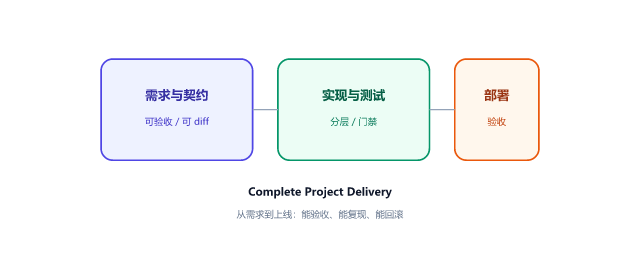
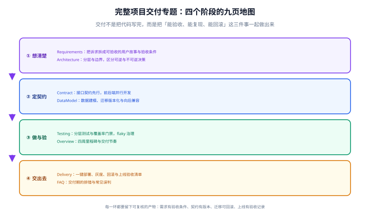

# 完整项目交付

**完整项目交付**讲的不是某个技术，而是「把一个想法变成一个能上线、能验收、能复现、能回滚的系统」这条路上的方法、模板与清单。它回答的是那些在真实项目里最容易扯皮的问题：需求怎么算拆完了、契约谁来定、数据怎么改不炸、什么时候可以上线。

## 本专题讲什么

按交付的时间顺序组织，每一页对应一个阶段，每页都给可直接抄用的模板与清单：**需求怎么写成可验收的句子 → 架构决策怎么留痕 → 契约怎么先行 → 数据怎么改才安全 → 测试怎么分层与设门禁 → 怎么上线与验收**。

::: tip 一句话定位
交付的完成标准不是「代码写完了」，而是**能验收、能复现、能回滚**这三件事同时成立。
:::

## 按阶段找页面

| 阶段 | 页面 | 你会拿到什么 |
| --- | --- | --- |
| 全景 | [交付全景与验收标准](./Overview/index.md) | 四周里程碑、每阶段的验收判据、五类常见失败模式 |
| 需求 | [需求拆分与验收条件](./Requirements/index.md) | 用户故事写法、Given/When/Then 模板、范围裁剪与非功能需求 |
| 设计 | [架构设计与技术选型](./Architecture/index.md) | 分层与边界、可逆 vs 不可逆决策、ADR 四段式、选型评分表 |
| 契约 | [接口契约先行](./Contract/index.md) | OpenAPI 契约、前后端并行、Mock、破坏性变更拦截、错误码表 |
| 数据 | [数据建模与迁移](./DataModel/index.md) | 建模与命名规范、索引取舍、迁移六步法、回滚设计 |
| 验证 | [测试策略与门禁](./Testing/index.md) | 测试分层职责、覆盖率门禁怎么设、集成测试的真实依赖、flaky 治理 |
| 交付 | [一键部署与上线验收](./Delivery/index.md) | 部署六步顺序、灰度与回滚、六类 18 项验收清单 |
| 排错 | [常见问题与排错](./FAQ/index.md) | 需求变 / 联调对不上 / 上线才发现 三类问题的处理 |

## 按角色选读路径

- **要起一个新项目**：Overview → Requirements → Architecture → Contract。四页读完，动手前该定的都定了。
- **接手一个做到一半的项目**：先看 [架构设计与技术选型](./Architecture/index.md) 的决策记录与 [测试策略与门禁](./Testing/index.md)，判断「现在到哪一步了」是否有客观答案。
- **准备上线**：[一键部署与上线验收](./Delivery/index.md) + [数据建模与迁移](./DataModel/index.md)。上线出问题绝大多数出在这两页。
- **联调总是返工**：[接口契约先行](./Contract/index.md) 一页就够，重点是破坏性变更的判定标准。

## 三条底线

1. **先有判据，再动手。** 需求要有验收条件，部署要有验收清单，测试要有门禁阈值。没有判据的工作无法验收，只能靠「我觉得差不多了」。
2. **不可逆的事情要慢，可逆的事情要快。** 数据库主键策略、对外接口语义这类改一次要迁数据改契约的决策，值得写文档反复论证；目录结构、日志方案这类改起来是一次提交的事，先做起来再说。
3. **每一步都留下可复核的产物。** 需求留验收条件、决策留 ADR、契约留版本、迁移留回滚方案、上线留验收记录。产物的意义是让后来的人（包括三个月后的你）不必重新推演一遍。

## 与传统「项目文档」的区别

本专题刻意写成**方法论 + 模板 + 清单**，而不是某个具体项目的记录：

| | 本专题 | 具体项目文档 |
| --- | --- | --- |
| 位置 | `docs/Others/ProjectDelivery/` | `project/Complete/FullStackProject/` 等 |
| 内容 | 可复用的方法、模板、判据 | 某个项目当时真实的决策与实施记录 |
| 用法 | 起新项目时照着走 | 想知道「当时为什么这么定」时翻 |

想看到一个具体项目怎么落地，去看 [全栈项目实战](../../../project/Complete/FullStackProject/index.md)；想知道「下次该怎么做」，留在本专题。

## 相关专题

- [全栈项目实战](../../../project/Complete/FullStackProject/index.md)：本专题方法论的一个具体落地案例（需求拆分、数据库设计、接口联调、编码、测试、部署）。
- [后端通用模板](../../../project/Base/BackendTemplate/index.md)：把「需求到上线」里最重复的那部分（统一响应、异常、认证、数据访问、部署）沉淀成可复用的工程基座。
- [Vue3 前端模板](../../../project/Base/Vue3Template/index.md)：前端侧的同类基座，与本专题的契约、测试两页直接相关。
- [协作与项目管理](../../Tools/Collaboration/index.md)：任务拆分、看板、Code Review 与提交规范——本专题讲「交付物的判据」，那里讲「协作的动作」。
- [Docker](../../Ops/Docker/index.md) 与 [CI/CD](../../Tools/CICD/index.md)：部署与流水线的工具层细节。

## 参考资料

- [OpenAPI Specification](https://spec.openapis.org/oas/latest.html)
- [Architecture Decision Records（ADR）](https://adr.github.io/)
- [十二要素应用（12-Factor App）](https://12factor.net/zh_cn/)
- [Google SRE Book：发布工程](https://sre.google/sre-book/release-engineering/)
- [The Twelve-Factor App：构建、发布、运行](https://12factor.net/zh_cn/build-release-run)
- [Keep a Changelog：变更记录规范](https://keepachangelog.com/zh-CN/1.1.0/)
