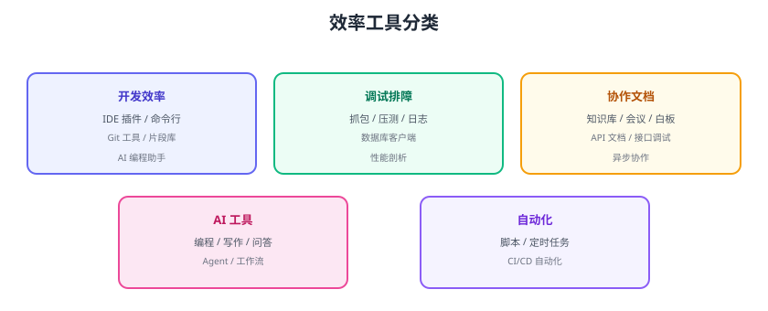

# 效率工具安利

好的工具把重复劳动交给机器，把时间还给思考。本页按开发、调试、协作、AI、自动化五类整理实用工具，并给出「工具选型三问」帮你做减法。



## 开发效率

| 工具 | 用途 | 说明 |
| --- | --- | --- |
| IntelliJ IDEA / VS Code | 主流 IDE | 配好快捷键与插件事半功倍 |
| GitHub Copilot / AI 助手 | AI 编程 | 补全、生成测试、解释代码 |
| pnpm | 包管理 | 快、省空间，工程化标配 |
| Docker | 环境一致 | 消灭“在我机器上是好的” |
| 代码片段库 | 常用代码复用 | 沉淀团队模板 |

## 调试排障

| 工具 | 场景 |
| --- | --- |
| Wireshark / tcpdump | 抓包分析协议 |
| curl / Postman / Apifox | 接口调试与文档 |
| jstack / jmap / MAT | JVM 排查 |
| Arthas | Java 在线诊断 |
| pprof / async-profiler | 性能剖析 |
| Grafana + Prometheus | 指标与告警 |

## 协作文档

| 工具 | 用途 |
| --- | --- |
| 飞书/钉钉/企业微信 | IM + 文档 + 会议一体化 |
| Notion / Obsidian | 个人知识库 |
| 语雀/Confluence | 团队知识库 |
| Figma | 设计协作 |
| Mermaid / draw.io | 画架构图、时序图 |

## AI 工具

| 工具 | 用途 |
| --- | --- |
| Codex / Copilot | AI 编程助手 |
| ChatGPT / Claude | 问答、写作、分析 |
| Midjourney / 即梦 | 配图生成 |
| n8n / Coze | 自动化工作流 |
| Whisper | 语音转文字 |

::: tip AI 工具使用原则
1. 用 AI 加速，不替自己做决定：输出要人工复核。
2. 敏感代码/数据注意合规，别把密钥贴进对话。
3. 把 AI 当“结对程序员”：让它解释、评审、写测试。
:::

## 自动化

```text
重复的事交给脚本：
- 部署：CI/CD 流水线（GitHub Actions）
- 巡检：定时任务 + 告警
- 文档：Markdown 模板 + 自动构建发布
- 测试：单元测试 + E2E 自动跑
```

## 工具选型三问

```text
1. 它解决的是真痛点吗？（别为工具而工具）
2. 学习成本多久回本？（一周内用不上就暂缓）
3. 团队能一起用吗？（单人工具有维护风险）
```

## 易错点与最佳实践

::: danger 常见错误
1. **工具囤积症**：装一堆工具，真正用的没几个；做减法。
2. **重度依赖单一工具**：工具挂了就瘫痪；关键流程有备份方案。
3. **忽略快捷键与脚本**：鼠标点来点去，效率损失巨大。
4. **AI 结果不验证**：直接抄 AI 代码，出问题背锅。
5. **文档散落**：笔记记了不整理，等于没记；定期归档。
:::

::: tip 最佳实践
1. 每季度做一次工具盘点：保留高频、淘汰闲置。
2. 快捷键是性价比最高的投资：每周练熟 5 个。
3. 把常用命令/脚本沉淀到文档库。
4. 团队统一工具链，降低协作成本。
:::

## 验证方式

1. 盘点自己最近 30 天用过的工具，标注高频/闲置。
2. 挑一个高频操作，写脚本或配置自动化。
3. 用 AI 完成一次代码评审，人工复核其建议。

## 参考资料

- 本专题章节入口：[复盘杂项目录](../index.md)
- 效率工具测评（少数派/利器等社区）
