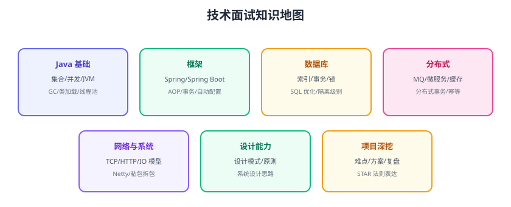

# 面试题集

面试是检验知识体系的“考试”：面试题往往从一个点展开到整个体系。本页按文档库六大领域整理高频面试题，每题给出回答思路与文档库对应章节，用于自我测评与面试前冲刺。



## Java 基础

### 集合与并发

| 题 | 回答思路 | 对应文档 |
| --- | --- | --- |
| HashMap 原理 | 数组+链表+红黑树、扩容、put 流程 | [集合框架](../../../Backend/Java/JavaSE/Collection/index.md) |
| ConcurrentHashMap 为什么线程安全 | CAS + synchronized + 分段思想 | [并发集合](../../../Backend/Java/JavaSE/Collection/Concurrent/index.md) |
| 线程池参数与拒绝策略 | 核心/最大/队列/饱和策略 | [线程池](../../../Backend/Java/JavaSE/Multithreading/ThreadPool/index.md) |
| volatile 与 synchronized 区别 | 可见性/原子性/锁 | [volatile](../../../Backend/Java/JavaSE/Multithreading/Volatile/index.md) |

### JVM

| 题 | 回答思路 |
| --- | --- |
| JVM 内存区域 | 堆/栈/方法区/程序计数器/本地方法栈 |
| 类加载过程 | 加载→验证→准备→解析→初始化，双亲委派 |
| GC 算法与收集器 | 标记清除/复制/标记整理；G1/ZGC |
| 内存泄漏排查 | jmap/jstack/MAT |

对应文档：[JVM 基础](../../../Backend/Java/JavaSE/JVM/index.md)

## 框架与 Spring

| 题 | 回答思路 |
| --- | --- |
| Spring IoC 原理 | 容器、Bean 生命周期、依赖注入 |
| AOP 实现 | JDK 动态代理 / CGLIB，切点与通知 |
| Spring Boot 自动配置原理 | @EnableAutoConfiguration + 条件装配 |
| 事务失效场景 | 自调用、非 public、异常被吞、传播属性 |
| Spring Security 认证流程 | 过滤器链、AuthenticationProvider |

对应文档：[Spring](../../../Backend/Java/Frame/Spring/index.md)、[Spring Boot](../../../Backend/Java/Frame/SpringBoot/index.md)

## 数据库与 SQL

| 题 | 回答思路 |
| --- | --- |
| 索引为什么用 B+ 树 | 层高低、范围查询、叶子链表 |
| 联合索引最左前缀 | 索引列顺序与查询条件 |
| 索引失效场景 | 函数、隐式转换、前模糊、最左缺失 |
| 事务隔离级别与 MVCC | 脏读/不可重复读/幻读、undo log |
| 死锁原因与解决 | 锁顺序、事务长度、重试 |
| 慢 SQL 怎么优化 | EXPLAIN → 索引/SQL 改写 → 验证 |

对应文档：[SQL 优化](../../../DB/Relational/SQLOptimization/index.md)、[MySQL 事务](../../../DB/Relational/MySQL/Transaction/index.md)

## 分布式

| 题 | 回答思路 |
| --- | --- |
| 消息队列怎么保证不丢 | 生产确认 + Broker 持久化 + 消费 ACK |
| 消费幂等怎么实现 | 唯一 ID + 去重表/状态机 |
| 分布式事务方案 | 2PC/TCC/SAGA/本地消息表 + Seata |
| 微服务注册中心原理 | 注册/发现/心跳/健康检查 |
| 服务雪崩怎么防 | 超时 + 熔断 + 限流 + 降级 |
| 分布式锁怎么实现 | Redis SETNX + Lua / ZooKeeper |

对应文档：[消息队列](../../../Backend/MessageQueue/index.md)、[微服务](../../../Backend/Microservices/index.md)

## 网络与系统

| 题 | 回答思路 |
| --- | --- |
| TCP 三次握手为什么是三次 | 确认收发、防失效请求、同步序列号 |
| TCP 与 UDP 区别 | 可靠/有序/连接 vs 快速/无连接 |
| HTTP/1.1、2、3 区别 | 队头阻塞、多路复用、QUIC |
| HTTPS 握手流程 | 证书校验、密钥协商、加密 |
| BIO/NIO/多路复用 | 线程模型、Selector |
| Netty 线程模型 | Boss/Worker、EventLoop、Pipeline |
| 粘包拆包怎么解决 | 定长/分隔符/长度字段 |

对应文档：[网络编程](../../../Backend/NetworkProgramming/index.md)

## 运维与工具

| 题 | 回答思路 |
| --- | --- |
| Docker 镜像与容器区别 | 只读模板 vs 运行实例 |
| K8s Pod 与 Deployment | 最小调度单元、副本管理 |
| Prometheus 架构 | Pull 模型、TSDB、告警链路 |
| CI/CD 流水线怎么设计 | lint→test→build→deploy，门禁 |
| Git rebase 与 merge | 历史线性 vs 合并节点 |

对应文档：[Docker](../../../Ops/Docker/index.md)、[Kubernetes](../../../Ops/Kubernetes/index.md)、[CI/CD](../../../Tools/CICD/index.md)

## 面试答题模板

```text
技术题四段式：
1. 一句话结论（是什么）
2. 原理/机制（怎么工作）
3. 代码/场景例子（具体落地）
4. 优缺点与权衡（什么时候不适用）

项目题 STAR：
S 背景 → T 任务 → A 行动 → R 结果（带数据）
```

## 易错点与最佳实践

::: danger 面试常见错误
1. **只背结论不解释原理**：面试官追问就露馅；用四段式答透。
2. **项目经历没有数据**：说“优化了性能”不如“QPS 从 100 到 1000”。
3. **不会说“不知道”**：诚实说明 + 现场推演思路，比瞎编强。
4. **只准备八股不准备场景**：把面试题当成场景题来答（如果…怎么办）。
5. **不复习自己写的文档**：文档库就是最好的题库，先自测再面试。
:::

::: tip 最佳实践
1. 用文档库做自测：随机抽 10 题，讲给空气听（费曼）。
2. 每周末做一次 30 分钟面试模拟。
3. 把答不出的题加入「待补清单」，更新知识地图。
4. 项目 STAR 准备 3 个故事：性能优化、疑难排查、技术选型。
:::

## 验证方式

1. 从上面六大类各抽 3 题，用四段式写/讲一遍。
2. 标记答不完整的题，去对应文档补学。
3. 模拟一次 45 分钟面试，录音复盘。

## 参考资料

- 面试答题技巧（STAR）：https://www.themuse.com/advice/star-interview-method
- 本专题章节入口：[复盘杂项目录](../index.md)
