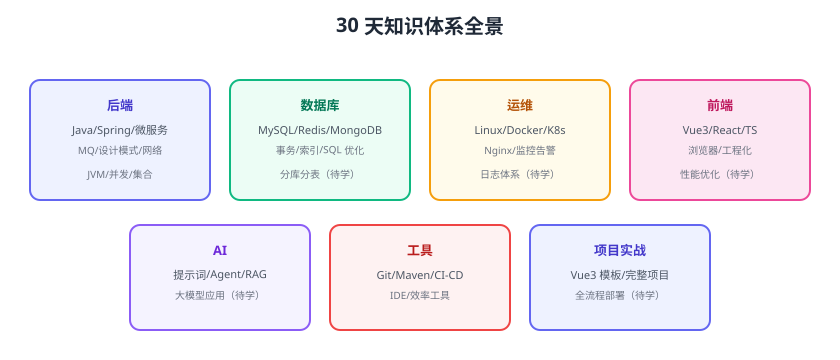

# 知识体系整理

知识地图把散落的文档组织成一张「全景图」：六大领域、每个领域的核心主题、掌握状态与下一步。有了地图，才知道自己知道什么、不知道什么、接下来学什么。



## 为什么需要知识地图

1. **发现盲区**：地图上一眼看出哪些领域还是空白。
2. **避免遗忘**：学过的主题记录状态，定期回炉。
3. **指导学习**：先学地图上的主线，再深入分支。
4. **面试前快速定位**：按地图逐项复习。

## 六大领域地图

### 后端（核心主线）

```text
Java 基础：语法 → 集合 → IO → 并发 → JVM
框架：Spring → Spring Boot → Spring MVC → Spring Security
分布式：消息队列 → 微服务 → 分布式事务
工程能力：设计模式 → 网络编程 → SQL 优化
```

### 数据库

```text
关系型：MySQL（基础 → 事务 → 索引 → SQL 优化）
非关系型：Redis（缓存/持久化）→ MongoDB（文档模型）
进阶：分库分表、时序数据库（下一轮）
```

### 运维

```text
基础：Linux → 网络命令
容器：Docker → Kubernetes
接入：Nginx
可观测：监控告警 → 日志体系（待补）
```

### 前端

```text
基础：HTML/CSS/JS → TypeScript
框架：Vue3 → React
原理：浏览器原理
工程：前端工程化（规范/测试/构建/CI）
```

### AI

```text
提示词工程 → Agent 应用 → RAG（下一轮）→ 大模型应用开发（下一轮）
```

### 工具与项目

```text
Git → Maven/Gradle → CI/CD → 项目模板 → 完整项目实战（下一轮）
```

## 掌握状态标记

用三级状态管理每个主题：

| 状态 | 含义 | 动作 |
| --- | --- | --- |
| 🔴 未学 | 地图上有但还没学 | 排入计划 |
| 🟡 学习中 | 学了一部分 | 继续 + 补练习 |
| 🟢 已掌握 | 能讲、能写、能实践 | 定期复习 + 输出 |

```text
示例：
🟢 Java 集合（能讲源码要点）
🟡 Spring Boot（掌握常用，缺源码深挖）
🔴 分库分表（下一轮）
```

## 维护方法

1. **每周更新**：学完一个主题就更新地图。
2. **地图即文档**：把地图放进文档库，持续演进。
3. **与计划联动**：DOCS_PLAN.md 的轮换表就是地图的“时间轴”。
4. **复习触发**：标记 🟡 的主题每两周回看一次。

## 易错点与最佳实践

::: danger 常见错误
1. **地图只画不维护**：三分钟热度，地图过期。
2. **追求全覆盖**：什么都画，什么都浅；按主线优先。
3. **只学不标注**：学了不更新状态，等于白学。
4. **地图与文档脱节**：地图上有的主题文档库没有，或反之。
:::

::: tip 最佳实践
1. 地图保持「一页纸」：能放进一张图，别做成年报。
2. 标注与 DOCS_PLAN 计划一致，形成闭环。
3. 每月花 30 分钟更新地图 + 复习 🟡 主题。
4. 面试/求职前按地图做一次全量扫描。
:::

## 验证方式

1. 画一张自己的六领域知识地图，标注每个主题状态。
2. 找出 3 个 🔴 盲区，排入下一轮学习计划。
3. 对照文档库检查：地图主题与文档目录一一对应。

## 参考资料

- 本专题章节入口：[复盘杂项目录](../index.md)
- 学习方法（见 [学习方法与规划](../LearningMethod/index.md)）
