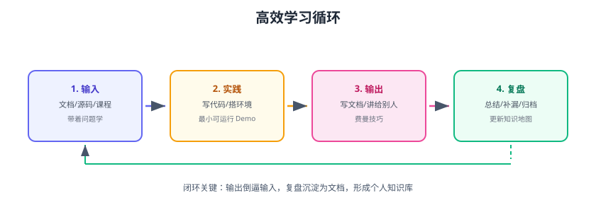

# 学习方法与规划

持续学习的关键不是“学得多”，而是**形成闭环**：输入 → 实践 → 输出 → 复盘。本页给出可落地的高效学习方法、费曼技巧、记忆策略，以及 31~60 天的学习规划建议。



## 学习闭环

```text
1. 输入：带着问题学（文档、源码、课程）
2. 实践：最小可运行 Demo（写代码、搭环境）
3. 输出：写文档、讲给别人（费曼技巧）
4. 复盘：总结补漏、更新知识地图
```

::: tip 核心观点
**输出倒逼输入**：能写清楚、讲明白，才是真的会。文档库本身就是最好的输出载体。
:::

## 费曼技巧

```text
1. 选一个概念
2. 用最简单的话讲给“小白”听
3. 讲不清楚的地方 = 没学会的地方
4. 回头查资料，重新讲，直到流畅
```

应用方式：

- 每学完一个主题，写一篇“给别人看”的笔记。
- 在文档库写文档时，想象读者是半年后的自己。
- 团队分享：每周 15 分钟讲一个知识点。

## 刻意练习

单纯重复不会进步，要有**反馈**的练习：

| 练习方式 | 反馈来源 |
| --- | --- |
| 写代码实现 | 测试用例、运行结果 |
| 做题 | 标准答案 + 错题复盘 |
| 画架构图 | 与官方图对比 |
| 讲给别人 | 听众提问 |
| 面试模拟 | 面试官追问 |

## 记忆策略

1. **间隔重复**：第 1、3、7、30 天复习，比一次学 5 小时有效。
2. **主动回忆**：合上文档默写要点，而不是重读。
3. **关联记忆**：新知识与旧知识建立联系（交叉链接正是为此）。
4. **输出即记忆**：写文档、画图、讲，都是强化。
5. **知识地图回访**：每周扫一眼地图，标记遗忘点。

## 时间规划建议

### 每日

```text
1 小时学习（输入）+ 30 分钟输出（文档/笔记）
```

### 每周

```text
1 个主题深入 + 1 篇输出 + 1 次复习
```

### 每月

```text
1 轮知识地图更新 + 1 次阶段复盘 + 1 篇总结文章
```

## 31~60 天规划要点

下一轮建议优先：

| 方向 | 主题 | 理由 |
| --- | --- | --- |
| 后端深挖 | Java IO/NIO、Spring Cloud、Kafka 深入 | 主线延伸，面试高频 |
| 数据库进阶 | PostgreSQL、MySQL 索引深入、分库分表 | 补齐关系型知识 |
| 前端进阶 | CSS 进阶、前端性能、安全 | 完善前端体系 |
| AI 应用 | 大模型应用、RAG、本地模型 | 紧跟热点 |
| 项目实战 | 后端模板、完整项目 | 把知识串起来 |
| 运维进阶 | 网络基础、日志体系 | 补全可观测性 |

## 易错点与最佳实践

::: danger 学习常见错误
1. **收藏即学会**：收藏夹吃灰；规定收藏后 48 小时内必须消化输出。
2. **只输入不输出**：看 100 篇不如写 1 篇。
3. **贪多求快**：一天换三个主题，什么都没留下。
4. **没有反馈地练习**：重复错误一万次也不会进步。
5. **忽视复习**：学过就忘，等于时间白花。
:::

::: tip 最佳实践
1. 一次只学一个主题，学完再换。
2. 每个主题配一个「动手任务」，实践才算学会。
3. 输出优先发到文档库，沉淀为长期资产。
4. 用间隔重复表管理复习。
5. 状态不好就休息：效率比时长重要。
:::

## 验证方式

1. 用费曼技巧把最近学的主题讲一遍，找出讲不清的点。
2. 制定一份 31~60 天个人计划，对应 DOCS_PLAN 轮换表。
3. 连续 7 天执行「1 小时输入 + 30 分钟输出」，记录完成情况。

## 参考资料

- 费曼技巧：https://fs.blog/feynman-technique/
- 刻意练习（Anders Ericsson，书籍）
- 认知天性（Peter Brown 等，书籍）
- 本专题章节入口：[复盘杂项目录](../index.md)
