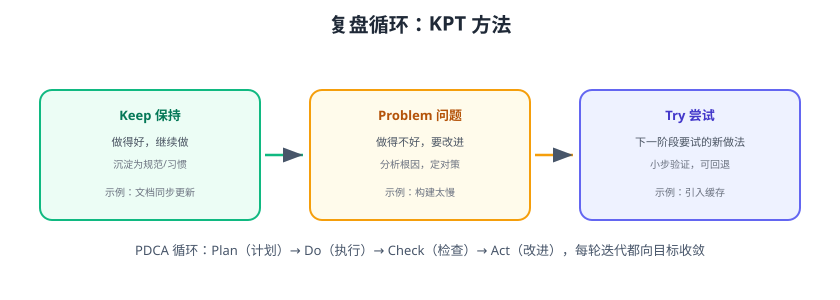

# 30 天阶段复盘

第一轮 30 天轮换完成：文档库从零起步，覆盖了后端、数据库、运维、前端、AI、工具六大领域共 **30 个主题、260+ 篇文档**。本页用 KPT 方法做一次阶段复盘：保持什么、问题在哪、下一轮试什么。



## 第一轮产出盘点

| 领域 | 主题 | 代表内容 |
| --- | --- | --- |
| 后端 | Java/Python/Spring/微服务等 | JavaSE、并发、JVM、Spring Boot、消息队列、微服务、设计模式、网络编程 |
| 数据库 | MySQL/Redis/MongoDB/SQL 优化 | 事务、索引、查询、SQL 优化方法论 |
| 运维 | Linux/Docker/K8s/Nginx/监控 | 容器编排、集群、监控告警体系 |
| 前端 | Vue3/React/TS/浏览器/工程化 | 框架核心、浏览器原理、工程化规范 |
| AI | 提示词/Agent | 提示词工程、Agent 应用 |
| 工具 | Git/Maven/CI-CD | 版本控制、构建、流水线 |
| 项目 | Vue3 模板 | 基础项目模板 |

## Keep：做得好的

1. **主题成体系**：每个主题按「完整模板」展开，深度足够（每篇 ≥ 60 行）。
2. **配图规范**：每个主题首页有 Logo，正文配 SVG 示意图。
3. **版本联网核对**：所有版本信息以官方来源为准（如 Kafka 4.3、Netty 4.2）。
4. **交叉链接**：专题之间相互引用，知识不再是孤岛。
5. **构建验证 + 自动部署**：每次提交都 `pnpm docs:build` 验证并 push 触发部署。

## Problem：做得不够好的

| 问题 | 影响 | 对策 |
| --- | --- | --- |
| 部分主题深度不均 | 一些主题实践篇偏少 | 下一轮对高频主题补「实战/案例」 |
| 存量文档仍有历史碎片 | 部分旧文有失效链接、格式不统一 | 持续做存量整理（每日 5~10 篇） |
| 缺少体系化的练习/测评 | 学习停留在阅读 | 面试题集 + 每主题自测清单 |
| 英文原版资料引用偏少 | 一手信息不足 | 补充官方英文文档链接 |
| 复盘频率低 | 问题积累才处理 | 每 10 天做一次小复盘 |

## Try：下一轮要试的

1. **面试驱动学习**：先做题，再补知识（见 [面试题集](../Interview/index.md)）。
2. **每主题带练习**：给重点主题加「动手任务」章节。
3. **建立个人知识地图**：用 [知识体系整理](../KnowledgeMap/index.md) 动态维护。
4. **月度输出**：每月写一篇技术总结/分享。
5. **文档质量分**：为每篇文档打分（深度/示例/配图/验证），低于标准补全。

## 复盘会议（团队版）

```text
时间：30 分钟
环节：
  1. 数据回顾（5m）：完成了什么、指标如何
  2. Keep 分享（5m）：每人说一个亮点
  3. Problem 讨论（10m）：根因分析，避免指责
  4. Try 定行动（10m）：SMART 目标 + 责任人
收尾：行动项进下一轮计划，下轮复盘检验
```

## 易错点与最佳实践

::: danger 复盘常见错误
1. **只报喜不报忧**：复盘变表扬大会，问题被掩盖。
2. **只分析不行动**：复盘点完就散会，没有行动项。
3. **行动项没有负责人和时限**：下轮复盘发现没人做。
4. **把复盘当追责**：聚焦流程与根因，不指责个人。
5. **复盘频率过低**：季度才复盘，问题积累太多无从下手。
:::

::: tip 最佳实践
1. 复盘要有**数据**：完成量、失败率、耗时。
2. 行动项用 SMART：具体、可衡量、可达成、相关、有时限。
3. 小步快跑：10 天小复盘 + 30 天大复盘。
4. 复盘结果归档到文档库，形成历史记录。
:::

## 验证方式

1. 对照 DOCS_PLAN.md 核对 30 天主题完成情况。
2. 用 KPT 填写本阶段复盘，产出 3 个行动项。
3. 把行动项加入下一轮计划（31~60 天轮换表）。

## 参考资料

- KPT 复盘方法：https://www.atlassian.com/team-playbook/plays/retrospective
- 复盘方法论（联想复盘四步法）
- 本专题章节入口：[复盘杂项目录](../index.md)
