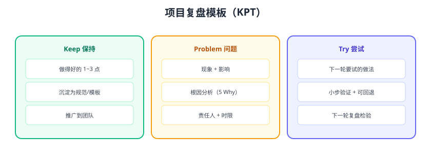

# 项目复盘模板

项目复盘把「做完」变成「做好」：总结做得好的、分析出问题的、定下改进的。本页给出可直接复制的 **KPT 复盘模板**、5Why 根因分析法，以及复盘文档的结构与示例。



## KPT 复盘模板

```markdown
# 项目复盘：<项目名>

## 基本信息
- 周期：2026-08-01 ~ 2026-08-29
- 目标：<一句话>
- 结果：<达标情况，带数据>

## Keep（保持）
1. <做得好的点 1>
2. <做得好的点 2>

## Problem（问题）
| 问题 | 影响 | 根因 | 对策 | 责任人/时限 |
| --- | --- | --- | --- | --- |
| <现象> | <影响> | <5Why 结论> | <行动> | <谁/何时> |

## Try（尝试）
1. <下一阶段要试的新做法>
2. <小步验证方式>

## 遗留与风险
- <未完成事项>
- <风险项与预案>
```

## 5Why 根因分析

```text
问题：接口经常超时
Why1：数据库查询慢
Why2：订单表全表扫描
Why3：缺少 user_id 索引
Why4：上线评审没检查执行计划
Why5：没有「新 SQL 必须 EXPLAIN」的门禁
→ 根因：流程缺门禁 → 对策：CI/评审加检查项
```

追问到**流程层面**，而不是停在“某人忘了”。

## 复盘三问

```text
1. 目标达成了吗？差在哪？（数据说话）
2. 过程中最意外的成功/失败是什么？
3. 如果重来一次，哪里会不一样？
```

## 复盘文档示例

```markdown
# 项目复盘：文档库第一轮建设

## 目标与结果
目标：30 天产出 30 个主题、260+ 篇技术文档
结果：30/30 主题完成，文档 260+ 篇，构建与部署全自动 ✅

## Keep
1. 每个主题按完整模板展开，深度达标。
2. 版本信息联网核对，事实准确。
3. 每日构建验证 + 自动部署，质量可控。

## Problem
| 问题 | 影响 | 根因 | 对策 |
| --- | --- | --- | --- |
| 部分旧文档链接失效 | 阅读体验差 | 历史迁移遗留 | 全库链接巡检并修复 |
| 主题实践篇偏少 | 学了不会用 | 重输入轻输出 | 下一轮补实战章节 |

## Try
1. 面试题驱动学习。
2. 每主题配动手任务。
3. 10 天一次小复盘。

## 遗留
- 分库分表、RAG、完整项目等主题排入下一轮。
```

## 复盘会议的引导

```text
1. 先定规则：对事不对人，聚焦流程。
2. 数据开场：用指标说话，不凭感觉。
3. Keep 先行：先肯定，再谈问题。
4. 问题用 5Why 挖根因。
5. 收尾必须有行动项：谁、做什么、何时。
```

## 易错点与最佳实践

::: danger 复盘常见错误
1. **没有数据**：全靠印象，无法判断对错。
2. **问题停留在表面**：不挖根因，下轮重犯。
3. **行动项没有责任人**：写进文档就完事。
4. **复盘太晚**：项目结束三个月才复盘，细节都忘了。
5. **只复盘失败不复盘成功**：成功的经验同样要沉淀。
:::

::: tip 最佳实践
1. 项目里程碑就做小复盘，结束做大复盘。
2. 行动项进入下轮计划并跟踪闭环。
3. 复盘文档归档，形成团队经验库。
4. 成功经验写成模板/清单，让团队直接复用。
:::

## 验证方式

1. 用模板复盘最近一个项目，产出 3 个行动项。
2. 对最严重的问题做一次 5Why，验证根因结论。
3. 把复盘文档归档到文档库。

## 参考资料

- 复盘方法论（联想复盘法）
- 5Why 分析法：https://www.mindtools.com/a3mi00v/5-whys
- 本专题章节入口：[复盘杂项目录](../index.md)
