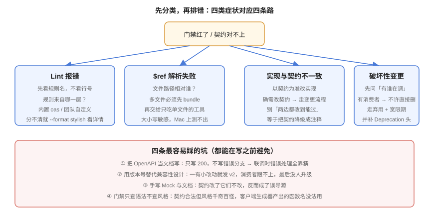

# 常见问题与最佳实践

本页把接口设计与治理落地过程中最高频的疑问集中回答，并在最后给出一份可以贴进团队规范的清单。

## 一、要不要做、从哪开始

### Q1：我们是个小团队，接口也没几个，需要搞这套吗？

**按「有没有不是写它的人在调」来判断，而不是按团队规模。**

| 情况 | 建议 |
| --- | --- |
| 只有自己写自己调、且没有前端在等 | 可以先不写契约；但**至少定命名规范**（几个字的事，省掉以后全部返工） |
| 有前端在并行开发 | 契约 + Mock。这一条几乎立刻回本：前端不用等后端 |
| 有第三方 / 移动端 / 多团队消费 | 全流程：契约 + 规范 + 门禁 + 版本策略 |

不要一上来就追求「全公司统一」。**先在一个具体项目上跑通，再推广**——推广失败最常见的原因就是第一批尝鲜者自己被流程压垮了。

### Q2：存量接口一大堆，怎么补契约？

**不要为「补历史」专门排期。** 那件事的成本远高于收益，而且补完的契约很快又会过时。

可行顺序：

1. **新接口一律契约优先**（从今天起）；
2. **正在改动的接口顺手补**；
3. **对外接口优先补齐**（漂移代价最高）；
4. 存量内部接口**靠时间自然覆盖**。

### Q3：已经有 Swagger 注解自动导出了，算有契约吗？

算「有文档」，**不算「契约先行」**。差别在于**事实来源是谁**：

- 注解导出 → 事实来源是代码，契约只能反映「已经写完的东西」，前端无法先行；
- 手写契约 → 事实来源是契约，实现与契约不一致时**错的是实现**。

两者可以并存，但必须指定唯一的事实来源。推荐组合是**手写契约 + 用导出的实现做一致性探针**（`oasdiff diff` 差异即缺陷），细节见 [OpenAPI 契约工程化](../OpenAPI/index.md) 第 5 节。

### Q4：用 Apifox / Postman 管理接口，还需要契约文件吗？

需要。**平台是协作界面，不是事实来源。**

判据很简单：**契约文件能不能进 Git、能不能被 CI 读、能不能做 diff**。能，才谈得上治理。如果契约只存在于平台里，那么：

- 改了什么、什么时候改的，没有可审计的记录；
- CI 拿不到它，门禁无从谈起；
- 平台供应商变更时，你的全部资产跟着一起走。

可行做法：**契约文件为事实来源，导入平台用于协作**，并在 CI 里检查「平台导出物与仓库契约无差异」。

## 二、设计与规范

### Q5：路径到底要不要带版本号？

默认**要**，用 `/api/v1/...`。理由不是「规范」，而是**排障成本最低**：日志、抓包、浏览器地址栏里一眼能看出是哪个版本。

另外三种方案（查询参数、自定义 Header、媒体类型协商）见 [版本策略](../Versioning/index.md) 第 3 节。**对外公开 API 强烈建议路径版本。**

### Q6：`POST /posts/{id}/publish` 这种「动作端点」是不是违反 REST？

是**有意识的例外**，不是违规。判据：

| 问 | 答 | 结论 |
| --- | --- | --- |
| 重复调两次结果一样吗？ | 一样，且这是业务要求 | 可以做成幂等的动作端点 |
| 它只是改一个字段吗？ | 是 | **用 PATCH，别做动作端点** |
| 它有前置条件、副作用、可能 409 吗？ | 有 | 用动作端点，并在契约里写清 409 分支 |

风险是动作端点越用越多。可以设一条可统计的指标：**动作端点不超过总路径数的 15%**，超了就说明资源建模没做完。

### Q7：PUT 和 PATCH 到底怎么选？

| | PUT | PATCH |
| --- | --- | --- |
| 语义 | **整体替换**（未传字段视为置空/默认） | **部分修改**（未传字段保持原值） |
| 幂等 | 是 | 取决于实现 |
| 风险 | 调用方漏传一个字段就把它清空了 | 需要明确定义「传 null」与「不传」的区别 |

**最常见的坑**：用 PUT 做部分更新。结果是幂等性形同虚设（第二次 PUT 会覆盖掉这之间的其它改动）。

**PATCH 的语义必须写进契约**：传 `null` 是「置空」还是「不修改」？两个都要有明确说法，否则前端一定会踩坑。

### Q8：错误码要不要用业务码？HTTP 状态码不够吗？

**两层都要，各司其职**：

- **HTTP 状态码**：给基础设施看（网关、监控、缓存、重试策略）；
- **业务 `code`**：给前端分支与表单定位看（`STATE_CONFLICT`、`SLUG_DUPLICATED`）。

只回 200 + `{"code": 5001}` 是历史遗留风格，会让网关与监控无法区分成功与失败——**限流、熔断、告警全都失准**。

### Q9：分页用 offset 还是 cursor？

| | offset（`page`/`size`） | cursor |
| --- | --- | --- |
| 适合 | 后台列表、需要总数与跳页 | 信息流、深翻页、数据量大 |
| 缺点 | 深翻页慢；数据插入时**会重复/漏项** | 无法跳页；不能直接知道总数 |

要点：

- `size` **必须有上限**（写进契约的 `maximum`）；
- `page` 从 1 还是 0 开始**必须统一**（Spring Data 从 0、前端从 1，这是 off-by-one 的头号来源）；
- cursor **必须是不透明字符串**，不能是自增 ID 明文。

## 三、契约与工具

### Q10：契约文件该拆成多份吗？

**超过几百行就拆**。按资源拆到 `paths/` 与 `schemas/` 下，根文件用 `$ref` 汇总；**交付给下游前先 `bundle`**。

三个坑：

1. `#/paths/~1posts` 里的 `~1` **不能写成 `/`**（JSON Pointer 转义）；
2. 相对路径相对于**引用所在文件**，不是根文件；
3. **大小写敏感**——macOS 上能读到的 `Schemas/post.yaml`，Linux CI 上会报文件不存在。

### Q11：3.0 要不要升到 3.1 / 3.2？

**看需求，不看版本数字。**

需要 `webhooks`、需要 SSE/NDJSON 进契约（3.2 `itemSchema`）、需要复用 JSON Schema 生态（3.1）→ 值得升。都不需要 → 留在 3.0 完全合理。

升级的四个必改点（`nullable`、`example → examples`、`exclusiveMinimum` 类型、`format` 语义变化）见 [OpenAPI 契约工程化](../OpenAPI/index.md) 第 1 节。

### Q12：`operationId` 不就是个可选字段吗，为什么非要写？

因为它决定**客户端生成器产出的函数名**。没有它，生成器会退回按路径拼名：`get_api_v1_posts_slug_`。后果是：

- 函数名不可读；
- **改一次路径，全站导入报错**。

所以「`operationId` 必填且全局唯一」应当是一条 **error 级**规则。

### Q13：契约里的 `examples` 有什么用，不是装饰吗？

三个真实用途：**文档站可读性**、**Mock 的数据来源**、**契约测试的断言基线**。

没有 `examples` 时，Mock 会按 schema 生成 `"string"`、`0` 这类占位数据——前端拿到的「测试数据」毫无业务意义，等于没测。

### Q14：契约测试和接口自动化测试有什么区别？

| | 契约测试 | 接口自动化测试 |
| --- | --- | --- |
| 断言依据 | **契约**（自动生成用例） | 人工写的业务断言 |
| 能发现 | 结构漂移、类型错、错误分支缺失 | 业务逻辑错、状态迁移错 |
| 不能发现 | 业务语义错（响应结构对但数值错） | 契约漂移（用例是按老结构写的） |

**两者互补，都要有。**

## 四、治理与演进

### Q15：破坏性变更检测为什么总是绿灯？

按出现频率排，三个原因：

1. **基线取的是当前分支的头**——等于自己跟自己比。基线必须取**上一次真正发布出去的契约**。
2. **比较的两个文件其实是同一个**（`$BASE` 变量为空或路径写错，被静默当成空文件）。
3. **工具没读到任何路径**（契约路径配错），于是「无差异」。

**处置**：在门禁里加活性断言——**扫描到的路径数必须 > 0**，并且做一次变异测试（删一个字段，确认退出码非 0）。

### Q16：`Deprecation` 和 `Sunset` 头为什么日期格式不一样？

因为两份 RFC 相隔多年，格式没统一：

- `Deprecation`（RFC 9745）：**结构化字段日期**，前置 `@` 表示 Unix 秒 → `Deprecation: @1767225600`
- `Sunset`（RFC 8594）：**HTTP-date** → `Sunset: Mon, 01 Mar 2027 00:00:00 GMT`

把 `Sunset` 写成 `@1767225600` 会让它被当成无效日期**静默忽略**——你以为通知了，实际没有。**这是实现里最高频的一处 bug。**

### Q17：废弃接口后应该返回 404 还是 410？

**410 Gone。** 它明确表达「曾经存在、已永久移除」，调用方能据此区分「接口下线」与「路径打错」。

同时保留 `Sunset` 与 `Link: rel="deprecation"`，让迟到的调用方仍能找到原因与替代资源。

### Q18：宽限期定多久合适？

**对外接口建议 ≥ 6 个月**，但真正的终点应该按**调用量**决定：当该版本的调用量降到可忽略时，才真正下线——**而不是日历翻页到点就关**。

配套要求：宽限期内接口**行为不变**（RFC 9745 明确 `Deprecation` 头不改变行为），只是被标记。

### Q19：文档站的「Try it」能指向生产吗？

**不能。** 一旦指向生产，任何访客都能用你的文档站往生产库写数据。

做法：契约的 `servers` 里列出 production 与 sandbox，**文档站只展示 sandbox**；或直接关掉写接口的试请求。

### Q20：网关已经做了鉴权，服务端还要再校验一次吗？

**要。** 两个理由：

1. **网关只做粗粒度**（路径级：有没有令牌、令牌有效吗），细粒度授权（这个身份能不能操作这条数据）**必须基于数据判断**，网关拿不到数据；
2. **内网不是安全边界**。服务直连、横向移动、测试环境绕过网关，都是现实存在的路径。

正确分工：网关拒绝未认证流量（省资源），服务端独立完成完整的认证 + 授权（保正确）。

## 五、最佳实践清单

可以整段贴进团队规范：

::: tip API 设计与治理十条
1. **有消费者就有契约**：凡不是写它的人在用，先有契约再写实现。
2. **错误分支是契约的一半**：只写 200 的契约是空壳，4xx/5xx 必须穷举并给出示例。
3. **`operationId` 必填且全局唯一**：客户端生成器的前提，也是重命名可被检出的前提。
4. **默认一律取最保守**：路由默认不转发、鉴权默认拒绝、限流默认按低档。
5. **派生自契约**：Mock、文档、TS 类型、网关路由由契约生成，手写的一律标 `expires`。
6. **门禁必须有牙齿**：规则集可执行、`--fail-severity=error`、并且**做过变异测试**。
7. **基线取上一次发布的契约**：否则破坏性变更会被自己掩盖。
8. **先加法、再端点、最后才版本**：80% 的「必须发 v2」都能退化成「加一个可选字段」。
9. **废弃要机器可读**：`Deprecation` + `Sunset` + `Link`，在中间件统一注入，过期返回 410。
10. **活性判据**：凡是以「有没有问题」为结论的脚本，都必须先证明「确实扫到了东西」。
:::

::: danger 四个必须避免的写法
1. **门禁只跑工具默认规则**——拦不住任何风格问题，全绿毫无意义。
2. **例外没有 `expires`**——例外永久化，规则名存实亡。
3. **文档站 Try it 指向生产**——任何人都能往生产库写数据。
4. **手写 Mock 不标失效期限**——它变成第二份事实来源，且比没有更危险。
:::

## 参考资料

- [OpenAPI Specification 3.2.0](https://spec.openapis.org/oas/v3.2.0.html)
- [RFC 9110 · HTTP Semantics](https://www.rfc-editor.org/rfc/rfc9110.html)
- [RFC 9457 · Problem Details for HTTP APIs](https://www.rfc-editor.org/rfc/rfc9457.html)
- [RFC 9745 · Deprecation](https://www.rfc-editor.org/rfc/rfc9745.html) / [RFC 8594 · Sunset](https://www.rfc-editor.org/rfc/rfc8594.html)
- [OWASP API Security Top 10](https://owasp.org/API-Security/)
- [NIST SP 800-228](https://csrc.nist.gov/pubs/sp/800/228/final)：API 保护的生命周期控制建议
- 返回专题：[API 设计与治理](../index.md)
