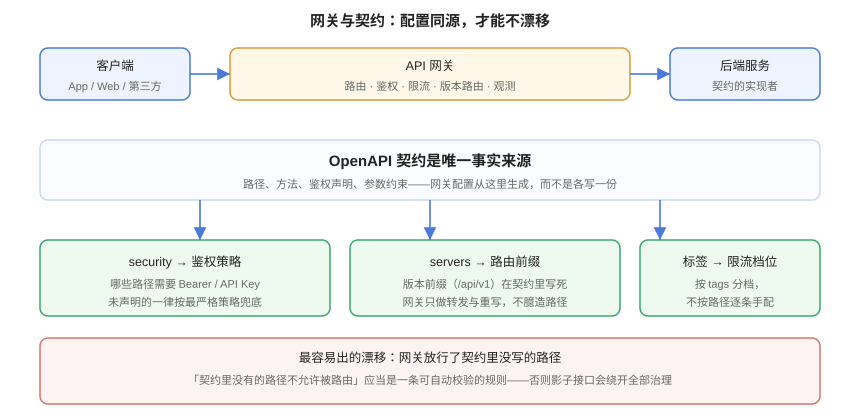

# 网关对接：路由、鉴权、限流与契约的一致性

**一句话定位**：契约定义了「接口长什么样」，网关决定了「请求怎么到达接口、谁被允许调用、调得太快会怎样」。这一页讲**两者之间最容易脱节的地方**，以及怎么让网关配置与契约同源。



::: info 本页边界
本页**不展开某个网关产品的部署与插件开发**——Kong、APISIX、Spring Cloud Gateway 的具体配置与插件写法分别见 [微服务 · 网关](../../../Backend/Microservices/index.md)、[Spring Cloud · 网关](../../../Backend/SpringCloud/index.md)、[Nginx 反向代理](../../../Ops/Nginx/index.md)。

本页只讲**契约与网关之间的那条接口**：哪些信息应该从契约流向网关、哪些判断不该交给网关、以及怎么自动校验两者一致。
:::

## 1. 网关在接口治理里的四个职责

| 职责 | 网关做 | 契约提供什么 |
| --- | --- | --- |
| **路由** | 把 `/api/v1/posts/**` 转发到文章服务 | `servers` 的路径前缀、`paths` 的实际路径集合 |
| **鉴权** | 校验 Bearer 令牌 / API Key，拒绝未认证请求 | `security` 与 `components.securitySchemes` |
| **限流** | 按调用方 / 按接口分档限速 | `tags`（用于分档）与接口的 `operationId`（用于统计维度） |
| **观测** | 记录状态码、延迟、调用方、trace 透传 | 契约里的错误分支定义（否则指标分不出「业务 4xx」与「真故障」） |

::: tip 一个判断标准
**网关只应该做「与业务无关的横切关注点」。** 一旦网关开始判断「这个用户能不能删这篇文章」，说明授权逻辑被切成了两半——一半在网关（路径级），一半在服务（数据级），而**两者之间的缝隙正是越权漏洞的产地**。

正确的分工：网关做**粗粒度**的（有没有令牌、令牌是否有效、是不是白名单路径），服务做**细粒度**的（这个身份能不能操作这条数据），且**细粒度判断必须基于数据，不能基于路径**。
:::

## 2. 三个真实的漂移点

### 2.1 路由漂移：网关放行了契约里没有的路径

这是最危险的一类，因为**它让影子接口绕开全部治理**：契约里没有 → 契约测试不覆盖 → 安全审计看不到。

常见成因有三个：

| 成因 | 表现 | 修法 |
| --- | --- | --- |
| 手工加路由救急 | 上线当晚在网关加了一条 `/api/v1/internal/debug` | 应急路由必须**登记待办并设过期日**（同 `waivers.yaml` 机制） |
| 通配符路由 | `/api/**` 一把转发到后端 | 后端多暴露一个 controller 就自动出网，没人发现 |
| 路径前缀双份维护 | 网关配 `/v1/posts`，契约写 `/api/v1/posts`，靠 rewrite 兜住 | 前缀以 `servers.url` 为唯一来源，网关生成 |

::: danger 通配符路由是「默认放行」的典型
与鉴权规则的默认拒绝原则（见[项目 · 管理端认证与角色](../../../../project/Complete/BlogPlatform/AuthRoles/index.md)）完全同源：**默认放行的失效方式是「多出来的东西自动可见」，且没有人会发现；默认拒绝的失效方式是「新加的东西调不通」，第一次联调就会暴露。**

路由上，默认拒绝的落法是：**网关只转发契约里声明过的路径**，其余一律 404（而不是"先转过去看看后端认不认识"）。
:::

### 2.2 鉴权漂移：契约说不需要，网关说要

`security` 在 OpenAPI 里有**继承语义**：根级的 `security` 是默认值，operation 级的会**覆盖**它；写 `security: []` 表示**显式关闭**鉴权。

最常见的两个配置错误：

```yaml
# ❌ 错误一：以为 operation 里不写就继承，实际上也影响了文档站的「试请求」体验
security:
  - bearerAuth: []
paths:
  /posts:
    get:
      operationId: listPosts      # 读者端接口，本应公开
      # 忘了写 security: []，于是读者端接口在文档里被标成「需要令牌」
```

```yaml
# ✅ 正确：公开接口显式关闭，受保护接口显式声明
paths:
  /posts:
    get:
      operationId: listPosts
      security: []                # 公开
  /admin/posts:
    post:
      operationId: createPost
      security:
        - bearerAuth: [EDITOR]     # 需要 EDITOR 角色
```

::: warning 契约里的鉴权声明只有两个消费者
1. **文档站**（决定「试请求」要不要弹输入令牌）；
2. **网关配置生成**（决定这条路径是否要求令牌）。

**它绝不替代服务端的授权逻辑**。服务端必须独立做一次完整校验——「网关已经验过了」不能作为跳过服务端校验的理由，因为网关与服务之间通常还有内网段，而内网不是安全边界。
:::

### 2.3 限流漂移：按路径逐条手配，永远配不全

限流配置手写时的典型状态是：上线时给核心接口加了限流，半年后新增的 10 个接口一个都没加——**因为它们本来就没在限流清单里**，而没人会想起去补。

可维护的做法是**按契约里的结构分档**，而不是按路径逐条列：

```yaml
# 限流档位（示例，具体语法取决于你用的网关）
rate_limits:
  - match: { tags: [search] }          # 检索类：重、贵、必须限
    limit: 30/m
  - match: { tags: [posts], method: GET }
    limit: 600/m
  - match: { security: bearerAuth, tags: [admin] }
    limit: 120/m
  - default:                            # 默认档：未分类的一律按此档，不是不限
    limit: 60/m
```

::: danger 默认档不能是「不限」
与路由、鉴权同理：**默认必须是「最保守」的那一档**。新增接口时忘记分类的后果应该是「调用方很快撞到限流并来问」，而不是「无限流直接打穿后端」。
:::

## 3. 契约到网关：可自动化的部分

网关配置的很大一部分其实是**契约的机械投影**。能自动生成的部分不要手写。

| 网关配置项 | 能否从契约生成 | 生成依据 |
| --- | --- | --- |
| 路由路径表 | ✅ | `servers.url` + `paths` |
| 是否需要鉴权 | ✅ | 根级 `security` + operation 级覆盖 |
| 限流分档的匹配条件 | ⚠️ 半自动 | `tags` 与 `security`（档位数值仍需人工定） |
| 超时设置 | ❌ | 与后端实现的性能特征相关，契约里表达不了 |
| 重试策略 | ❌ | 与幂等性相关，需要人工判断（GET/PUT 可重试，POST 需幂等键） |
| 请求体大小上限 | ⚠️ | 契约里没有直接字段，可用自定义扩展 `x-max-body-size` |

```shell
# 一个可用的做法：从契约导出路由清单，与网关实际路由做差集
python3 - <<'PY'
import yaml, json
doc = yaml.safe_load(open('docs/api/openapi.yaml', encoding='utf-8'))
prefix = doc['servers'][0]['url'].split('//')[-1].split('/', 1)[1]   # 取 /api/v1
routes = set()
for p, item in doc['paths'].items():
    has_public = any('security' in op and op['security'] == [] for op in item.values() if isinstance(op, dict))
    routes.add((f'/{prefix}{p}', 'public' if has_public else 'protected'))
print(f'契约声明路由数: {len(routes)}')
for r in sorted(routes):
    print(' ', r)
# 断言活性：路由数为 0 说明 servers/paths 解析出了问题
assert routes, '契约里没解析出任何路由——先检查 servers.url 与 paths'
PY
```

::: tip 为什么值得做这一步
**它是唯一能稳定发现「网关多出来的路由」的低成本手段。** 反过来（网关少一条路由）会在联调时立刻暴露，不用自动化；但多出来的那一条，如果不主动去查，可以安静地存在好几年。
:::

## 4. 网关侧不该做的事

| 不该做 | 为什么 | 该在哪做 |
| --- | --- | --- |
| **字段级授权**（这个 token 能不能改这个 id） | 网关拿不到业务数据，只能靠路径猜 | 服务端基于数据判断 |
| **业务校验**（金额是否超限、状态是否允许） | 契约里没有业务规则，网关改了就得跟着改 | 服务端 + 契约里的 4xx 分支 |
| **响应体重写**（补字段、改结构） | 让契约与真实响应不一致，契约测试会失败且原因难查 | 服务端返回正确结构 |
| **把错误统一成 500** | 丢失错误语义，调用方无法自愈，指标分不出业务错误 | 保留原始状态码与错误体 |
| **作为流量观测的唯一来源** | 网关指标只有路径维度，没有业务维度 | 网关指标 + 服务端业务指标 |

::: warning 「网关把错误统一成 500」是最伤的一处
有些网关默认会把上游返回的非法内容或异常包装成 502/500。结果是：**服务端明明正确返回了 409 并带上了 `code` 与 `traceId`，客户端拿到的却是一个没有任何信息的 500。** 排障时你会先怀疑服务端，最后才发现是网关吃掉了响应。

上线前的验收清单里应当有一条：**用 curl 直连服务、再经网关各发一次同样的非法请求，比较状态码与响应体是否一致。**
:::

## 5. 验证方式

```shell
# ① 契约声明的状态码 vs 经网关实际返回的状态码（同一非法请求，两条路径各打一次）
curl -s -o /dev/null -w 'direct=%{http_code}\n' \
  -X POST http://127.0.0.1:18080/api/v1/admin/posts -H 'Content-Type: application/json' -d '{}'
curl -s -o /dev/null -w 'gateway=%{http_code}\n' \
  -X POST http://127.0.0.1:8080/api/v1/admin/posts -H 'Content-Type: application/json' -d '{}'
# 期望：两次一致（如都是 401）。不一致说明网关改写了语义

# ② 未认证访问受保护路径（契约里声明了 security 的）
curl -s -o /dev/null -w '%{http_code}\n' http://127.0.0.1:8080/api/v1/admin/posts
# 期望：401

# ③ 公开路径不应被误伤
curl -s -o /dev/null -w '%{http_code}\n' http://127.0.0.1:8080/api/v1/posts
# 期望：200（若为 401，说明根级 security 被错误地施加到了公开接口）

# ④ 限流生效且带 Retry-After
for i in $(seq 1 80); do
  curl -s -o /dev/null -w '%{http_code} ' http://127.0.0.1:8080/api/v1/search?q=x
done; echo
# 期望：出现 429，且响应头含 Retry-After
curl -sI http://127.0.0.1:8080/api/v1/search?q=x | grep -i '^retry-after:'
```

::: danger 第 ③ 步是最容易被漏掉的一步
把公开接口误判为需要鉴权，在测试里往往表现为「前端首页白屏」而不是「接口报错」——因为 SSR 场景下拿不到数据会直接渲染失败。上线前专门跑一次「匿名调用所有声明为公开的接口」，能省下很多排查时间。
:::

## 6. 参考资料

- [OpenAPI Specification · Security Requirement Object](https://spec.openapis.org/oas/v3.2.0.html#security-requirement-object)：`security` 的继承与覆盖语义
- [RFC 9110 · HTTP Semantics](https://www.rfc-editor.org/rfc/rfc9110.html)：状态码语义，网关改写错误码的依据
- [OWASP API Security Top 10 · API5:2023 功能级授权失效](https://owasp.org/API-Security/editions/2023/en/0xa5-broken-function-level-authorization/)：路径级授权的风险来源
- [NIST SP 800-228](https://csrc.nist.gov/pubs/sp/800/228/final)：API 保护在开发与运行时阶段的控制建议（2026-03 更新）
- 相邻页：[微服务 · 网关](../../../Backend/Microservices/index.md)、[Spring Cloud · 网关](../../../Backend/SpringCloud/index.md)、[Nginx 反向代理](../../../Ops/Nginx/index.md)
