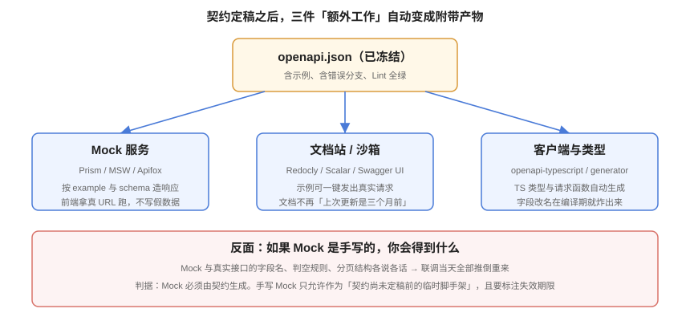

# Mock、文档站与沙箱

**一句话定位**：契约定稿之后，Mock、文档、SDK、类型定义都应该是**自动产物**——这一页讲怎么把它们接起来，以及**当 Mock 是手写的时候，你到底失去了什么**。



::: info 版本口径（2026-10 核对）
- **Prism**（Stoplight）：`@stoplight/prism-cli`，按 OpenAPI 契约启动 Mock 服务器，支持 request validation 与 dynamic mock。
- **Redocly CLI**：`preview-docs` 本地预览、`build-docs` 产出静态文档站；对 3.2 新字段持续跟进。
- **Scalar**：新一代 API 客户端/文档渲染器，支持「文档 + 请求发送 + 代码示例」一体化。
- **Swagger UI / Swagger Editor**：对 OAS **3.0 与 3.1 支持最广泛**，3.2 支持在逐步落地。
- **openapi-typescript**：从契约生成 TypeScript 类型；**MSW**（Mock Service Worker）可与之配合在前端进程内拦截请求。
- **Postman / Apifox**：都能**导入** OAS 定义；它们同时是接口调试工具（见 [接口调试工具](../../APITools/index.md)），但**不应作为契约的事实来源**。
:::

## 1. 为什么必须让 Mock 由契约生成

先看手写 Mock 的失效路径。它几乎总是按同样的顺序坏掉：

1. 契约定稿，前端照着契约字段名写了 Mock；
2. 后端实现时觉得 `createdAt` 用 `createTime` 更符合团队习惯，改了实现**没改契约**；
3. 联调当天，前端发现字段名对不上，临时在前端加了一层映射；
4. 三个月后契约终于更新，前端那层映射成了**没人敢删的遗留代码**。

根本原因不是谁不认真，而是**手写 Mock 是一份独立维护的「第二份契约」**——两份事实来源必然漂移。

| 指标 | 手写 Mock | 契约生成 Mock |
| --- | --- | --- |
| 字段名一致性 | 靠人 | **结构性保证** |
| 契约改动后 | 需要有人记得改 | 重启 Mock 即可 |
| 分页 / 错误结构 | 各写各的 | 与契约同源 |
| 是否可进 CI | 很难断言 | 可做契约测试 |

::: tip 判据
**「Mock 是不是从契约生成的」是一条可以自动检查的规则。** 实现方式：在 CI 里启动契约生成的 Mock 服务，用契约测试（Schemathesis / Dredd 风格）打一遍；如果手写 Mock 与契约不一致，这一步会失败。手写 Mock **只允许作为「契约尚未定稿前的临时脚手架」**，并且要标注失效期限——它与 `waivers.yaml` 里的例外是同一类东西，都需要 `owner` 与 `expires`。
:::

## 2. 契约生成 Mock：三种落地形态

| 形态 | 工具 | 适合 | 特点 |
| --- | --- | --- | --- |
| **独立 Mock 服务** | Prism CLI | 前后端分离、需要真实 URL | 启动即用，支持按 `example` 返回、请求校验 |
| **进程内拦截** | MSW + openapi 契约 | 前端单测 / 组件测试 | 不用起服务，测试快；需自己把契约映射成 handler |
| **平台内置** | Apifox / Postman 的 Mock | 团队已有平台 | 上手快；注意**契约必须从平台导出回仓库**，否则又变成两份来源 |

### 2.1 Prism 最小可用

```shell
# 从契约直接启动 Mock 服务（支持 --dynamic 生成随机数据）
npx --yes @stoplight/prism-cli mock docs/api/openapi.yaml --port 4010 --dynamic

# 验证：按契约里的 examples 返回
curl -s http://127.0.0.1:4010/posts?page=1&size=20 | head -c 300

# 请求校验模式（把契约当守门员，非法请求返回 422）
npx --yes @stoplight/prism-cli mock docs/api/openapi.yaml --errors
```

::: danger Prism 的两个坑
1. **默认端口 4010，容易被前端 proxy 配置漏掉**：前端的 `proxy` / `VITE_API_BASE` 要指向 Mock 服务，而不是后端端口。这一条在「前端明明改了却没生效」的场景里出现频率极高。
2. **`--dynamic` 生成的数据不一定满足业务语义**：`status` 会随机取枚举里的任意值，包括 `draft`。如果前端只测了 `published` 的分支，测试覆盖就是假的。**该用固定示例的地方（`examples`）要写明确，不要依赖随机。**
:::

### 2.2 契约 → TypeScript 类型与请求函数

```shell
# 只生成类型（零运行时依赖，最轻）
npx --yes openapi-typescript docs/api/openapi.yaml -o src/api/schema.d.ts

# 生成带类型与 fetch 封装的客户端（Redocly，实验特性，注意其稳定性）
npx --yes @redocly/cli generate-client docs/api/openapi.yaml -o src/api/client
```

生成类型带来一个实实在在的好处：**字段改名在编译期就炸出来**。

```typescript
// src/api/usePost.ts
import type { components } from './schema';
type PostView = components['schemas']['PostView'];

export async function fetchPost(slug: string): Promise<PostView> {
  const res = await fetch(`/api/v1/posts/${slug}`);
  if (!res.ok) throw new Error(`HTTP ${res.status}`);
  return (await res.json()) as PostView;
}
```

契约把 `title` 改成 `name` 并重新生成后，`post.title` 会直接变成编译错误——**这比在测试环境点出 500 早得多，也比人工搜索可靠得多**。

::: warning 生成物要冻结，但不要手改
生成目录（如 `src/api/schema.d.ts`）应当：

- **进版本控制**（前端构建不必依赖网络与 Node 工具链）；
- **在文件头标注「自动生成，请勿手改」**；
- 在 CI 里加一条检查：**重新生成后 `git diff --exit-code` 必须为空**。这条检查能拦住「契约改了但生成物没重新生成」这种最常见的漂移。
:::

## 3. 文档站：从「交付物」变成「副产品」

文档站最常见的死法是「上线时写得很完整，之后没人更新」。治本的做法是**让它没有手写的部分**。

### 3.1 三种渲染路线

| 路线 | 工具 | 适合 |
| --- | --- | --- |
| **纯渲染** | Redoc / Scalar / Swagger UI | 只读文档，契约即文档 |
| **渲染 + 试请求** | Scalar、Swagger UI、Redocly `preview-docs` | 需要让调用方在页面上直接发请求 |
| **渲染 + 沙箱环境** | 文档站 + 独立测试环境 | 请求会真实写入数据、需要可回滚的环境 |

```shell
# 本地预览
npx --yes @redocly/cli preview-docs docs/api/openapi.yaml

# 产出静态文档站（可发布到任意静态托管）
npx --yes @redocly/cli build-docs docs/api/openapi.yaml -o dist/api-docs
```

::: danger 「试请求」必须指向沙箱，不能指向生产
文档站的「Try it」按钮一旦指向生产环境，任何访客都可以用你的文档站往生产库写数据。**要么关掉写接口的试请求，要么把 `servers` 指向沙箱环境**，并确保沙箱的数据可一键重置。

配套建议：契约的 `servers` 里明确列出各环境（`name: production` / `name: sandbox`），文档站只展示沙箱。
:::

### 3.2 文档质量的三个可见信号

契约里这三样东西直接决定文档站好不好用：

| 元素 | 没有时的表现 | 做法 |
| --- | --- | --- |
| `operation.summary` / `description` | 页面只有一行路径，调用方不知道它做什么 | summary 一句话，description 写清前置条件与副作用 |
| `examples` | 请求/响应体是 `"string"`、`0`、`"2026-01-01T00:00:00Z"` 这类占位数据 | 每个 schema 至少一个贴近业务的示例 |
| `tags` | 几十个接口平铺，找不到入口 | 按业务链路分组；3.2 起支持标签 `parent` 嵌套 |

## 4. 契约测试：把「一致性」变成可执行断言

Mock、文档、类型都是**从契约出发**的产物。反方向的一致性——**实现是否真的符合契约**——要靠契约测试来保证。

```python
# tests/test_contract.py —— 用 Schemathesis 按契约打真实服务
import schemathesis

# 契约即测试用例来源
schema = schemathesis.openapi.from_path("docs/api/openapi.yaml")

@schema.parametrize()
def test_api_conforms_to_contract(case):
    response = case.call(base_url="http://127.0.0.1:18080")
    case.validate_response(response)
```

| 检查方向 | 工具 | 断言什么 |
| --- | --- | --- |
| 实现是否符合契约 | Schemathesis / Dredd | 响应状态码、结构、字段类型都在契约声明范围内 |
| 契约是否符合实现 | `oasdiff diff` 契约 vs 导出实现 | 差异即缺陷 |
| Mock 是否符合契约 | 契约生成的 Mock 天然满足 | 手写 Mock 用同一套契约测试打 |

::: tip 从「只读接口」开始
契约测试对写接口需要数据清理，成本更高。可行的推进顺序是：**先给只读接口（GET）全量接上契约测试**——它们没有副作用、可重复执行、覆盖了大多数数据结构；写接口先用冒烟用例覆盖状态迁移，再逐步纳入。
:::

## 5. 验证方式

```shell
cd your-project

# ① 契约能驱动 Mock（不需要后端）
npx --yes @stoplight/prism-cli mock docs/api/openapi.yaml --port 4010 &
sleep 3
curl -s -o /dev/null -w '%{http_code}\n' 'http://127.0.0.1:4010/posts?page=1&size=20'
# 期望：200（若为 404，检查契约里的路径前缀与 servers.url）
kill %1

# ② 契约能产文档站且真的渲染出内容（活性判据）
npx --yes @redocly/cli build-docs docs/api/openapi.yaml -o dist/api-docs
test -f dist/api-docs/index.html && echo "OK: 文档站已生成"
grep -c 'operation' dist/api-docs/index.html | head -1
# 期望：grep 命中数 > 0；为 0 说明生成的是空壳页

# ③ 生成物无漂移（CI 里用 --exit-code）
npx --yes openapi-typescript docs/api/openapi.yaml -o /tmp/schema.d.ts
diff -q /tmp/schema.d.ts src/api/schema.d.ts && echo "OK: 生成物与契约一致"
```

## 6. 参考资料

- [Prism 文档](https://github.com/stoplightio/prism)：契约驱动 Mock 与代理
- [Redocly CLI · build-docs / preview-docs](https://redocly.com/docs/cli/commands/build-docs)
- [Scalar](https://github.com/scalar/scalar)：现代化 API 文档与客户端
- [openapi-typescript](https://github.com/openapi-ts/openapi-typescript)：契约 → TS 类型
- [MSW（Mock Service Worker）](https://mswjs.io/)：进程内请求拦截
- [Schemathesis](https://schemathesis.readthedocs.io/)：基于契约的属性测试
- 相邻页：[接口调试工具](../../APITools/index.md)（手工调试与平台内置 Mock）、[接口自动化](../../TestingTools/APIAutomation/index.md)（把用例沉淀进 CI）
