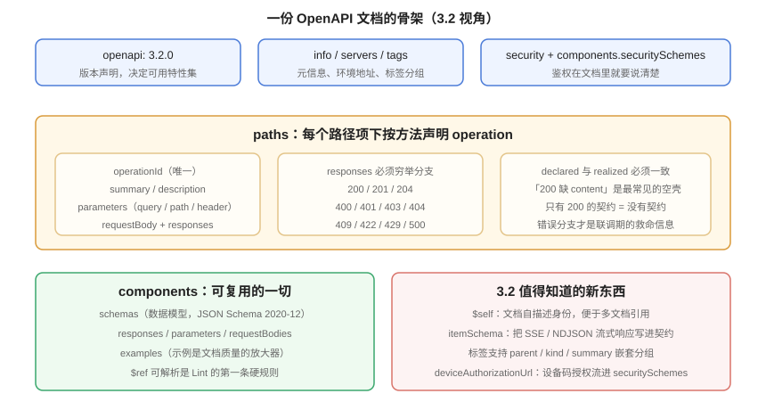

# OpenAPI 契约工程化：从 3.0 到 3.2

**一句话定位**：上一页讲「接口该长什么样」，这一页讲「怎么把它写死成机器可读的文件」——文档骨架、`$ref` 组织、多文件拆分与打包、示例与可校验性，以及 **3.0 / 3.1 / 3.2 三个大版本到底差在哪**。



::: info 版本口径（2026-10 核对）
- **OpenAPI Specification 3.2.1**：2026-09-10 发布的补丁版，承接 **3.2.0**（2025-09-19）；3.2 相对 3.1 **完全向后兼容**，没有既有合法文档变非法。
- **3.1.x / 3.0.x**：仍在维护。**3.1 是与 JSON Schema 2020-12 对齐的分水岭**，也是很多团队升级的分界线。
- **OpenAPI 4.0（Moonwalk）**：仍在设计阶段、无发布日期；3.2 已提前吸收若干向后兼容的 4.0 探索成果（如 `$self`、标签嵌套）。
- 工具链对 3.2 的支持仍在铺开，**3.1 与 3.0 的支持最成熟**；采用 3.2 独有字段（`$self`、`itemSchema`）前先确认你的解析器、Lint 与生成器都跟上了。
:::

## 1. 三个大版本：升级前必须知道的差异

这是本页最实用的一张对照表。很多「升级后工具报错」的问题，答案都在这三行里。

| 维度 | 3.0.x | 3.1.x | 3.2.x |
| --- | --- | --- | --- |
| `openapi` 字段值 | `3.0.3` 等 | `3.1.0` / `3.1.1` | `3.2.0` / `3.2.1` |
| Schema 方言 | 自己的 Schema 子集 | **完整 JSON Schema 2020-12** | 同 3.1（JSON Schema 2020-12 的超集） |
| `nullable` | 用 `nullable: true` | **已移除**，用 `type: [string, "null"]` | 同 3.1 |
| 属性描述 | `example`（单数） | `examples`（JSON Schema 的数组形式） | 同 3.1 |
| 独占字段 | 无 | `webhooks`、`jsonSchemaDialect`、`license.identifier` | 新增 `$self`、`itemSchema`、标签 `parent/kind/summary`、`securitySchemes[].deprecated` |
| 流式响应表达 | 无法正式表达 | 勉强用 `text/event-stream` + 空 schema | **`itemSchema`**：把 SSE / NDJSON 每一帧的结构写进契约 |
| 文档身份 | 无 | 无 | **`$self`**：给文档一个规范 URI，多文档引用不再靠猜 |
| 工具成熟度 | 最成熟（存量最多） | 成熟 | 在铺开中，部分工具只认 3.0/3.1 的字段 |

::: danger 从 3.0 升到 3.1 的四个必改点
1. **`nullable: true` 全部替换**为 `type: [原有类型, "null"]`。留着 `nullable` 在 3.1 里是**未定义字段**，会被严格校验器直接报错。
2. **`example` → `examples`**（数组）。单数形式在 3.1 的 Schema 对象里不再被识别为示例，文档站会显示不出示例。
3. **`exclusiveMinimum` / `exclusiveMaximum` 从布尔值改为数值**（JSON Schema 2020-12 的语义变化）。`exclusiveMinimum: true` 这类写法会直接报错。
4. **`format` 的语义变了**：在 3.1 里 `format` 默认只是**注解**，不强制校验。想让 `format: email` 真的拦住非法邮箱，必须由校验器配置（或在 `jsonSchemaDialect` 层面明确）。
:::

::: tip 该不该升到 3.1/3.2？
判据不是「新不新」，而是**你有没有以下任一需求**：

- 需要表达 `webhooks`（3.0 完全没法写）；
- 需要 SSE / NDJSON 这类流式接口进契约（→ 3.2 的 `itemSchema`）；
- 需要复用成熟的 JSON Schema 工具与生态（→ 3.1）；
- 契约要被多个文档交叉引用（→ 3.2 的 `$self`）。

**都不需要 → 留在 3.0 完全合理**。3.0 的工具链最成熟，为了「版本数字好看」升级，是纯粹的净成本。
:::

## 2. 文档结构：三层职责

一份 OpenAPI 文档只有三层，分清职责就不会写乱：

| 层 | 字段 | 职责 | 常见错误 |
| --- | --- | --- | --- |
| **元信息层** | `info` / `servers` / `tags` / `security` | 我是谁、在哪、怎么分组、怎么鉴权 | `servers` 里写死本机地址；`security` 漏声明导致文档站无法发起真实请求 |
| **操作层** | `paths` → 方法 → `operation` | 每个接口的入参、出参、可能的状态码 | 只写 200；`operationId` 重复或缺失 |
| **定义层** | `components` → `schemas` / `responses` / `parameters` | 可复用的一切 | `$ref` 指向不存在的节点；schema 与实现字段名不一致 |

### 2.1 `operationId` 是契约里最被低估的字段

`operationId` 决定了两件事：

1. **客户端生成器**用什么名字生成函数（`listPosts()` 还是 `get2()`）；
2. **文档站的锚点**，以及**破坏性变更检测**能不能把「重命名」识别出来。

约定：**`operationId` 全局唯一，用 `动词 + 资源复数` 的 camelCase**（`listPosts` / `getPost` / `createPost` / `publishPost`）。缺失时可用 Lint 规则强制（见 [治理机制](../Governance/index.md)）。

::: danger `operationId` 缺失的连锁后果
没有 `operationId`，生成器会退回按路径+方法拼名字：`get_api_v1_posts_slug_`。前端拿到的函数名既不可读也不稳定——**改一次路径，全站导入报错**。所以「`operationId` 必填」应当是一条 error 级规则。
:::

### 2.2 示例（`examples`）不是装饰

示例在契约里有三个真实用途：

| 用途 | 说明 |
| --- | --- |
| **文档站可读性** | 调用方看的第一眼就是示例，而不是 schema 表格 |
| **Mock 响应数据源** | Prism 等 Mock 工具优先用 `examples` 生成响应体；没有示例就按 schema 造，容易出现 `"string"` 这种假数据 |
| **契约测试的断言来源** | 回归用例可以用示例作为「至少结构要能对上」的基线 |

写法（3.1+，`examples` 是**映射或数组**）：

```yaml
components:
  schemas:
    PostView:
      type: object
      required: [id, slug, title, status]
      properties:
        id:     { type: integer, minimum: 1 }
        slug:   { type: string, pattern: '^[a-z0-9]+(?:-[a-z0-9]+)*$' }
        title:  { type: string, maxLength: 200 }
        status: { type: string, enum: [draft, published] }
      examples:
        - id: 1024
          slug: "hello-openapi"
          title: "契约优先到底改变了什么"
          status: published
```

## 3. 多文件拆分与打包

单文件契约超过几百行就会变成合并冲突的重灾区。可维护的组织方式是**按资源拆分**：

```text
docs/api/
├─ openapi.yaml            # 根文件：info / servers / security / $ref 汇总
├─ paths/
│  ├─ posts.yaml
│  ├─ categories.yaml
│  └─ comments.yaml
├─ schemas/
│  ├─ Post.yaml
│  ├─ PostPage.yaml
│  └─ Problem.yaml
└─ components/
   └─ responses.yaml
```

根文件用 `$ref` 组合：

```yaml [docs/api/openapi.yaml]
openapi: 3.2.0
info: { title: 博客平台 API, version: 1.3.0 }
servers:
  - url: https://api.example.com/api/v1
paths:
  /posts:
    $ref: './paths/posts.yaml#/paths/~1posts'
  /categories:
    $ref: './paths/categories.yaml#/paths/~1categories'
components:
  schemas:
    PostView:     { $ref: './schemas/Post.yaml' }
    Problem:      { $ref: './components/Problem.yaml' }
```

::: danger `$ref` 的三个坑
1. **`#/paths/~1posts` 里的 `~1` 是 `/` 的 JSON Pointer 转义**，不能写成 `/`。这个符号写错，报错信息通常只告诉你「引用不可解析」，不告诉你错在哪。
2. **相对路径相对于「引用所在文件」**，不是相对于根文件。子目录里的文件要用 `../` 回到上一级。
3. **大小写敏感**：`./Schemas/Post.yaml` 在 macOS 上能读到 `schemas/Post.yaml`，上了 Linux CI 就报文件不存在。**这一条与 REST 页的路径大小写问题同源**，都是「本地测不出」的典型。
:::

### 3.1 打包（bundle）：给只吃单文件的工具

Lint、文档站、客户端生成器对多文件的支持程度不一。稳妥做法是**先 bundle 再交给下游**：

```shell
npx @redocly/cli bundle docs/api/openapi.yaml -o dist/openapi.bundle.yaml
npx @redocly/cli lint   docs/api/openapi.yaml          # lint 直接读多文件也可以

# 边界情况：先 bundle、再 lint 打包产物，能发现「只在合并后才出现」的重复 operationId
npx @stoplight/spectral-cli lint dist/openapi.bundle.yaml
```

::: tip 为什么要 lint 两次
多文件模式下，Lint 看到的是一个个独立文档；`operationId` 全局唯一、`$ref` 循环引用这类规则**只有在合并后才能完整判定**。所以「lint 源文件 + lint 打包产物」是两道互补的检查，不是重复劳动。
:::

## 4. 契约的自我校验：先证明它「合法」

「Lint 通过」不等于「契约合法」。校验分两类，都要做：

| 类型 | 工具 | 检查什么 | 失败意味着 |
| --- | --- | --- | --- |
| **结构校验** | `openapi-spec-validator`、Swagger Editor | 是否符合 OpenAPI 元模式（字段名、必填项、类型） | 契约**不是**合法 OpenAPI 文档，工具会直接报错 |
| **风格校验** | Spectral、Redocly、Vacuum | 是否符合团队规范（命名、必填 description、错误分支） | 文档合法，但质量不达标 |

```shell
# ① 结构校验：零依赖、Python 生态
python3 -m pip install openapi-spec-validator
python3 -m openapi_spec_validator docs/api/openapi.yaml && echo "结构合法"

# ② 风格校验（规则集见「治理机制」页）
npx @stoplight/spectral-cli lint docs/api/openapi.yaml

# ③ 差异检测：与基线比，看有没有破坏性变更
oasdiff breaking docs/api/openapi.baseline.yaml docs/api/openapi.yaml
```

::: warning 换行符与编码
契约文件统一 **UTF-8 + LF**。Windows 提交的 CRLF 会让某些解析器的行号偏移，报错指向与实际不符；带 BOM 的 UTF-8 会让只按字节解析的工具在第一行就失败。仓库应有 `.editorconfig` 与 `.gitattributes` 兜底（本仓库已有 `.editorconfig`）。
:::

## 5. Java 侧：为什么本项目选「手写契约」而不是注解导出

很多 Spring 项目用注解 + springdoc 自动导出契约。这是一种**代码优先**的做法，它有自己的适用场景，但不适合契约先行：

| | 注解导出（springdoc） | 手写契约 |
| --- | --- | --- |
| 契约何时存在 | 实现写完之后 | **实现之前** |
| 契约与实现的一致性 | 天然一致（同一处生成） | 需要契约测试保证 |
| 能否驱动前端先行开发 | ❌ 要等实现 | ✅ 契约定稿即可 |
| 契约能否做设计评审 | 评审发生在代码评审里（太晚） | ✅ 独立 PR，改一行很便宜 |
| 适合 | 内部服务、契约消费者就是自己 | **对外接口、多端消费、长期演进** |

::: tip 一个不冲突的组合
两者可以叠加，但**必须指定唯一的事实来源**。推荐组合：**手写契约作为事实来源**，同时用 springdoc 在**测试环境**暴露实现导出的文档，由 CI 做 `oasdiff` 比对——**差异即为缺陷**（要么改实现，要么走契约变更流程）。这就把「自动导出」从「事实来源」降级成了「一致性探针」，是它最合适的位置。

导出实现的命令与 springdoc 的配置细节见 [SpringBoot · Swagger / springdoc](../../../Backend/Java/Frame/SpringBoot/v3/Integration/Swagger/index.md) 与 [完整项目交付 · 接口契约先行](../../../Others/ProjectDelivery/Contract/index.md)。
:::

## 6. 验证方式

```shell
cd your-project

# ① 结构合法
python3 -m openapi_spec_validator docs/api/openapi.yaml && echo "OK: 结构合法"

# ② 规则集通过（无 error）
npx @stoplight/spectral-cli lint docs/api/openapi.yaml

# ③ 多文件可打包（证明所有 $ref 都能解析）
npx @redocly/cli bundle docs/api/openapi.yaml -o dist/openapi.bundle.yaml \
  && echo "OK: $ref 全部可解析"

# ④ 活性判据：确认打包产物里真的有内容
python3 - <<'PY'
import json, sys, yaml
doc = yaml.safe_load(open('dist/openapi.bundle.yaml', encoding='utf-8'))
paths = doc.get('paths', {})
schemas = doc.get('components', {}).get('schemas', {})
print(f'paths={len(paths)} schemas={len(schemas)}')
assert len(paths) > 0, '打包产物里没有路径——先确认读的是正确的文件'
assert len(schemas) > 0, '没有复用 schema，检查 components 是否被 inline 掉了'
PY
# 期望：paths 与 schemas 均为正整数；若为 0，说明前面的「通过」没有意义
```

## 7. 参考资料

- [OpenAPI Specification 3.2.0](https://spec.openapis.org/oas/v3.2.0.html)：本页所有 3.2 结论的来源
- [OpenAPI Specification 3.1.0](https://spec.openapis.org/oas/v3.1.0.html)：JSON Schema 2020-12 对齐的版本
- [OpenAPI Initiative：3.2 公告与升级说明](https://www.openapis.org/blog)：向后兼容性与新字段的官方口径
- [JSON Schema 2020-12](https://json-schema.org/specification-links#2020-12)：Schema 方言
- [openapi-spec-validator](https://github.com/python-openapi/openapi-spec-validator)：零依赖的结构校验
- [Redocly CLI 文档](https://redocly.com/docs/cli/)：lint / bundle / 预览
- 相邻页：[REST 设计规范](../RestDesign/index.md)、[版本策略与兼容性演进](../Versioning/index.md)、[治理机制](../Governance/index.md)
