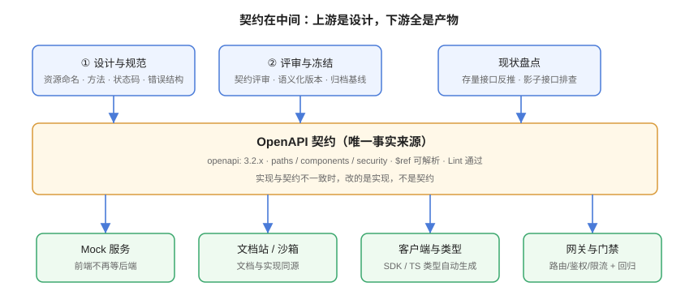
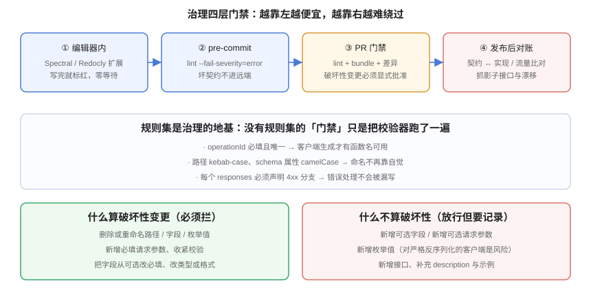

# 体系概述：契约优先与治理四道关

**一句话定位**：本页回答「接口为什么需要被设计」「契约优先到底改变了什么」「治理要治理哪些东西」——它是整个专题的地图，后面每一页都是这张图上的一块。



## 1. 接口问题的本质：没有人对「接口」负责

一个典型的团队里，「接口」这件事是被切碎分给好几个角色的：

- **后端**负责让它能跑——实现优先，接口是实现的副产品；
- **前端**负责把它调通——靠问、靠抓包、靠猜；
- **测试**负责把它测全——用例跟着实现走，实现改了用例再改；
- **运维**负责把它放出去——网关路由按收到的路径手配一份。

每个人都在做自己的那一段，**但没有人的职责是「接口本身长什么样」**。这就是所有接口问题的共同来源：

| 症状 | 真实成因 |
| --- | --- |
| 同一系统里 `GET /getUserById` 与 `POST /user/query` 并存 | 没有人定过命名规范，每个人按自己顺手的方式写 |
| 前端抱怨「文档是错的」 | 文档由人手写，与实现是两份东西，必然漂移 |
| 联调时才发现错误码没约定 | 契约里只写了成功响应，错误分支从来没被设计过 |
| 改了一个字段名，三个调用方同时在线上炸 | 没有版本策略，也没有破坏性变更的拦截机制 |
| 网关里躺着一批文档上不存在的路径 | 网关配置与契约是两份独立维护的东西 |

**换工具不解决这些问题**。把 Postman 换成 Apifox、把 Swagger UI 换成 Redoc，症状会暂时好看，但成因一点没动。

## 2. 契约优先：把「事实来源」反过来

「契约优先（Contract-First）」与「代码优先（Code-First）」的差别，看起来只是**先写哪个文件**，实际上是**谁是事实来源**。

| 维度 | 代码优先 | 契约优先 |
| --- | --- | --- |
| **事实来源** | 实现代码 | 契约文档 |
| **契约怎么来** | 从代码注解/反射**导出** | 先**手写**，再驱动实现 |
| **不一致时谁错** | 契约过时了 | **实现错了** |
| **前端何时能开工** | 等实现完成（或等导出） | 契约定稿即可，Mock 顶上 |
| **设计讨论发生在** | 代码评审时（通常已太晚） | 契约评审时（改一行便宜的时机） |
| **适合的场景** | 内部小服务、快速原型 | **对外接口、多端消费、长期演进** |

::: tip 一句话理解
**代码优先产出的是「能跑的接口」，契约优先产出的是「可以被别人依赖的接口」。**
判断该用哪种，问一句：**这个接口有没有「不是写它的那个人」的消费者？** 有——尤其是跨团队、跨公司、跨端——就该契约优先。
:::

### 2.1 契约优先的实操顺序

不要一上来就"全公司推行契约优先"，那一定会死在第一批存量接口上。可行的顺序是：

1. **新接口一律契约优先**：从今天起新增的接口，先交契约 PR，评审通过再写实现。存量不动。
2. **变更中的接口顺手补契约**：存量接口下次被改动时，补上契约再改。**不为了「补历史」专门排期**——那件事的成本远高于收益。
3. **对外的接口优先补齐**：第三方在用的接口最先补，因为它们的漂移代价最高。
4. **最后才是门禁**：等库里的契约覆盖到一定程度（经验值：对外接口 100%、内部接口 60% 以上），再开破坏性变更拦截。过早开门禁只会让人绕过它。

## 3. 治理四道关：越靠左越便宜

「治理」不是一句口号，而是**四层依次收紧的门禁**。核心原则只有一条：**越靠左（越接近编写）的检查越便宜，也越容易被人接受**。



| 层 | 位置 | 做什么 | 失败代价 |
| --- | --- | --- | --- |
| ① 编辑器 | 写契约的当下 | 实时标注违规（缩进、命名、缺 description） | 几乎为零，改一个词 |
| ② pre-commit | 提交前 | `lint --fail-severity=error`，坏契约不进远端 | 几秒，改完重提 |
| ③ PR 门禁 | 合并前 | lint + bundle + **破坏性变更检测** | 分钟级，需要讨论与批准 |
| ④ 发布后对账 | 上线后 | 契约 ↔ 实现产物 diff、契约 ↔ 真实流量比对 | 小时级，可能已经是事故 |

::: warning 关于第 ④ 层
很多团队只做前三层就以为治理完成了。但**前三层管不住「线上多出来的东西」**：手工在网关加的一条路由、紧急上线时绕过契约改的实现、被遗忘的内部调试接口。第 ④ 层是**唯一能发现影子接口（Shadow API）**的一层，而影子接口恰恰是安全审计里最常被点名的项。
:::

### 3.1 治理到底治理什么

「治理」这个词容易被讲得很大，实际要管的只有五件事（正好对应本专题的后续页面）：

| 治理对象 | 具体要求 | 展开页 |
| --- | --- | --- |
| **风格** | 资源怎么命名、方法怎么用、状态码怎么选、错误结构长什么样 | [REST 设计规范](../RestDesign/index.md) |
| **表达** | 用什么格式写下来、怎么拆分文件、`$ref` 怎么组织、示例怎么给 | [OpenAPI 契约工程化](../OpenAPI/index.md) |
| **演进** | 什么算破坏性变更、版本号怎么给、废弃怎么通知、宽限期多长 | [版本策略与兼容性演进](../Versioning/index.md) |
| **门禁** | 规则集怎么写、什么时候跑、失败怎么处理、例外怎么申请 | [治理机制](../Governance/index.md) |
| **派生物** | Mock、文档、客户端、网关配置由谁生成、怎么保证不漂移 | [Mock、文档站与沙箱](../MockAndDocs/index.md)、[网关对接](../Gateway/index.md) |

## 4. 三条「先想清楚再动手」的判断

在开始整理接口之前，先把这三个判断做掉。它们的共同点是：**做错的代价远高于做对的成本**。

### 4.1 对外 / 对内，决定治理强度

同一个系统里，「对外接口」与「内部接口」应该被区别对待：

| | 对外（第三方 / 多端消费） | 对内（同团队内部调用） |
| --- | --- | --- |
| 契约 | **必须**，且必须评审、必须版本化 | 建议有，可简化 |
| 破坏性变更 | **一律禁止**，只能新增或走弃用流程 | 允许，但必须同步更新所有调用方 |
| 废弃宽限期 | ≥ 6 个月（按调用量下降决定终点） | 可以短到一周 |
| 鉴权 | 网关统一做，契约里显式声明 | 服务间身份（mTLS / 内网令牌） |

::: danger 最常见的一处偷懒
把「内部接口」的定义放宽成「只有我们自己在用」——于是同公司另一个团队调用的接口也被算成内部，改名不过一声通知。**判据不是「谁在调」，而是「调用方能不能在同一个发布节奏里被一起改掉」**：能，是对内；不能，就是对外。
:::

### 4.2 契约要不要单独仓库

| 方案 | 适合 | 代价 |
| --- | --- | --- |
| **与实现同仓** | 单服务、契约消费者就是自己 | 契约与实现的变更天然绑定，很难漏 |
| **独立契约仓库** | 多服务共享、有独立的评审流程 | 需要额外的同步机制（版本 tag / 子模块） |

默认选**与实现同仓**。只有当一份契约要被**两个以上团队**消费时，独立仓库带来的「显式评审」才值得它的同步成本。

### 4.3 契约的「冻结」是流程动作，不是技术动作

所谓「契约冻结」指的是：从某个时刻起，**这份契约的改动必须走变更流程**。它的实现方式通常是：

- 发布时把当前契约**打一个基线快照**（`openapi.baseline.json`）存进版本控制；
- 之后的每次 PR 都与基线做 diff，破坏性变更需要显式批准并生成新基线；
- 基线本身**不可变**——改基线等于「承认上一个版本没有真正发布」。

## 5. 一个最小可用的判据集

如果你只想记住本页的几条，记这些——它们是后面所有页面的收敛点：

1. **有消费者，就有契约**：凡是「不是写它的人在用」的接口，必须先有契约。
2. **契约先行，不等于全量重构**：只管新接口与正在改的接口，存量靠时间自然覆盖。
3. **错误分支是契约的一半**：只写 200 的契约是空壳，4xx/5xx 才是联调期的救命信息。
4. **门禁要有牙齿，也要能被证伪**：门禁脚本必须能通过「故意改坏」来证明它真的会报错（本专题实战页会给具体做法）。
5. **派生物必须由契约生成**：手写的 Mock 与文档一定会漂移，而且漂移后比没有更危险。

## 6. 验证方式

本页是概述，没有可执行的东西。但有一个判断可以现在做：

```shell
# 数一数你的项目里「有契约的接口」占比
# ① 实现侧暴露的路径数
grep -rhoE '@(Get|Post|Put|Patch|Delete)Mapping\("[^"]*"\)' src/main/java | wc -l

# ② 契约里声明的路径数
grep -cE '^\s{2}/' docs/api/openapi.yaml

# 期望：两者差距越小越好；差距大说明契约覆盖不足
# 注意：如果 ② 的计数为 0，先确认文件路径写对了（活性判据）——扫不到文件的「一致」毫无意义
```

## 7. 参考资料

- [OpenAPI Specification 3.2.0](https://spec.openapis.org/oas/v3.2.0.html)：契约格式的权威定义
- [OpenAPI Initiative：什么是 OpenAPI](https://www.openapis.org/what-is-openapi)：官方对「契约优先」价值的说明
- [RFC 9110 · HTTP Semantics](https://www.rfc-editor.org/rfc/rfc9110.html)：方法语义与幂等性的定义来源
- [OWASP API Security Top 10](https://owasp.org/API-Security/)：含 API9:2023「不当的资产清单管理」，正是影子接口的官方风险编号
- 本专题后续页：[REST 设计规范](../RestDesign/index.md)、[OpenAPI 契约工程化](../OpenAPI/index.md)、[版本策略](../Versioning/index.md)、[治理机制](../Governance/index.md)
