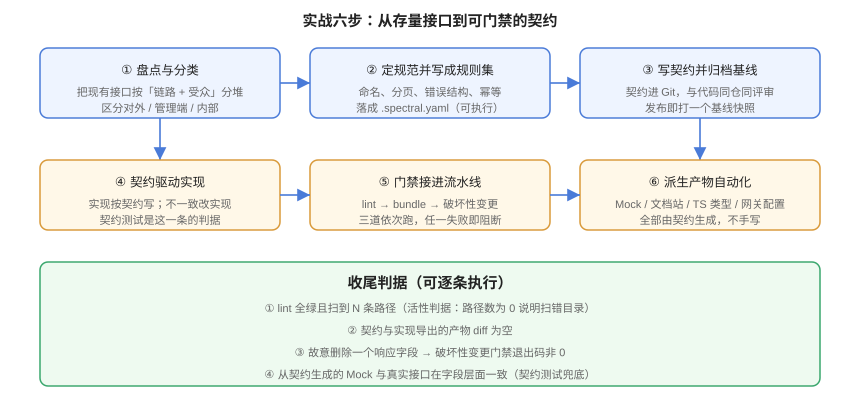

# 实战：给博客平台做一套 API 设计与治理

**一句话定位**：把前面六页的结论串成一条**可以照着做一遍**的流水线——从「一堆没契约的接口」走到「契约驱动 Mock、文档、类型、网关，且破坏性变更被 CI 拦住」。



::: info 本实战的背景与边界
场景取自本仓库第 91-120 天的项目「全栈博客平台」（见 [项目 · 全栈博客平台](../../../../project/Complete/BlogPlatform/index.md)）。该项目已有一个自建的契约校验器，它只做**结构层**的三件事：版本字段、`$ref` 可解析、每个 operation 有响应结构。

本页在这个基础上补齐**风格层、演进层、派生层**——也就是从「契约是合法的」走到「契约是可治理的」。

**本页所有命令都指你自己的工程**：仓库是文档库，不存放脚本与工程文件。
:::

## 0. 起点：先看清现状

假设你的项目里已经有 `docs/api/openapi.yaml`（4 条链路、12 条路径、14 个 operation），以及一个零依赖的校验脚本。

在动手之前，先量三个数——**没有基线，就无法证明治理有效**：

```shell
cd your-project

# ① 契约声明的路径数
python3 -c "
import yaml; d=yaml.safe_load(open('docs/api/openapi.yaml',encoding='utf-8'))
print('paths =', len(d.get('paths',{})))
print('operations =', sum(len([m for m in v if m in ('get','post','put','patch','delete')]) for v in d['paths'].values()))
"

# ② 实现侧暴露的接口数（以 Spring 为例）
grep -rhoE '@(Get|Post|Put|Patch|Delete)Mapping' src/main/java | wc -l

# ③ 契约里声明了错误分支的 operation 占比
python3 -c "
import yaml; d=yaml.safe_load(open('docs/api/openapi.yaml',encoding='utf-8'))
tot=err=0
for p,item in d['paths'].items():
    for m,op in item.items():
        if m not in ('get','post','put','patch','delete'): continue
        tot+=1
        if any(str(c).startswith('4') or str(c).startswith('5') for c in op.get('responses',{})): err+=1
print(f'{err}/{tot} operations 声明了错误分支')
"
```

**期望**：三个数都能打印出来。如果 ② 为 0 或 ① 为 0，先检查路径写对了没有——**「扫到 0 个」不等于「没有问题」**（这是本专题反复强调的活性判据）。

| 基线指标 | 目标值 | 为什么是它 |
| --- | --- | --- |
| 契约覆盖实现 | 100%（新增接口）/ ≥ 60%（存量） | 见[体系概述](../Overview/index.md)的推进顺序 |
| 声明错误分支的 operation 占比 | **100%** | 只写 200 的契约是空壳 |
| `operationId` 覆盖率 | 100% | 客户端生成器的前提 |

## 第 1 步：规范落成规则集

**做了什么**：把 [REST 设计规范](../RestDesign/index.md) 的六条命名规则、错误分支要求、分页上限要求写成 `.spectral.yaml`（完整内容见[治理机制](../Governance/index.md)第 1 节）。

**关键决策**：只把「写错了就没法用」的判 `error`，文档质量类判 `warn`。第一批只开 6 条规则，而不是 30 条——**规则一次开太多，团队会整体绕过门禁**。

**如何验证**：

```shell
npx --yes @stoplight/spectral-cli lint docs/api/openapi.yaml
# 期望：输出各规则命中数与 summary；error 数应为当前基线（首次可能不为 0）
```

::: warning 第一批跑出几百条告警是正常的
存量契约按新规则扫，几乎必然一片红。**不要为了「扫出零条」而把规则关掉**——正确做法是先看分布：如果某条规则命中了 80% 的路径，说明它是「存量风格」，需要单独排期批改；如果只命中 3 条，直接改掉。**用数据决定改规则还是改契约。**
:::

## 第 2 步：把结构校验器扩成三层

**做了什么**：原有的自建校验器只查「版本 + `$ref` + 有响应结构」。按契约格式规范（见 [OpenAPI 契约工程化](../OpenAPI/index.md)）补上：

| 新增断言 | 判据 |
| --- | --- |
| `operationId` 全局唯一且非空 | 影响客户端生成器函数名 |
| 每个 operation 至少一个 4xx | 错误处理必须被设计过 |
| 2xx 响应必须声明 `content` | 「只写 description 的 200」是空壳 |
| `size` 参数必须声明 `maximum` | 防止一次拉全表 |
| 契约版本号符合语义化版本三段式 | 版本比对的前提 |

**如何验证**：

```shell
python3 validate_contract.py            # 期望：全部断言通过
python3 validate_contract.py --selftest # 期望：每条断言在「人为改坏」的输入下都报错
```

::: danger `--selftest` 不是可选项
**一条永远为真的断言比没有断言更糟**——它提供虚假的安全感。`--selftest` 的做法是：对每条断言构造一份**故意违反它**的输入，确认断言会失败。

真实案例：某条断言写的是「检查 id 是正数」，但它读的是上下文里预置的值而不是 HTTP 响应，于是**对空响应也通过**。这类「没有牙齿的断言」只有变异测试能抓出来。
:::

## 第 3 步：契约驱动 Mock，让前端先开工

**做了什么**：用 Prism 按契约启动 Mock，把前端开发环境的 `baseURL` 指向它。

```shell
# 启动 Mock（另开一个终端）
npx --yes @stoplight/prism-cli mock docs/api/openapi.yaml --port 4010 --dynamic
```

```typescript
// .env.development —— 前端指向 Mock 而不是后端
VITE_API_BASE=http://127.0.0.1:4010
```

**为什么值得**：前端不再需要「等后端写完」。而更重要的是——**Mock 是契约生成的，字段名永远不会和后端不一致**。

**如何验证**：

```shell
curl -s 'http://127.0.0.1:4010/posts?page=1&size=20' | python3 -m json.tool | head -20
# 期望：返回结构里有 total / page / size / records 四个字段（与契约的 PostPage 一致）

# 关键：Mock 的响应结构必须能通过契约测试
# 用同一个 schema 校验 Mock 的返回，字段缺失即失败
```

## 第 4 步：生成 TS 类型与文档站

**做了什么**：把契约同时接给两个下游产物。

```shell
# ① 类型（进版本控制，CI 里做漂移检查）
npx --yes openapi-typescript docs/api/openapi.yaml -o src/api/schema.d.ts

# ② 文档站（指向沙箱环境，不指生产）
npx --yes @redocly/cli build-docs docs/api/openapi.yaml -o dist/api-docs
```

**`servers` 的写法**（这一条直接决定文档站的「Try it」打到哪里）：

```yaml
servers:
  - url: https://api.example.com/api/v1
    name: production
  - url: https://sandbox-api.example.com/api/v1
    name: sandbox      # 文档站只展示这一个
```

**如何验证**：

```shell
# 生成物无漂移：重新生成后不应有 diff
npx --yes openapi-typescript docs/api/openapi.yaml -o /tmp/schema.d.ts
diff -q /tmp/schema.d.ts src/api/schema.d.ts && echo "OK: 生成物与契约一致"

# 文档站真的渲染出了内容
test -f dist/api-docs/index.html && echo "OK: 文档站已生成"
```

::: tip 把「生成物漂移」做成一条 CI 检查
`git diff --exit-code`（重新生成后必须无差异）是一条**极低成本、极高收益**的检查。它拦住的是最常见的漂移形态：**契约改了、生成物忘了重新生成**——这类问题在人工评审里几乎一定会漏。
:::

## 第 5 步：把门禁接进流水线

**做了什么**：三道检查按成本从低到高依次跑，任一失败即阻断。

```yaml [.github/workflows/api-contract.yml]
name: API 契约门禁
on:
  pull_request:
    paths: ['docs/api/**', 'src/main/**']

jobs:
  contract:
    runs-on: ubuntu-latest
    steps:
      - uses: actions/checkout@v4
        with: { fetch-depth: 0 }

      - name: ① 结构合法（最便宜，先跑）
        run: |
          python3 -m pip install --quiet openapi-spec-validator pyyaml
          python3 -m openapi_spec_validator docs/api/openapi.yaml

      - name: ② 团队规则集
        run: npx --yes @stoplight/spectral-cli lint docs/api/openapi.yaml --fail-severity=error

      - name: ③ 多文件可打包
        run: npx --yes @redocly/cli@latest bundle docs/api/openapi.yaml -o /tmp/bundle.yaml

      - name: ④ 生成物无漂移
        run: |
          npx --yes openapi-typescript docs/api/openapi.yaml -o /tmp/schema.d.ts
          diff -q /tmp/schema.d.ts frontend/src/api/schema.d.ts

      - name: ⑤ 破坏性变更（最贵，放最后）
        run: |
          git show origin/main:docs/api/openapi.baseline.yaml > /tmp/baseline.yaml
          go install github.com/oasdiff/oasdiff@latest
          oasdiff breaking /tmp/baseline.yaml docs/api/openapi.yaml
```

**顺序的理由**：便宜的检查先跑。结构校验几秒、Lint 十几秒、生成物比对半分钟、破坏性变更需要拉基线并下载工具。**把最贵的放最后，失败时已经用最小的代价拦住了大部分问题。**

**如何验证**（这一步必须做，否则门禁的绿色结论不可信）：

```shell
# 变异测试：删掉契约里一个响应字段，第 ⑤ 步必须失败
cp docs/api/openapi.yaml /tmp/new.yaml
python3 - <<'PY'
import yaml
d = yaml.safe_load(open('/tmp/new.yaml', encoding='utf-8'))
s = d['components']['schemas']
k = next(k for k, v in s.items() if v.get('type') == 'object' and v.get('properties'))
del s[k]['properties'][next(iter(s[k]['properties']))]
yaml.safe_dump(d, open('/tmp/new.yaml', 'w', encoding='utf-8'), allow_unicode=True)
PY
oasdiff breaking docs/api/openapi.yaml /tmp/new.yaml
echo "退出码应为非 0；若为 0，说明基线取错了（比较的可能是同一个文件）"
```

## 第 6 步：网关与契约对齐

**做了什么**：从契约导出路由清单，与网关实际路由做差集，找出**契约里没有但线上可访问**的路径。

```shell
python3 - <<'PY'
import yaml
doc = yaml.safe_load(open('docs/api/openapi.yaml', encoding='utf-8'))
prefix = doc['servers'][0]['url'].split('//')[-1].split('/', 1)[1]
rows = []
for p, item in doc['paths'].items():
    ops = [m for m in item if m in ('get','post','put','patch','delete')]
    public = any(item[m].get('security') == [] for m in ops)
    rows.append((f'/{prefix}{p}', 'public' if public else 'protected', ','.join(ops).upper()))
print(f'契约声明路由数: {len(rows)}')
for r in sorted(rows):
    print(f'  {r[0]:<38} {r[1]:<10} {r[2]}')
assert rows, '契约里没解析出路由——检查 servers.url 与 paths（活性判据）'
PY
```

把输出与网关的路由表比对。差集里落在**网关一侧**的，就是需要处理的影子路由。

**如何验证**：

```shell
# 同一非法请求，直连服务与经网关各打一次，状态码必须一致
curl -s -o /dev/null -w 'direct=%{http_code}\n'  -X POST http://127.0.0.1:18080/api/v1/admin/posts -H 'Content-Type: application/json' -d '{}'
curl -s -o /dev/null -w 'gateway=%{http_code}\n' -X POST http://127.0.0.1:8080/api/v1/admin/posts -H 'Content-Type: application/json' -d '{}'
# 期望：两次相同（如都是 401）

# 匿名访问公开接口不被误伤
curl -s -o /dev/null -w '%{http_code}\n' http://127.0.0.1:8080/api/v1/posts
# 期望：200
```

## 收尾：四类判据逐条过一遍

| # | 判据 | 命令要点 | 通过标准 |
| --- | --- | --- | --- |
| 1 | 契约合法 | `openapi_spec_validator` | 无异常 |
| 2 | 契约符合团队规范 | `spectral lint --fail-severity=error` | error = 0；且**扫描到的路径数 > 0** |
| 3 | 实现与契约一致 | `oasdiff diff 契约 实现导出` | 差异为空 |
| 4 | 破坏性变更被拦住 | 删一个字段后跑 `oasdiff breaking` | **退出码非 0**（证伪成功） |
| 5 | 派生自契约 | Mock 响应能通过契约测试、生成物 `diff` 为空 | 全部一致 |
| 6 | 网关与契约同源 | 契约路由集合 ⊆ 网关路由集合 | 网关无多余路径 |

## 常见坑与处置

| 现象 | 真因 | 处置 |
| --- | --- | --- |
| Lint 一直通过，但契约明明有问题 | 没加 `--fail-severity=error`，Spectral 默认报告问题但退出码为 0 | 显式加参数 |
| 契约测试通过率突然 100%，之前一直有失败 | 契约文件路径写错，脚本扫了个空文件 | 加「扫到 N 条路径」的活性断言 |
| 破坏性变更检测永远绿灯 | 基线取的是当前分支的头，等于自己比自己 | 基线取**上一次发布的契约** |
| 文档站的 Try it 写进了生产库 | `servers` 只写了生产地址 | 增加 sandbox 条目并只展示它 |
| 前端字段名和后端不一致，联调才发现 | Mock 是手写的 | 改成契约生成；手写 Mock 标注 `expires` |
| 网关放行了契约里没有的路径 | 通配符路由 / 应急手工路由未登记 | 改为按契约声明路由；应急路由进例外表并设过期日 |

## 参考资料

- [OpenAPI Specification 3.2.0](https://spec.openapis.org/oas/v3.2.0.html)
- [Spectral 规则集文档](https://docs.stoplight.io/docs/spectral/)
- [Prism（契约驱动 Mock）](https://github.com/stoplightio/prism)
- [oasdiff（破坏性变更检测）](https://github.com/Tufin/oasdiff)
- [openapi-typescript](https://github.com/openapi-ts/openapi-typescript)
- [Schemathesis（契约测试）](https://schemathesis.readthedocs.io/)
- 项目侧对照：[全栈博客平台 · 接口契约](../../../../project/Complete/BlogPlatform/Contract/index.md)、[文章下线动作](../../../../project/Complete/BlogPlatform/Lifecycle/index.md)
- 方法论对照：[完整项目交付 · 接口契约先行](../../../Others/ProjectDelivery/Contract/index.md)
