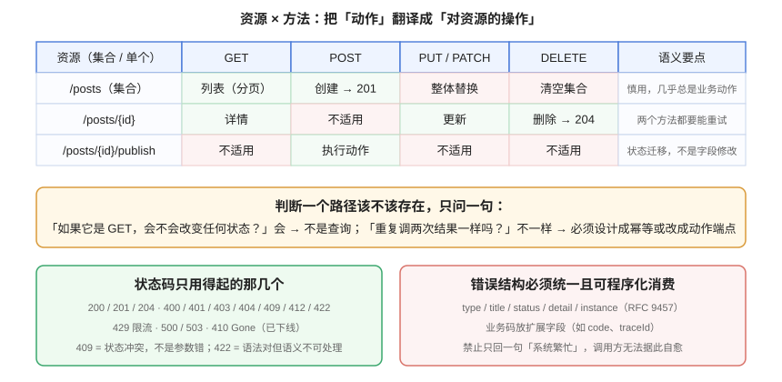

# REST 设计规范：资源、方法、状态码与错误结构

**一句话定位**：这一页把「接口该长什么样」落成可以写进团队规范的条目——**资源怎么命名、方法怎么选、状态码怎么给、错误怎么回、分页过滤怎么统一**。所有结论都服务于一个目标：**让调用方在没读文档的情况下也能猜对一半**。



::: info 版本口径
本页的语义依据以 [RFC 9110 · HTTP Semantics](https://www.rfc-editor.org/rfc/rfc9110.html)（2022）为准；错误结构参照 [RFC 9457 · Problem Details](https://www.rfc-editor.org/rfc/rfc9457.html)（2023）。这两份是 IETF 标准，不随框架与工具版本变化。框架侧的具体写法见 [Spring Boot REST API](../../../Backend/Java/Frame/SpringBoot/Common/RestAPI/index.md) 与 [Python Web 框架 · FastAPI](../../../Backend/PythonWeb/FastAPI/index.md)。
:::

## 1. 资源建模：先找名词，再找动词

REST 的核心只有一句：**用 URI 标识资源，用方法表达操作**。绝大多数设计混乱都源于把「动作」直接写进了路径。

### 1.1 命名六条

| # | 规则 | 正例 | 反例 |
| --- | --- | --- | --- |
| 1 | 路径用**名词复数**，不用动词 | `GET /posts` | `GET /getPosts` |
| 2 | 层级用 `/` 表达从属，最多两层 | `GET /posts/{id}/comments` | `GET /comments/of/post/{id}` |
| 3 | 标识符用路径参数，不放查询串 | `GET /posts/{slug}` | `GET /post?slug=xxx` |
| 4 | 多词用 **kebab-case**（路径）/ **camelCase**（字段） | `/audit-logs`、`createdAt` | `/AuditLogs`、`created_at` |
| 5 | 查询参数只做**过滤、排序、分页、投影** | `?status=published&sort=createdAt,desc` | `?action=delete` |
| 6 | 不要出现文件扩展名 | `/posts/{slug}` | `/posts/{slug}.json` |

::: danger 大小写敏感性是「本地测不出」的坑
URL 路径在规范上是**大小写敏感**的，但 macOS / Windows 的默认文件系统不敏感。于是 `/Posts` 与 `/posts` 在开发机上「看起来都能通」，一上 Linux 容器就 404。**规范里必须写死「路径全小写」并交给 Lint 检查**，不要靠人记住。
:::

### 1.2 什么时候可以「动作端点」

正统 REST 会告诉你「一切皆资源」。现实里有两类操作确实无法自然表达为资源操作，允许用**子资源 + 动词**的形式：

| 场景 | 写法 | 为什么不能硬套资源操作 |
| --- | --- | --- |
| **状态迁移** | `POST /posts/{id}/publish` | 发布不是一个字段的赋值，它有前置条件、有副作用、有 409 |
| **不可重试的业务动作** | `POST /orders/{id}/cancel` | 取消会触发退款与库存回补，语义远超「改 status 字段」 |
| **搜索** | `POST /search` | 检索条件复杂到超出 URL 长度与实际可读性 |

判据很简单：**「重复调两次结果一样吗？」** 不一样、且这个「不一样」是业务上必须被表达的，就用动作端点，并在契约里写清幂等性。

::: warning 动作端点别越用越多
动作端点是**例外**。一旦团队开始用 `POST /posts/{id}/update-title` 这类端点，说明资源建模没做完——那是 PATCH 的活。治理上可以把「动作端点不得超过总路径数的 15%」写成一条可统计的指标。
:::

## 2. 方法：语义、幂等与安全

| 方法 | 语义 | 安全（不改状态） | 幂等（重复调用结果一致） | 典型状态码 |
| --- | --- | --- | --- | --- |
| `GET` | 读取资源 | ✅ | ✅ | 200 / 304 / 404 |
| `HEAD` | 只取元信息 | ✅ | ✅ | 同 GET（无 body） |
| `POST` | 创建资源 / 执行动作 | ❌ | ❌ | **201**（带 `Location`）/ 200 / 202 |
| `PUT` | **整体替换** | ❌ | ✅ | 200 / 204 |
| `PATCH` | **部分修改** | ❌ | 取决于实现 | 200 / 204 |
| `DELETE` | 删除资源 | ❌ | ✅ | **204** / 202 / 200 |

::: danger 三个高频错误
1. **用 GET 做写操作**：`GET /posts/1/publish`。后果不是「不规范」，而是**预取、爬虫、浏览器预渲染会真的把你的文章发出去**。GET 必须安全，这是不可协商的底线。
2. **PATCH 做成「整体替换」**：调用方只传了 `title`，结果其余字段被清空。PATCH 的语义是「只改我传的字段」，缺省字段必须保持原值。
3. **PUT 用来做部分更新**：语义混乱，且**幂等性形同虚设**——两次相同的 PUT，第二次可能把第一次的其它改动覆盖掉。
:::

### 2.1 幂等性在接口层怎么落

幂等不是「会自动重试」，而是**同一请求重复执行，对资源的最终状态与副作用都一样**。写接口的落地做法：

```http
POST /api/v1/orders HTTP/1.1
Content-Type: application/json
Idempotency-Key: 7f3c2a91-4e0b-4c8a-9d21-5e8b1a6c0f34

{ "skuId": 1001, "quantity": 2 }
```

服务端记录 `Idempotency-Key` 与首次结果：

- 首次请求 → 正常执行，返回 `201`；
- **同一 key 再次到达** → **返回首次结果**（含首次的状态码），而不是再执行一次，也不是返回 409；
- 同一 key 但**请求体不同** → 返回 `422`，这是调用方的 bug。

::: tip 为什么重复提交返回「首次结果」而不是 409
因为幂等键的使用场景就是**超时重试**——调用方根本不知道第一次是否成功。此时返回 409 会让调用方误以为「这次失败了，需要换 key 重来」，实际上业务已经成功。**返回首次结果才能让重试变得安全。**
:::

## 3. 状态码：只用得起的那几个，但要用对

状态码的常见问题不是「用得太少」，而是**语义混用**。下表是建议的收敛集合：

| 码 | 含义 | 什么时候用 | 什么时候**不要**用 |
| --- | --- | --- | --- |
| 200 | 成功 | 查询成功、更新成功（返回体） | 创建成功（应该 201） |
| 201 | 已创建 | POST 创建资源成功，必须带 `Location` | 异步任务已受理（应该 202） |
| 202 | 已受理 | 任务已入队、结果稍后查 | 同步已完成的操作 |
| 204 | 无内容 | DELETE 成功、PUT 更新成功但无返回体 | 查询成功（调用方拿不到数据） |
| 400 | 请求错误 | **语法层面**错：字段类型不对、必填缺失 | 业务规则冲突（用 409 / 422） |
| 401 | 未认证 | 无凭据 / 凭据无效 / 已过期 | 已登录但权限不足（用 403） |
| 403 | 无权限 | 身份合法但**不允许**该操作 | 未登录（用 401） |
| 404 | 不存在 | 资源不存在，**或不允许暴露其存在性** | 路径写错（那是客户端 bug，仍然 404 但含义不同） |
| 409 | 状态冲突 | 唯一键冲突、状态机不允许的迁移 | 参数不合法 |
| 412 | 前置条件失败 | `If-Match` 乐观锁版本不匹配 | 一般业务校验 |
| 422 | 语义不可处理 | 语法对但业务上无法接受（如余额不足） | 字段格式错（用 400） |
| 429 | 请求过多 | 限流，必须带 `Retry-After` | 通用错误 |
| 500 / 503 | 服务端问题 | 未预期异常 / 服务不可用（可带 `Retry-After`） | 一切「我们想掩盖的错误」 |
| 410 | 已永久下线 | 接口已 Sunset（见[版本策略](../Versioning/index.md)） | 临时维护（用 503） |

::: danger 401 与 403 的顺序不能反
**必须先认证、再授权**。反过来（先判权限）等于对未认证的调用方承认「这个路径是存在的」——这是一条信息泄露。同理，**未发布内容的 slug 对匿名用户应返回 404 而不是 403**：403 等于告诉攻击者「这个 slug 存在，只是你看不到」。
:::

## 4. 错误结构：让调用方能「程序化地自愈」

错误响应的价值不在于「告诉人出了什么事」，而在于**让客户端代码能据此决定下一步**。所以它必须是**结构化且稳定**的。

### 4.1 RFC 9457（Problem Details）结构

```json
{
  "type": "https://api.example.com/problems/state-conflict",
  "title": "状态冲突",
  "status": 409,
  "detail": "文章当前状态为 PUBLISHED，不能再次发布",
  "instance": "/api/v1/admin/posts/1024/publish",
  "code": "STATE_CONFLICT",
  "traceId": "b7c1f0a2-9e4d-4a11-8f3c-0d5e6a7b8c90"
}
```

| 字段 | 作用 | 是否必须 |
| --- | --- | --- |
| `type` | 错误类型的**稳定 URI**（文档锚点），客户端据此分支 | 建议 |
| `title` | 人类可读的短标题，同一 `type` 下应固定 | 必须 |
| `status` | 与 HTTP 状态码一致，便于日志统一解析 | 必须 |
| `detail` | 本次错误的**定位信息**（哪个字段、哪个 id） | 必须 |
| `instance` | 出错的具体请求路径 | 建议 |
| `code` | 业务错误码（扩展字段），前端表单定位用的稳定标识 | 建议 |
| `traceId` | 与日志、链路追踪对齐，排障的第一入口 | **强烈建议** |

::: tip 一个提升明显的小改动
把 `detail` 从「参数不合法」升级为「参数不合法：categoryId 不存在：999999」。后台表单能直接标红出错的那一格，前端不用再猜、也不用去翻服务端日志。这个改动的成本是几行字符串拼接，收益是每天几十次沟通。
:::

### 4.2 校验错误要能一次报全

多个字段同时不合法时，**一次性返回全部**，而不是「改一个报一个」：

```json
{
  "type": "https://api.example.com/problems/validation-failed",
  "title": "参数校验失败",
  "status": 400,
  "detail": "3 个字段不合法",
  "instance": "/api/v1/admin/posts",
  "code": "VALIDATION_FAILED",
  "traceId": "b7c1f0a2-9e4d-4a11-8f3c-0d5e6a7b8c90",
  "errors": [
    { "field": "title",    "code": "NotBlank", "message": "标题不能为空" },
    { "field": "slug",     "code": "Pattern",  "message": "slug 只允许小写字母、数字与连字符" },
    { "field": "categoryId","code": "Exist",   "message": "分类不存在" }
  ]
}
```

字段名必须与请求体里的**实际 JSON 字段名**一致（`categoryId`，不是 `category_id`），否则前端无法把错误映射回表单控件。

## 5. 集合接口的统一约定

列表接口是复用度最高、也最容易被各写各的一类。把下面这套约定写进规范，能省掉大量重复设计。

### 5.1 分页

| 方案 | 请求 | 响应 | 适合 |
| --- | --- | --- | --- |
| **偏移分页** | `?page=1&size=20` | `{ total, page, size, records }` | 有总数、需跳页的后台列表 |
| **游标分页** | `?cursor=xxx&limit=20` | `{ nextCursor, hasMore, records }` | 信息流、深翻页、数据量大 |

```json
{
  "total": 137,
  "page": 2,
  "size": 20,
  "records": [ { "id": 21, "title": "..." } ]
}
```

::: danger 三条硬规则
1. **`size` 必须有上限**（如 50 或 100）并在契约里声明。没有上限的分页接口等于一个「一键拖垮数据库」的入口。
2. **`page` 从 1 开始**还是从 0 开始，必须写进规范。Spring Data 从 0 开始，前端从 1 开始——这个不一致是最高频的 off-by-one 缺陷来源。
3. **游标不能是自增 ID 的明文**：`cursor=1024` 会泄露业务量并可能被遍历。游标应当是**不透明字符串**（如基址编码的 `(createdAt, id)` 组合），并在服务端校验。
:::

### 5.2 过滤、排序与投影

```text
GET /api/v1/posts?status=published&categoryId=3&sort=createdAt,desc&page=1&size=20
GET /api/v1/posts?fields=id,title,slug,createdAt      # 投影：只取需要的字段
```

::: danger 排序与过滤字段必须走白名单
`?sort=id;DROP TABLE posts--` 这类注入在真实系统里非常常见。实现方式：**请求里的名字 → 实体字段**做一次显式映射，映射表本身就是允许的取值集合。禁止把请求参数直接拼进 SQL 或传给 ORM 的动态排序接口（除非该接口本身有白名单）。
:::

### 5.3 空集合不是错误

列表查询没有结果时返回 **200 + 空数组**，不是 404：

```json
{ "total": 0, "page": 1, "size": 20, "records": [] }
```

404 的语义是「**这个资源不存在**」，而「这个集合为空」是集合的正常状态。

## 6. 契约里怎么写：把上面的规范翻译成 YAML

规范如果不落到契约里，就只是口头约定。下面是一段可以直接放进 `openapi.yaml` 的骨架（**OpenAPI 3.2**）：

```yaml [docs/api/openapi.yaml]
openapi: 3.2.0
info:
  title: 博客平台 API
  version: 1.3.0            # 契约自身的语义化版本，见「版本策略」页
servers:
  - url: https://api.example.com/api/v1
    name: production
tags:
  - name: posts
    summary: 文章（读者端）
paths:
  /posts:
    get:
      operationId: listPosts          # 唯一，客户端生成器据此命名函数
      tags: [posts]
      parameters:
        - name: status
          in: query
          schema: { type: string, enum: [published] }
        - name: page
          in: query
          schema: { type: integer, minimum: 1, default: 1 }
        - name: size
          in: query
          schema: { type: integer, minimum: 1, maximum: 50, default: 20 }
      responses:
        '200':
          description: 分页结果
          content:
            application/json:
              schema: { $ref: '#/components/schemas/PostPage' }
        '400':
          $ref: '#/components/responses/ValidationFailed'
components:
  schemas:
    PostPage:
      type: object
      required: [total, page, size, records]
      properties:
        total: { type: integer, minimum: 0 }
        page:  { type: integer, minimum: 1 }
        size:  { type: integer, minimum: 1, maximum: 50 }
        records:
          type: array
          items: { $ref: '#/components/schemas/PostView' }
```

::: warning 每个 responses 的分支都要写全
`200` 之外必须有 `400 / 401 / 404 / 409`（按接口实际可能出现的分支）。**只写 200 的契约是空壳**——它没有回答调用方最关心的问题：出错了怎么办、错误长什么样。第 100 天的项目侧实践里，契约校验器专门有一条「每个 operation 必须有响应结构」的断言，就是为了拦这个。
:::

## 7. 实战：把一段「动作式 API」改成资源式

**改造前**（典型的代码优先产物）：

```text
POST /api/getPostList        Body: { type: 1, key: "xxx", pageNo: 1 }
POST /api/deletePost         Body: { id: 12 }
POST /api/updatePostStatus   Body: { id: 12, status: 2 }
GET  /api/postDetail?id=12
```

**改造后**：

```text
GET    /api/v1/posts?status=published&page=1&size=20
GET    /api/v1/posts/{slug}
DELETE /api/v1/posts/{id}
POST   /api/v1/posts/{id}/publish     # 动作端点：状态迁移，幂等性由状态机保证
```

改造过程中会暴露两类问题，都是「改造本身的价值」：

1. `updatePostStatus` 里的 `status: 2` 是**魔法数字**——改成 `publish` 动作端点后，谁都能看懂这个调用在做什么，且非法迁移（如已发布的再发布）自然落到 409。
2. `getPostList` 的 `type` 参数是**复合语义**（同时表达「已发布」与「按分类筛选」）——拆成 `status` 与 `categoryId` 两个正交参数后，组合数从「N 种 type 的硬编码分支」变成「两个独立维度」。

## 8. 验证方式

规范类内容的验证分两步：**先证明检查器有牙齿，再证明文档符合规范**。

```shell
# ① 用 Spectral 跑团队规则集（规则集写法见「治理机制」页）
npx @stoplight/spectral-cli lint docs/api/openapi.yaml
# 期望：无 error 级别输出；警告逐条确认是否接受

# ② 活性判据：确认真的扫到了内容，而不是扫了个空文件
npx @stoplight/spectral-cli lint docs/api/openapi.yaml --format json | \
  python3 -c "import json,sys; d=json.load(sys.stdin); print('findings:', len(d))"
# 期望：能打印出 findings 数量；若为 0 且你确信文档有问题，说明规则集没生效

# ③ 变异测试：故意把 paths 改成大写开头，确认命名规则报 error
#    只做一次，用于确认「门禁不是摆设」
```

## 9. 参考资料

- [RFC 9110 · HTTP Semantics](https://www.rfc-editor.org/rfc/rfc9110.html)：方法的安全性与幂等性定义
- [RFC 9457 · Problem Details for HTTP APIs](https://www.rfc-editor.org/rfc/rfc9457.html)：错误响应结构
- [RFC 9458 · HTTP Message Signatures](https://www.rfc-editor.org/rfc/rfc9458.html)：需要请求签名时的标准做法
- [RFC 7234 / 9111 · HTTP Caching](https://www.rfc-editor.org/rfc/rfc9111.html)：`ETag` 与条件请求
- [Microsoft REST API Guidelines](https://github.com/microsoft/api-guidelines)：工业界较完整的 REST 规范参考
- [Google API Design Guide](https://cloud.google.com/apis/design)：资源命名与标准方法的中文可读版本
- 相邻页：[OpenAPI 契约工程化](../OpenAPI/index.md)（怎么写下来）、[治理机制](../Governance/index.md)（怎么卡住）
