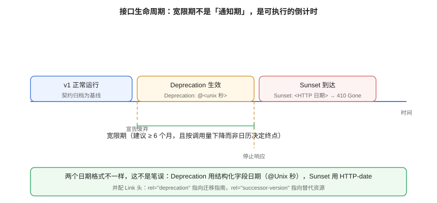

# 版本策略与兼容性演进

**一句话定位**：接口改了怎么办？这一页回答三件事——**什么样的改动可以不发新版本、什么样的必须发、以及废弃一个接口时怎么让调用方真的知道**。核心结论是：**版本号是最后手段，不是第一反应**。



::: info 本页的规范依据（2026-10 核对）
- **[RFC 9745](https://www.rfc-editor.org/rfc/rfc9745.html)（Deprecation 响应头）**：Standards Track，2025 年 3 月进入标准轨道。用结构化字段日期（`@1688169599`）声明「从什么时候起算废弃」。
- **[RFC 8594](https://www.rfc-editor.org/rfc/rfc8594.html)（Sunset 响应头）**：声明「资源预计什么时候停止响应」，值为 HTTP-date。
- **[RFC 8288](https://www.rfc-editor.org/rfc/rfc8288.html)（Web Linking）**：`Link` 头与 `rel="deprecation"`、`rel="successor-version"` 关系类型的来源。
- **语义化版本（SemVer）2.0.0**：契约自身版本号的给法。
- 这份页面对应的项目侧实践见 [项目 · 文章下线动作](../../../../project/Complete/BlogPlatform/Lifecycle/index.md)——那里把状态机与「接口/资源下线」的相似性做了一次对照。
:::

## 1. 先破一个误解：版本号不是兼容性方案

很多团队的版本策略实质是：**「有改动就发新版本」**。这套做法的问题是它把成本从「设计兼容变更」转嫁给了「所有调用方」。

```text
v1 → v2 → v3 → v4 ...
```

半年之后，线上同时跑着 4 个版本，每个版本都有自己的 bug 修复分支，文档站有 4 份并列的说明——**没有任何一个调用方愿意升级**，因为升级既没有强制、也没有足够的好处。

更现实的模型是：**尽量不新增版本；必须新增时，用明确的生命周期把它管起来。**

| 做法 | 调用方成本 | 你的成本 | 何时合适 |
| --- | --- | --- | --- |
| **兼容性演进**（同一版本内做加法） | 零 | 设计与评审成本 | **默认选择**，覆盖 80% 的改动 |
| **新增版本**（路径/媒体类型/Header 表达） | 迁移成本 | 多版本维护成本 | 语义发生**不兼容的重构**时 |
| **新增端点**（旧端点保留） | 零（旧端点继续可用） | 少量冗余 | 改动局限在少数资源时，**比发新版本更轻** |

::: tip 一句话判据
**先问「能不能只做加法」，再问「能不能只改一个端点」，最后才问「要不要发新版本」。**
绝大多数「必须发 v2」的判断，在认真设计过兼容性之后都会退化成「其实只需加一个可选字段」。
:::

## 2. 三类变更：兼容 / 需谨慎 / 破坏性

把改动分类，是版本策略的起点。下表可以直接当评审清单用。

### 2.1 兼容性变更（同一版本内可发布）

| 变更 | 为什么兼容 | 注意事项 |
| --- | --- | --- |
| 新增**可选**请求参数 | 老调用方不传时行为不变 | 默认值必须与老行为一致 |
| 新增响应字段 | 客户端忽略未知字段即可 | ⚠️ 见下方「严格模式的客户端」 |
| 新增接口 / 新增资源 | 不影响既有路径 | 记得同步网关路由与契约 |
| 放宽校验（如 `maxLength` 200 → 500） | 原本合法的仍然合法 | 数据库与前端也要同步放宽 |
| 补充 `description` / `examples` | 纯文档 | 无 |
| 新增枚举值 | 服务端行为不变 | ⚠️ 见下方 |

::: danger 「新增字段」与「新增枚举值」不是绝对安全
严格反序列化的客户端（很多移动端 SDK、`serde` 默认配置、Go 的 `DisallowUnknownFields`）会在遇到**未知字段**时直接失败；枚举同理（把值映射到 enum 的语言会在遇到未知值时抛错）。

所以规范里应写明两条：

1. **客户端必须容忍未知字段**（这条要写进对接文档，并在 SDK 模板里配好）。
2. **新增枚举值视为「需谨慎变更」**：必须提前通知，并给出「未知值兜底」的要求（如前端遇到未知状态显示为「其他」而不是崩溃）。
:::

### 2.2 破坏性变更（必须走版本或弃用流程）

| 变更 | 为什么破坏 |
| --- | --- |
| 删除或重命名**路径**、**字段**、**枚举值** | 调用方直接 404 / 反序列化失败 |
| 把可选字段改为**必填** | 老调用方不传时会 400 |
| 收紧校验（如 `maxLength` 500 → 200） | 原本合法的请求变非法 |
| 修改字段**类型或格式**（`string` → `integer`、`date` → `date-time`） | 解析失败或语义漂移 |
| 修改**默认值**或分页语义（`page` 从 1 起改为 0 起） | 静默返回错误数据，**最难发现** |
| 修改状态码语义（原本 200 的改 204） | 客户端拿不到期望的返回体 |
| 改变**鉴权方式**（从 API Key 改为 OAuth） | 所有调用方认证失败 |

::: warning 「改默认值」是最危险的一类
它不会报错、不会有异常、不会有告警——只是**数据悄悄变得不对**。典型例子：分页 `size` 默认值从 10 改成 20，调用方按「每页 10 条」写死的翻页逻辑就会漏数据（把第 11 条当成第 21 条）。

因此：**默认值属于契约的一部分**，修改默认值必须走破坏性变更流程，并在契约里显式写出 `default`，让它可被 diff 检出。
:::

## 3. 版本表达：四种方案与选择

| 方案 | 形式 | 优点 | 缺点 | 适合 |
| --- | --- | --- | --- | --- |
| **URL 路径版本** | `/api/v1/posts` | 最直观、网关与日志最好处理、缓存友好 | 同一资源多路径；信奉「URI 标识资源」的人认为不该带版本 | **大多数公开 API 的默认选择** |
| **查询参数版本** | `/api/posts?version=2` | 改动最小 | 容易被漏传；缓存与路由需要额外处理 | 过渡期临时方案 |
| **自定义 Header** | `X-API-Version: 2` | 路径干净 | 调试与分享链接时不直观；不是标准 | 内部 API |
| **媒体类型协商** | `Accept: application/vnd.acme.v2+json` | 最符合 HTTP 语义 | 工具链支持参差；对使用者门槛高 | 语义严谨、调用方技术能力强 |

::: tip 选择建议
**对外接口用 URL 路径版本**——它的最大优势不是「规范」，而是**任何人在浏览器地址栏、日志、抓包里都能一眼看出这是哪个版本**，排障成本最低。媒体的内容协商更适合「同一 URI 下按 Accept 返回不同表示」的场景，而不是用来做粗粒度的版本隔离。
:::

### 3.1 契约自身也要有版本号

接口的版本（`/api/v1`）与**契约文档的版本**是两件事。契约用语义化版本：

```yaml
openapi: 3.2.0
info:
  title: 博客平台 API
  version: 1.3.2     # 主.次.修订 —— 针对「契约文件」的变更
```

| 位 | 什么改动会 +1 | 消费者要做什么 |
| --- | --- | --- |
| **主版本**（1.x.x → 2.0.0） | 契约里有**破坏性变更** | 必须评估迁移 |
| **次版本**（x.2.x → x.3.0） | 兼容性新增（新接口、新可选参数） | 无需动作，可按需采用 |
| **修订**（x.x.1 → x.x.2） | 仅文档修正（description、示例） | 无需动作 |

这样做的价值在于：**「契约有没有破坏性变更」变成了一次版本号比对**，而不需要每次读 diff。基线归档（`openapi.baseline.json`）与这个版本号一起进版本控制。

## 4. 废弃：让「通知」变成机器可读的信号

传统做法是发邮件、发公告、在群里 @ 一圈。问题是**调用方是代码，不是人**——写代码的人可能已经离职、代码可能没人再动过。所以废弃必须**在响应里**说。

### 4.1 三个响应头，各答一个问题

```http
HTTP/1.1 200 OK
Content-Type: application/json
Deprecation: @1767225600
Sunset: Mon, 01 Mar 2027 00:00:00 GMT
Link: <https://docs.example.com/migration/v1-to-v2>; rel="deprecation"; type="text/html",
      <https://api.example.com/api/v2/posts>; rel="successor-version"
```

| 头 | 回答的问题 | 值格式 | 依据 |
| --- | --- | --- | --- |
| `Deprecation` | **从什么时候起**算废弃 | 结构化字段日期 `@<Unix 秒>` | RFC 9745 |
| `Sunset` | **到什么时候**停止响应 | HTTP-date（不是 ISO 8601！） | RFC 8594 |
| `Link` + `rel="deprecation"` | 我该**看什么文档** | URI | RFC 8288 |
| `Link` + `rel="successor-version"` | 替代资源在**哪里** | URI | RFC 8288 |

::: danger 两个日期格式不同，这不是笔误
`Deprecation` 用结构化字段语法（前置 `@` 表示 Unix 时间戳，SECONDS），`Sunset` 用 HTTP-date（沿用 `Expires` 的格式）。两份 RFC 相隔多年，格式没有统一。

**这是实现里最高频的 bug**：把 `Sunset` 写成 `@1767225600` 会被解析器当成无效日期而忽略——**废弃信号静默失效，而你以为已经通知了**。
:::

### 4.2 配套的四条纪律

| 纪律 | 说明 |
| --- | --- |
| **在中间件统一注入** | 按路由（整个 v1 路由）挂一次，而不是在每个 handler 里写。漏掉一个 handler 就等于那条路径没通知 |
| **废弃不改变行为** | RFC 9745 明确：`Deprecation` 头的出现**不意味着**资源行为变化。它仍在正常工作，只是「已被标记」。不要提前返回错误 |
| **宽限期足够长且以调用量为准** | 对外接口建议 ≥ 6 个月；但**终点应按「调用量降到可忽略」决定**，而不是日历翻页 |
| **过期后返回 410 而不是 404** | 410 Gone 明确表达「曾经存在、已永久移除」，调用方据此区分「路径打错」与「接口下线」；同时保留 `Sunset` 与 `rel="deprecation"` 链接，让迟到的调用方仍能找到原因 |

::: tip 一条可自动化的检查
给响应加一条检查规则：**`Deprecation` 头存在时，`Sunset` 必须存在且不早于 `Deprecation` 日期**（RFC 9745 规定了后者不早于前者）。这条规则在客户端做集成测试时就能跑，成本极低但能拦住配置错误。
:::

## 5. 迁移路线：三种常见形态

| 形态 | 做法 | 适合 | 代价 |
| --- | --- | --- | --- |
| **并行版本**（v1 / v2 同时在线） | 两套代码路径，数据模型做兼容层 | 语义不兼容的重构 | 双份维护、双份 bug 修复 |
| **渐进式迁移**（旧端点逐步下线） | 保留 v1 路径，内部转调新实现 | **改动局限在少数资源** | 少量适配代码 |
| **兼容层**（版本无关内部实现） | 入口按版本解析，内部统一模型 | 长期多版本共存 | 兼容层本身会腐化 |

::: warning 「并行版本」的成本被普遍低估
真正的成本不在写两套接口，而在**之后每一次 bug 修复都要修两遍、每一次安全补丁都要打两遍**。所以并行版本必须配一个**明确的退场日期**，且退场日期要写进契约的 `description` 与文档站首页——**没有退场日期的 v1 就是永久 v1**。
:::

## 6. 验证方式

```shell
# ① 破坏性变更检测（与基线比）——这是本页最重要的门禁
oasdiff breaking openapi.baseline.yaml openapi.yaml
# 退出码 0：无破坏性变更；非 0：有，必须走变更流程

# ② 变更清单（人读）
oasdiff changelog openapi.baseline.yaml openapi.yaml

# ③ 契约自身的版本号是否被正确递进（示例用 jq，可换成任意 YAML 工具）
python3 - <<'PY'
import yaml
old = yaml.safe_load(open('openapi.baseline.yaml', encoding='utf-8'))['info']['version']
new = yaml.safe_load(open('openapi.yaml',          encoding='utf-8'))['info']['version']
def tup(v): return tuple(int(x) for x in v.split('.'))
print(f'{old} -> {new}')
if tup(new)[0] > tup(old)[0]:
    print('主版本递进：本次应包含破坏性变更，请确认 oasdiff breaking 有输出')
else:
    print('非主版本递进：本次不应包含破坏性变更')
PY

# ④ 废弃信号可被探测（服务运行中）
curl -sI http://127.0.0.1:18080/api/v1/posts | grep -iE '^(deprecation|sunset|link):'
# 期望：废弃期内能看到三个头；若一个都没有，说明中间件没挂上
```

::: danger 变异测试：确认门禁不是摆设
删掉契约里的一个响应字段，`oasdiff breaking` **必须**退出码非 0。如果仍然返回 0，说明你比较的两个文件是同一个（常见于基线没被真正更新）——**「零破坏性变更」这个绿色结论必须先被证伪一次才可信**。
:::

## 7. 参考资料

- [RFC 9745 · The Deprecation HTTP Response Header Field](https://www.rfc-editor.org/rfc/rfc9745.html)
- [RFC 8594 · The Sunset HTTP Header Field](https://www.rfc-editor.org/rfc/rfc8594.html)
- [RFC 8288 · Web Linking](https://www.rfc-editor.org/rfc/rfc8288.html)：`Link` 头与关系类型注册表
- [RFC 9110 · HTTP Semantics](https://www.rfc-editor.org/rfc/rfc9110.html)：日期格式与状态码
- [Semantic Versioning 2.0.0](https://semver.org/lang/zh-CN/)
- [oasdiff 文档](https://github.com/Tufin/oasdiff)：破坏性变更检测与 changelog 生成
- [OpenAPI Initiative：版本与废弃](https://spec.openapis.org/oas/v3.2.0.html#versions-and-deprecation)
- 相邻页：[REST 设计规范](../RestDesign/index.md)（状态码语义）、[治理机制](../Governance/index.md)（怎么把检测接进流水线）
