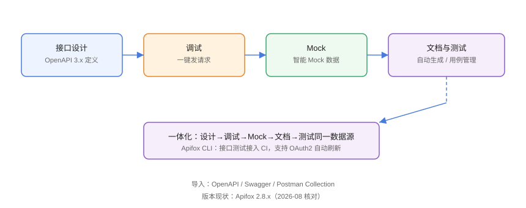

# Apifox：接口设计到测试一体化

Apifox 是把 **接口设计、调试、Mock、文档、自动化测试**整合在一个产品里的中文接口协作工具：接口定义一次，调试、Mock、文档、用例自动联动，避免「文档一套、Mock 一套、测试又一套」的重复维护。本页基于 **Apifox 2.8** 编写。

## 产品定位



Apifox 的核心理念是**以接口定义为单一事实来源（Single Source of Truth）**：改一处定义，调试示例、Mock 数据、文档、测试用例同步更新。

## 一体化能力

| 模块 | 能力 |
| --- | --- |
| 接口设计 | 编辑接口、定义请求/响应模型，兼容 OpenAPI 3.x |
| 调试 | 发送请求、查看响应、管理环境变量 |
| Mock | 按字段类型智能生成假数据 |
| 文档 | 一键生成在线接口文档 |
| 测试 | 用例管理、测试套件、断言与数据驱动 |
| CLI | Apifox CLI 接入 CI 运行测试 |

## 安装与初始化

```shell
# Windows
winget install Apifox.Apifox

# macOS
brew install --cask apifox
```

1. 注册/登录账号。
2. 创建项目（对应一个团队/系统的接口集）。
3. 可从 OpenAPI/Swagger/Postman Collection 导入存量接口。

## 导入存量接口

```text
项目 → 导入数据：
1. 选择来源：OpenAPI/Swagger JSON/YAML、Postman Collection、Hoppscotch
2. 预览解析结果
3. 确认导入，接口自动归类到目录
```

## 接口设计与调试

### 新建接口

```text
接口管理 → 新建接口：
1. 填写名称与路径，选择 Method
2. 定义 Query/Header/Body 参数与示例值
3. 定义响应模型（JSON Schema）
```

### 调试

```text
打开接口 → 切换到「调试」标签：
1. 环境选择器切换环境
2. 填好参数点击发送
3. 查看响应与耗时
```

### 环境管理

```text
环境管理 → 新建环境：
开发 / 测试 / 生产
每个环境定义 baseUrl、token 等变量
请求中用 {{baseUrl}} 引用
```

## 自动生成文档

接口定义保存后，文档自动生成：

```text
分享文档：
项目 → 分享 → 生成在线文档链接
可设置访问密码 / 过期时间
```

文档包含请求示例、参数说明、响应示例，前后端与测试共用同一份，避免维护两套文档。

## Mock 与前端并行

后端未完成时，前端直接用 Apifox 的 Mock 地址联调：

```text
项目 → Mock 服务：
1. 开启 Mock，获取 Mock 地址
2. 前端请求 baseUrl 换成 Mock 地址
3. 字段按响应模型自动生成示例数据
```

详细规则见本专题「Mock 数据与模拟服务」。

## 测试与断言

### 断言脚本

Apifox 兼容 Postman 的 `pm.*` 语法，并做扩展：

```javascript [Tests]
pm.test("状态码为 200", function () {
  pm.response.to.have.status(200);
});

pm.test("业务码为 0", function () {
  const body = pm.response.json();
  pm.expect(body.code).to.eql(0);
});

// 提取 token
const data = pm.response.json().data;
pm.environment.set("token", data.token);
```

### 测试套件

```text
测试管理 → 测试套件：
1. 选择要执行的接口用例
2. 配置环境、迭代次数、数据文件
3. 运行生成测试报告
```

## Apifox CLI 与 CI

```shell
# 安装 CLI
npm install -g apifox-cli

# 登录
apifox login

# 运行测试套件（项目 ID 与测试套件 ID 在控制台获取）
apifox run --project-id <项目ID> --test-suite-id <套件ID>

# 导出 JUnit 报告
apifox run --project-id <项目ID> --test-suite-id <套件ID> --junit-xml report.xml
```

```yaml [.github/workflows/api-test.yml]
name: API Test
on:
  pull_request:
jobs:
  test:
    runs-on: ubuntu-latest
    steps:
      - uses: actions/checkout@v4
      - uses: actions/setup-node@v4
        with:
          node-version: 22
      - run: npm install -g apifox-cli
      - run: apifox login --token ${{ secrets.APIFOX_TOKEN }}
      - run: apifox run --project-id ${{ vars.APIFOX_PROJECT_ID }} --test-suite-id ${{ vars.APIFOX_SUITE_ID }}
```

## 易错点与最佳实践

::: danger 常见问题
1. **响应模型不维护**：Mock 与文档都依赖响应模型，接口改了必须同步更新定义。
2. **环境变量不建**：baseUrl 写死在每个请求里，换环境全改。
3. **把生产环境变量共享给所有人**：生产地址与密钥应单独管理、权限控制。
4. **断言与接口脱节**：参数类型改了断言没改，测试通过但实际已坏。
5. **导入后不检查**：从 Swagger/Postman 导入可能有字段丢失，导入后逐项核对。
:::

::: tip 最佳实践
- 接口定义先行：先设计再开发，前端可同时用 Mock 开工。
- 文档与代码同步更新：接口变更后重新导出 OpenAPI，检查 diff。
- 用例分层：冒烟用例（核心链路）+ 回归用例（全量）。
- 在 CI 里跑测试套件，失败即阻断合并。
- 定期把线上接口导出对比，发现「文档与实现漂移」。
:::

## 实战：从 Swagger 导入并完成冒烟测试

```text
1. 项目 → 导入数据 → 选择 Swagger/OpenAPI 文件
2. 检查导入的接口数量与路径
3. 配置开发环境 baseUrl
4. 对登录接口设置断言并运行
5. 创建冒烟测试套件（登录 → 用户列表 → 详情）
6. 运行套件，输出报告
```

## 验证方式

1. 导入后接口树完整，无缺失。
2. 调试接口返回预期响应。
3. 文档链接打开可见接口说明。
4. 测试套件运行通过，CI 能读取 JUnit 报告。

## 参考资料

- Apifox 文档：<https://docs.apifox.com/>
- Apifox 更新日志：<https://docs.apifox.com/changelog>
- Apifox CLI：<https://docs.apifox.com/guidelines/apifox-cli>
- Apifox 6 月更新：<https://apifox.cn/blog/features-2026-6/>
