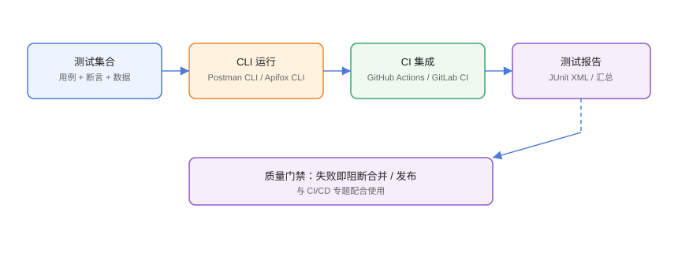

# 自动化测试与 CI 集成

接口自动化把「手工点一遍」变成「每次提交自动跑一遍」：集合 + 断言 + CLI 运行 + CI 门禁。本页覆盖 Postman CLI（Newman）与 Apifox CLI 两种主流方式，并给出 GitHub Actions 集成示例。

## 自动化链路



```text
测试集合（断言）→ CLI 运行 → CI 触发 → 测试报告 → 质量门禁
```

## 前置条件：把集合准备好

1. 每个接口有**断言**（状态码、业务码、关键字段）。
2. 环境变量与脚本可脱离 UI 运行（不依赖手工填值）。
3. 数据文件（CSV/JSON）驱动参数化用例。
4. 在本地 CLI 先跑通，再进 CI。

## Postman：Newman / Postman CLI

### 本地运行

```shell
# 导出集合与环境文件
# 集合：右键集合 → Export → Collection v2.1 JSON
# 环境：环境 → 导出

npm install -g newman

newman run collection.json \
  -e environment.json \
  -d data.csv \
  --reporters cli,json \
  --reporter-json-export report.json
```

### 退出码与门禁

```shell
# 有断言失败时 newman 返回非 0，可作 CI 门禁
newman run collection.json -e environment.json || exit 1
```

### GitHub Actions

```yaml [.github/workflows/api-test.yml]
name: API Regression
on:
  pull_request:
  schedule:
    - cron: "0 2 * * *"
jobs:
  test:
    runs-on: ubuntu-latest
    steps:
      - uses: actions/checkout@v4
      - uses: actions/setup-node@v4
        with:
          node-version: 22
      - name: Install Newman
        run: npm install -g newman
      - name: Run API tests
        run: |
          newman run tests/api/collection.json \
            -e tests/api/prod-env.json \
            --reporters cli,junit \
            --reporter-junit-export junit.xml
      - name: Upload report
        if: always()
        uses: actions/upload-artifact@v4
        with:
          name: api-test-report
          path: junit.xml
```

## Postman Monitors（云端定时）

```text
Postman 云端监控：
1. 集合 → Monitors → 创建
2. 设置频率（如每小时）
3. 失败时邮箱/Webhook 通知
适合：生产接口可用性巡检
```

## Apifox CLI

```shell
npm install -g apifox-cli
apifox login

# 运行项目测试套件
apifox run \
  --project-id <PROJECT_ID> \
  --test-suite-id <SUITE_ID> \
  --junit-xml apifox-report.xml
```

Apifox 测试套件在控制台维护，断言与用例都在工具内，CI 里只跑一条命令。

### GitLab CI 示例

```yaml [.gitlab-ci.yml]
api-test:
  stage: test
  image: node:22
  script:
    - npm install -g apifox-cli
    - apifox login --token "$APIFOX_TOKEN"
    - apifox run --project-id "$APIFOX_PROJECT_ID" --test-suite-id "$APIFOX_SUITE_ID" --junit-xml report.xml
  artifacts:
    when: always
    reports:
      junit: report.xml
```

## 报告与门禁

| 工具 | 报告格式 | CI 接入 |
| --- | --- | --- |
| Newman | CLI/JSON/JUnit/HTML | upload-artifact / junit 报告 |
| Apifox CLI | JUnit/HTML | GitLab junit / 上传制品 |
| Postman Monitors | 云端报告 + 通知 | 不依赖 CI |

**门禁策略**：

1. PR 必须通过接口回归（失败即无法合并）。
2. 定时巡检生产核心接口，失败自动建工单/告警。
3. 接口变更必须同步更新集合与断言，否则 CI 拦截。

## 易错点与最佳实践

::: danger 常见问题
1. **集合依赖手工状态**：如 token 只在 UI 里点过，CLI 跑必然失败。脚本化登录，脱离 UI 可运行。
2. **环境文件含真实密钥**：导出环境文件会带密码，CI 里用 Secret 注入，仓库只放脱敏模板。
3. **断言太少**：只断言 200，业务错误测不出来。至少加业务码与关键字段。
4. **数据文件编码问题**：CSV 中文乱码，统一 UTF-8。
5. **CI 里网络不通测试环境**：先确认测试环境可访问，或用 Docker 内网服务。
:::

::: tip 最佳实践
- 先本地 CLI 跑通，再进 CI，避免在流水线里调试。
- 环境文件模板入库，真实值用 Secret 注入。
- 冒烟用例跑主干链路，回归用例全量跑，分开调度。
- JUnit 报告接入流水线，失败定位到具体断言。
- 定时巡检生产只读接口，把可用性告警接入值班通知。
:::

## 实战：把登录链路接入 GitHub Actions

```text
1. 在 Postman 建集合：login → users → orders（含断言与 token 脚本）
2. 导出 collection.json 与 prod-env.json（脱敏）
3. 仓库 .github/workflows/api-test.yml 按上文配置
4. 仓库 Settings → Secrets 添加测试环境密钥
5. 推送 PR，观察 Actions 运行并通过
6. 制造一个失败用例，确认 CI 阻断合并
```

## 验证方式

1. 本地 `newman run` 退出码为 0。
2. CI 日志显示全部用例通过。
3. 故意改错断言，CI 失败并上传 JUnit 报告。
4. 定时监控在接口异常时触发通知。

## 参考资料

- Newman：<https://github.com/postmanlabs/newman>
- Postman CLI 文档：<https://learning.postman.com/docs/postman-cli/postman-cli-overview/>
- Apifox CLI：<https://docs.apifox.com/guidelines/apifox-cli>
- GitHub Actions 与 JUnit：<https://docs.github.com/actions/writing-workflows>
