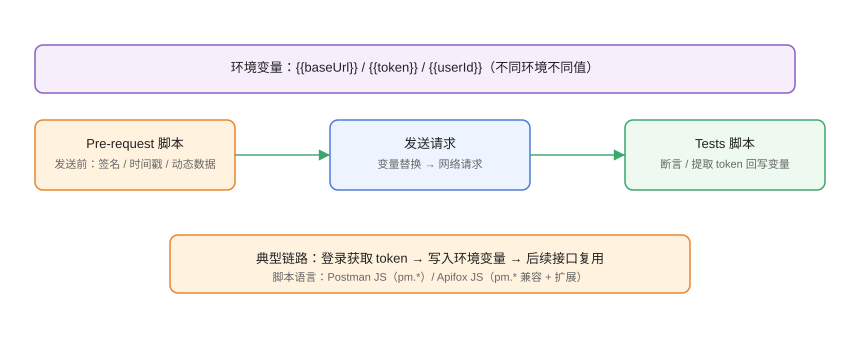

# 环境变量与脚本

环境变量让「同一份请求在不同环境复用」，脚本让请求「动态化」：签名、时间戳、token 自动获取、断言与数据提取。本页以 Postman/Apifox 通用的 `pm.*` 脚本语法为主线。

## 为什么需要环境与脚本



```text
没有环境变量：每个环境复制一份请求，改地址要改 N 处。
没有脚本：token 手动粘贴、签名手算、断言靠肉眼。
```

环境与脚本解决两类问题：

1. **配置可切换**：开发/测试/生产用同一份请求，只切环境。
2. **请求可编程**：登录自动取 token、参数动态生成、响应自动校验。

## 变量作用域

| 作用域 | 生命周期 | 适用 |
| --- | --- | --- |
| 全局变量 | 一直存在 | 通用配置 |
| 环境变量 | 切环境时切换 | 环境相关（baseUrl、token） |
| 集合变量 | 集合内 | 集合共享常量 |
| 局部变量 | 单次请求执行内 | 临时中间值 |
| 数据变量 | Runner 迭代内 | 数据文件驱动 |

取值优先级：**局部 > 数据 > 环境 > 集合 > 全局**。

## 变量定义与引用

### 定义环境变量

```text
Postman：右上角环境 → 添加环境 → 添加变量
Apifox：环境管理 → 新建环境 → 添加变量
```

| 变量名 | 示例值 | 说明 |
| --- | --- | --- |
| baseUrl | https://api.example.com | 接口基址 |
| token | （脚本写入） | 登录后自动填充 |
| userId | 1 | 测试数据 |

### 引用语法

```http
GET {{baseUrl}}/users/{{userId}}
Authorization: Bearer {{token}}
```

脚本中读写：

```javascript
// 读
const baseUrl = pm.environment.get("baseUrl");
// 写
pm.environment.set("token", "abc123");
// 删
pm.environment.unset("token");
```

## Pre-request 脚本

在**请求发送前**执行，适合生成动态参数：

```javascript [Pre-request Script]
// 生成时间戳与签名
const ts = Date.now();
const nonce = Math.random().toString(36).slice(2);
pm.request.headers.add({
  key: "X-Timestamp",
  value: String(ts)
});
pm.request.headers.add({
  key: "X-Nonce",
  value: nonce
});

// 动态设置查询参数
const query = pm.request.url.query;
query.upsert({ key: "page", value: "1" });
```

## Tests 脚本

在**响应返回后**执行，负责断言与数据提取：

### 基础断言

```javascript [Tests]
pm.test("状态码 200", () => pm.response.to.have.status(200));
pm.test("响应时间 < 500ms", () => {
  pm.expect(pm.response.responseTime).to.be.below(500);
});

const body = pm.response.json();
pm.test("业务 code = 0", () => pm.expect(body.code).to.eql(0));
pm.test("data 非空", () => pm.expect(body.data).to.not.be.empty);
```

### 提取数据

```javascript [Tests]
const data = pm.response.json().data;

// 写入环境变量，供后续请求使用
pm.environment.set("token", data.token);
pm.environment.set("orderId", String(data.orderId));

// 集合变量（团队共享默认值）
pm.collectionVariables.set("defaultUserId", "1001");
```

### 断言数组与嵌套

```javascript [Tests]
const list = pm.response.json().data.list;
pm.test("列表元素均含 id", () => {
  list.forEach(item => pm.expect(item.id).to.be.a("number"));
});
```

## 登录链路：token 自动复用

```text
集合顺序：
1. POST /login —— Tests 里把 token 写入环境变量
2. GET /users/{{userId}} —— 自动携带 Bearer {{token}}
3. POST /orders —— 同样复用 token
```

```javascript [登录接口 Tests]
const res = pm.response.json();
if (res.code === 0) {
  pm.environment.set("token", res.data.token);
  pm.environment.set("userId", String(res.data.user.id));
} else {
  pm.test("登录失败信息", () => {
    throw new Error("登录返回：" + JSON.stringify(res));
  });
}
```

## 加密与签名（示例）

```javascript [Pre-request Script]
// 需要 CryptoJS（Postman 内置；Apifox 用 apifox.CryptoJS）
const ts = Date.now();
const secret = pm.environment.get("apiSecret");
const sign = CryptoJS.MD5(`ts=${ts}&secret=${secret}`).toString();

pm.request.headers.add({ key: "X-Ts", value: String(ts) });
pm.request.headers.add({ key: "X-Sign", value: sign });
```

::: warning 说明
脚本里写死密钥会随集合泄露。密钥放环境变量或 Vault，并设置访问权限；生产密钥不得进共享集合。
:::

## 数据驱动测试

Runner 支持 CSV/JSON 数据文件：

```csv [cases.csv]
username,password,expectCode
admin,123456,0
guest,000000,1001
```

```javascript [Tests]
const body = pm.response.json();
pm.test("业务码符合数据文件预期", () => {
  pm.expect(body.code).to.eql(pm.iterationData.get("expectCode"));
});
```

每次迭代用一行数据，实现「一批用例跑一遍集合」。

## 易错点与最佳实践

::: danger 常见问题
1. **变量没生效**：检查作用域与拼写，`{{baseUrl}}` 与 `{{baseurl}}` 大小写敏感。
2. **token 没写入成功**：断言里先打印 `pm.response.json()` 确认字段路径。
3. **脚本语法错误被静默**：脚本抛错会显示在 Console，先打开 Console 调试。
4. **在 Tests 里用 `return`**：不生效，用 `pm.test` 或直接赋值。
5. **把密钥写进脚本/集合**：一律放环境变量或 Vault。
:::

::: tip 最佳实践
- 环境命名规范：dev/test/prod，生产环境单独权限控制。
- 每个接口至少包含「状态码 + 业务码 + 关键字段」三类断言。
- 登录链路放集合最前面，token 自动注入，避免手工复制。
- 签名/时间戳等动态逻辑集中在 Pre-request 脚本，便于复用。
- 脚本统一用 `pm.*` 语法，Postman 与 Apifox 通用，降低切换成本。
:::

## 实战：完整登录 + 鉴权调用

```text
1. 建环境 dev：baseUrl=https://api.example.com
2. POST /login：Body 用户名密码；Tests 提取 token
3. GET /users/{{userId}}：Authorization: Bearer {{token}}
4. 先运行 login（Tests 通过），再运行 users（200）
5. 用 CSV 数据文件跑 3 组用户，全部断言通过
```

## 验证方式

1. 环境切换后 URL 自动变化。
2. Console 无脚本报错。
3. 登录后 token 可见（眼睛图标查看环境变量）。
4. 数据驱动跑完，报告显示每条用例结果。

## 参考资料

- Postman 脚本参考：<https://learning.postman.com/docs/writing-scripts/script-references/postman-sandbox-api-reference/>
- Apifox 脚本：<https://docs.apifox.com/guidelines/script/>
- Postman 数据文件：<https://learning.postman.com/docs/running-collections/working-with-data-files/>
- CryptoJS：<https://github.com/brix/crypto-js>
