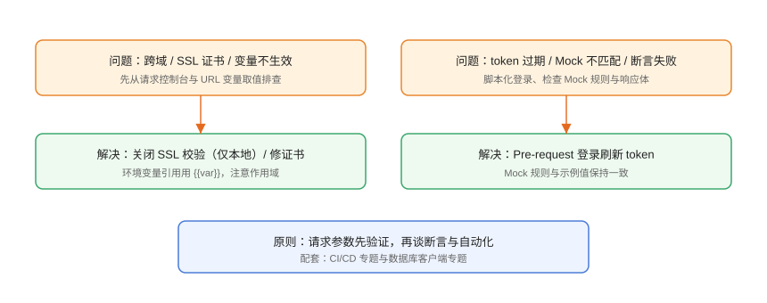

# 常见问题与最佳实践

本页汇总接口调试的高频问题：跨域、SSL、变量不生效、token 过期、Mock 不匹配、自动化失败等，按「现象 → 排查 → 解决 → 验证」组织。

## 问题总览



## 请求与响应类

### Q1：请求报 CORS 跨域错误

**现象**：浏览器中跨域被拦，但 Postman/Apifox 正常。

**原因**：浏览器同源策略；Postman 是原生网络请求，不执行 JS 同源限制。

**解决**：后端加 CORS 头；或前端用代理转发；测试环境不要关闭浏览器安全策略掩盖问题。

### Q2：SSL 证书校验失败

```text
Error: unable to verify the first certificate
```

**排查**：

1. 证书是否过期/域名不匹配。
2. 是否自签证书（内网）。

**解决**：正确做法是安装 CA 证书；**仅在本地测试**时可临时关闭校验（Postman Settings → SSL certificate verification 关闭），生产环境必须保留校验。

### Q3：请求返回 401/403

**排查顺序**：

1. Authorization 头是否携带（`Bearer {{token}}`）。
2. token 是否过期或写入失败。
3. 账号是否有权限。

```javascript
// 检查 token 是否已写入
console.log(pm.environment.get("token"));
```

## 变量与脚本类

### Q4：`{{baseUrl}}` 没被替换

**原因**：变量名拼写错误、作用域不存在、环境未选中。

**解决**：

```text
1. 检查拼写与大小写
2. 确认已选中正确环境
3. 打开 Console 查看变量解析
```

### Q5：token 提取不出来

```javascript
// 先打印原始响应
console.log(pm.response.text());
console.log(pm.response.json());
```

确认字段路径后再写赋值语句；注意响应是 JSON 还是 JSON 字符串。

### Q6：脚本在 CI 里不执行

**原因**：集合依赖 UI 状态（如手工设置的 token），CLI 运行没有该状态。

**解决**：把 token 获取脚本化到 Pre-request/Tests，保证脱离 UI 可运行；环境文件用模板 + Secret 注入。

## Mock 类

### Q7：Mock 返回 404

**原因**：请求路径/Method 与示例不匹配（Postman 需先 Save Example）。

**解决**：

```text
1. 确认请求路径与示例路径一致
2. 确认响应模型已保存示例
3. Apifox 检查字段规则是否覆盖所有字段
```

### Q8：Mock 数据与真实接口不一致

**解决**：Mock 严格按响应模型生成；字段变更先改模型再改 Mock；联调阶段切真实环境验证。

## 自动化类

### Q9：Newman 本地通过，CI 失败

**常见原因**：

1. 环境文件包含本机地址/密钥，CI 无权限。
2. 测试环境与 CI 网络隔离。
3. 数据文件编码（UTF-8 BOM）导致解析问题。

**解决**：CI 用 Secret 注入变量；测试环境对 CI 网段开放；数据文件统一 UTF-8。

### Q10：JUnit 报告接不进流水线

```yaml
# GitHub Actions 需在步骤里显式生成 junit.xml
--reporters junit --reporter-junit-export junit.xml
# GitLab 用 artifacts.reports.junit 指向同一文件
```

### Q11：定时监控不触发告警

```text
检查：监控频率、通知渠道（邮箱/Webhook）是否配置、
集合是否使用只读生产接口、token 是否在云端同步
```

## 工具选型类

### Q12：Postman 还是 Apifox？

| 维度 | Postman | Apifox |
| --- | --- | --- |
| 协议覆盖 | REST/GraphQL/gRPC/WebSocket 全面 | 以 HTTP/REST 为主，持续扩展 |
| 文档与 Mock | 需示例配置 | 定义驱动，自动化生成 |
| 中文体验 | 一般 | 好 |
| 团队生态 | 全球社区、插件多 | 国内团队协作顺滑 |
| 自动化 | Newman/Postman CLI | Apifox CLI |

**建议**：接口生命周期完整、重文档 Mock 选 Apifox；复杂协议与全球化生态选 Postman。

## 安全类

### Q13：接口密码/密钥怎么管理？

1. 密钥放环境变量或 Postman Vault，不进集合正文。
2. 仓库只提交脱敏模板环境文件。
3. 生产密钥用 CI Secret 注入。
4. 定期轮换并检查泄露（扫描历史提交）。

### Q14：生产环境能用工具调试吗？

**原则**：生产**只允许只读接口**调试（GET 查询），写操作走审批与发布流程；使用专用只读账号与最小权限。

## 最佳实践清单

::: tip 生产环境清单
- 集合按模块组织，统一命名；每个接口至少 3 条断言。
- 环境变量模板入库，真实值用 Secret/Vault。
- 登录 token 脚本化，脱离 UI 可运行。
- Mock 按响应模型生成，联调必须切真实环境。
- 自动化先本地 CLI 跑通，再进 CI，失败即阻断。
- 定时巡检生产只读接口，异常自动告警。
- 接口变更同步更新定义、文档、用例。
:::

## 参考资料

- Postman 帮助中心：<https://learning.postman.com/>
- Apifox 常见问题：<https://docs.apifox.com/>
- Newman 仓库：<https://github.com/postmanlabs/newman>
- HTTP 状态码：<https://developer.mozilla.org/zh-CN/docs/Web/HTTP/Status>
