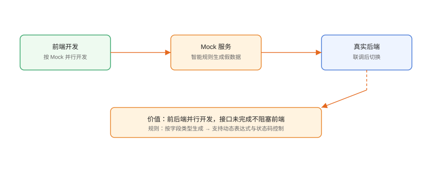

# Mock 数据与模拟服务

Mock（模拟）是**在后端接口尚未就绪时，用工具按接口定义生成假数据**，让前端开发、联调与测试不被阻塞。本页覆盖 Mock 原理、Postman Mock Server 与 Apifox 智能 Mock 的配置方法。

## 为什么需要 Mock



| 场景 | 没有 Mock | 有 Mock |
| --- | --- | --- |
| 前后端并行 | 前端等后端 | 前端用 Mock 先开发 |
| 第三方接口未上线 | 无法联调 | 模拟第三方行为 |
| 异常/边界数据 | 难构造 | Mock 规则直接返回 |
| 自动化测试 | 依赖真实环境 | 稳定可控 |

## Mock 的类型

| 类型 | 说明 | 适用 |
| --- | --- | --- |
| 静态 Mock | 固定返回某份 JSON | 快速占位 |
| 智能 Mock | 按字段类型生成随机数据 | 接口未定义完成 |
| 规则 Mock | 按条件返回不同数据 | 测试分支/异常 |
| Mock Server | 提供真实 HTTP 地址 | 前端/测试直接调用 |

## Postman Mock Server

### 基于集合创建

```text
1. 准备好集合，每个请求保存示例响应（Save Example）
2. 集合 → 更多 → Mock Collection
3. 选择环境（含示例数据），创建 Mock Server
4. 获得 Mock URL：https://<mock-id>.mock.pstmn.io
5. 请求地址改为 {{mockUrl}}/users 即可
```

### 关键点

- Mock 匹配**请求路径 + 方法**，返回对应的保存示例。
- 支持路径变量与查询参数匹配。
- 未匹配的请求返回 404，可在 Mock 配置里调整。

```text
示例：
GET https://<mock-id>.mock.pstmn.io/users/1
→ 返回集合中 users/:id 的保存示例
```

## Apifox 智能 Mock

Apifox 按**响应模型字段类型**自动生成符合规则的假数据，无需手工维护示例：

```text
1. 项目 → Mock 服务 → 开启
2. 复制 Mock 地址
3. 前端 baseUrl 指向 Mock 地址
```

### 字段规则

| 字段类型 | 生成示例 |
| --- | --- |
| string | 随机中文/英文文本 |
| number | 随机数值 |
| boolean | true/false |
| date | 当前日期 |
| email | 随机邮箱 |
| array | 按 items 生成数组 |
| object | 按属性递归生成 |

### 自定义规则

```json [响应模型示例]
{
  "code": 0,
  "data": {
    "id": "@integer(1, 10000)",
    "name": "@cname",
    "email": "@email",
    "phone": "@phone",
    "createdAt": "@datetime"
  }
}
```

支持 `@integer`、`@cname`、`@email`、`@phone`、`@datetime` 等表达式，可组合条件返回不同状态码。

## Mock 与真实环境的切换

```text
推荐用环境变量控制：
1. 环境「前端开发」：baseUrl = Mock 地址
2. 环境「联调」：baseUrl = 测试环境地址
3. 环境「生产」：baseUrl = 生产地址
前端只在代码里引用 {{baseUrl}}，切换环境即可切换数据源
```

后端就绪后，把环境切回真实地址，无需改代码。

## 高级：条件 Mock

Apifox 支持按请求参数返回不同结果：

```text
规则示例：
- userId=1 → 返回 VIP 用户示例
- userId=9999 → 返回 404 示例
- 无 token → 返回 401 示例
```

这对**异常分支测试**很有价值：前端可稳定触发 401/500 页面。

## 易错点与最佳实践

::: danger 常见问题
1. **Mock 与真实接口结构不一致**：前端联调真实接口时才发现字段对不上。Mock 数据严格按响应模型生成。
2. **把 Mock 地址带到生产**：环境变量配错，生产页面显示假数据。上线前检查 baseUrl。
3. **示例没保存导致 Mock 404**：Postman 需要先保存 Example 才能 Mock。
4. **Mock 数据含敏感信息**：用假数据模板，不要复制真实库数据。
5. **Mock 掩盖联调问题**：Mock 只用于并行开发，联调必须切真实环境验证。
:::

::: tip 最佳实践
- Mock 数据由**响应模型驱动**，先定义好接口再 Mock，减少返工。
- 用环境变量隔离 Mock/真实地址，一行不改代码完成切换。
- 为 401/404/500 各准备一个 Mock 规则，方便前端测异常页。
- 定期清理过期 Mock 与示例，避免误导。
- 接口文档中的示例值保持与 Mock 一致，降低认知成本。
:::

## 实战：前端并行开发 + 异常分支

```text
1. Apifox 项目定义 /users、/orders 接口与响应模型
2. 开启 Mock，复制地址
3. 前端开发环境 baseUrl = Mock 地址，开始开发
4. 配置 userId=9999 → 404 的规则，验证前端 404 页面
5. 后端联调：环境切换到测试地址，跑通全链路
6. 上线前检查 baseUrl 为生产地址
```

## 验证方式

1. 浏览器访问 Mock URL，返回与模型一致的 JSON。
2. 切换环境变量后，前端请求地址变化。
3. 异常规则触发对应状态码。
4. 联调环境全链路通过，无 Mock 残留。

## 参考资料

- Postman Mock Server：<https://learning.postman.com/docs/mocking-data/mocking-with-examples/>
- Apifox Mock：<https://docs.apifox.com/guidelines/mock/>
- Mock.js 数据规则：<https://github.com/nuysoft/Mock/wiki>
