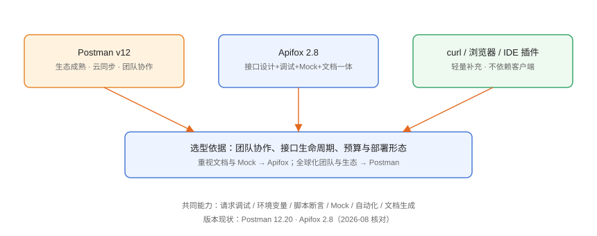

# 接口调试概述与选型

接口调试（API Debugging）指在开发与测试阶段**直接向接口发送请求、检查响应**的过程，是前后端联调、接口测试、问题定位的基础动作。本页介绍接口调试的核心环节，并给出 Postman 与 Apifox 的选型建议。

## 解决什么问题

1. **快速验证接口**：不需要写完整客户端，填 URL 就能发请求。
2. **复现与定位问题**：请求头、参数、响应体一目了然，配合控制台看细节。
3. **管理环境差异**：开发/测试/生产地址切换不再改代码。
4. **沉淀用例**：调通的请求保存为集合，重复执行并断言。
5. **文档与 Mock**：接口定义即文档，前端可并行开发。

## 核心环节



```text
构造请求 → 发送 → 检查响应 → 断言 → 保存为用例 → 自动化回归
```

| 环节 | 关键点 |
| --- | --- |
| 构造请求 | Method、URL、Headers、Query、Body |
| 环境管理 | 变量替换，多环境一键切换 |
| 响应检查 | 状态码、响应头、响应体、耗时 |
| 脚本断言 | 自动校验返回值、提取后续依赖数据 |
| 用例沉淀 | 集合/目录组织，团队共享 |
| 自动化 | CLI 运行 + CI 集成 + 报告 |

## 主流工具对比

| 工具 | 形态 | 优势 | 适合场景 |
| --- | --- | --- | --- |
| Postman | 桌面 + Web + CLI | 生态成熟、协作与云同步强、支持 REST/GraphQL/gRPC/WebSocket | 全球化团队、复杂协议 |
| Apifox | 桌面 + Web + CLI | 设计/调试/Mock/文档/测试一体化、中文体验好 | 国内团队、接口全生命周期 |
| curl / httpie | 命令行 | 轻量、可脚本化 | 临时验证、自动化脚本 |
| IDE 插件（VS Code REST Client） | 插件 | 与代码同库、无需安装客户端 | 个人开发 |

::: info 版本现状（2026-08 核对）
- **Postman v12**：2026-03 上线新 UI（Git 原生、AI 兼容），当前 12.20.x；v11 仍可继续使用但功能更新放缓。
- **Apifox 2.8.x**：持续迭代，2.8 支持 Apifox CLI 全面升级、OAuth 2.0 自动刷新令牌、MCP 调试等。
:::

## 按团队选型

| 场景 | 推荐 | 理由 |
| --- | --- | --- |
| 国内前后端协作、要文档与 Mock | Apifox | 一体化解耦多工具 |
| 全球团队、已有 Postman 生态 | Postman | 社区与插件丰富 |
| 只做临时验证 | curl / REST Client | 零安装 |
| 接口自动化入 CI | 两者 CLI 均可 | 结合 CI/CD 流水线 |

## 与 CI/CD 的关系

接口调试工具不只是「手工工具」：调通的集合经过 CLI 包装后，可以成为**接口回归测试**，在每次提交时自动运行，形成质量门禁。详见本专题「自动化测试与 CI 集成」与 [CI/CD 专题](../../CICD/index.md)。

## 请求构造要素

任何接口请求都由五部分构成，调试时逐项检查：

| 要素 | 说明 | 常见错误 |
| --- | --- | --- |
| Method | GET/POST/PUT/DELETE 等 | 用错方法导致 405 |
| URL | 协议 + 主机 + 路径 | 少写 https、路径拼错 |
| Headers | Content-Type、Authorization 等 | 漏 Content-Type 导致 415 |
| Query | URL 查询参数 | 参数名与后端不一致 |
| Body | JSON/表单/文件 | JSON 格式错误、字段缺失 |

## 常用协议形态

| 协议 | 特点 | 典型工具 |
| --- | --- | --- |
| REST（HTTP/JSON） | 最普遍、简单 | Postman、Apifox |
| GraphQL | 单端点按需取字段 | Postman 内置支持 |
| gRPC | 高性能、强类型 | Postman 支持、grpcurl |
| WebSocket | 双向实时 | Postman、浏览器 DevTools |
| SOAP/XML | 老系统常见 | Postman、SoapUI |

## 选择工具前的自检清单

1. 团队有多少人需要共享接口集合？（单人可先用免费轻量工具）
2. 是否需要在线文档与 Mock？（需要则优先 Apifox 或 Postman Mock Server）
3. 是否需要接入 CI 自动化？（确认所选工具有 CLI 与 JUnit 报告）
4. 是否涉及 gRPC/WebSocket 等特殊协议？（Postman 覆盖更全）
5. 数据是否敏感、能否用云服务？（私有化部署时考虑自托管方案）

## 工具链定位

```text
接口调试工具：日常开发与联调
  ├── 配合数据库客户端：核对接口返回的数据与库中数据
  ├── 配合 CI/CD：接口回归成为发布门禁
  └── 配合监控告警：生产接口可用性巡检
```

三者在日常工作中互相补充：接口工具负责「请求是否正确」，数据库客户端负责「数据是否正确」，CI 负责「每次都正确」。

## 常见误区

::: danger 常见问题
1. **只在浏览器地址栏测 GET**：无法覆盖 POST/Header/鉴权，问题经常测不出来。
2. **把密码写死在请求里**：应该用环境变量 + Vault/密钥管理。
3. **不保存用例**：调完就关，回归全靠手工重试。
4. **生产环境直接调试写操作**：生产接口调试应使用只读或沙箱数据，避免误改线上数据。
5. **忽视团队协作**：个人本地集合不共享，接口变更无人同步。
:::

## 验证方式

1. 用任一工具对目标接口发送一次 GET 请求，状态码 200。
2. 配置开发/测试两套环境变量并切换验证。
3. 保存一个带断言的请求，重复运行两次结果一致。

## 参考资料

- Postman 官方文档：<https://learning.postman.com/>
- Apifox 文档：<https://docs.apifox.com/>
- curl 文档：<https://curl.se/docs/>
- VS Code REST Client：<https://marketplace.visualstudio.com/items?itemName=humao.rest-client>
