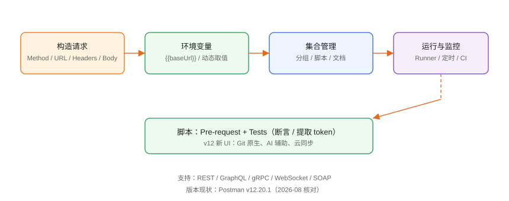

# Postman：请求调试与协作

Postman 是使用最广的接口调试与协作平台：桌面应用构造请求、集合管理用例、环境变量切换配置、脚本做断言与数据提取，并通过工作区实现团队协作。本页基于 **Postman v12** 编写。

## 产品定位



Postman 的核心是**集合（Collection）**：一组有序请求 + 脚本 + 文档，可以同步到云端、共享给团队，也能用 CLI 离线运行。

## v12 新特性

| 能力 | 说明 |
| --- | --- |
| Git 原生 | 集合可直接关联 Git 仓库，变更走提交 |
| 新 UI | 更简洁、响应式，适配大屏与 AI 辅助 |
| 云同步 | 工作区、集合实时同步 |
| Agent Mode | AI 辅助调试、分析失败请求 |
| 协议覆盖 | REST / GraphQL / gRPC / WebSocket / SOAP |

## 安装与登录

```shell
# Windows
winget install Postman.Postman

# macOS
brew install --cask postman
```

1. 安装后打开，注册/登录 Postman 账号（免费版够个人使用）。
2. 登录后自动创建个人工作区，可邀请团队成员。

## 构造第一个请求

```text
1. 点击 New → HTTP Request
2. Method 选择 GET
3. URL 填写 https://api.example.com/users
4. 点击 Send
```

```json [响应示例]
{
  "code": 0,
  "data": [
    {"id": 1, "name": "张三"},
    {"id": 2, "name": "李四"}
  ]
}
```

### 常用请求写法

```http
POST https://api.example.com/login
Content-Type: application/json

{
  "username": "{{username}}",
  "password": "{{password}}"
}
```

```http
GET https://api.example.com/users/{{userId}}
Authorization: Bearer {{token}}
```

## 集合管理

### 保存与组织

```text
New → Collection → 命名（如「用户中心接口」）
在集合下新建文件夹：认证、用户、订单
请求右键 → Save As → 归入集合
```

### 集合级配置

| 配置 | 作用 |
| --- | --- |
| Variables | 集合级变量，成员共享 |
| Pre-request Script | 集合内所有请求发送前执行 |
| Tests | 集合内所有请求响应后执行 |
| Authorization | 统一鉴权配置 |

## 环境与全局变量

```text
右上角环境选择器：
1. 创建「开发环境」「测试环境」「生产环境」
2. 每个环境定义 baseUrl、token、userId
3. 请求中使用 {{baseUrl}} 引用
```

| 变量作用域（低→高） | 说明 |
| --- | --- |
| 全局变量 | 所有集合可见 |
| 集合变量 | 集合内共享 |
| 环境变量 | 按环境切换 |
| 局部变量（脚本） | 单次运行内 |
| 数据变量（Runner） | 数据文件驱动 |

## 脚本：断言与数据提取

### Tests 断言

```javascript [Tests]
pm.test("状态码为 200", function () {
  pm.response.to.have.status(200);
});

pm.test("返回 code 为 0", function () {
  const body = pm.response.json();
  pm.expect(body.code).to.eql(0);
});

pm.test("返回用户列表非空", function () {
  const body = pm.response.json();
  pm.expect(body.data.length).to.be.above(0);
});
```

### 提取 token 供后续使用

```javascript [Tests]
const body = pm.response.json();
pm.environment.set("token", body.data.token);
pm.environment.set("userId", String(body.data.userId));
```

### Pre-request 生成签名

```javascript [Pre-request Script]
const ts = Date.now();
const sign = CryptoJS.MD5("secret" + ts).toString();
pm.request.headers.add({ key: "X-Timestamp", value: String(ts) });
pm.request.headers.add({ key: "X-Sign", value: sign });
```

## 集合运行器（Runner）

```text
选择集合 → Run：
1. 选择环境
2. 配置迭代次数与数据文件（CSV/JSON）
3. 运行并查看每个用例通过/失败
```

数据文件示例：

```csv [users.csv]
userId,expectStatus
1,200
9999,404
```

## 协作

- **工作区**：团队共享集合，实时同步变更。
- **评论与版本**：请求上留言，集合支持版本历史。
- **Monitors**：云端定时运行集合，接口故障自动告警。
- **API 网络/目录**：公开接口可复用现成集合。

## 易错点与最佳实践

::: danger 常见问题
1. **URL 写死 IP 端口**：换环境要改一堆请求。统一用 `{{baseUrl}}`。
2. **token 手动复制粘贴**：登录接口 Tests 里自动写入环境变量，后续自动携带。
3. **断言只查状态码**：200 不代表业务成功，还要断言业务 code 与关键字段。
4. **敏感信息提交到共享集合**：密码/密钥进 Vault 或环境变量，不进集合正文。
5. **生产集合随手运行写操作**：生产环境用只读数据，写操作走审批。
:::

::: tip 最佳实践
- 集合按模块组织，命名统一「模块-接口名-用途」。
- 环境命名带环境名（dev/test/prod），生产标红提示。
- 每个接口至少 3 条断言：状态码、业务码、关键字段。
- 用 Runner + CSV 数据文件做参数化测试，覆盖边界值。
- 把集合导出/关联 Git，纳入版本管理。
:::

## 实战：登录并查询用户

```text
1. 建集合「用户中心」，建环境「开发环境」，baseUrl=https://api.example.com
2. 新建 POST /login：Body 用户名密码，Tests 提取 token 到环境变量
3. 新建 GET /users/{{userId}}：Authorization Bearer {{token}}
4. 依次运行：先 login 再 users，确认 token 自动带入
5. Runner 跑两遍，全部通过
```

## 验证方式

1. 请求返回 200 且业务 code 正确。
2. 环境切换后 URL 自动变化。
3. 登录后 token 已写入环境变量（点击眼睛图标查看）。
4. Runner 报告全部用例通过。

## 参考资料

- Postman Learning Center：<https://learning.postman.com/>
- Postman 脚本参考：<https://learning.postman.com/docs/writing-scripts/script-references/postman-sandbox-api-reference/>
- Postman v12 发布说明：<https://releasebot.io/updates/postman>
- Newman（CLI）：<https://github.com/postmanlabs/newman>
