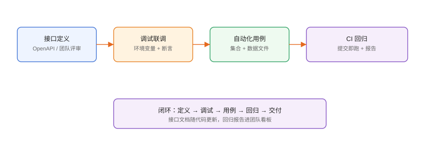

# 实战：接口调试全流程

本页把专题能力串成一条**可落地的接口工作流**：定义接口 → 环境与脚本 → 调试联调 → Mock 并行 → 自动化回归 → CI 门禁。照着做一遍，一个团队的接口协作就有了统一基线。

## 目标工作流



```text
接口定义 → 调试联调 → 用例沉淀 → Mock 并行 → 自动化回归 → CI 门禁
```

## 第一步：接口定义（单一事实来源）

```yaml [openapi.yaml 片段]
openapi: 3.1.0
info:
  title: 用户中心 API
  version: 1.0.0
paths:
  /login:
    post:
      requestBody:
        required: true
        content:
          application/json:
            schema:
              type: object
              required: [username, password]
              properties:
                username: {type: string}
                password: {type: string}
      responses:
        "200":
          description: 登录成功
          content:
            application/json:
              schema:
                type: object
                properties:
                  code: {type: integer}
                  data:
                    type: object
                    properties:
                      token: {type: string}
                      userId: {type: integer}
  /users/{userId}:
    get:
      parameters:
        - {name: userId, in: path, required: true, schema: {type: integer}}
      responses:
        "200":
          description: 用户详情
```

**落地方式**：团队选定 Postman 或 Apifox 后，接口定义统一维护在工具内，可导出 OpenAPI 存档；后端实现、前端联调、测试用例全部以它为准。

## 第二步：环境与账号

```text
环境设计：
dev   : http://127.0.0.1:8080
test  : https://test-api.example.com
prod  : https://api.example.com
```

```text
账号设计：
- 只读账号：联调查询
- 测试专用账号：可写测试数据（命名 test_ 前缀）
- 生产：禁止用工具直接写操作
```

## 第三步：登录链路与断言

### 登录接口

```http
POST {{baseUrl}}/login
Content-Type: application/json

{
  "username": "{{username}}",
  "password": "{{password}}"
}
```

```javascript [Tests]
const res = pm.response.json();
pm.test("登录成功", () => {
  pm.response.to.have.status(200);
  pm.expect(res.code).to.eql(0);
});
pm.environment.set("token", res.data.token);
pm.environment.set("userId", String(res.data.userId));
```

### 业务接口

```http
GET {{baseUrl}}/users/{{userId}}
Authorization: Bearer {{token}}
```

```javascript [Tests]
pm.test("获取用户详情", () => {
  pm.response.to.have.status(200);
  const body = pm.response.json();
  pm.expect(body.code).to.eql(0);
  pm.expect(body.data.id).to.eql(pm.environment.get("userId"));
});
```

## 第四步：Mock 与前端并行

```text
1. 后端开发 /users/orders 期间，Apifox 开启 Mock
2. 前端 baseUrl 指向 Mock 地址，开始页面开发
3. 配置异常规则（401/404/500）验证前端错误处理
4. 后端就绪后切回测试环境联调
```

## 第五步：用例沉淀

```text
集合结构：
用户中心
├─ 认证
│  ├─ 登录成功
│  ├─ 密码错误
│  └─ 账号不存在
├─ 用户
│  ├─ 查询详情
│  └─ 查询不存在用户（404）
└─ 订单
   ├─ 创建订单
   └─ 无权限（401）
```

每个用例至少 3 条断言：状态码、业务码、关键字段。

## 第六步：数据驱动与回归

```csv [cases.csv]
username,password,expectCode
admin,123456,0
guest,000000,1001
missing,123456,1002
```

```shell
newman run user-center.json \
  -e test-env.json \
  -d cases.csv \
  --reporters cli,junit \
  --reporter-junit-export junit.xml
```

## 第七步：接入 CI

```yaml [.github/workflows/api-regression.yml]
name: API Regression
on:
  pull_request:
  schedule:
    - cron: "0 3 * * *"
jobs:
  regression:
    runs-on: ubuntu-latest
    steps:
      - uses: actions/checkout@v4
      - uses: actions/setup-node@v4
        with:
          node-version: 22
      - run: npm install -g newman
      - name: Run regression
        env:
          API_USERNAME: ${{ secrets.API_USERNAME }}
          API_PASSWORD: ${{ secrets.API_PASSWORD }}
        run: |
          newman run tests/api/user-center.json \
            -e tests/api/test-env.json \
            --env-var username="$API_USERNAME" \
            --env-var password="$API_PASSWORD" \
            --reporters cli,junit \
            --reporter-junit-export junit.xml
      - name: Upload report
        if: always()
        uses: actions/upload-artifact@v4
        with:
          name: api-report
          path: junit.xml
```

## 团队规范建议

1. **接口变更流程**：先改定义 → 评审 → 实现 → 更新用例 → PR 通过 CI。
2. **环境变量模板入库**：真实值用 Secret 注入。
3. **定时巡检**：每天跑生产只读接口，异常自动告警。
4. **报告复盘**：每周看一次失败用例，归类为「接口 bug / 用例老化 / 环境问题」。

## 易错点与最佳实践

::: danger 常见问题
1. **定义与实现漂移**：代码改了文档没改，CI 回归才发现。接口变更必须同步定义。
2. **用例环境依赖**：用例依赖测试库特定数据，别人跑就挂。用数据文件与独立测试账号。
3. **Mock 与真实混用**：联调切回真实环境后还留着 Mock 地址，页面显示假数据。
4. **CI 失败没人看**：门禁形同虚设。失败告警进值班群。
5. **只测正常路径**：401/404/超时这些分支不覆盖，上线才暴露。
:::

::: tip 最佳实践
- 冒烟用例跑主干（登录→列表→详情→下单），控制在 3 分钟内。
- 生产巡检用只读接口 + 专用账号，不影响线上数据。
- 断言统一模板：状态码 + 业务码 + 关键字段，新人照着写。
- 每周归类失败用例，驱动接口与用例质量持续改进。
- 与 [CI/CD 专题](../../CICD/index.md)、[数据库客户端](../../DatabaseClients/index.md) 配合，形成完整工具链。
:::

## 验证方式

1. 本地 Newman/Apifox CLI 全绿。
2. Mock 环境前端可独立完成页面开发。
3. PR 合并前 CI 自动回归通过。
4. 定时巡检在接口故障时触发通知。

## 参考资料

- Postman：<https://learning.postman.com/>
- Apifox：<https://docs.apifox.com/>
- Newman：<https://github.com/postmanlabs/newman>
- OpenAPI 规范：<https://spec.openapis.org/oas/v3.1.0>
