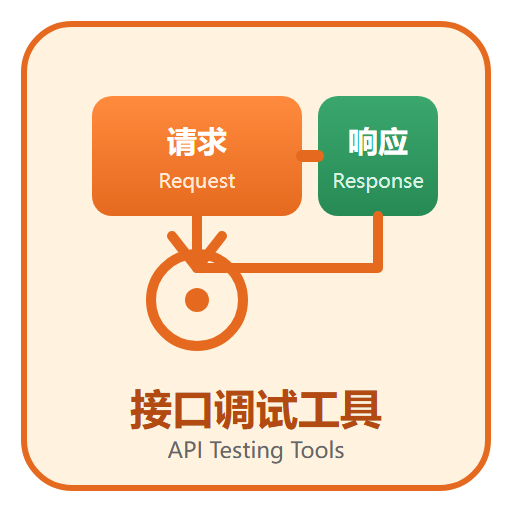

# 接口调试工具

接口调试工具是前后端协作与质量保障的「日常驾驶舱」：构造请求、调试响应、管理环境变量、生成 Mock、沉淀自动化用例并接入 CI。本专题以 **Postman v12** 与 **Apifox 2.8** 为主线，覆盖环境与脚本、Mock、自动化测试与实战流程。

## 专题导航

- [接口调试概述与选型](Overview/index.md)
- [Postman：请求调试与协作](Postman/index.md)
- [Apifox：接口设计到测试一体化](Apifox/index.md)
- [环境变量与脚本](Environment/index.md)
- [Mock 数据与模拟服务](Mock/index.md)
- [自动化测试与 CI 集成](Automation/index.md)
- [实战：接口调试全流程](Practice/index.md)
- [常见问题与最佳实践](FAQ/index.md)

## 阅读建议

1. 刚接触接口调试：先读「概述与选型」，再任选 Postman 或 Apifox 入门。
2. 需要 token、签名这类动态请求：重点读「环境变量与脚本」。
3. 前后端并行开发：重点读「Mock 数据与模拟服务」。
4. 要把接口测试纳入流水线：重点读「自动化测试与 CI 集成」，配合 [CI/CD 专题](../CICD/index.md)。

## 相关专题与分工

- [接口自动化](../TestingTools/APIAutomation/index.md)：本专题负责**手工调试与协作**——构造请求、调试响应、Mock 数据、管理环境变量与密钥、把调好的集合分享给协作者；该页负责把调试成果**沉淀成可回归、可进 CI 门禁的脚本**——数据与用例分离、分层断言（状态码 / 结构 / 业务字段）、契约校验。两者是同一条接口链路上的前后半程：先在调试工具里把请求调通，再把它变成自动化用例交给该页；调试工具里的临时集合不是回归资产，别拿它当自动化用。
