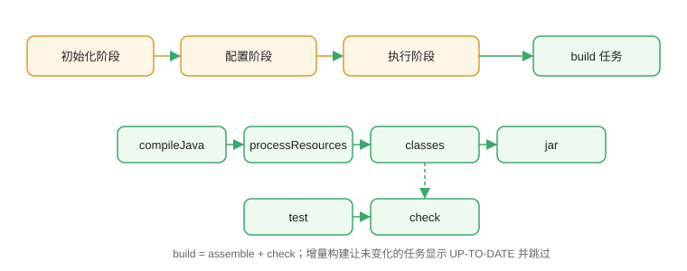

# 生命周期与任务

Gradle 没有 Maven 那种“阶段表”，取而代之的是**任务图（Task DAG）**。理解初始化、配置、执行三个阶段，以及任务间的依赖，是掌握 Gradle 的关键。

## 构建的三个阶段

```text
初始化阶段（Initialization）
    │  读取 settings.gradle.kts，确定包含哪些项目
    ▼
配置阶段（Configuration）
    │  执行每个项目的 build.gradle.kts，构建任务图
    ▼
执行阶段（Execution）
    │  按依赖顺序执行选中的任务
    ▼
输出（BUILD SUCCESSFUL / FAILED）
```



| 阶段 | 做什么 | 发生次数 |
| --- | --- | --- |
| 初始化 | 解析 settings，创建 Project 对象 | 每次构建 1 次 |
| 配置 | 执行构建脚本，生成任务图 | 每次构建 1 次 |
| 执行 | 运行实际任务 | 按需执行 |

Gradle 9 的**配置缓存**可以把配置阶段结果缓存起来，第二次构建直接复用，大幅缩短构建时间。

## Java 插件提供的常用任务

```shell
./gradlew tasks
```

Java 插件默认提供：

| 任务 | 作用 |
| --- | --- |
| `clean` | 删除 `build/` |
| `compileJava` | 编译主代码 |
| `processResources` | 复制主资源 |
| `classes` | 编译 + 资源 |
| `test` | 运行单元测试 |
| `jar` | 打 jar |
| `assemble` | 产出所有归档（jar 等） |
| `check` | 运行所有验证任务（测试、静态检查） |
| `build` | assemble + check |

`./gradlew build` 是最常用的完整构建命令。

## 常用命令行

```shell
./gradlew build                    # 完整构建
./gradlew clean build              # 清理后构建
./gradlew test                     # 只跑测试
./gradlew run                      # 运行 application 项目
./gradlew assemble                 # 只打产物
./gradlew check                    # 只做质量检查
./gradlew :web:build               # 构建指定子项目
./gradlew build --dry-run          # 预览任务而不执行
./gradlew build --info             # 查看详细日志
./gradlew build --scan             # 生成构建分析报告
```

## 任务依赖

```kotlin
tasks.register("hello") {
    doLast {
        println("Hello Gradle")
    }
}

tasks.register("world") {
    dependsOn("hello")
    doLast {
        println("World")
    }
}
```

执行 `./gradlew world` 会先运行 `hello` 再运行 `world`。

## 增量构建

Gradle 通过任务的 `inputs` 和 `outputs` 判断是否需要重新执行：

```kotlin
tasks.register("copyConfig") {
    val src = file("src/config")
    val dest = layout.buildDirectory.dir("config")
    inputs.dir(src)
    outputs.dir(dest)
    doLast {
        copy {
            from(src)
            into(dest)
        }
    }
}
```

输入没变化时，任务显示 `UP-TO-DATE`，直接跳过执行。

## 构建缓存与守护进程

| 机制 | 作用 | 开关 |
| --- | --- | --- |
| 守护进程 | 常驻 JVM，避免冷启动 | 默认开启 |
| 增量构建 | 本机跳过未变化任务 | 默认开启 |
| 构建缓存 | 跨构建/跨机器复用任务产物 | `org.gradle.caching=true` |
| 配置缓存 | 复用配置阶段结果 | Gradle 9 推荐开启 |

## 常见问题

::: danger 常见错误
1. 以为 Gradle 有 `install` 阶段：Gradle 没有统一的 `install`，发布用插件（如 `maven-publish` 的 `publish` 任务）。
2. 在配置阶段执行耗时逻辑：每次构建都跑，应放进 `doLast {}` 或任务动作里。
3. 使用 `gradle build` 而不是 `./gradlew build`：团队版本不一致，构建行为漂移。
4. 任务执行顺序依赖“书写顺序”而不是声明 `dependsOn`：Gradle 只保证任务图顺序，不保证脚本书写顺序。
5. 修改了任务输入但任务显示 `UP-TO-DATE`：检查 `inputs` / `outputs` 声明是否覆盖了实际依赖的文件。
:::

## 验证方式

1. 执行 `./gradlew build --dry-run`，观察任务列表顺序。
2. 连续两次执行 `./gradlew build`，第二次大量任务显示 `UP-TO-DATE`，验证增量构建。
3. 修改一个源码文件后再构建，只重新编译受影响的任务。
4. 执行 `./gradlew tasks`，确认自定义任务出现在任务列表中。

## 参考资料

- Gradle 构建生命周期：https://docs.gradle.org/current/userguide/build_lifecycle.html
- 任务开发指南：https://docs.gradle.org/current/userguide/more_about_tasks.html
- 增量构建与缓存：https://docs.gradle.org/current/userguide/incremental_build.html
