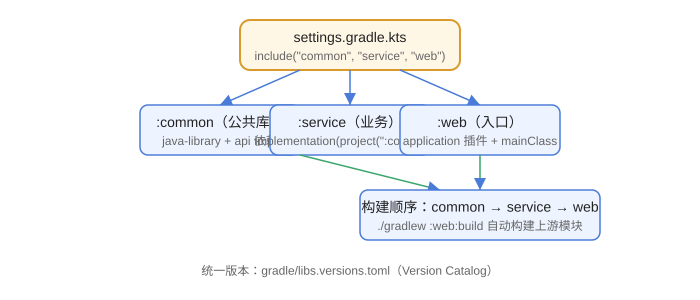

# 多项目工程与 Wrapper

中大型项目通常拆成多个 Gradle 子项目（subproject），例如 `common`、`service`、`web`。这一篇讲 settings 配置、项目间依赖、统一版本，以及 Wrapper 的正确使用方式。

## 目录结构

```text
my-platform/
├─ settings.gradle.kts
├─ build.gradle.kts          # 根项目构建脚本（可选）
├─ gradle.properties
├─ gradlew / gradlew.bat
├─ gradle/
│  ├─ libs.versions.toml
│  └─ wrapper/gradle-wrapper.properties
├─ common/
│  ├─ build.gradle.kts
│  └─ src/...
├─ service/
│  ├─ build.gradle.kts
│  └─ src/...
└─ web/
   ├─ build.gradle.kts
   └─ src/...
```



## settings.gradle.kts：声明子项目

```kotlin [settings.gradle.kts]
rootProject.name = "my-platform"

include("common")
include("service")
include("web")

pluginManagement {
    repositories {
        mavenCentral()
        gradlePluginPortal()
    }
}
```

子项目的目录名默认就是项目名；目录与名字不同时可显式指定：

```kotlin
include(":service")
project(":service").projectDir = file("modules/service")
```

## 根项目统一配置

根项目的 `build.gradle.kts` 可以统一配置所有子项目：

```kotlin [build.gradle.kts]
subprojects {
    group = "com.example"
    version = "1.0.0-SNAPSHOT"
}
```

更推荐的做法是每个子项目使用自己的插件与配置，公共依赖版本统一交给 Version Catalog。

## 子项目：common

```kotlin [common/build.gradle.kts]
plugins {
    `java-library`
}

dependencies {
    api("org.apache.commons:commons-lang3:3.17.0")
    testImplementation(libs.junit.jupiter)
    tasks.test {
        useJUnitPlatform()
    }
}
```

`java-library` 让 common 的 `api` 依赖能传递给下游。

## 子项目：service 与 web

```kotlin [service/build.gradle.kts]
plugins {
    java
}

dependencies {
    implementation(project(":common"))
}
```

```kotlin [web/build.gradle.kts]
plugins {
    java
    application
}

dependencies {
    implementation(project(":service"))
}

application {
    mainClass = "com.example.web.Main"
}
```

`project(":common")` 是项目依赖（Project Dependency），Gradle 会自动按依赖顺序构建。

## 构建命令

```shell
./gradlew build                 # 构建所有项目
./gradlew :web:build            # 只构建 web（同时触发其项目依赖）
./gradlew :web:run              # 运行 web
./gradlew projects              # 查看所有子项目
./gradlew build --parallel      # 并行构建（默认已支持并行）
```

## 统一版本：在根项目使用约束

```kotlin [build.gradle.kts]
subprojects {
    dependencies {
        constraints {
            implementation("org.apache.commons:commons-lang3:3.17.0")
            implementation("com.google.guava:guava:33.2.1-jre")
        }
    }
}
```

也可以直接使用 Version Catalog（推荐），所有子项目引用同一个 `libs.versions.toml`。

## Wrapper：锁定构建版本

生成 Wrapper：

```shell
gradle wrapper --gradle-version 9.7.0
```

生成的文件：

```text
gradlew
gradlew.bat
gradle/wrapper/gradle-wrapper.jar
gradle/wrapper/gradle-wrapper.properties
```

之后团队统一使用：

```shell
./gradlew build    # Windows 用 .\gradlew.bat build
```

`gradle-wrapper.properties` 中的 `distributionUrl` 指定了精确的 Gradle 版本，新同事克隆仓库后首次运行会自动下载对应版本。

## 易错点

::: danger 常见错误
1. `settings.gradle.kts` 忘记 `include`：子项目目录存在但不参与构建。
2. 子项目之间用固定版本依赖（`implementation("com.example:common:1.0.0-SNAPSHOT")`）：本地不 install 时拉不到，改用 `project(":common")`。
3. 根项目 `subprojects {}` 里给所有子项目统一加 `application` 插件：导致每个模块都可执行，职责混乱；插件按需在每个子项目声明。
4. 直接提交 `gradle-wrapper.jar` 以外的手改文件：`gradlew` 与 wrapper 配置要一起提交，不要手工改动 jar。
5. 在 CI 中用系统安装的 Gradle 而不是 Wrapper：版本漂移，CI 结果与本地不一致。
:::

## 验证方式

1. 在根目录执行 `./gradlew projects`，确认三个子项目都被识别。
2. 执行 `./gradlew :web:build`，观察构建顺序：common → service → web。
3. 修改 `common` 后执行 `./gradlew :web:build`，确认 `:common:compileJava` 被重新执行。
4. 检查 `gradle/wrapper/gradle-wrapper.properties`，确认 `distributionUrl` 指向 9.7.0。

## 参考资料

- 多项目构建：https://docs.gradle.org/current/userguide/multi_project_builds.html
- Gradle Wrapper：https://docs.gradle.org/current/userguide/gradle_wrapper.html
- 项目依赖：https://docs.gradle.org/current/userguide/declaring_dependencies.html#sec:project_dependencies
