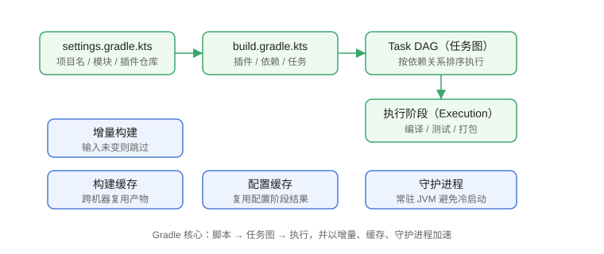

# Gradle 概述与安装

Gradle 是面向 JVM（以及 Android、原生、多语言）的通用构建工具，核心思想是“任务（Task）驱动的有向无环图（DAG）”。它比 Maven 更灵活，同时内置增量构建、构建缓存和守护进程，是目前 Java 与 Android 项目的主流选择。

::: info 版本现状（2026-08 核对）
**Gradle 当前稳定版为 9.7.0**（2026-08-05 发布）。Gradle 9.x 运行需要 **JVM 17 及以上**；构建脚本推荐使用 **Kotlin DSL**（Groovy DSL 在 9.x 仍可用，但部分旧语法已弃用，计划在 Gradle 10 移除）。
:::

## Gradle 解决什么问题

与 Maven 相同，Gradle 负责编译、测试、打包、依赖管理；与 Maven 不同的是：

1. **灵活的任务模型**：构建逻辑是任务 DAG，自定义任务、增量执行都很自然。
2. **增量构建**：输入没变的任务直接跳过，全量构建快。
3. **构建缓存**：同一份构建结果可在不同机器间复用。
4. **守护进程**：常驻 JVM 复用，避免重复启动开销。
5. **多种 DSL**：Kotlin DSL 提供类型安全、IDE 补全。

## 核心概念

```text
settings.gradle.kts（声明项目/插件仓库）
        │
        ▼
build.gradle.kts（插件、依赖、任务）
        │
        ▼
Task DAG（任务依赖图）
        │
        ├── 增量构建（输入/输出判断）
        ├── 构建缓存（复用产物）
        └── 配置缓存（复用配置结果）
```



| 概念 | 作用 |
| --- | --- |
| Project | 一个构建单元，对应一个目录 |
| Task | 最小执行单元，如 `compileJava`、`test` |
| Configuration | 依赖分组，如 `implementation`、`testImplementation` |
| Plugin | 扩展构建能力，如 `java`、`org.springframework.boot` |
| Wrapper | 固定 Gradle 版本的启动器 |

## 版本演进与选择

| 版本线 | 运行所需 JVM | 状态 | 说明 |
| --- | --- | --- | --- |
| Gradle 7.x | JVM 8+ | 已停止维护 | 老项目存量使用 |
| Gradle 8.x | JVM 8+（8.x 末期要求 17） | 停止维护 | 建议升级 9.x |
| Gradle 9.x | JVM 17+ | 维护中 | **当前稳定线，最新 9.7.0** |
| Gradle 10.x | 预计 JVM 17+ | 未发布 | Groovy DSL 旧语法计划移除 |

## 安装 Gradle

### 前置条件

确认已安装 JDK 17+：

```shell
java -version
```

### Windows

方式一：包管理器（管理员 PowerShell）：

```shell
choco install gradle
```

方式二：手动安装：

1. 到 https://gradle.org/releases/ 下载 `gradle-9.7.0-bin.zip`。
2. 解压到 `D:\tools\gradle-9.7.0`。
3. 配置环境变量：

```properties [系统环境变量]
GRADLE_HOME=D:\tools\gradle-9.7.0
PATH=%GRADLE_HOME%\bin;%PATH%
```

4. 新开终端验证：

```shell
gradle --version
```

### macOS / Linux

```shell
# macOS
brew install gradle

# Linux（Debian/Ubuntu）
sudo apt update && sudo apt install -y gradle

# 或使用 SDKMAN（推荐，方便多版本切换）
sdk install gradle 9.7.0
```

## 验证安装

```shell
gradle --version
```

预期输出包含：

```text
------------------------------------------------------------
Gradle 9.7.0
------------------------------------------------------------
JVM:           17.0.12 (Eclipse Adoptium 17.0.12+7)
OS:            Windows 11 ...
```

再创建一个空项目验证基本流程：

```shell
mkdir hello-gradle
cd hello-gradle
gradle init --type basic --dsl kotlin --project-name hello-gradle
gradle tasks
```

`gradle tasks` 能列出任务列表，说明安装与项目结构正常。

## 常见安装问题

::: danger 常见错误
1. 提示 `gradle 不是内部或外部命令`：`PATH` 未配置，或没有新开终端。
2. 报 `Unsupported class file major version` 或 JVM 版本过低：Gradle 9.x 需要 JVM 17+，升级 JDK 或用 SDKMAN 切换。
3. 首次运行下载很慢：Gradle 发行版会从 services.gradle.org 下载，内网环境配置镜像或使用公司代理；确定版本后建议统一用 Wrapper，避免每台机器单独安装。
4. 同时安装多个 Gradle 版本导致行为不一致：项目内始终使用 `./gradlew`，不要直接调系统 `gradle`。
:::

## 参考资料

- Gradle 官方文档：https://docs.gradle.org/
- Gradle 发行版下载：https://gradle.org/releases/
- Gradle 9.7.0 发布说明：https://docs.gradle.org/9.7.0/release-notes.html
