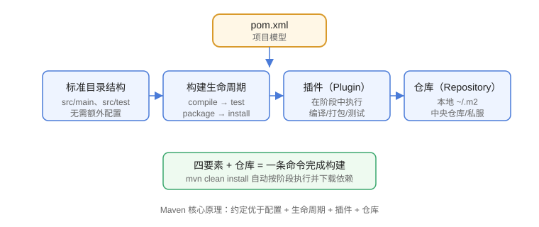

# Maven 概述与安装

Maven 是 Apache 旗下的 Java 项目构建与依赖管理工具，用一句线性的“生命周期 + 插件”把编译、测试、打包、部署标准化。它适合 Java 项目、微服务工程、Spring Boot 应用以及需要统一依赖版本的多模块项目。

::: info 版本现状（2026-08 核对）
**Maven 3.9.x 是当前稳定线，最新版本为 3.9.16**（2026-05 发布）。Maven 4.0.0 目前处于 RC 阶段（2026-08-04 发布 4.0.0-rc-6），尚未正式 GA，生产项目建议继续使用 3.9.16，可先在测试环境体验 Maven 4。
:::

## Maven 解决什么问题

在没有构建工具时，Java 项目会遇到四类重复劳动：

1. 手动执行 `javac`、复制资源、打 jar，步骤容易漏。
2. 依赖 jar 靠人肉下载和拷贝，版本冲突难以排查。
3. 每个开发者的编译环境不一致，出现“我这边能跑”。
4. 测试、打包、发布没有统一入口，无法接入 CI/CD。

Maven 通过「约定优于配置」解决这些问题：规定标准目录结构、用 `pom.xml` 描述项目、从仓库自动下载依赖，再按固定阶段执行构建。

## 核心原理：五要素

```text
pom.xml 描述项目
    │
    ├── 标准目录结构（src/main、src/test）
    ├── 构建生命周期（compile → test → package → install）
    ├── 插件（在生命周期中执行具体动作）
    └── 仓库（本地 ~/.m2 → 中央仓库 → 私服）
```



| 要素 | 作用 |
| --- | --- |
| `pom.xml` | 项目模型：坐标、依赖、插件、属性 |
| 目录约定 | 固定源码、资源、测试的位置，无需配置 |
| 生命周期 | 定义构建阶段与顺序 |
| 插件 | 在阶段中执行编译、打包、测试等动作 |
| 仓库 | 集中管理 jar 的下载、缓存与发布 |

## 版本演进与选择

| 版本线 | 运行所需 JDK | 状态 | 建议 |
| --- | --- | --- | --- |
| Maven 2.x | Java 5+ | 已停止维护 | 存量项目尽快升级 |
| Maven 3.6.x | Java 7+ | 已停止维护 | 仅存量项目使用 |
| Maven 3.8.x / 3.9.x | Java 8+（推荐 17+） | 维护中 | **生产首选 3.9.16** |
| Maven 4.0.0 | JDK 17+ | RC（未 GA） | 测试体验，勿直接用于生产 |

::: warning 版本选择建议
Maven 4 正式发布后再迁移：它重构了 POM 模型、默认使用新解析器，部分老插件可能不兼容。当前用 3.9.16，升级前先跑一遍 `mvn verify` 验证全量构建。
:::

## 安装 Maven

### 前置条件

- 安装 JDK：Maven 3.9 运行需要 Java 8+，建议使用 JDK 17 或 21（LTS）；Maven 4 强制要求 JDK 17+。
- 确认 `JAVA_HOME` 已配置，`java -version` 可正常输出。

### Windows

方式一：包管理器（管理员 PowerShell）：

```shell
choco install maven
```

方式二：手动安装（更可控）：

1. 到 https://maven.apache.org/download.cgi 下载 `apache-maven-3.9.16-bin.zip`。
2. 解压到 `D:\tools\apache-maven-3.9.16`。
3. 配置环境变量：

```properties [系统环境变量]
MAVEN_HOME=D:\tools\apache-maven-3.9.16
PATH=%MAVEN_HOME%\bin;%PATH%
```

4. 新开终端验证：

```shell
mvn -v
```

### macOS / Linux

```shell
# macOS
brew install maven

# Linux（Debian/Ubuntu）
sudo apt update && sudo apt install -y maven

# 或使用 SDKMAN（推荐，方便切换版本）
curl -s "https://get.sdkman.io" | bash
sdk install maven 3.9.16
```

## 验证安装

```shell
mvn -v
```

预期输出包含：

```text
Apache Maven 3.9.16 (....)
Maven home: D:\tools\apache-maven-3.9.16
Java version: 17.0.12, vendor: Eclipse Adoptium, runtime: ...
```

再验证依赖下载链路（会从中央仓库拉取 junit 并写入本地仓库）：

```shell
mvn dependency:get -Dartifact=junit:junit:4.13.2
```

最后检查本地仓库目录：

```shell
ls ~/.m2/repository/junit/junit/4.13.2
```

出现 `junit-4.13.2.jar` 说明仓库链路正常。

## 常见安装问题

::: danger 常见错误
1. 提示「mvn 不是内部或外部命令」：`PATH` 未配置或未新开终端，检查 `echo %PATH%`。
2. 提示 `JAVA_HOME` 错误：`JAVA_HOME` 必须指向 JDK 目录，而不是 `bin` 目录，例如 `C:\Program Files\Java\jdk-17`。
3. `mvn dependency:get` 长时间卡住或报错：网络无法访问中央仓库，配置国内镜像（见下文）。
4. 安装多个 JDK 后构建版本混乱：用 `JAVA_HOME` 锁定 JDK，并在 IDE 中同步。
:::

## 配置国内镜像（推荐）

在 `~/.m2/settings.xml` 中添加阿里云镜像，加速依赖下载：

```xml [~/.m2/settings.xml]
<settings>
  <mirrors>
    <mirror>
      <id>aliyun</id>
      <mirrorOf>central</mirrorOf>
      <name>Aliyun Maven Mirror</name>
      <url>https://maven.aliyun.com/repository/public</url>
    </mirror>
  </mirrors>
</settings>
```

配置后用 `mvn help:effective-settings` 确认生效。

## 参考资料

- Maven 官方文档：https://maven.apache.org/
- Maven 下载页：https://maven.apache.org/download.cgi
- Maven 3.9 发布说明：https://maven.apache.org/docs/3.9.16/release-notes.html
- Maven 4 新特性（What's New in Maven 4）：https://maven.apache.org/whatsnewinmaven4.html
