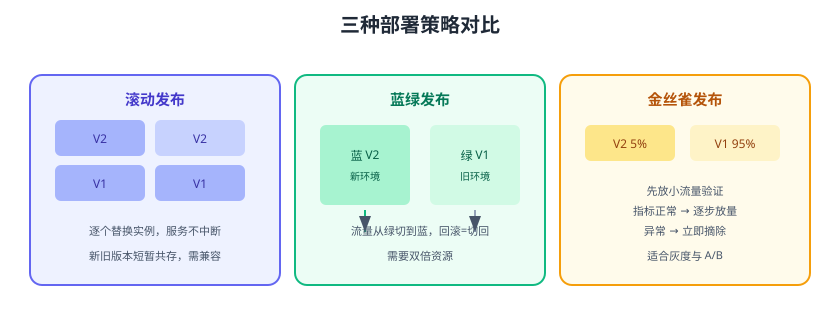
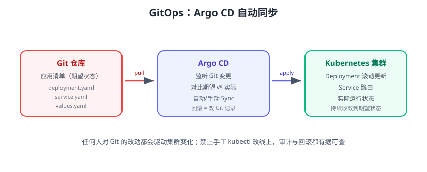

# 自动部署与回滚

部署是把制品安全地送到目标环境的过程。自动部署的核心不是“跑一条脚本”，而是**可验证、可回滚、可观测**。本页覆盖滚动/蓝绿/金丝雀三种发布策略、健康检查与自动回滚、GitOps（Argo CD）部署，以及回滚的完整预案。



## 部署流程总览

```text
制品（不可变 Tag）
  → 部署到 staging → 冒烟测试 → 通过
  → 部署到 prod（策略选择）→ 健康检查
  → 指标观察窗口（10~30 分钟）→ 宣布上线
  → 异常 → 自动/手动回滚
```

## 三种部署策略

| 策略 | 原理 | 停机 | 回滚速度 | 适用 |
| --- | --- | --- | --- | --- |
| 滚动 | 逐个替换实例 | 无 | 慢（逐台回滚） | 大多数应用，默认选择 |
| 蓝绿 | 新环境整体切换 | 无 | 极快（切回旧环境） | 核心应用、数据库兼容要求高 |
| 金丝雀 | 小流量试新版本 | 无 | 快（摘流量） | 高风险变更、灰度、A/B |

### 滚动发布（K8s 默认）

```yaml [deployment.yaml]
spec:
  replicas: 3
  strategy:
    type: RollingUpdate
    rollingUpdate:
      maxUnavailable: 1        # 最多 1 个实例不可用
      maxSurge: 1              # 最多多起 1 个新实例
  template:
    spec:
      containers:
        - name: app
          image: registry.example.com/shop/order-service:1.2.0-45-a1b2c3d
```

```shell
kubectl rollout status deployment/order-service
kubectl rollout history deployment/order-service
kubectl rollout undo deployment/order-service   # 一键回滚
```

### 蓝绿发布

```text
绿（V1，当前）→ 部署蓝（V2）→ 验证 → 切 Service 指向蓝
回滚：把 Service 指回绿
```

```shell
# 切流量（Service selector 从 green 改 blue）
kubectl patch service order-service -p \
  '{"spec":{"selector":{"version":"blue"}}}'

# 回滚
kubectl patch service order-service -p \
  '{"spec":{"selector":{"version":"green"}}}'
```

### 金丝雀发布

```shell
# 创建金丝雀 Deployment（副本 1，版本 V2）
kubectl create deployment order-canary --image=...:V2 --replicas=1

# 用 Service + 权重（或 Nginx/Argo Rollouts）按 5%:95% 分流
```

金丝雀观察指标正常后逐步放大流量，异常立即摘除 V2。

## 健康检查与自动回滚

### 就绪探针

```yaml
spec:
  template:
    spec:
      containers:
        - name: app
          readinessProbe:
            httpGet:
              path: /actuator/health
              port: 8080
            initialDelaySeconds: 5
            periodSeconds: 10
          livenessProbe:
            httpGet:
              path: /actuator/health
              port: 8080
            initialDelaySeconds: 30
            periodSeconds: 15
```

### 流水线健康检查

```shell
# 部署后轮询健康接口，失败即回滚
for i in $(seq 1 30); do
  if curl -sf http://localhost:8080/actuator/health | grep -q '"UP"'; then
    echo "健康检查通过"
    exit 0
  fi
  sleep 5
done
echo "健康检查失败，触发回滚"
exit 1
```

## GitOps：Argo CD

GitOps 把 **Git 仓库当作部署的唯一事实来源**：应用清单（Deployment/Service）提交到 Git，Argo CD 监听变更并自动把集群收敛到期望状态。回滚 = 改回 Git 里的旧版本。



### 安装与接入

```shell
kubectl create namespace argocd
kubectl apply -n argocd -f https://raw.githubusercontent.com/argoproj/argo-cd/v3.5.0/manifests/install.yaml
kubectl -n argocd get secret argocd-initial-admin-secret \
  -o jsonpath="{.data.password}" | base64 -d
```

### 创建 Application

```yaml [app.yaml]
apiVersion: argoproj.io/v1alpha1
kind: Application
metadata:
  name: order-service
  namespace: argocd
spec:
  destination:
    server: https://kubernetes.default.svc
    namespace: shop
  project: default
  source:
    repoURL: https://git.example.com/shop/order-service-config.git
    path: overlays/prod
    targetRevision: main
  syncPolicy:
    automated:
      prune: true
      selfHeal: true
```

```shell
kubectl apply -f app.yaml
argocd app sync order-service
argocd app get order-service
```

发布流程变为：

```text
改 Git 镜像 Tag → MR 合并 → Argo CD 检测到差异 → 自动/手动同步 → 集群更新
```

## 回滚预案

::: danger 回滚前三问
1. **数据兼容吗**：新版本改了表结构/缓存格式，回滚到旧代码可能读不了新数据；先评估是否需要“向前兼容”设计。
2. **回滚后健康吗**：旧版本能正常启动并连上当前数据库吗？
3. **回滚谁执行**：谁有权限、多久内完成、要不要审批？
:::

| 场景 | 回滚动作 |
| --- | --- |
| K8s 滚动发布 | `kubectl rollout undo deployment/xxx` |
| 蓝绿 | Service 切回旧环境 |
| 金丝雀 | 摘掉金丝雀流量/删除 Canary |
| Argo CD | Git 回退旧 Tag 并 sync |
| 数据库变更 | 迁移脚本反向执行（downgrade）或备份恢复 |
| 前端 | CDN 回滚到上一版 dist/或旧静态资源 |

## 数据库发布与回滚

数据库变更无法“像应用一样回滚”，常用策略：

1. **向前兼容**：先加列/加表（可空），应用双版本都兼容，再改代码，最后清理旧字段。
2. **扩展-迁移-收缩（Expand-Migrate-Contract）**。
3. **版本化迁移**：Flyway/Liquibase 管理脚本，支持 undo（谨慎使用）。
4. **备份先行**：大表变更前备份，异常时恢复。

## 易错点与最佳实践

::: danger 常见错误
1. **跳过 staging**：改完直接上 prod，问题到用户端才发现。
2. **健康检查探针太宽松**：探针永远通过，部署失败无感知；探针要真实反映服务可用性。
3. **回滚等于重发旧代码但数据已变**：忽略数据库兼容，回滚后照样出问题。
4. **手工 kubectl/ssh 改线上**：绕过流水线，集群状态与 Git 不一致，回滚无从下手。
5. **并发部署无锁**：两个版本同时滚，互相覆盖；加互斥。
6. **无观察窗口**：部署完没看指标就宣布成功，异常 20 分钟后才发现。
:::

::: tip 最佳实践
1. 生产部署用不可变镜像 Tag + 健康检查 + 自动回滚三件套。
2. 部署完成后观察错误率、RT、CPU 10~30 分钟再确认。
3. 能 GitOps 就 GitOps：禁止手工改集群，审计与回滚都有据可查。
4. 每季度做一次回滚演练，把“回滚手册”写成可执行脚本。
5. 发布窗口避开高峰，核心系统保留 24 小时观察期。
:::

## 验证方式

1. 用 K8s 做一次滚动发布，观察新旧实例平滑切换，`rollout status` 显示成功。
2. 手动把探针路径改成不存在的接口，确认部署卡住并触发自动回滚。
3. 用 Argo CD 改 Git 里的镜像 Tag，观察集群自动同步到新版本；再回退 Tag 验证回滚。
4. 演练蓝绿：切流量、验证、切回，全程记录时间与操作。

## 参考资料

- Kubernetes Deployment 策略：https://kubernetes.io/zh-cn/docs/concepts/workloads/controllers/deployment/
- Kubernetes 滚动更新与回滚：https://kubernetes.io/zh-cn/docs/tasks/run-application/rolling-update-replication-controller/
- Argo CD 文档：https://argo-cd.readthedocs.io/
- Argo Rollouts（渐进式发布）：https://argoproj.github.io/rollouts/
- 蓝绿/金丝雀发布模式：https://martinfowler.com/bliki/BlueGreenDeployment.html
