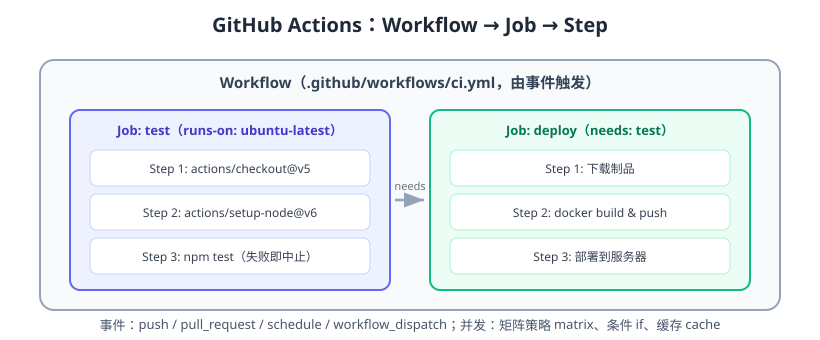

# GitHub Actions 入门

GitHub Actions 是 GitHub 内置的 CI/CD 平台：在仓库里放一个 YAML 文件，就能在 push、PR、定时、手动等事件发生时自动执行构建、测试和部署。它不需要额外搭建服务器，免费额度对开源项目友好，是当前上手 CI/CD 成本最低的入口。



## 核心概念

| 概念 | 说明 |
| --- | --- |
| Workflow | 一个自动化流程，定义在 `.github/workflows/*.yml` |
| Event | 触发事件：`push`、`pull_request`、`schedule`、`workflow_dispatch` 等 |
| Job | 工作流中的一项任务，默认并行，可用 `needs` 控制依赖 |
| Step | Job 内的一个步骤：命令或 Action，顺序执行 |
| Action | 可复用的步骤单元（官方或社区发布），如 `actions/checkout` |
| Runner | 执行环境：GitHub 托管的 ubuntu/windows/macos 或自托管 |
| Context | 运行时信息，如 `github.sha`、`secrets.TOKEN` |
| Artifact | 构建产物，可在 job 间传递、供下载 |

## 目录结构与最小示例

```text
.github/
└── workflows/
    └── ci.yml
```

```yaml [.github/workflows/ci.yml]
name: CI

on:
  push:
    branches: [main]
  pull_request:
    branches: [main]

jobs:
  test:
    runs-on: ubuntu-latest
    steps:
      - uses: actions/checkout@v5
      - uses: actions/setup-node@v6
        with:
          node-version: 22
          cache: npm
      - run: npm ci
      - run: npm test
      - run: npm run build
```

提交后到仓库的 **Actions** 标签页可以看到运行记录；绿勾表示通过。

## 常用事件

```yaml
on:
  push:                    # 分支推送
    branches: [main]
    paths: ["src/**"]      # 只影响部分路径时触发
  pull_request:            # PR 事件
    types: [opened, synchronize]
  schedule:                # 定时（cron，UTC 时区）
    - cron: "0 2 * * *"
  workflow_dispatch:       # 手动触发（带输入参数）
    inputs:
      env:
        description: 目标环境
        default: staging
  workflow_run:            # 其他工作流完成后触发
    workflows: ["CI"]
    types: [completed]
```

## Job 依赖与并行

```yaml
jobs:
  lint:
    runs-on: ubuntu-latest
    steps: [uses: actions/checkout@v5, run: npm run lint]

  test:
    runs-on: ubuntu-latest
    steps: [uses: actions/checkout@v5, run: npm test]

  deploy:
    runs-on: ubuntu-latest
    needs: [lint, test]        # 两个都成功才执行
    if: github.ref == 'refs/heads/main'
    steps:
      - run: echo "deploy"
```

`lint` 与 `test` 并行，`deploy` 等两者通过后执行。

## 矩阵构建（Matrix）

一套配置跑多个版本/平台：

```yaml
jobs:
  test:
    runs-on: ubuntu-latest
    strategy:
      matrix:
        node: [20, 22, 24]
        os: [ubuntu-latest, windows-latest]
    runs-on: ${{ matrix.os }}
    steps:
      - uses: actions/checkout@v5
      - uses: actions/setup-node@v6
        with:
          node-version: ${{ matrix.node }}
      - run: npm ci
      - run: npm test
```

## 缓存与加速

```yaml
steps:
  - uses: actions/setup-node@v6
    with:
      node-version: 22
      cache: npm          # 自动缓存 ~/.npm
  - run: npm ci
```

```yaml
- uses: actions/cache@v5
  with:
    path: ~/.m2/repository
    key: maven-${{ hashFiles('**/pom.xml') }}
    restore-keys: |
      maven-
```

## 制品传递（Artifact）

```yaml
jobs:
  build:
    runs-on: ubuntu-latest
    steps:
      - uses: actions/checkout@v5
      - run: npm ci && npm run build
      - uses: actions/upload-artifact@v7
        with:
          name: dist
          path: dist/

  deploy:
    needs: build
    runs-on: ubuntu-latest
    steps:
      - uses: actions/download-artifact@v8
        with:
          name: dist
          path: dist/
      - run: ls -la dist/
```

::: info 版本说明
GitHub 从 2026 年起要求 Actions 运行在 Node 24 运行时，旧版基于 Node 20 的 Action 将于 2026 年 9 月从托管 Runner 移除；常用大版本：checkout@v5、setup-node@v6、cache@v5、upload-artifact@v7、download-artifact@v8。
:::

## 密钥与安全

```yaml
steps:
  - name: Deploy
    env:
      SERVER_TOKEN: ${{ secrets.SERVER_TOKEN }}   # 来自仓库 Settings → Secrets
    run: ./deploy.sh
```

::: danger 安全红线
1. **禁止把密钥写进 YAML**：用 secrets 上下文引用（如 `secrets.SERVER_TOKEN`），密钥存于仓库 Settings。
2. **第三方 Action 固定版本**：用 tag/SHA 锁定，防止供应链投毒；`@v5` 至少锁大版本。
3. **pull_request_target 慎用**：它运行在基分支上下文，易被恶意 PR 利用；如用则限制触发文件。
4. **workflow 权限最小化**：`permissions: contents: read`，只在需要的 job 放大权限。
5. **Fork PR 不自动跑含密钥的步骤**：`pull_request` 的 secrets 不传给 fork 的 PR。
:::

## 自托管 Runner

```shell
# 在仓库 Settings → Actions → Runners 获取注册命令
./config.sh --url https://github.com/org/repo --token <token>
./run.sh
```

```yaml
jobs:
  test:
    runs-on: [self-hosted, linux, x64]   # 按标签匹配
    steps:
      - uses: actions/checkout@v5
```

自托管适合：内网部署、需要专用 GPU/大内存、避免云 Runner 成本。注意自托管 Runner 安全性（恶意代码会直接执行在你的机器上）。

## 易错点与最佳实践

::: danger 常见错误
1. **`npm ci` 写成 `npm install`**：`npm ci` 按 lock 文件精确安装，CI 中必须用它。
2. **换行符差异**：Windows runner 上 CRLF 导致 shell 脚本报错，脚本文件设 `core.autocrlf` 或换 `ubuntu-latest`。
3. **忘记 `needs`**：部署 job 没等测试 job，构建完直接部署未验证代码。
4. **cron 用本地时区**：schedule 使用 UTC，要按北京时间换算（`0 2 * * *` 是北京 10:00）。
5. **超时缺失**：`timeout-minutes` 不设置，挂起的 job 一直占资源。
6. **大文件提交**：仓库超过 1GB 或单文件超 100MB，clone 越来越慢；用 Git LFS 或制品仓库。
:::

::: tip 最佳实践
1. 每个 job 设置 `timeout-minutes`（如 30）。
2. 测试报告用 `actions/upload-artifact` 保留，失败可下载排查。
3. 发布步骤用 `concurrency` 防止并发重复部署：
```yaml
concurrency:
  group: deploy-${{ github.ref }}
  cancel-in-progress: true
```
4. 用 `dependabot` 自动升级第三方 Action，保持安全更新。
:::

## 验证方式

1. 提交一个最小 workflow，到 Actions 页面确认触发、步骤日志正常。
2. 故意让测试失败，确认 job 变红、PR 显示检查未通过。
3. 添加制品上传，构建完成后在 Actions 页面下载 dist 验证内容。
4. 配置 cron 定时任务，观察到点自动运行。

## 参考资料

- GitHub Actions 官方文档：https://docs.github.com/zh/actions
- Workflow 语法：https://docs.github.com/zh/actions/reference/workflow-syntax-for-github-actions
- Actions 市场：https://github.com/marketplace?type=actions
- Security hardening：https://docs.github.com/zh/actions/security-guides/security-hardening-for-github-actions
