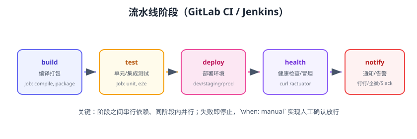

# GitLab CI/CD

GitLab CI/CD 是 GitLab 内置的流水线平台：在仓库根目录放一个 `.gitlab-ci.yml`，提交后由 **GitLab Runner** 执行流水线。它把「代码仓库、CI、CD、制品库、安全扫描」放在同一平台，适合企业内网与一体化 DevSecOps。截至 2026 年 8 月，GitLab 最新稳定为 **19.x**。



## 核心概念

| 概念 | 说明 |
| --- | --- |
| Pipeline | 一次提交触发的一整条流水线 |
| Stage | 流水线阶段，如 build / test / deploy，阶段间串行 |
| Job | 阶段内的任务，同阶段内并行 |
| Runner | 执行 Job 的机器（共享/分组/项目级） |
| `.gitlab-ci.yml` | 流水线定义文件，放在仓库根目录 |
| CI/CD Variables | 流水线变量，可存密钥 |
| Artifacts | Job 产物，可传递到后续 Job |
| Cache | 依赖缓存（如 Maven 仓库） |

## 最小示例

```yaml [.gitlab-ci.yml]
stages:
  - build
  - test
  - deploy

build-job:
  stage: build
  image: node:22
  script:
    - npm ci
    - npm run build
  artifacts:
    paths:
      - dist/
    expire_in: 7 days

test-job:
  stage: test
  image: node:22
  script:
    - npm test

deploy-job:
  stage: deploy
  image: alpine:3.20
  script:
    - echo "deploy to server"
  only:
    - main
```

提交后到 **CI/CD → Pipelines** 页面查看流水线执行情况。

## 常用关键字

| 关键字 | 作用 |
| --- | --- |
| `stages` | 定义阶段顺序 |
| `image` | Job 运行容器镜像 |
| `services` | 附加服务（如 MySQL、Redis） |
| `before_script` / `after_script` | 每个 Job 前后执行的公共脚本 |
| `only` / `rules` | 触发条件（`rules` 是推荐写法） |
| `when` | `on_success` / `on_failure` / `manual` / `always` |
| `artifacts` | 制品传递与保留 |
| `cache` | 依赖缓存 |
| `variables` | 流水线/Job 变量 |
| `needs` | 跳过 stage 强制依赖，实现 DAG 流水线 |
| `retry` | 失败自动重试次数 |
| `allow_failure` | 允许失败不阻断流水线 |

## 分支与合并请求规则

```yaml
rules:
  - if: '$CI_PIPELINE_SOURCE == "merge_request_event"'
    when: always
  - if: '$CI_COMMIT_BRANCH == "main"'
    when: always
  - when: never
```

MR 集成配置（Settings → Merge Requests）：

- Pipelines must succeed：流水线成功才允许合并。
- 开启 Auto-merge：满足条件自动合并。
- 用 `merge_request_event` 让每个 MR 都跑一次预合并流水线。

## 环境与部署（CD）

```yaml
deploy-staging:
  stage: deploy
  environment:
    name: staging
    url: https://staging.example.com
  script:
    - ./deploy.sh staging
  only:
    - main

deploy-prod:
  stage: deploy
  environment:
    name: production
    url: https://example.com
  script:
    - ./deploy.sh prod
  when: manual          # 人工确认才发布生产
  only:
    - tags              # 打 tag 时才可发布
```

`environment` 提供部署历史与回滚入口：在 **Deployments** 页面可查看每次部署并执行回滚。

## 安装 Runner

```shell
# Linux 安装并注册
curl -L "https://packages.gitlab.com/install/repositories/runner/gitlab-runner/script.deb.sh" | sudo bash
sudo apt-get install gitlab-runner

# 注册：从 GitLab 项目 Settings → CI/CD → Runners 获取 token
sudo gitlab-runner register \
  --url https://gitlab.example.com \
  --token <registration-token> \
  --executor docker \
  --docker-image alpine:3.20

sudo gitlab-runner start
```

Runner 类型：

| 类型 | 范围 | 适用 |
| --- | --- | --- |
| Shared Runner | 全实例 | 小型团队、开源 |
| Group Runner | 一组项目 | 团队级统一资源 |
| Project Runner | 单个项目 | 专属资源、内网环境 |

## 缓存与制品

```yaml
cache:
  key: "$CI_COMMIT_REF_SLUG"
  paths:
    - .npm/

job:
  before_script:
    - npm ci --cache .npm
  artifacts:
    paths: [dist/]
    expire_in: 7 days
```

::: tip 制品 vs 缓存
制品用于**跨 Job 传递构建产物**（必须的交付物）；缓存用于**加速依赖安装**（可随时丢弃）。不要把缓存当制品用。
:::

## 安全与密钥

```yaml
variables:
  REGISTRY: registry.example.com

deploy:
  script:
    - docker login $REGISTRY -u gitlab-ci-token -p $CI_JOB_TOKEN
    - docker push $REGISTRY/app:latest
```

密钥存 **Settings → CI/CD → Variables**（勾选 Masked / Protected），流水线里用 `$变量名` 引用，不进代码库。

## 易错点与最佳实践

::: danger 常见错误
1. **`only` 与 `rules` 混用**：两者同时存在行为复杂难排查，新项目统一用 `rules`。
2. **Runner 没注册 Docker executor**：Job 里用 `image:` 却注册的是 shell executor，镜像不生效。
3. **密钥写进 `.gitlab-ci.yml`**：明文泄露；用 CI/CD Variables。
4. **stage 太多串行**：全部塞进一个 stage 又会失去依赖控制；用 `needs` 做 DAG。
5. **制品过期时间无限**：`expire_in` 不设，制品仓库无限膨胀。
6. **Runner 版本过旧**：GitLab 升级后旧 Runner 不兼容，Job 一直 pending；保持 Runner 与 GitLab 同步升级。
:::

::: tip 最佳实践
1. 公共配置用 `include` 复用：
```yaml
include:
  - project: 'devops/ci-templates'
    file: '/templates/node.yml'
    ref: main
```
2. 为不同环境用 `rules` + `variables` 控制，环境变量通过 `$CI_ENVIRONMENT_NAME` 区分。
3. 失败通知：`after_script` 或集成钉钉/企微 webhook。
4. 生产部署默认 `when: manual` + 打 tag 触发，加双保险。
:::

## 验证方式

1. 提交 `.gitlab-ci.yml`，确认 Pipelines 页面出现流水线且三个阶段全部通过。
2. 故意写错一行脚本，确认对应 Job 红色、后续阶段不执行。
3. 配置 MR 规则后新建 MR，确认合并按钮被流水线状态阻断/放行。
4. 手动执行生产部署 Job，确认 Deployments 页面有记录且可回滚。

## 参考资料

- GitLab CI/CD 文档：https://docs.gitlab.com/ci/
- `.gitlab-ci.yml` 关键字参考：https://docs.gitlab.com/ci/yaml/
- GitLab Runner 文档：https://docs.gitlab.com/runner/
- GitLab 版本发布说明：https://about.gitlab.com/releases/
