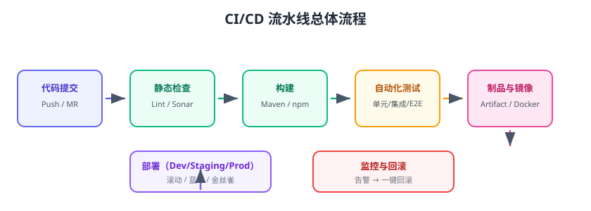

# CI/CD 概念与流水线设计

CI/CD 是 DevOps 的核心实践：**CI（Continuous Integration，持续集成）** 让开发者的每次提交都自动构建与测试，尽早发现问题；**CD（Continuous Delivery / Continuous Deployment，持续交付/持续部署）** 让通过验证的制品自动发布到环境，甚至直接上线。本页讲清概念边界、流水线阶段与设计原则。



## 三个概念的区别

| 概念 | 英文 | 做什么 | 典型动作 |
| --- | --- | --- | --- |
| 持续集成 | Continuous Integration | 频繁合并代码并自动构建测试 | 每次 Push 触发：编译 + 单测 |
| 持续交付 | Continuous Delivery | 随时可发布，发布动作人工触发 | 一键部署到生产 |
| 持续部署 | Continuous Deployment | 验证通过自动发布，无人干预 | 流水线自动上线 |

::: tip 一句话理解
CI 解决“代码合进来是不是好的”，CD 解决“好的代码怎么安全快速地到用户手里”。持续部署是持续交付的自动化升级版。
:::

## 为什么需要 CI/CD

| 痛点 | CI/CD 解决 |
| --- | --- |
| “在我机器上是好的” | 统一环境自动构建，杜绝环境差异 |
| 提交后过两周才发现冲突 | 高频集成，冲突当天暴露 |
| 手工测试遗漏回归 | 自动化测试 + 质量门禁 |
| 发布靠人肉操作，又慢又容易错 | 一键/自动部署，步骤可复现 |
| 上线出问题无法快速回退 | 制品版本化 + 一键回滚 |
| 团队发布频率低 | 小步快跑，随时可发布 |

## CI/CD 流水线的核心阶段

```text
代码提交 → 静态检查 → 构建 → 自动化测试 → 质量门禁 → 制品/镜像 → 部署 → 健康检查 → 通知
```

| 阶段 | 内容 | 失败处理 |
| --- | --- | --- |
| 触发 | push / MR / 定时 / 手动 | - |
| 静态检查 | 格式、Lint、代码规范 | 阻断合并 |
| 构建 | 编译打包（Maven/npm） | 阻断 |
| 测试 | 单元/集成/E2E | 阻断 |
| 质量门禁 | 覆盖率、Bug、漏洞扫描 | 未达标阻断 |
| 制品 | 上传 Artifact / 镜像仓库 | 阻断 |
| 部署 | dev → staging → prod | 自动回滚 |
| 健康检查 | 接口探活、冒烟测试 | 失败回滚 |
| 通知 | 成功/失败推送 | 辅助 |

## 流水线设计原则

### 1. 快反馈

- 主流水线控制在 10 分钟以内，超时先拆。
- 全量测试放夜间/发布流水线，提交流水线只跑受影响部分。

### 2. 环境一致

- 构建、测试、部署用同一份 Docker 镜像/运行时版本。
- 依赖锁定：`package-lock.json`、`pom.xml` 版本固定。

### 3. 制品不可变

- 每个构建产物带唯一版本号（commit SHA + 构建号），如 `app-20260829-1.0.0-abc1234`。
- **同一个制品在 dev 验证后原样部署到 prod**，不再重新构建。

### 4. 门禁前置

- 合并 MR 前必须通过检查（CI 状态作为 merge 条件）。
- 发布前必须通过 staging 冒烟测试。

### 5. 失败可视化

- 失败第一时间通知责任人（钉钉/企微/Slack）。
- 日志、制品、测试报告可下载可回溯。

## 工具选型

| 工具 | 托管方式 | 特点 | 适用 |
| --- | --- | --- | --- |
| GitHub Actions | 云托管（GitHub） | 与仓库一体、YAML 简单、生态大 | GitHub 仓库、开源项目 |
| GitLab CI/CD | 自托管/云 | 一体化 DevSecOps，流水线即代码 | 企业内网、GitLab 用户 |
| Jenkins | 自托管 | 插件最多、最灵活，可管一切 | 已有 Java 基础设施、复杂流程 |
| Drone / Gitea Actions | 自托管 | 轻量、容器化 | 轻量团队 |
| Argo CD | 云原生 | GitOps 部署到 K8s | Kubernetes 环境 |

::: info 版本说明（2026-08 核对）
GitHub Actions 关键 Action 已升级到 Node 24 运行时（checkout@v5、setup-node@v6、upload-artifact@v7 等）；Jenkins 最新 LTS 为 2.568.x；GitLab 最新稳定为 19.x；Argo CD 最新稳定为 3.5.x。
:::

## 一个最小流水线长什么样

以 GitHub Actions 为例：

```yaml [.github/workflows/ci.yml]
name: CI
on: [push, pull_request]
jobs:
  build:
    runs-on: ubuntu-latest
    steps:
      - uses: actions/checkout@v5
      - uses: actions/setup-node@v6
        with:
          node-version: 22
          cache: npm
      - run: npm ci
      - run: npm test
```

提交后 Actions 自动运行；测试失败则 PR 被标记为未通过。

## 易错点与最佳实践

::: danger 常见错误
1. **流水线当“一次性脚本”**：只写步骤不写门禁，失败也不阻断，等于没做 CI。
2. **制品不一致**：dev 和 prod 各自构建，验证过的代码上线时变成另一份。
3. **测试环境变量写死**：测试连生产库，CI 一跑就污染数据。
4. **构建不缓存**：每次都全量下载依赖，流水线越来越慢，开发者被迫绕过它。
5. **密钥写在流水线文件里**：Token、密码进 Git 仓库，等于公开。
6. **只做 CI 不做 CD**：自动化到测试为止，发布还是人肉，价值打折扣。
:::

::: tip 落地建议
1. 先用 GitHub Actions/GitLab CI 把「提交 → 构建 → 测试 → 上传制品」跑通，再加部署。
2. 部署先做 dev/staging 自动化，稳定后再放开 prod。
3. 流水线文件进代码库评审，配置变更也要走 MR。
4. 每季度做一次“断网演练”：模拟 CI 挂了、制品仓库挂了，确认手工兜底方案。
:::

## 验证方式

1. 建一个最小仓库 + 一个 CI 工作流，提交后确认自动运行并成功。
2. 故意写一个失败用例，确认 CI 变红且 PR 被阻断。
3. 修改流水线加一条“上传制品”步骤，确认可以在制品页面下载产物。

## 参考资料

- GitHub Actions 文档：https://docs.github.com/zh/actions
- GitLab CI/CD 文档：https://docs.gitlab.com/ci/
- Jenkins 文档：https://www.jenkins.io/doc/
- 持续交付（Martin Fowler）：https://martinfowler.com/bliki/ContinuousDelivery.html
- 《持续交付：发布可靠软件的系统方法》（Jez Humble，书籍）
