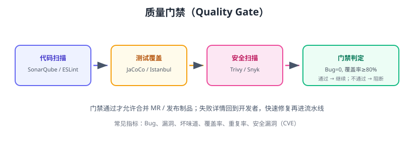

# 自动化测试与质量门禁

CI 的价值核心是**自动化测试**：没有自动化测试的流水线只是“自动编译机”。本页讲清楚测试金字塔、如何在流水线里组织单元/集成/E2E 测试、覆盖率统计，以及用 SonarQube 等工具建立**质量门禁（Quality Gate）**——不达标就不允许合并与发布。



## 测试金字塔

```text
        /\   E2E（少而慢，端到端主流程）
       /  \
      /----\  集成测试（中等数量，服务/数据库协作）
     /------\
    /--------\  单元测试（多而快，纯逻辑）
```

| 层级 | 数量 | 速度 | 稳定性 | 成本 |
| --- | --- | --- | --- | --- |
| 单元测试 | 多 | 毫秒级 | 高 | 低 |
| 集成测试 | 中 | 秒级 | 中 | 中 |
| E2E 测试 | 少 | 分钟级 | 低 | 高 |

策略：**70% 单元 + 20% 集成 + 10% E2E**，金字塔越往上越少越慢。

## 流水线中如何安排测试

| 流水线 | 跑什么 | 为什么 |
| --- | --- | --- |
| PR 校验 | 单元测试 + 受影响模块测试 | 快反馈 |
| 主干 | 单元 + 集成 + 覆盖率 | 全量验证 |
| 发布前 | E2E + 冒烟 | 上线前最后把关 |
| 夜间 | 全量回归 + 性能测试 | 深层次验证 |

## 单元测试示例

### Java（JUnit 5）

```java
import static org.junit.jupiter.api.Assertions.*;
import org.junit.jupiter.api.Test;

class PriceCalculatorTest {
    @Test
    void discount_applies_when_amount_over_100() {
        PriceCalculator calc = new PriceCalculator();
        assertEquals(90.0, calc.finalPrice(100.0), 0.001);
    }

    @Test
    void no_discount_below_threshold() {
        PriceCalculator calc = new PriceCalculator();
        assertEquals(50.0, calc.finalPrice(50.0), 0.001);
    }
}
```

```shell
mvn test
```

### JavaScript（Vitest）

```js
import { describe, it, expect } from "vitest";
import { finalPrice } from "./price";

describe("finalPrice", () => {
  it("满 100 打 9 折", () => {
    expect(finalPrice(100)).toBe(90);
  });
  it("未满 100 不打折", () => {
    expect(finalPrice(50)).toBe(50);
  });
});
```

```shell
npm test
```

## 覆盖率统计

| 工具 | 场景 | 产出 |
| --- | --- | --- |
| JaCoCo | Java | HTML/XML 报告，行/分支覆盖率 |
| Istanbul / Vitest coverage | JS/TS | lcov 报告 |
| pytest-cov | Python | XML/HTML 报告 |
| Go cover | Go | profile 文件 |

### JaCoCo + Maven

```xml
<plugin>
    <groupId>org.jacoco</groupId>
    <artifactId>jacoco-maven-plugin</artifactId>
    <version>0.8.13</version>
    <executions>
        <execution>
            <goals><goal>prepare-agent</goal></goals>
        </execution>
        <execution>
            <id>report</id>
            <phase>verify</phase>
            <goals><goal>report</goal></goals>
        </execution>
    </executions>
</plugin>
```

```shell
mvn verify
```

报告在 `target/site/jacoco/index.html`。

## E2E 测试

### Playwright

```js [playwright.config.js]
export default {
  testDir: "./e2e",
  use: { baseURL: process.env.E2E_BASE_URL || "http://localhost:3000" },
  reporter: [["html", { open: "never" }]],
};
```

```shell
npm run test:e2e
```

CI 中先起应用再跑 E2E：

```yaml
jobs:
  e2e:
    runs-on: ubuntu-latest
    steps:
      - uses: actions/checkout@v5
      - run: npm ci
      - run: npm run build
      - run: npx playwright install --with-deps
      - run: npm run start & npx playwright test
```

## SonarQube 质量门禁

SonarQube 是静态代码质量平台：扫描 Bug、漏洞、坏味道、重复代码、覆盖率。截至 2026 年 8 月，SonarQube Server 当前版本为 **2026.x（2026.1 LTA）**。

### 启动 SonarQube

```shell
docker run -d --name sonarqube -p 9000:9000 sonarqube:lts-community
```

### 流水线集成（GitHub Actions）

```yaml
steps:
  - uses: actions/checkout@v5
  - name: SonarQube Scan
    uses: sonarsource/sonarqube-scan-action@v5
    env:
      SONAR_TOKEN: ${{ secrets.SONAR_TOKEN }}
      SONAR_HOST_URL: ${{ secrets.SONAR_HOST_URL }}
```

### 常见门禁指标

| 指标 | 建议阈值 |
| --- | --- |
| 新增代码覆盖率 | ≥ 80% |
| 新增 Bug | 0 |
| 新增漏洞 | 0 |
| 新增安全热点 | 0 未处理 |
| 坏味道/重复率 | 按团队约定 |

门禁失败 → 流水线阻断 → 开发者修复再跑。

## 安全扫描

| 工具 | 用途 |
| --- | --- |
| Trivy | 镜像/依赖漏洞扫描 |
| Snyk / Dependabot | 依赖漏洞（CVE）自动检测 |
| Gitleaks / trufflehog | 扫描密钥泄露 |
| OWASP ZAP | Web 安全测试 |

```yaml
- name: Trivy 镜像扫描
  uses: aquasecurity/trivy-action@master
  with:
    image-ref: registry.example.com/app:1.2.0
    severity: CRITICAL,HIGH
    exit-code: 1        # 发现高危漏洞即失败
```

## 易错点与最佳实践

::: danger 常见错误
1. **测试依赖网络/外部服务**：单元测试里真连数据库、调第三方，慢且不稳定；用 Mock/Testcontainers。
2. **断言形同虚设**：测试只执行不断言，红了也不知道错在哪；每个用例必须有明确断言。
3. **覆盖率数字游戏**：只追覆盖率数字，不测关键路径；用变异测试/代码评审补盲区。
4. **E2E 与 CI 争抢环境**：E2E 并发跑同一环境互相干扰；用隔离环境或队列。
5. **质量门禁形同虚设**：门禁失败仍然手动合并；要让 CI 状态成为合并的硬性条件。
6. **测试报告不归档**：失败后找不到报告，排查全靠猜；报告上传制品。
:::

::: tip 最佳实践
1. 单元测试做到“快、隔离、确定性”，不碰文件系统/网络/时间。
2. 集成测试用 Testcontainers 起真实 MySQL/Redis，保证接近生产。
3. 覆盖率以**新增代码**为准（SonarQube 的 New Coverage），而不是全量。
4. 测试结果可视化：JUnit 报告 → CI 页面；Sonar 质量门禁 → PR 状态。
5. 随机失败（Flaky Test）当天修：先隔离重试，定位根因，不“跳过”了事。
:::

## 验证方式

1. 本地跑 `mvn test` / `npm test`，确认全部通过且生成报告。
2. 接入 SonarQube 扫描，故意写一个未覆盖分支，确认质量门禁失败并阻断流水线。
3. 用 Trivy 扫描镜像，制造一个已知 CVE 依赖，确认流水线标红。
4. 检查 CI 页面能下载测试报告与覆盖率报告。

## 参考资料

- 测试金字塔（Martin Fowler）：https://martinfowler.com/bliki/TestPyramid.html
- SonarQube 文档：https://docs.sonarsource.com/sonarqube/
- JaCoCo 文档：https://www.jacoco.org/jacoco/trunk/doc/
- Playwright 文档：https://playwright.dev/docs/ci
- Trivy 文档：https://aquasecurity.github.io/trivy/
