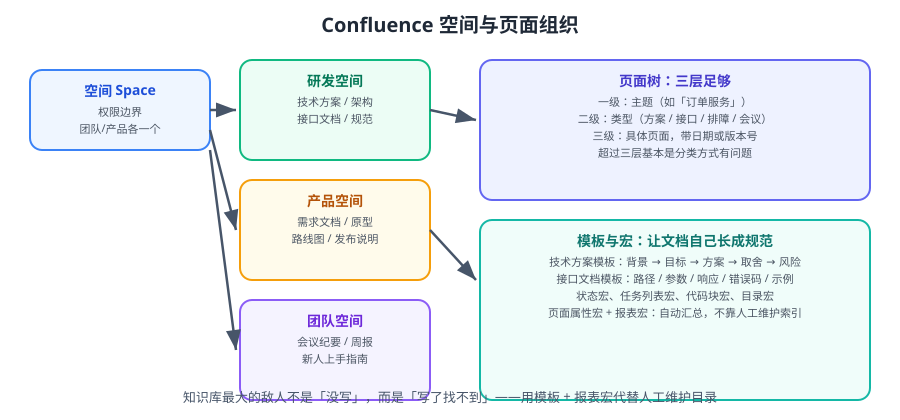

# Confluence 知识库

知识库的价值不在「写了多少」，而在「**能否在 30 秒内找到唯一权威版本**」。Confluence 用「空间 + 页面树 + 模板 + 宏」把这件事工程化。本篇讲怎么把它建成团队真的会用的知识库。



::: tip 一句话理解
知识库最大的敌人不是「没写」，而是「**写了找不到**」和「**三处各有一版**」。结构性治理（空间/模板/状态）比写作能力重要得多。
:::

## 一、空间（Space）怎么划

| 空间类型 | 用途 | 典型数量 |
| --- | --- | --- |
| **团队空间** | 会议纪要、周报、团队规范 | 每个团队 1 个 |
| **产品/领域空间** | 需求、路线图、发布说明 | 每个产品线 1 个 |
| **研发空间** | 技术方案、架构、接口、排障手册 | 1 个（跨团队共享） |
| **个人空间** | 草稿、临时笔记 | 每人 1 个，**内容成熟后必须迁出** |

::: danger 三个空间划分反模式
1. **一个空间装所有东西**：几百个页面无结构，搜索结果毫无区分度。
2. **每个小团队一个空间**：信息碎片化，跨团队找不到东西。
3. **个人空间当知识库用**：人一走内容就失联。个人空间只放草稿。
:::

::: tip 空间的判断标准
「这个内容，会不会有**跨团队**的人需要查？」
- 会 → 放共享的研发空间 / 领域空间。
- 不会，只是本团队内部 → 团队空间。
- 只是草稿 → 个人空间，**并设置意识「草稿需在两周内迁出」**。
:::

## 二、页面树：三层就够

```text
研发空间
├── 服务：订单（order-service）
│   ├── 方案：订单导出设计（2026-09）
│   ├── 接口：订单导出 API v1
│   ├── 排障：导出超时排查手册
│   └── 会议：订单域周会纪要（2026 年）
├── 服务：支付（payment-service）
├── 规范：代码规范 / 分支策略 / 发布流程
└── 归档：2025 年及以前
```

| 层级 | 内容 | 示例 |
| --- | --- | --- |
| 一级 | 主题（服务名 / 规范 / 归档） | `服务：订单` |
| 二级 | 类型（方案 / 接口 / 排障 / 会议） | `方案` |
| 三级 | 具体页面（带时间或版本） | `订单导出设计（2026-09）` |

::: warning 超过三层说明分类方式有问题
如果出现「服务 → 模块 → 子模块 → 方案 → 具体方案」，说明你在用目录模拟「标签」。
正确做法：**用标签（Label）表达横向维度**（如 `order`、`export`、`v2`），用页面树表达纵向归属，然后用**页面属性宏 + 报表宏**自动生成索引。
:::

## 三、模板：让文档自己长成规范

| 模板 | 结构 | 关键点 |
| --- | --- | --- |
| **技术方案** | 背景 → 目标与非目标 → 方案 → 取舍对比 → 影响面 → 风险与回滚 → 排期 | 「非目标」和「取舍」最容易被省，也最重要 |
| **接口文档** | 路径 / 方法 → 鉴权 → 请求参数 → 响应 → 错误码 → 示例 → 变更记录 | 错误码必须穷举 |
| **排障手册** | 现象 → 快速判定 → 排查步骤 → 常见根因 → 处置 → 升级路径 | 面向「凌晨三点被叫起来的人」写 |
| **会议纪要** | 议题 → 结论 → 待办（谁、何时） → 相关链接 | 没有「待办」的纪要等于没开 |
| **复盘** | 时间线 → 影响 → 根因 → 改进项（人/时间） | 改进项必须可验证 |
| **新人上手** | 环境 → 代码结构 → 常用命令 → 干系人 → 第一周任务 | 以「照着做能跑起来」为标准 |

```text
# 技术方案模板正文骨架（可直接粘贴到页面）

## 背景
（为什么要做，当前有什么问题，用数据说明）

## 目标与非目标
- 目标：（可验证的结果）
- 非目标：（明确不做的事，防止范围蔓延）

## 方案
（总体思路 + 架构图/时序图）

## 取舍对比
| 方案 | 优点 | 代价 | 结论 |
| --- | --- | --- | --- |

## 影响面
- 接口变更：兼容 / 不兼容
- 数据变更：是否需要迁移
- 上下游影响：

## 风险与回滚
| 风险 | 概率 | 影响 | 应对 | 回滚方式 |
| --- | --- | --- | --- | --- |

## 排期
（里程碑与依赖）
```

::: tip 模板要「短」
超过两页的模板没人会认真填。**原则**：模板只保留「不写就会出事」的小节，其余按需加。
:::

## 四、常用宏

| 宏 | 用途 | 典型场景 |
| --- | --- | --- |
| **状态宏（Status）** | 标记状态：草稿 / 评审中 / 已确认 / 过期 | 放在页首，一眼看出可信度 |
| **信息面板（Info / Note / Warning）** | 强调背景或风险 | 标注「适用版本」「不兼容变更」 |
| **任务列表（Task List）** | 可勾选项 + 可汇总 | 方案里的待办，用「任务报表」宏汇总全空间未完成项 |
| **目录（Table of Contents）** | 自动生成页内目录 | 长文档必备 |
| **页面属性（Page Properties）** | 给页面打结构化字段 | Owner、状态、适用版本、最后复核日期 |
| **页面属性报表** | 汇总所有页面属性 | **自动生成索引**，替代人工维护列表 |
| **代码块（Code Block）** | 带语言高亮的代码 | 配置、SQL、接口示例 |
| **展开（Expand）** | 折叠长内容 | 长配置、附录 |
| **包含页面（Include Page）** | 复用其他页面片段 | 统一的下发规范、环境说明 |
| **Jira 事项（Jira Issue）** | 内嵌事项状态与进度 | 方案页挂上关联需求 |

### 4.1 用「页面属性报表」自动生成索引

```text
步骤：
1. 给「方案」类的每个页面加一段「页面属性」宏，字段设为：
   - 状态（选项：草稿 / 评审中 / 已确认 / 过期）
   - Owner（用户）
   - 适用版本（文本）
   - 最后复核（日期）
2. 在父页面加一个「页面属性报表」宏，限定范围为当前页面的子页面。
3. 设置显示列：标题、状态、Owner、适用版本、最后复核。
```

::: danger 人工维护的目录 100% 会过期
「这里列一下我们所有的技术方案」——这种手写列表在文档超过 20 篇后必然失真。
**改用页面属性 + 报表宏**：新增页面自动出现，过期页面自动暴露（按「最后复核」排序一眼可见）。
:::

## 五、权限模型

| 层级 | 权限项 | 建议 |
| --- | --- | --- |
| 空间权限 | 查看 / 编辑 / 管理 | 研发空间对全员可查看，编辑开放给研发 |
| 页面权限 | 限制查看/编辑 | 只用于敏感内容（安全、薪酬、M&A） |
| 只读空间 | 归档空间 | 归档后改为只读，避免误改 |

::: danger 页面权限滥用的代价
页面级权限一旦大量使用，会导致：
1. 搜索**静默漏结果**——用户不知道有内容存在。
2. 后续维护者看不到内容，无法判断是否过期。
**做法**：能用空间/标签解决的，就不要用页面权限。敏感内容单独建空间。
:::

## 六、与 Jira 联动

| 联动 | 做法 | 收益 |
| --- | --- | --- |
| 方案页挂需求 | 页面内嵌 Jira 事项宏 | 从方案直接看进度 |
| 事项挂方案 | Jira 事项的「文档」字段填页面链接 | 从需求直接看方案 |
| 发布说明自动生成 | 用版本 + 事项查询拼装 | 不用人工整理发版内容 |
| 需求模板与方案模板互相引用 | 模板里写清「方案必须回填到事项」 | 闭环 |

```text
# 推荐的闭环链路
Jira 事项（有验收标准）
    ↕ 双向链接
Confluence 方案页（状态：已确认）
    ↕ 双向链接
合并请求（标题含事项键）
    ↕
发布版本（发布说明引用方案页）
```

## 七、版本管理与内容治理

| 功能 | 用法 |
| --- | --- |
| 页面历史 | 查看每次修改的差异与作者 |
| 版本对比 | 判断「结论什么时候变的」 |
| 恢复旧版本 | 误改后一键回退 |
| 限制编辑 | 定稿后可设「仅编辑者限制」，防止他人改动 |
| 归档 | 过期内容移入归档空间并改只读 |

### 内容治理的四个动作

```text
① 打标签：给每页加 2~4 个标签（服务名 + 类型 + 版本）
② 标状态：草稿 / 评审中 / 已确认 / 过期
③ 定 Owner：每页必须有一个人对内容负责
④ 定期复核：每季度用「页面属性报表」按「最后复核日期」排序，处理过期页面
```

::: tip 一个可执行的小制度
**「每季度第一个周五，清一遍知识库」**：
1. 打开页面属性报表，按最后复核日期升序。
2. 每个 Owner 处理自己名下超过 6 个月未复核的页面：更新 / 标过期 / 归档，三选一。
3. 把本轮处理数量与归档数量记进季度复盘。
:::

## 八、Data Center 版本注意事项

::: info 版本事实（2026-09 核对）
- **Confluence Data Center 当前 LTS 为 10.2.x**。
- **Confluence 11 在开发中**，与 Jira 12 同步的三项平台变更：**React 18 → 19**、**Jackson 2 → 3**、设计令牌升级（图标/边框/强调色会有轻微视觉变化）。
- 10.2 引入的实用能力：**OpenSearch 支持**（更好的索引性能）、**Confluence Data Center connector for Rovo**（把 DC 数据同步到 Cloud 侧 AI 能力，无需整体迁移）。
- **Marketplace V1/V2 API 已弃用**，`marketplace-client-java` 库在 DC 产品中不再对第三方插件开放，插件需迁移到 Marketplace REST v4。
:::

::: warning 自托管团队的现实问题
Atlassian 已公布 Data Center 生命周期调整，官方在推动迁移至 Cloud。自托管团队应尽早评估：
1. 是否有必须自托管的合规约束？
2. 迁移到 Cloud 的成本（席位、数据、集成改造）？
3. 若不迁移，替代方案是什么（飞书知识库 / 自建 Wiki）？

**关键**：无论选哪条路，**内容本身（Markdown / 结构化文档）的迁移成本最低**——这也是「文档尽量用标准 Markdown、不要过度依赖私有宏」的现实理由。
:::

## 九、实战：建设「研发空间」

### 第一步：定结构（一次性）

```text
研发空间
├── 00-索引（用页面属性报表自动生成）
├── 规范
│   ├── 代码规范
│   ├── 分支与提交规范
│   └── 发布流程
├── 服务
│   ├── 订单服务
│   │   ├── 方案
│   │   ├── 接口
│   │   └── 排障
│   └── 支付服务
└── 归档
```

### 第二步：建四个模板

在「空间设置 → 模板」中创建：技术方案、接口文档、排障手册、会议纪要。

### 第三步：给模板加「页面属性」宏

```text
在技术方案模板的页首插入「页面属性」宏，字段：
  状态    → 选项：草稿 / 评审中 / 已确认 / 过期（默认草稿）
  Owner   → 用户（默认当前用户）
  适用版本 → 文本
  最后复核 → 日期（默认今天）
```

### 第四步：建索引页

在 `00-索引` 页面插入「页面属性报表」宏：
- 范围：当前空间（或指定父页面）
- 显示列：标题、状态、Owner、适用版本、最后复核
- 排序：按「最后复核」升序（最早的排前面）

### 第五步：定三条规则并写进规范页

```text
① 新页面必须从模板创建（不得空白页开始）
② 每页必须有 Owner 与状态；过期内容必须标「过期」或移入归档
③ 每季度第一个周五统一复核一次
```

### 验证方式

```text
1. 从「技术方案」模板创建一页
   预期：页面自动带上「状态=草稿、Owner=我、最后复核=今天」的页面属性

2. 打开 00-索引
   预期：新页面自动出现在报表中，无需人工添加

3. 搜索任意服务名（如「订单 导出」）
   预期：能搜到对应方案与接口页，且结果页数在可接受范围（不是几十条噪音）

4. 修改页面标题后回到索引刷新
   预期：报表中的标题同步更新

5. 把某页状态改为「过期」并在归档创建副本
   预期：索引中状态列显示「过期」，可按状态筛选出来
```

## 十、易错点汇总

::: danger 逐条对照
1. **一个空间装所有内容**：搜索失去区分度。按「团队 / 领域 / 研发 / 个人」划分。
2. **页面树超过三层**：说明在用目录模拟标签。改用 Label + 页面属性报表。
3. **人工维护目录页**：必然过期。改用页面属性 + 报表宏。
4. **没有 Owner 与状态**：无法判断内容可信度与时效。写进模板默认值。
5. **滥用页面权限**：搜索静默漏结果。能用空间/标签解决就不设页面权限。
6. **把长文档塞进 Jira 描述字段**：无法检索与版本管理。方案放知识库。
7. **过度依赖私有宏**：迁移成本极高。核心内容尽量用标准 Markdown / 表格。
8. **会议纪要不写待办**：等于没开会。模板里强制「待办（谁/何时）」小节。
9. **从不归档**：知识库越来越臃肿，检索质量下降。每季度归档一次。
10. **升级前不评估插件**：Confluence 11 的 React 19 / Jackson 3 会打断不兼容插件。
:::

## 参考资料

- Confluence 文档：https://support.atlassian.com/confluence/
- Confluence 宏参考：https://confluence.atlassian.com/doc/macros-139545.html
- Atlassian Data Center 路线图：https://www.atlassian.com/roadmap/data-center
- Atlassian 开发者变更日志：https://developer.atlassian.com/server/jira/platform/changelog/
- 本专题其余章节：[协作与项目管理导览](../index.md)、[Jira 实战](../Jira/index.md)、[文档协作规范](../DocCollaboration/index.md)
