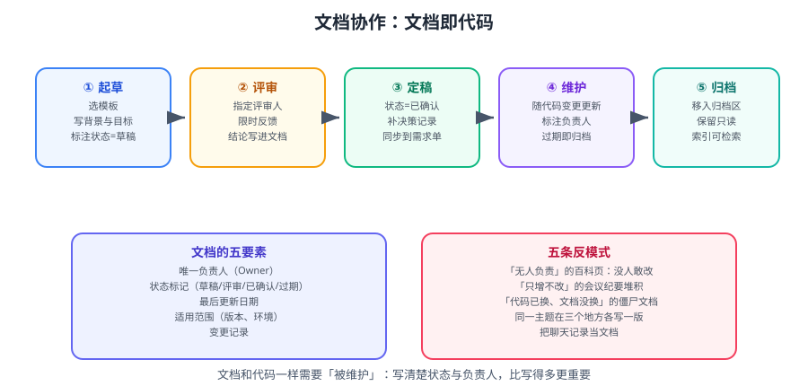

# 文档协作规范

文档和代码一样，会**腐烂**：代码变了文档没变、负责人离职了没人接手、同一主题三处各有一版。本篇给出一套可执行的规范，让文档「被维护」而不是「被写完」。



::: tip 一句话理解
文档最需要的不是「写得更好」，而是**状态标记 + 唯一负责人 + 定期复核**。没有这三样的文档，写得再好也会变成误导。
:::

## 一、文档即代码（Docs as Code）

| 原则 | 说明 | 落地 |
| --- | --- | --- |
| **版本化** | 文档与代码同仓库或同版本体系 | 接口文档随代码提交一起更新 |
| **可评审** | 变更通过合并请求评审 | 仓库内 Markdown 走 PR |
| **可检索** | 纯文本、结构清晰 | 避免图片里塞文字 |
| **自动化** | 构建、链接检查、格式检查 | CI 里跑链接巡检与 lint |
| **有归属** | 每份文档有 Owner | 文件头/页面属性标注 |

```text
# 仓库内文档的典型结构（技术文档与代码同仓库时）
repo/
├── docs/
│   ├── adr/                    架构决策记录（ADR）
│   ├── api/                    OpenAPI 规范
│   ├── runbook/                排障手册
│   └── design/                 设计文档
├── README.md                   项目入口
└── CONTRIBUTING.md             贡献指南
```

::: tip 什么时候放仓库、什么时候放知识库
| 内容 | 位置 | 理由 |
| --- | --- | --- |
| 与代码强耦合（API、配置、部署） | **仓库** | 跟着代码走，改代码时一起改 |
| 决策记录（ADR）、演进历史 | **仓库** | 需要与提交历史对照 |
| 跨团队共享（规范、流程、架构总览） | **知识库** | 需要非技术角色参与与检索 |
| 会议纪要、周报 | **知识库 / 云文档** | 时效性强，不需代码评审 |
:::

## 二、文档五要素

| 要素 | 作用 | 写法 |
| --- | --- | --- |
| **唯一负责人（Owner）** | 有人对内容负责 | 页面属性 / 文件头注释 |
| **状态** | 读者判断可信度 | 草稿 / 评审中 / 已确认 / 过期 |
| **最后更新日期** | 判断时效 | 自动或手工标注 |
| **适用范围** | 避免误用 | 版本号、环境、生效日期 |
| **变更记录** | 追溯结论变化 | 关键文档附变更小节 |

```markdown
<!-- docs/design/order-export.md 文件头示例 -->
> **状态**：已确认（2026-09-05）
> **适用版本**：order-service ≥ 1.4.0
> **Owner**：@zhangsan
> **最后复核**：2026-09-05
```

::: danger 「已确认」和「草稿」必须可见
读者最怕的是把草稿当成权威结论执行。
**做法**：把状态放到页面/文件的**最顶部**，并且在索引页自动列出所有非「已确认」状态的文档。
:::

## 三、六类文档模板

### 3.1 需求文档

```markdown
## 背景
（当前问题、影响多少人、用什么数据说明）

## 目标与非目标
- 目标：（可验证）
- 非目标：（明确不做，防范围蔓延）

## 用户故事与验收标准
| 场景 | 操作 | 预期结果 |
| --- | --- | --- |

## 依赖与风险
```

### 3.2 技术方案

```markdown
## 背景与目标
## 方案设计（含架构图/时序图）
## 取舍对比
| 方案 | 优点 | 代价 | 结论 |
## 影响面（接口/数据/上下游）
## 风险与回滚
## 排期
```

### 3.3 接口文档

```markdown
## 概述（用途、鉴权方式、基地址）
## 请求
- 路径与方法
- 请求头
- 参数表（名称/类型/必填/说明/示例）
## 响应
- 成功响应（含完整示例）
- 错误码表（必须穷举）
## 变更记录
| 版本 | 日期 | 变更 | 兼容性 |
```

### 3.4 排障手册（Runbook）

```markdown
## 现象
（用户/监控能看到什么）

## 快速判定（3 条命令内判断方向）
（在此放 shell 代码块，命令可直接复制）

## 排查步骤
## 常见根因与处置
## 升级路径（什么时候找人、找谁）
```

::: tip Runbook 的写作标准
**面向「凌晨三点被叫醒、脑子不清醒的人」写。**
- 每条命令可直接复制。
- 每步都有「看到什么说明什么」。
- 明确写「到这里还不行就找人，找谁、怎么找」。
:::

### 3.5 会议纪要

```markdown
## 议题
## 结论（逐条，可执行）
## 待办
| 事项 | 负责人 | 截止 |
## 相关链接（事项、文档、方案）
```

### 3.6 复盘

```markdown
## 时间线（精确到分钟）
## 影响（时长、范围、数据）
## 根因
## 改进项
| 改进 | 负责人 | 截止 | 验证方式 |
```

## 四、命名与目录组织

| 类型 | 命名建议 | 示例 |
| --- | --- | --- |
| 方案页 | `方案：<主题>（<年月>）` | `方案：订单导出（2026-09）` |
| 接口页 | `接口：<资源> <动作> v<主版本>` | `接口：订单导出 v1` |
| 排障页 | `排障：<现象>` | `排障：导出任务超时` |
| 纪要 | `会议：<主题>（<日期>）` | `会议：订单域周会（2026-09-08）` |
| 复盘 | `复盘：<事件>（<日期>）` | `复盘：导出服务故障（2026-09-13）` |

::: warning 用「日期后置」而不是前置
`2026-09-08 订单域周会` 在按名称排序时会把同类文档打散到不同年份段。
`会议：订单域周会（2026-09-08）` 让同类文档邻接排列，便于归档。
:::

目录组织三条规则：

```text
① 纵向归属用目录（服务 → 类型 → 具体页面），不超过三层
② 横向维度用标签/属性（服务名、版本、环境），配合报表自动生成索引
③ 归档单独目录，且设为只读；不删除历史内容
```

## 五、评审机制

| 文档类型 | 评审人 | 时限 | 通过标准 |
| --- | --- | --- | --- |
| 需求 | 产品 + 研发 + 测试 | 1 个工作日 | 验收标准可验证 |
| 技术方案 | 技术负责人 + 相关方 | 2 个工作日 | 取舍与回滚写清 |
| 接口文档 | 调用方 + 实现方 | 1 个工作日 | 错误码穷举、示例完整 |
| 排障手册 | 值班人试跑一次 | 1 个工作日 | 照着跑能定位 |
| 复盘 | 技术负责人 | 3 个工作日 | 改进项可验证 |

```markdown
<!-- 评审检查清单（放进合并请求或页面评论模板） -->
- [ ] 有明确的 Owner 与状态
- [ ] 结论能推出动作（不是只有现象描述）
- [ ] 版本/适用范围已标注
- [ ] 涉及接口或配置的部分有完整示例
- [ ] 与既有文档无重复（或已合并）
- [ ] 相关链接可达（无死链）
```

::: danger 评审 SLA 必须有「超时怎么办」
只写「请及时评审」等于没写。要写清：
- 超过 2 个工作日未评审 → 自动在群里 @ 评审人（用自动化规则）。
- 超过 4 个工作日 → 升级到技术负责人。
**没有兜底的 SLA，就是一句空话。**
:::

## 六、归档与淘汰

| 情况 | 处置 |
| --- | --- |
| 内容过期但仍有参考价值 | 标记「过期（仅历史参考）」+ 移入归档目录 |
| 与另一篇重复 | 合并到主文档，旧页面保留并加「已合并至 …」跳转说明 |
| 技术已下线 | 移入归档，标注「技术已下线」与替代方案 |
| 无人维护的临时记录 | 直接归档，不删除 |
| 误写/错误内容 | 修正并保留变更记录，不要直接删（否则读者不知道结论变过） |

::: warning 删文档前必须做的两件事
1. **全库搜索引用**：侧边栏、目录页、其他文档、外部链接（如果是公开站点，还有搜索引擎与别人收藏的 URL）。
2. **保留旧 URL 可达**：改路径/改标题时，保留跳转页或重定向，避免 404。
:::

## 七、检索优化

| 手段 | 做法 |
| --- | --- |
| 标题写全 | 标题里包含**对象 + 动作 + 场景**，如「订单导出接口超时的排查」 |
| 加标签/属性 | 服务名、类型、版本、环境 |
| 首段写摘要 | 前 2 句讲清「这是什么、解决什么问题」 |
| 用标准术语 | 统一「订单/order」、「缺陷/bug」，建立术语表 |
| 避免图片承载文字 | 图片内容搜不到 |
| 主动维护索引页 | 用报表宏自动生成，而不是手写列表 |

## 八、反模式清单

| 反模式 | 后果 | 正解 |
| --- | --- | --- |
| 无人负责的百科页 | 没人敢改，越用越不准 | 指定 Owner + 季度复核 |
| 只增不改的纪要堆积 | 索引爆炸，检索噪音大 | 按季度归档 |
| 僵尸文档（代码已换） | 误导执行 | 接口/配置变更纳入 DoD |
| 同一主题三处各一版 | 无法判断哪份权威 | 定唯一来源 + 合并 |
| 聊天记录当文档 | 无法检索、无法追溯 | 结论回写文档 |
| 用图片承载表格 | 不可搜索、不可复制 | 用 Markdown 表格 |
| 长文档塞进事项描述 | 无法检索与版本管理 | 放知识库，事项里放链接 |

## 九、实战：给团队落一套文档规范

### 第一步：一页纸规范（写进知识库首页）

```markdown
# 文档规范（v1，Owner：@zhangsan，2026-09 生效）

## 唯一来源
- 事项：Jira（项目 ORD）
- 技术方案 / 接口 / 排障：知识库「研发空间」
- 与代码强耦合的文档（ADR、API 规范）：代码仓库 docs/

## 五要素
每份文档必须标注：Owner、状态、适用范围、最后更新、变更记录

## 状态定义
- 草稿：可自由修改，不得作为执行依据
- 评审中：已提交评审，等待结论
- 已确认：可作为执行依据
- 过期：仅历史参考

## 流程
起草（选模板） → 评审（≤2 个工作日，超时自动提醒） →
定稿（标「已确认」） → 维护（代码变更时同步） → 归档（季度复核）

## 三条硬规则
1. 新文档必须从模板创建，不得空白页开始
2. 每季度第一个周五复核一次，超 6 个月未复核需处理
3. 删改路径必须保留跳转，禁止产生 404
```

### 第二步：仓库内文档加链接巡检

```yaml
# .github/workflows/docs-lint.yml
name: docs-lint
on:
  pull_request:
    paths: ["docs/**", "**/*.md"]

jobs:
  markdown-link-check:
    runs-on: ubuntu-latest
    steps:
      - uses: actions/checkout@v4
      - name: 检查 Markdown 链接
        uses: gaurav-nelson/github-action-markdown-link-check@v1
        with:
          use-quiet-mode: "yes"
          config-file: ".markdown-link-check.json"
```

```json
{
  "ignorePatterns": [
    { "pattern": "^http://localhost" },
    { "pattern": "^https://内部地址" }
  ],
  "timeout": "15s",
  "retryOn429": true,
  "retryCount": 2
}
```

### 第三步：季度复核的可执行动作

```text
1. 打开索引页（页面属性报表），按「最后复核」升序排列
2. 每个 Owner 处理自己名下超过 6 个月未复核的页面，三选一：
   - 更新内容并改「最后复核」为今天
   - 标为「过期」并移入归档
   - 合并到其他页面并保留跳转说明
3. 记录本轮处理数量，写进季度复盘
```

### 验证方式

```text
1. 结构验证
   操作：随机抽 5 份文档，检查五要素是否齐全
   预期：5 份都有 Owner、状态、适用范围、最后更新

2. 索引验证
   操作：新建一份「草稿」状态文档，打开索引页
   预期：新文档自动出现在索引中，且状态列显示「草稿」

3. 链接验证
   操作：在合并请求中故意写一个不存在的相对链接
   预期：CI 的链接检查失败，合并被阻止

4. 复核机制验证
   操作：把某页「最后复核」改为一年前
   预期：索引按日期排序时它排在第一批，能被稳定筛出

5. 归档验证
   操作：归档某页并改其路径
   预期：旧路径仍可访问（跳转说明），无 404
```

## 十、易错点汇总

::: danger 逐条对照
1. **文档没有 Owner**：无人维护，越用越不准。写进模板默认值。
2. **没有状态标记**：草稿被当成结论执行。状态放页首。
3. **评审没有 SLA 兜底**：文档卡在「评审中」永远不动。加超时提醒与升级路径。
4. **同一主题多处版本**：无法判断权威。定唯一来源并合并。
5. **删文档不留跳转**：产生大量 404，外部链接全失效。
6. **接口文档不随代码更新**：最常见的僵尸文档。把「文档更新」写进 DoD。
7. **用图片承载表格**：不可搜索、不可复制、不能 diff。
8. **标题不含关键词**：检索命中率极低。标题写清对象与场景。
9. **从不归档**：索引爆炸，检索退化。季度复核。
10. **规范文档本身没有 Owner**：规范最先腐烂。规范页也要标 Owner 与复核日期。
:::

## 参考资料

- Docs as Code（Write the Docs）：https://www.writethedocs.org/guide/docs-as-code/
- 架构决策记录（ADR）：https://adr.github.io/
- Diátaxis 文档分类法（教程/指南/参考/解释）：https://diataxis.fr/
- GitHub Actions 链接检查：https://github.com/gaurav-nelson/github-action-markdown-link-check
- 本专题其余章节：[协作与项目管理导览](../index.md)、[Confluence 知识库](../Confluence/index.md)、[飞书协作](../Feishu/index.md)、[年度复盘 · 文档库盘点](../../../Others/AnnualReview/DocsAudit/index.md)
