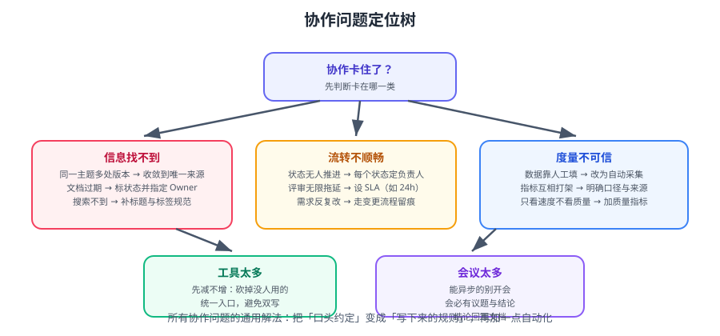

# 常见问题与最佳实践

本篇汇总协作与项目管理中最常被问到的问题，按「现象 → 根因 → 对策」组织。定位思路见下方决策树。



::: tip 使用方式
先判断「卡在哪一类」：信息找不到、流转不顺畅、度量不可信、工具太多、会议太多。九成协作问题的通用解法都是同一句话——**把口头约定变成写下来的规则，再加一点自动化**。
:::

## 一、信息找不到 / 多版本并存

### 1.1 同一件事有 3 个版本

**根因**：没有定义「唯一来源」。

```text
对策（四步）：
① 列出该信息的全部落点
② 指定一个「唯一可写来源」，其余改为只读镜像或加跳转说明
③ 在旧位置写上「本内容已迁移至 <链接>」，保留 30 天后归档
④ 把这条写进规范页（一页纸）
```

::: danger 不要「先建新的再慢慢迁」
迁移必须**一次性完成并切换**，否则两处长期并存，团队会继续用旧的那处。
**做法**：定一个切换日期，当天完成迁移、改权限、发通知。
:::

### 1.2 搜不到（知道写过但找不到）

| 原因 | 对策 |
| --- | --- |
| 标题不含关键词 | 标题写清「对象 + 动作 + 场景」 |
| 内容藏在聊天记录里 | 重要结论必须回写文档 |
| 文字在图片里 | 用 Markdown 表格/文本，不用截图承载数据 |
| 没有标签/属性 | 加服务名、类型、版本标签 |
| 没有索引页 | 用页面属性报表自动生成索引 |

### 1.3 「最新版是哪一版」

```text
对策：
① 关键文档标注「适用范围（版本）」与「最后更新」
② 定稿后设为只读（限制编辑），改动走新版本页
③ 旧版本移入归档并标「过期（仅历史参考）」
④ 索引页按「最后复核」排序，过期内容自动浮到最前
```

## 二、流转不顺畅

### 2.1 事项卡住没人推进（状态黑洞）

```text
诊断：跑一条查询 —— status 停留超过 1 天的事项有几条？
对策：
① 每个状态指定「负责人角色」，而不是整单只有一个 assignee
② 每个状态设 SLA（如评审 24h、测试启动 24h），超时自动 @ 提醒
③ 看板上按「停留时长」排序，站会只看这一列
```

### 2.2 事项没有负责人

**根因**：创建时没强制填，且没人巡检。

```text
对策：
① 用自动化在流转到「进行中」时校验负责人非空，为空则阻止
② 建一个共享过滤器「assignee is EMPTY AND statusCategory != Done」，每天推送
```

### 2.3 评审无限拖延

| 对策 | 说明 |
| --- | --- |
| 设 SLA | 24 小时内必须给出结论（通过 / 驳回 / 要求补充） |
| 超时自动提醒 | 每小时检查一次，超 24 小时在群里 @ 评审人 |
| 超时升级 | 超过 48 小时升级到技术负责人 |
| 限制在评审数量 | 一人同时最多 3 个待评审，避免排队 |
| 用检查清单代替「凭感觉」 | 清单化后评审更快也更一致 |

### 2.4 需求反复变

**根因**：需求门禁（DoR）没有检查验收标准。

```text
对策：
① DoR 检查清单作为流转阻断条件：「验收标准为空 → 不允许进入开发」
② 变更要走变更流程：在事项里记录「变更内容 + 影响 + 重新估算」
③ 已经进开发的重大变更 → 视为新需求，重新评估排期（不要偷偷塞进去）
```

### 2.5 Sprint 中途不断插队

```text
对策：
① 插队必须「等量替换」：加一件就移出一件
② 紧急需求走独立通道（紧急泳道），但要每周统计紧急通道使用次数
③ 把「紧急通道使用率」作为流程健康指标——如果每周都用，说明计划机制有问题
```

## 三、度量不可信

### 3.1 数据靠人工填，所以不准

```text
对策：能自动采集的绝不用人工。
  事项数据 → 从 Jira 取
  代码数据 → 从 Git/流水线取
  告警数据 → 从监控取
  多维表格里的「人工统计列」→ 改为公式或关联字段
```

### 3.2 指标互相打架

| 冲突 | 原因 | 对策 |
| --- | --- | --- |
| 速度变快但缺陷变多 | 只看速度不看质量 | 两个指标必须同时看 |
| 完成数上升但周期变长 | 把大任务拆碎刷数量 | 用「周期时间中位数」而非「完成数」 |
| 感觉很快但用户投诉变多 | 度量的是内部流转而非端到端 | 补测「前置时间」 |

::: danger 指标必须成对看
单看任何一个指标都会被「优化」到失真：
- 只看速度 → 牺牲质量
- 只看质量 → 牺牲速度
- 只看 WIP 下降 → 大家不拉卡了，变成积压在「待办」
**建议同时看：周期时间 + 缺陷逃逸率 + WIP。**
:::

### 3.3 度量被用来考核

```text
症状：数据突然变好看，但业务感受没变；或者大家开始「刷数据」。
对策：
① 明确宣布「度量只用于发现问题，不用于评价个人」
② 只公布团队级数据，不公布个人排名
③ 关注「趋势」而不是「绝对值」
```

## 四、工具太多 / 双写

| 现象 | 根因 | 对策 |
| --- | --- | --- |
| 同一信息填两处 | 边界未定义 | 明确「唯一可写入口」，其他位置只读 |
| 工具越加越多 | 每次遇到问题就引入新工具 | 先减后增：新增一个前先砍掉一个没人用的 |
| 切换成本高 | 信息孤岛，无法互相跳转 | 打通跳转链路（事项 ↔ 文档 ↔ 代码 ↔ 发布） |
| 没人愿意用 | 工具比流程复杂 | 先简化流程，再简化工具配置 |

::: tip 「信息孤岛自检」三问
1. 从事项能一步跳到方案文档吗？
2. 从方案文档能一步跳回事项吗？
3. 从发布记录能反查这次发布了哪些事项吗？
三个都答「能」，才算打通。
:::

## 五、会议太多

| 会议类型 | 建议方式 |
| --- | --- |
| 进度同步 | **取消**，改用看板 + 机器人推送 |
| 每日站会 | 保留但压缩到 15 分钟，只谈阻塞 |
| 方案评审 | 异步为先（文档评审），有分歧才开会 |
| 需求澄清 | 保留（交互问答效率高） |
| 复盘 | 会前各自写，会上只对齐结论 |

::: danger 会议三条铁律
1. **无议题不排会**：没有议程的会议等于让所有人猜。
2. **结论必须回写文档**：写在聊天里的结论等于没写。
3. **有硬性结束时间**：到点结束，未决事项另约。
:::

```text
# 一个可执行的减少会议动作
统计一周所有会议：人数 × 时长 = 人时成本
把其中「纯同步类」的会议逐个取消，改为：
  - 看板状态自动更新（代替进度汇报）
  - 每日自动推送「卡住的事项」（代替人工巡检）
  - 文档评审（代替评审会）
一个月后回看人时成本变化。
```

## 六、文档不维护

| 现象 | 对策 |
| --- | --- |
| 代码变了文档没变 | 把「文档更新」写进 DoD，评审时逐项确认 |
| 不知道谁维护 | 每份文档必须有 Owner（写进模板默认值） |
| 草稿被当结论用 | 页首标状态；索引里自动列出所有非「已确认」文档 |
| 索引页过期 | 用页面属性报表自动生成，替代手写列表 |
| 内容越堆越多 | 每季度复核一次，更新/标过期/归档三选一 |
| 删了文档导致 404 | 删改路径必须保留跳转说明 |

## 七、Jira 具体问题

::: details 「字段太多，创建事项像填问卷」
1. 统计每个字段的**实际填写率**，低于 30% 的直接隐藏（保留数据但不显示在创建页）。
2. 用「字段配置方案」按事项类型区分：Bug 只需要 5 个字段，Story 需要 8 个。
3. 必填字段只保留「没有它就无法工作」的：负责人、优先级、验收标准。
:::

::: details 「工作流改坏了，现在没人说得清流程」
1. 先**导出/截图当前工作流**，确认现状。
2. 只做「删除多余状态」与「补上必要校验」两件事，不要重设计。
3. 每次改动写进「配置变更记录」（谁、何时、改了什么、为什么）。
4. 改完在测试项目验证一轮再应用到生产项目。
:::

::: details 「Jira 变慢了」
| 症状 | 常见原因 |
| --- | --- |
| 列表页慢 | 全文检索索引问题；DC 可换 OpenSearch |
| 自定义字段多导致保存慢 | 字段数量过多，用 Instance Optimiser 治理 |
| 定时任务卡顿 | 自动化规则过多或条件过宽 |

DC 环境的管理能力：11.3 引入的 **Instance Optimiser** 可治理自定义字段；**JQL 韧性保护**可限制失控查询。升级到 Jira 12 时 Lucene 大版本升级**需要全量重建索引**，要预留窗口。
:::

::: details 「升级到 Jira 12 / Confluence 11 要注意什么」
- **Lucene 7.3 → 10.3.1**（Jira 12）：搜索更强，但**必须全量重建索引**。
- **React 18 → 19**：Marketplace 插件若直接依赖 React 需同步升级。
- **Jackson 2 → 3**：使用系统 Bundle 中 Jackson 的插件必须迁移。
- **Marketplace V1/V2 API 已弃用**：插件需迁移到 Marketplace REST v4。
**流程**：测试实例演练 → 插件兼容性扫描 → 备份 → 升级 → 重建索引 → 全功能核验。
:::

## 八、Confluence 具体问题

::: details 「知识库越用越乱」
1. **空间划分**：团队 / 领域 / 研发 / 个人分开，个人空间只放草稿。
2. **页面树 ≤ 3 层**：超过说明在用目录模拟标签，改用 Label。
3. **模板强制**：不允许空白页开始。
4. **季度复核**：按「最后复核」排序处理。
:::

::: details 「搜不到内容」
- 检查是否为**页面权限**导致静默漏结果（这是最隐蔽的原因）。
- 检查标题是否含关键词。
- 检查是否把内容放在附件（附件默认不参与全文检索，视版本而定）。
- 建立索引页与标签体系。
:::

::: details 「宏太多导致迁移困难」
核心内容尽量用**标准 Markdown / 表格**表达，宏只用于「结构性能力」（状态、报表、目录）。
迁移评估时，先统计私有宏的使用数量与位置，再决定是全量迁移还是按需重写。
:::

## 九、飞书具体问题

::: details 「机器人通知刷屏，大家开始屏蔽群」
1. **去重**：同告警 5 分钟内只推一次。
2. **分组**：按服务/规则聚合，不要一条告警一条消息。
3. **分级**：P0/P1 推群并 @ 人，P2/P3 只进日报。
4. **限流**：注意平台频率限制（以官方文档为准），批量通知要合并发送。
:::

::: details 「多维表格越来越卡」
| 原因 | 对策 |
| --- | --- |
| 行数过大（数万行以上） | 归档历史数据，或迁到真正的数据库 |
| 公式字段过多 | 减少实时计算字段，改为定时写入 |
| 关联字段过多且互相引用 | 精简关联，避免循环引用 |
| 视图过多 | 删除不用的视图 |
:::

::: details 「群消息里的结论找不回来」
**规则**：群只做通知，结论必须回写文档。
具体做法：讨论出结论后，立刻在群内回复一条「结论已写入 <文档链接>」，并把关键结论贴在消息里（便于搜索）。
:::

## 十、落地推进

::: details 「团队抵触，说增加工作量」
1. **先量化成本**：统计「找不到信息」「重复确认」每周消耗的人时。
2. **先减后加**：新增一条规范，同时砍掉一个旧动作。
3. **只改一件**：第一次回顾只改最痛的一件事，让团队两周内看到变化。
4. **从最痛开始**：不要从「最容易」开始（做完没有感知）。
:::

::: details 「规范执行两周就没人遵守了」
```text
三个自检问题：
① 有 Owner 吗？（没有 = 没规范）
② 有自动化检查吗？（靠人记必失效）
③ 超过两页吗？（越长执行率越低）
```
对策：能自动化的自动化，不能自动化的做成模板默认值，剩下的压到一页纸。
:::

::: details 「老板要报表，但数据要人工汇总」
```text
对策：把报表需求转化为「一次配置、自动更新」：
  ① 明确报表的口径与数据源
  ② 能用系统过滤器/仪表盘实现的，就不导 Excel
  ③ 必须人工整理的，做成固定模板 + 取数脚本
  ④ 报表的「生成时间与数据截止时间」必须标注
```
:::

## 十一、最佳实践清单

### 11.1 信息与来源

- 每类信息只有一个「可写入口」，其余只读。
- 事项、知识、数据三类分开，各用最合适的载体。
- 打通跳转链路：事项 ↔ 文档 ↔ 代码 ↔ 发布。
- 迁移必须一次性完成并宣布切换日期。

### 11.2 流程与状态

- 状态 ≤ 6 个，每个状态有唯一负责人角色。
- 每个状态有「进入条件」与「退出条件」。
- 状态设 SLA，超时自动提醒并升级。
- 关键流转加校验（缺验收标准 / 缺文档 / 缺负责人 → 阻止）。
- WIP 设上限，达到上限先清空再加新。

### 11.3 文档

- 每份文档有五要素：Owner、状态、适用范围、最后更新、变更记录。
- 新文档必须从模板创建。
- 索引自动生成，不手写。
- 每季度复核一次，更新/标过期/归档三选一。
- 删改路径必须保留跳转。

### 11.4 度量

- 只看四个指标：前置时间、周期时间、WIP、缺陷逃逸率。
- 只用于发现问题，不用于考核个人。
- 口径写进文档并固定，变了要标注分界线。
- 看趋势，不看绝对值。

### 11.5 会议与通知

- 同步类改异步；会议必须有议题、结论、结束时间。
- 结论必须回写文档。
- 通知必须包含：什么、何时、影响、谁负责、去哪处理。
- 通知去重、分组、分级，避免刷屏。

::: tip 一句话总结
**协作体系的健康度，可以用一个指标衡量：新人在不需要问任何人的情况下，能不能独立完成第一件交付。**
:::

## 参考资料

- Atlassian 团队协作最佳实践：https://www.atlassian.com/team-playbook
- Atlassian Data Center 路线图与升级说明：https://www.atlassian.com/roadmap/data-center
- 《Accelerate》（DevOps 四指标）：https://itrevolution.com/product/accelerate/
- Docs as Code：https://www.writethedocs.org/guide/docs-as-code/
- 本专题其余章节：[协作与项目管理导览](../index.md)、[概述与选型](../Overview/index.md)、[Jira 实战](../Jira/index.md)、[文档协作规范](../DocCollaboration/index.md)
