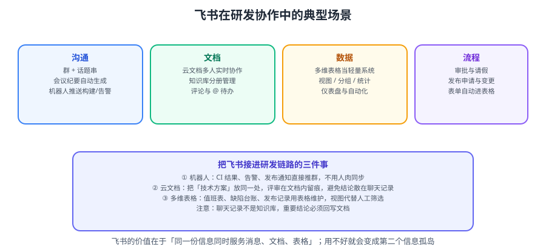

# 飞书协作

飞书（Feishu / Lark）的独特之处在于：**同一份信息可以同时以「消息、文档、表格」三种形态存在**。用好了，它能同时承担沟通、知识、台账三件事；用不好，它会变成第二个信息孤岛。



::: tip 一句话理解
飞书最强的不是聊天，而是**「云文档 + 多维表格 + 机器人」这组的组合拳**：文档当知识库、表格当轻量系统、机器人当自动化触手。
:::

## 一、四类能力与研发场景

| 能力 | 本质 | 研发场景 | 边界 |
| --- | --- | --- | --- |
| **即时沟通** | 消息流 | 值班群、告警群、项目群 | 只做通知，不做记录 |
| **云文档** | 富文本 / 表格 / 幻灯片 | 技术方案、会议纪要、接口文档 | 不适合放长期演进的大知识库主体 |
| **知识库** | 有层级与权限的文档集合 | 团队规范、新人上手、服务手册 | 需要有人维护分类 |
| **多维表格** | 轻量关系型数据库 | 值班表、缺陷台账、发布记录、资源清单 | 数据量过大或需要事务时改用真正的数据库 |
| **审批 / 机器人** | 流程与自动化 | 发布申请、变更审批、CI 通知 | 别用它做复杂工作流 |

::: danger 三个最常见的「用错」
1. **在群里派任务**：三天后没人知道还有哪些没做。→ 用多维表格或事项系统。
2. **把聊天记录当知识**：结论散落在 200 条消息里。→ 结论必须回写文档。
3. **多维表格当数据库**：几万行后卡顿、无法事务、无法并发写。→ 超过阈值就迁到真正的系统。
:::

## 二、云文档

### 2.1 研发最常用的四种文档

| 文档类型 | 用途 | 关键技巧 |
| --- | --- | --- |
| **文档（Doc）** | 方案、纪要、规范 | 用「标题层级」组织，便于生成大纲 |
| **表格（Sheet）** | 明细数据、统计 | 冻结首行、用筛选视图区分读者 |
| **多维表格（Base）** | 台账、看板、排班 | 字段类型决定能力，视图决定体验 |
| **幻灯片（Slides）** | 评审汇报、复盘 | 直接从文档「生成演示文稿」 |

### 2.2 协作与留痕

| 能力 | 说明 | 研发用法 |
| --- | --- | --- |
| 实时协同编辑 | 多人同时编辑，光标可见 | 会议中同步写纪要 |
| 评论与 @ | 针对选中内容评论 | 方案评审在文档内留痕 |
| **@ + 待办** | @ 某人形成待办项 | 评审意见转成待办，避免口头承诺 |
| 版本历史 | 查看/恢复历史版本 | 判断「结论何时被改」 |
| 权限设置 | 可阅读/可编辑/可管理 | 定稿后改为「可阅读」 |
| 分享链接权限 | 组织内/互联网/指定人 | **敏感文档禁止「互联网可阅读」** |

::: tip 把评审留在文档里
**反模式**：文档发到群里，大家在群里讨论，结论散落。
**正解**：评审人直接在文档里用「评论 + @」提出意见；作者逐条回复并标记「已采纳/不采纳 + 理由」；定稿后在文首写「评审结论」小节并附评审人名单。

这样三个月后回看，能完整还原「为什么当时这么选」。
:::

## 三、多维表格：把台账变成轻量系统

### 3.1 字段类型选对了，能力就对了

| 字段类型 | 用途 | 注意 |
| --- | --- | --- |
| 文本 / 多行文本 | 描述 | 长文本用「多行文本」 |
| 单选 / 多选 | 状态、分类、标签 | **状态一律用单选**，便于统计与视图筛选 |
| 人员 | 负责人、参与人 | 可配置「通知」行为 |
| 日期 | 时间点、截止日 | 可设「提醒」 |
| 附件 | 截图、报告 | |
| 数字 / 公式 | 计算字段 | 用于 SLA 超时、耗时计算 |
| 关联 | 跨表引用 | 缺陷表关联发布表 |
| 双向关联 | 互查 | 一个发布关联多个缺陷，缺陷也能反查发布 |
| 查找引用 | 拉取关联表字段 | 缺陷表带出发布版本号 |
| 自动编号 | 唯一 ID | 便于引用「BUG-1024」 |
| 创建人 / 创建时间 | 审计 | 自动记录 |

### 3.2 视图：一份数据，多种看法

| 视图 | 用途 |
| --- | --- |
| 表格视图 | 明细录入与编辑 |
| 看板视图 | 按「状态」分组，拖拽即变更 |
| 甘特视图 | 按日期字段展示排期 |
| 日历视图 | 排班、发布日历 |
| 分组 / 筛选 / 排序 | 为不同角色保存不同视图 |
| 仪表盘 | 图表统计，给管理者看 |

::: danger 「一份数据 N 份副本」是多维表格最常见的退化
**反模式**：为了给不同人看不同内容，复制出 3 张表，然后各自维护，很快就不一致。
**正解**：**一张表 + 多个视图**。视图只改变「显示什么、怎么排」，不改变数据本身。
:::

## 四、机器人：把自动化接进研发链路

### 4.1 群机器人 Webhook

```shell
# 获取方式：群设置 → 群机器人 → 添加机器人 → 自定义机器人 → 复制 Webhook 地址
# 建议开启「签名校验」，把密钥放到环境变量中

FEISHU_WEBHOOK="https://open.feishu.cn/open-apis/bot/v2/hook/xxxxxxxx"

notify() {
  local title="$1" text="$2" level="${3:-info}"
  local color="blue"
  case "$level" in
    success) color="green" ;;
    warning) color="orange" ;;
    error)   color="red" ;;
  esac

  curl -fsS -X POST "$FEISHU_WEBHOOK" \
    -H 'Content-Type: application/json' \
    -d "$(cat <<EOF
{
  "msg_type": "interactive",
  "card": {
    "header": { "title": { "tag": "plain_text", "content": "${title}" }, "template": "${color}" },
    "elements": [
      { "tag": "div", "text": { "tag": "lark_md", "content": "${text}" } }
    ]
  }
}
EOF
)"
}

# 用法示例
notify "构建失败" "**项目**：order-service\n**分支**：main\n**提交**：a1b2c3d\n[查看日志](https://ci.example.com/job/123)" error
```

::: warning Webhook 的三个安全要点
1. **Webhook 地址等于群里的发帖权限**，不要提交到公开仓库。用环境变量或 CI 的 Secret。
2. **开启签名校验**：否则地址泄露后任何人都能往群里发消息。
3. **加限流**：`频率限制约每分钟 100 条`（以官方文档为准）。批量通知要做合并，避免被限流。
:::

### 4.2 三个高价值通知场景

| 场景 | 触发 | 内容 |
| --- | --- | --- |
| CI 结果 | 流水线结束 | 项目、分支、提交人、结果、日志链接 |
| 告警通知 | 监控告警触发/恢复 | 告警名、实例、持续时间、处理链接 |
| 发布通知 | 发布开始/结束 | 版本、变更内容、影响面、回滚方式 |

```text
# 通知内容的最低要求（否则就是噪音）
① 什么（对象/服务）
② 什么时候（时间）
③ 影响什么（用户可感知的现象）
④ 谁负责（@ 到人或值班）
⑤ 去哪处理（一条可点击的链接）
```

## 五、审批与表单

| 场景 | 表单字段 | 审批人 |
| --- | --- | --- |
| 发布申请 | 版本、变更内容、影响面、回滚方案、窗口 | 技术负责人 + 测试 |
| 生产变更 | 变更类型、脚本、验证方式、回滚 | 技术负责人 + 运维 |
| 权限申请 | 系统、角色、期限、理由 | 系统 Owner |
| 值班调换 | 原值班人、接替人、日期 | 团队负责人 |

::: tip 表单 + 多维表格 = 自动台账
把审批结果自动写入多维表格，就得到了**不需要人维护的变更台账**：
- 谁在什么时候改了生产
- 变更类型分布
- 变更与故障的关联

这是「可审计」的起点。
:::

## 六、边界：飞书 vs Jira/Confluence

| 信息 | 推荐载体 | 理由 |
| --- | --- | --- |
| 需求与任务 | **Jira / 飞书项目** | 需要状态机、报表、跨迭代追踪 |
| 轻量台账（值班、缺陷、发布记录） | **多维表格** | 结构简单、改字段成本低 |
| 技术方案 / 接口 / 排障手册 | **知识库 / Confluence** | 需要长文、检索、版本历史 |
| 会议纪要 | 云文档 | 实时协作写，便于 @ 待办 |
| 即时通知 | 群 + 机器人 | 只做通知 |

::: danger 「双写」是协作体系崩溃的起点
如果同一份信息既在 Jira 又在多维表格，就一定会有人更新一边忘了另一边。
**规则**：每个信息只有一个**可写**入口，其他位置只做「只读镜像 + 链接」或「自动同步」。
:::

## 七、实战：搭一套「值班 + 缺陷台账 + 发布记录」

### 第一步：建三张多维表格

```text
表 1：值班表
  字段：日期（日期）、主值班（人员）、备值班（人员）、联系方式（文本）、状态（单选：正常/已调换）
  视图：日历视图（按日期）、看板视图（按状态）

表 2：缺陷台账
  字段：编号（自动编号）、标题（文本）、严重级别（单选：P0/P1/P2/P3）、
        状态（单选：新建/处理中/待验证/已关闭）、负责人（人员）、
        发现时间（日期）、引入版本（关联发布记录）、SLA 截止（公式）、超时（公式）
  视图：看板视图（按状态）、表格视图（按严重级别筛选）、仪表盘（按版本统计）

表 3：发布记录
  字段：版本号（文本）、发布窗口（日期）、负责人（人员）、
        变更内容（多行文本）、回滚方式（多行文本）、状态（单选：计划/进行中/完成/回滚）
  视图：甘特视图（按窗口）、表格视图
```

公式示例（缺陷台账的 SLA 与超时）：

```text
SLA 截止 = 发现时间 + SWITCH(严重级别, "P0", 1, "P1", 3, "P2", 7, 14)
超时 = IF(AND(状态 != "已关闭", NOW() > SLA 截止), "超时", "")
```

### 第二步：接两个机器人场景

```text
① 告警机器人：监控平台 → Webhook → 值班群
   内容包含：告警名、实例、开始时间、@ 主值班、处理链接

② CI 机器人：流水线结束 → 自定义机器人 → 项目群
   内容包含：项目、分支、提交人、结果、日志链接
```

### 第三步：把发布审批结果落到台账

```text
审批「发布申请」通过后：
  → 自动在多维表格「发布记录」新增一行
  → 状态 = 计划
  → 发布完成后再由发布脚本回调更新为「完成」
```

### 验证方式

```text
1. 值班表日历视图
   预期：本月每一天都有主值班人，无空缺（可用筛选「主值班为空」验证）

2. 缺陷台账看板
   预期：四个状态列都有卡片，拖拽后状态字段同步变化

3. SLA 公式
   预期：新建一条 P0 缺陷，「SLA 截止」= 发现时间 + 1 天；把发现时间改为 3 天前，超时列显示「超时」

4. 发布记录关联
   预期：在缺陷台账「引入版本」字段能选到发布记录中的版本号

5. 机器人
   预期：手动触发一次告警测试，值班群收到卡片且 @ 到主值班人

6. 通知去重
   预期：同一告警 5 分钟内只推一次（在监控侧配置分组或抑制）
```

## 八、易错点汇总

::: danger 逐条对照
1. **群里派任务**：事项被聊天流淹没。用多维表格 / 事项系统。
2. **结论只在聊天里**：无法检索。结论必须回写文档。
3. **复制出多份表格各自维护**：数据不一致。用「一张表 + 多视图」。
4. **多维表格当数据库**：数据量上来后卡顿且无事务。超过阈值迁到真正的系统。
5. **Webhook 明文提交到仓库**：等于把群发帖权限公开。用 Secret 管理。
6. **机器人不设限流/去重**：告警风暴刷屏，团队开始屏蔽群。加分组与抑制。
7. **分享链接设成「互联网可阅读」**：敏感信息泄露。默认「组织内可阅读」。
8. **审批与台账脱节**：审批过了但没人记录。用表单 + 表格自动落库。
9. **多维表格字段类型乱选**：状态用「文本」导致无法统计。状态一律用「单选」。
10. **双写**：同一信息两个可写入口，必然不一致。只保留一个可写入口。
:::

## 参考资料

- 飞书帮助中心：https://www.feishu.cn/hc/zh-CN
- 飞书开放平台（机器人 / 消息卡片）：https://open.feishu.cn/document/
- 飞书多维表格使用手册：https://www.feishu.cn/hc/zh-CN/articles/
- 本专题其余章节：[协作与项目管理导览](../index.md)、[Confluence 知识库](../Confluence/index.md)、[文档协作规范](../DocCollaboration/index.md)
