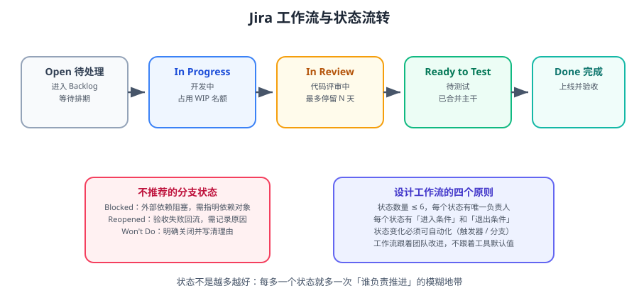

# Jira 实战

Jira 是事项管理的重量级工具：它把「谁在做什么、做到哪一步、卡在谁那里」变成可查询、可统计、可自动化的数据。本篇讲的是**怎么把 Jira 配成一个团队真正愿意用的系统**，而不是把菜单点一遍。



::: tip 一句话理解
Jira 的核心不是「填单」，而是**用状态表达进度、用查询替代追问、用自动化替代人肉同步**。
:::

## 一、核心概念

| 概念 | 说明 | 常见误用 |
| --- | --- | --- |
| **Project（项目）** | 一组事项的容器，有独立的权限与工作流 | 按「版本」建项目（应该按团队/产品域建） |
| **Issue（事项）** | 最小工作单元，有类型、状态、负责人 | 把「一件事」拆成 20 个没有意义的子任务 |
| **Issue Type（类型）** | Story / Task / Bug / Sub-task / Epic | 类型太多，团队分不清该选哪个 |
| **Workflow（工作流）** | 状态 + 流转规则 + 条件校验 | 状态堆到 12 个，没人知道下一个是谁 |
| **Status（状态）** | 事项当前所处阶段 | 用「状态」记录非流程信息（如「紧急」） |
| **Transition（流转）** | 从一个状态到另一个状态的合法动作 | 允许任意跳转，等于没有流程 |
| **Board（看板）** | 以列展示状态的视图，可拖拽流转 | 看板列与工作流状态不一致 |
| **Sprint（迭代）** | 一段固定时长的工作周期（通常 2 周） | Sprint 中途无限插队 |
| **Epic（史诗）** | 跨多个 Sprint 的大目标，聚合多个事项 | Epic 写成「项目名」，缺乏完成标准 |
| **Version / Release** | 发布版本，可关联事项形成发布说明 | 只有版本号没有发布标准 |
| **Component（组件）** | 项目内的模块划分，可设默认负责人 | 与代码仓库目录结构脱节 |
| **Label（标签）** | 自由标签，用于横向标记 | 标签爆炸，同义标签并存（`bug` / `缺陷`） |

::: danger 三个最容易「配错就废」的选项
1. **状态太多**：超过 6 个后，团队会开始凭感觉填写。**判据**：如果某个状态没有任何一列看板对应，它就不该存在。
2. **任意跳转**：如果 `Open` 能直接跳到 `Done`，那中间的 `In Review`、`Ready to Test` 就形同虚设。
3. **Issue Type 太多**：类型超过 5 个，创建页面就会变成选择题考试。**建议**：Story / Task / Bug / Sub-task / Epic 即可。
:::

## 二、设计工作流

### 2.1 推荐的六状态模型

```text
Open            · 已创建，等待排期（负责人：产品/需求方）
In Progress     · 开发中（负责人：开发）
In Review       · 代码评审中（负责人：评审人）
Ready to Test   · 已合并主干，待测试（负责人：测试）
Done            · 已上线并通过验收（负责人：发布/产品）
Blocked         · 被外部依赖阻塞（负责人：阻塞方指定人）
```

| 状态 | 进入条件 | 退出条件 |
| --- | --- | --- |
| Open | 有验收标准、有优先级 | 已排期并指派负责人 |
| In Progress | 已指派、方案已明确 | 代码已提交并开合并请求 |
| In Review | 合并请求已创建、CI 通过 | 至少 1 人评审通过 |
| Ready to Test | 已合并到主干并部署测试环境 | 测试通过 |
| Done | 已上线、产品验收通过 | — |
| Blocked | 明确写出阻塞对象与预期解除时间 | 阻塞解除，回到原状态 |

::: tip 每个状态配一个「停留时长」告警
用自动化规则实现：状态为 `In Review` 超过 24 小时 → 在群里 @ 评审人。
**没有时限的状态，一定会变成黑洞。**
:::

### 2.2 看板列与工作流的关系

| 看板类型 | 列 | 适用 |
| --- | --- | --- |
| **Scrum 板** | 按 Sprint 划分，列 = 状态 | 有固定迭代节奏、需要燃尽图 |
| **Kanban 板** | 连续流，列 = 状态，设 WIP 上限 | 需求持续流入、运维/支持类团队 |

::: warning WIP 上限是 Kanban 的灵魂
每列设「同时进行的最多事项数」（通常 = 团队人数 × 1.5）。达到上限就必须先清空一列才能拉新卡。
**不设 WIP 上限的看板，只是把待办清单换了个形状。**
:::

## 三、JQL：用查询替代追问

JQL（Jira Query Language）是 Jira 最有价值的功能——把「你那个做得怎么样了」变成一条可自动化的查询。

### 3.1 常用运算符与函数

| 语法 | 含义 | 示例 |
| --- | --- | --- |
| `=` `!=` | 等于 / 不等于 | `status = "In Progress"` |
| `in` `not in` | 在集合内 | `status in ("In Progress", "In Review")` |
| `~` | 文本模糊匹配 | `summary ~ "登录"` |
| `AND` `OR` `NOT` | 逻辑组合 | `project = ORD AND status != Done` |
| `ORDER BY` | 排序 | `ORDER BY created DESC` |
| `currentUser()` | 当前用户 | `assignee = currentUser()` |
| `startOfDay()` / `endOfDay()` | 时间函数 | `updated >= startOfDay(-1d)` |
| `startOfWeek()` / `endOfWeek()` | 周函数 | `created >= startOfWeek()` |
| `openSprint()` / `closedSprints()` | 迭代函数 | `sprint in openSprint()` |
| `watcher` / `voter` | 关注者 | `watcher = currentUser()` |
| `CHANGED` | 字段变更历史 | `status CHANGED FROM "In Review" TO Done` |

### 3.2 十个高频查询

```text
-- ① 我的待办（按优先级排序）
assignee = currentUser() AND statusCategory != Done ORDER BY priority DESC, updated DESC

-- ② 我这个 Sprint 的工作
assignee = currentUser() AND sprint in openSprint() ORDER BY status ASC

-- ③ 卡在评审超过一天的
status = "In Review" AND status CHANGED TO "In Review" BEFORE -1d

-- ④ 没有负责人的事项（最常见的漏洞）
project = ORD AND assignee is EMPTY AND statusCategory != Done

-- ⑤ 没有验收标准的（用于需求门禁检查）
project = ORD AND "acceptance criteria" is EMPTY AND type = Story

-- ⑥ 本次迭代新增（可能被插队）
project = ORD AND sprint in openSprint() AND created >= startOfWeek()

-- ⑦ 未关联方案文档的事项
project = ORD AND "设计文档" is EMPTY AND status in ("In Progress", "In Review")

-- ⑧ 近 7 天完成的（用于周报/度量）
project = ORD AND statusCategory = Done AND resolutiondate >= -7d

-- ⑨ 被阻塞且已超过 3 天
status = Blocked AND status CHANGED TO Blocked BEFORE -3d

-- ⑩ 缺陷逃逸（上线后才发现的 bug 通常标记特定 label）
project = ORD AND type = Bug AND labels = escaped AND created >= -30d
```

::: tip 把 JQL 变成「过滤器 + 订阅」
1. 保存查询为**共享过滤器**（Shared Filter），团队都能看到。
2. 配置**订阅**（Filter Subscription）：每天 9:00 自动把结果发到指定人/群。
3. 把过滤器加到**看板**上：用「快速过滤器」快速切换视图。

**这是「减少追问」最直接的一步**：与其每天问「谁没写验收标准」，不如让系统每天自动发一份。
:::

## 四、自动化规则

自动化（Automation for Jira）由三部分组成：**触发器（Trigger）→ 条件（Condition）→ 动作（Action）**。

| 场景 | 触发器 | 条件 | 动作 |
| --- | --- | --- | --- |
| 合并请求创建后自动流转 | 合并请求已创建 | 关联事项状态 = In Progress | 状态改为 In Review |
| 合并后推动到待测试 | 合并请求已合并 | 目标分支 = main | 状态改为 Ready to Test |
| 评审超时提醒 | 定时（每小时） | `status = "In Review"` 且停留 > 24h | 在群里 @ 评审人 |
| 缺少验收标准不允许开工 | 状态流转到 In Progress | 验收标准字段为空 | 阻止流转并提示 |
| 阻塞项升级 | 定时（每天 9:00） | `status = Blocked` 且 > 3 天 | 创建提醒并 @ 技术负责人 |
| 上线后自动通知 | 版本已发布 | — | 在群里发发布说明 |

::: danger 自动化的边界：不要用自动化掩盖流程问题
如果一条自动化规则写成「只要创建就自动改成 Done」，那不是自动化，那是自欺欺人。
**判断标准**：自动化应该做「人不想做但必须做的事」（同步、提醒、汇总），而不是替人做「判断」。
:::

## 五、与代码仓库联动

### 5.1 分支与提交命名约定

```text
分支：feature/ORD-123-add-order-export
提交：ORD-123 feat(order): 支持订单导出
合并请求标题：[ORD-123] 支持订单导出
```

| 联动能力 | 效果 |
| --- | --- |
| 分支名含事项键 | Jira 事项页自动显示关联分支 |
| 提交信息含事项键 | 提交记录出现在事项的「开发」面板 |
| 合并请求标题含事项键 | 代码评审与事项状态可直接联动 |
| Smart Commit（仅部分集成支持） | `ORD-123 #comment 已修复 #time 2h #close` 提交即可回写 |

```properties
# Git 提交模板 .gitmessage（可选）
# ORD-123 type(scope): 描述
# 关联需求：ORD-123
```

::: warning 前提是「事项键可读」
`ORD-123` 这样的前缀比 `12345` 有用得多。设置项目 Key 时选有意义的缩写（`ORD`、`PAY`、`USER`）。
:::

## 六、权限：三个角色就够

| 角色 | 权限 | 适用 |
| --- | --- | --- |
| **Project Admin** | 配置工作流、字段、权限方案 | 团队 1~2 人 |
| **Member（Developer）** | 创建、编辑、流转事项；参与评审 | 开发、测试、产品 |
| **Viewer** | 只读 + 评论 | 相关方、外部协作方 |

::: danger 权限的两个反模式
1. **人人都是管理员**：工作流被不同人反复改，三个月后没人说得清当前流程。
2. **字段权限过严**：只有管理员能改「优先级」，导致优先级永远不更新。
**做法**：流程相关配置集中在 1~2 个 Project Admin；业务字段（优先级、验收标准）放开给 Member。
:::

## 七、Data Center 版本注意事项

::: info 版本事实（2026-09 核对）
- **Jira Software Data Center 当前 LTS 为 11.3.x**（最新补丁 11.3.10，2026-08-07）。
- **Jira 12 已在开发中**，包含三项对管理员有影响的变更：
  - **Lucene 7.3 → 10.3.1**：搜索能力提升，但**需要全量重建索引**，升级窗口要预留数小时。
  - **React 18 → 19**：Marketplace 插件若直接依赖 React，需要同步升级。
  - **Jackson 2 → 3**：使用系统 Bundle 中 Jackson 的插件必须迁移（官方提供 `atlassian-rest` 迁移指南）。
- 11.3 版本引入的实用能力：OpenSearch 支持、Service Accounts（非人类账号）、Instance Optimiser（实例健康与自定义字段治理）、JQL 韧性保护（限制失控查询）。
:::

::: warning 自托管升级前的检查清单
1. 在**测试实例**上完整演练（含数据副本与插件）。
2. 逐个确认 Marketplace 插件的兼容性（官方「升级准备工具」可扫描）。
3. 预留**重建索引**的时间窗口（大实例可能数小时）。
4. 备份数据库与 `home`/`shared` 目录，并验证备份可用。
5. 升级后核验：登录、检索、附件、邮件、插件、自动化规则。
:::

## 八、实战：为一个 10 人团队配置 Jira

### 第一步：创建项目与事项类型

```text
项目 Key：ORD（订单域）
事项类型：Story / Task / Bug / Sub-task / Epic（只用这 5 个）
组件：order-api / order-web / order-job（与代码仓库目录一致）
```

### 第二步：配置工作流（六状态）

```text
Open → In Progress → In Review → Ready to Test → Done
                    ↘ Blocked ↗（任意进行中状态可进出）
```

关键校验（用 Validator / Condition 实现）：

| 流转 | 校验 |
| --- | --- |
| → In Progress | 验收标准非空；负责人非空 |
| → In Review | 合并请求链接非空 |
| → Ready to Test | 至少 1 个评审通过（用 label 或字段记录） |
| → Done | 已关联发布版本 |
| → Blocked | 阻塞原因非空 |

### 第三步：建立四个共享过滤器

```text
-- ① 每日站会视图
project = ORD AND sprint in openSprint() ORDER BY status ASC, priority DESC

-- ② 流转黑洞（卡住的事项）
project = ORD AND status in ("In Review", "Ready to Test", Blocked)
  AND status CHANGED BEFORE -1d
ORDER BY updated ASC

-- ③ 门禁违规（缺验收标准/缺文档/缺负责人）
project = ORD AND statusCategory != Done AND
  ("acceptance criteria" is EMPTY OR assignee is EMPTY OR "设计文档" is EMPTY)

-- ④ 交付度量（近 30 天完成）
project = ORD AND statusCategory = Done AND resolutiondate >= -30d
ORDER BY resolutiondate DESC
```

### 第四步：配置三条自动化规则

```text
规则 1（评审超时提醒）
  触发：定时，每小时
  条件：status = "In Review" 且 距离进入该状态 > 24 小时
  动作：在企业群 @ 评审人 并附事项链接

规则 2（合并即流转）
  触发：合并请求已合并
  条件：目标分支为 main
  动作：状态改为 "Ready to Test"，并在评论区记录合并提交哈希

规则 3（每日门禁报告）
  触发：定时，工作日 9:00
  条件：过滤器「门禁违规」有结果
  动作：把结果推送到团队群（附过滤器链接）
```

### 验证方式

```text
1. 创建一条测试事项，尝试从 Open 直接流转到 Done
   预期：被阻止，提示「必须先经过 In Review」

2. 把测试事项流转到 In Progress 但不填验收标准
   预期：被阻止，提示「验收标准不能为空」

3. 把测试事项置为 In Review，等待（或临时把阈值改为 1 分钟）
   预期：收到群内的评审提醒

4. 提交代码并合并，提交信息含事项键（如 ORD-1）
   预期：事项的开发面板显示提交与合并请求；状态自动变为 Ready to Test

5. 打开「流转黑洞」过滤器
   预期：只返回停留超过 1 天的事项，且排序正确

6. 打开「交付度量」过滤器，检查数量与看板一致
   预期：数量相符，可导出为周报数据
```

## 九、易错点汇总

::: danger 逐条对照
1. **状态过多（> 6）**：团队会凭感觉填。删到 ≤ 6 个。
2. **允许任意跳转**：流程失效。用 Validator 强制关键流转路径。
3. **没有 WIP 上限**：看板变成待办清单。给每列设上限。
4. **事项没有负责人**：最常见的漏洞。用过滤器「assignee is EMPTY」每日巡检。
5. **验收标准留空**：需求门禁失效。用自动化阻止流转。
6. **Sprint 中途无限插队**：迭代失去意义。插队必须替换掉同等工作量。
7. **标签同义词并存**：`bug` / `缺陷` / `Bug` 三种写法。建立标签字典并定期合并。
8. **把 Jira 当文档用**：长文档塞进描述字段，无法检索与版本管理。方案放 Confluence/知识库。
9. **度量用来考核个人**：数据必然失真。只用于发现问题。
10. **DC 升级前不演练**：Jira 12 的 Lucene 重建索引与插件兼容会直接导致升级失败。
:::

## 参考资料

- Jira Software 文档：https://support.atlassian.com/jira-software/
- JQL 参考：https://support.atlassian.com/jira-software-cloud/docs/jql-functions/
- Automation for Jira：https://support.atlassian.com/cloud-automation/
- Jira Data Center 开发变更日志（含 Jira 12 变更）：https://developer.atlassian.com/server/jira/platform/changelog/
- Jira 11.3 LTS 发布说明：https://confluence.atlassian.com/spaces/JIRASOFTWARE/
- 本专题其余章节：[协作与项目管理导览](../index.md)、[Confluence 知识库](../Confluence/index.md)、[研发流程](../RdProcess/index.md)
