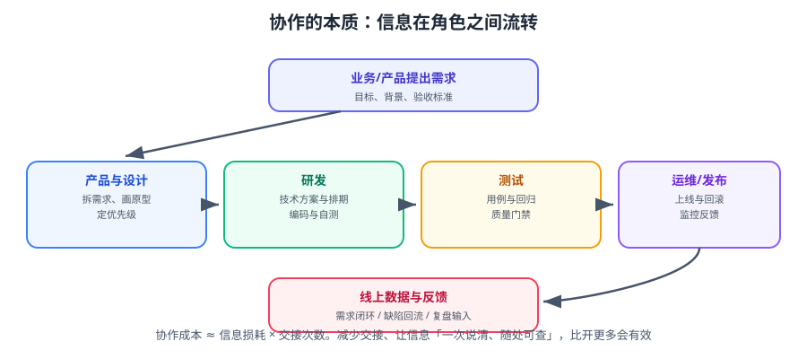

# 概述与选型

协作工具的第一性问题是：**「什么事、谁做、做到哪了、结论是什么」这四个信息，团队里任何人能否在 30 秒内查到。** 本篇给出判断标准与选型方法，而不是推荐一堆工具。



::: tip 一句话理解
选型不是「哪个工具功能多」，而是「它能不能成为某类信息的**唯一来源**」——一个团队最多容忍两三个唯一来源，多了一定乱。
:::

## 一、三类信息，三种载体

| 信息类型 | 特征 | 载体 | 判断标准 |
| --- | --- | --- | --- |
| **事项（Task）** | 有状态、有负责人、会变化 | Jira / 飞书项目 / 事项表 | 状态即进度，不需要问人 |
| **知识（Knowledge）** | 有结论、长期有效、需检索 | Confluence / 飞书知识库 / 仓库内 Markdown | 三个月后还能查到唯一答案 |
| **数据（Data）** | 结构化、要统计、要筛选 | 多维表格 / 报表 / 看板 | 不用人工汇总就能出数 |

::: danger 最容易犯的错：用聊天工具承载「事项」和「知识」
- 在群里派任务 → 三天后没人知道还有哪些没做（**事项被聊天流淹没**）。
- 在群里讨论方案 → 结论散落在 200 条消息里（**知识无法检索**）。
**群只适合「通知」**：通知「事项已建」「文档已更新」「结论已写」。
:::

## 二、信息流转的三条主线

```text
① 信息主线（事项）
需求提出 → 澄清 → 排期 → 开发 → 评审 → 测试 → 发布 → 验收
  每个箭头都是一个状态，每个状态必须有唯一负责人

② 知识主线（文档）
起草 → 评审 → 定稿 → 维护 → 归档
  每份文档必须有状态、Owner、最后更新日期

③ 反馈主线（数据）
监控/用户反馈 → 缺陷/需求 → 进入事项池 → 复盘 → 改进流程
  闭环的关键是「反馈必须能变成事项」
```

::: warning 三条主线必须能互相跳转
- 事项里要能点开**对应的方案文档**。
- 文档里要能引用**相关的事项编号**。
- 缺陷要能回指**引入它的那次发布**。

做不到互相跳转，就是「三个孤岛」，工具再多也只是增加切换成本。
:::

## 三、选型方法论：六步

| 步骤 | 做什么 | 产出 |
| --- | --- | --- |
| ① 画现状 | 列出当前所有信息落点（群、文档、表格、邮件） | 一张「信息落点清单」 |
| ② 找重复 | 标出「同一件事有多处版本」的地方 | 重复清单与收敛目标 |
| ③ 定唯一来源 | 每类信息指定一个「唯一来源」 | 一页纸的约定 |
| ④ 定最小可用集 | 只保留真正每天用的工具 | 工具清单（≤ 5 个） |
| ⑤ 定规则 | 状态流转、命名、模板、评审 SLA | 规范文档（≤ 2 页） |
| ⑥ 定自动化 | 哪些同步动作可以机器做 | 机器人/Webhook 清单 |

::: tip 「唯一来源」怎么写进约定
用一句话表达，例如：
> 需求与任务的唯一来源是 Jira；技术方案的唯一来源是 Confluence 的「研发空间」；团队排班与台账的唯一来源是多维表格。

有了这句话，争议就有裁决依据：「这个信息该记在哪？」——看它属于哪一类。
:::

## 四、常见组合方案对比

| 方案 | 适用 | 优点 | 代价 |
| --- | --- | --- | --- |
| **Jira + Confluence** | 中大型研发团队、需要严谨流程 | 工作流可定制、报表强、与代码仓库联动成熟 | 配置复杂、上手成本高、Cloud 有席位成本 |
| **飞书全家桶（项目 + 知识库 + 多维表格）** | 中小团队、重沟通协作 | 消息/文档/表格一体、上手快、自动化门槛低 | 深度工作流与跨项目报表较弱 |
| **GitLab / Gitea Issues + Wiki** | 纯工程团队、代码为中心 | 与代码零切换、免费、Markdown 原生 | 非技术角色参与门槛高、报表弱 |
| **Jira DC + Confluence DC** | 有内网/合规要求的团队 | 数据自持、可控 | 运维成本高、官方在推 Cloud 迁移 |
| **混合（飞书沟通 + Jira 管事项 + 仓库放方案）** | 数量较多、边界清晰的团队 | 各取所长 | **必须有明确的边界约定**，否则必然双写 |

::: danger 「混合方案」失败的唯一原因
没有写清**边界**。典型失败：需求既在 Jira 又在一张多维表格里，两边都要维护，最后两边都不准。
**约束**：同一个信息只允许有一个可写入口；其他位置只做「只读镜像 + 链接」。
:::

## 五、角色与职责（RACI）

| 事项 | R（执行） | A（负责） | C（咨询） | I（知会） |
| --- | --- | --- | --- | --- |
| 需求澄清 | 产品 | 产品负责人 | 研发、测试 | 全员 |
| 技术方案 | 研发 | 技术负责人 | 运维、DBA | 产品 |
| 代码评审 | 研发 | 技术负责人 | — | — |
| 发布上线 | 运维/研发 | 发布负责人 | 测试 | 全员 |
| 故障复盘 | 值班人 | 技术负责人 | 相关方 | 全员 |

::: tip RACI 最容易漏的是「A」
一件事有 5 个执行者但没人拍板，就会无限讨论。「A」只能是一个人。
在事项系统里可以落地为：每个状态字段都指定一个「当前负责人」，而不是整单只有一个 assignee。
:::

## 六、会议与异步的分工

| 场景 | 建议方式 | 理由 |
| --- | --- | --- |
| 信息同步（进度、通知） | **异步**：看板 + 文档 + 机器人推送 | 开会成本 = 人数 × 时长，纯同步极不划算 |
| 方案讨论（有分歧、需拍板） | **会议**：有议题、有结论 | 文字描述复杂取舍效率低 |
| 需求澄清（有交互问答） | **会议**：30 分钟内 | 多轮异步往返更慢 |
| 代码评审 | **异步**：合并请求评论 | 可保留上下文与历史 |
| 复盘 | **会议 + 文档**：会前各自写、会上对齐 | 会前不写会变成聊天 |

::: danger 会议的三个硬约束
1. **无议题不排会**：没有议程的会议，参加者只能被动听。
2. **结论必须回写文档**：写在聊天里的结论等于没写。
3. **有结束时间**：超时就另约，不要拖成 90 分钟。
:::

## 七、度量：只看四类指标

| 指标 | 定义 | 关注什么 |
| --- | --- | --- |
| **周期时间（Cycle Time）** | 从「开始做」到「做完」 | 交付速度 |
| **前置时间（Lead Time）** | 从「提出」到「交付」 | 等待成本，通常远大于工作时间 |
| **在制品（WIP）** | 同一时刻「进行中」的事项数 | WIP 越高，周期时间越长 |
| **缺陷逃逸率** | 上线后才发现的缺陷 / 总缺陷 | 质量门禁是否有效 |

::: danger 用度量做考核必然失真
一旦「完成数量」和绩效挂钩，人们就会把事项拆碎、把简单的先做、把难的挂着。
**度量只用于「发现问题」，不用于「评价个人」**——这是所有度量体系能活下去的前提。
:::

```text
# 一个健康的信号
WIP 稳定在团队人数的 1~2 倍；
周期时间中位数下降；
缺陷逃逸率下降或持平。
# 一个危险的信号
WIP 持续上升 → 人人多线程 → 周期时间上升 → 为了赶进度又加更多 WIP（死亡螺旋）
```

## 八、落地检查清单

::: tip 新团队从零起步，按这个顺序做
1. **确定唯一来源**（一页纸）：事项、知识、数据分别放哪。
2. **画状态流转图**：状态 ≤ 6 个，每个状态写清「进入条件」和「负责人角色」。
3. **准备三个模板**：需求、技术方案、复盘。
4. **打通一条自动化**：先做「合并请求 → 事项状态自动流转」，收益最直观。
5. **建立度量基线**：先测出当前的周期时间与 WIP，半年后再看变化。
6. **每两周回顾一次流程**：一次只改一个最痛的点，并把改动写进规范。
:::

| 检查项 | 通过标志 |
| --- | --- |
| 唯一来源明确 | 任意问一个信息，团队答案一致 |
| 状态可自解释 | 看板上一眼能看出谁在等谁 |
| 文档可检索 | 用关键词能搜到唯一权威版本 |
| 自动化已生效 | 至少一条状态变更由机器完成 |
| 度量可获取 | 能自动出周期时间与 WIP，不靠人工填 |
| 规范有 Owner | 规范文档上写着谁维护、多久回顾一次 |

## 参考资料

- Atlassian：团队协作最佳实践：https://www.atlassian.com/team-playbook
- Scrum Guide（2020）：https://scrumguides.org/
- 《Accelerate》（DevOps 四指标）：https://itrevolution.com/product/accelerate/
- 飞书帮助中心：https://www.feishu.cn/hc/zh-CN
- 本专题其余章节：[协作与项目管理导览](../index.md)、[研发流程](../RdProcess/index.md)
