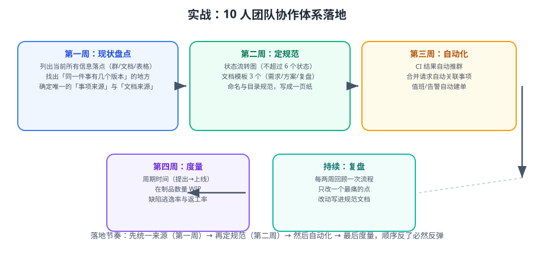

# 实战：10 人团队协作体系落地

本篇是一次完整的落地复盘：一个 10 人团队从「信息散落在 6 个群、3 个文档、2 张表格」到「有唯一来源、有状态流转、有自动化」，四周内做完，并且每一步都有可验证的收尾。



::: tip 一句话理解
落地节奏不能乱：**先统一来源（否则规范无处安放）→ 再定规范（否则自动化没有依据）→ 然后自动化（否则规范靠人记）→ 最后度量（否则不知道有没有变好）**。顺序反了必然反弹。
:::

## 一、团队现状与目标

| 项目 | 落地前 | 目标 |
| --- | --- | --- |
| 事项来源 | 群里说 + 有些人记在个人笔记 | Jira（项目 ORD）唯一来源 |
| 进度同步 | 每天 30 分钟站会念进度 | 看板 + 15 分钟阻塞项站会 |
| 技术方案 | 散落在 3 个文档、部分只在聊天里 | 知识库「研发空间」+ 方案模板 |
| 发布 | 靠人记步骤，无发布记录 | 发布单 + 多维表格台账 |
| 值班 | 口头排班，常出现空档 | 多维表格值班日历 |
| 告警 | 打到个人手机，无人认领 | 值班群 + @ 主值班 |
| 度量 | 无 | 前置时间 / 周期时间 / WIP / 缺陷逃逸率 |

## 二、第一周：现状盘点

### 2.1 产出「信息落点清单」

```text
# 信息落点清单（示例，逐项填写）
| 信息 | 当前落在哪 | 谁在维护 | 是否有重复版本 | 目标唯一来源 |
| --- | --- | --- | --- | --- |
| 需求 | 群聊、个人笔记、Excel | 产品 | 是（3 处） | Jira ORD |
| 任务进度 | 群聊 | 无 | 是 | Jira ORD |
| 技术方案 | 2 个知识库页面 + 聊天 | 各开发 | 是 | 知识库「研发空间」 |
| 接口文档 | 代码注释 + 一份过期 Wiki | 开发 | 是 | 知识库 · 接口页 + OpenAPI |
| 值班表 | Excel + 口头 | 组长 | 是 | 多维表格 |
| 缺陷 | Excel | 测试 | 否 | 多维表格（关联 Jira） |
| 发布记录 | 无 | 无 | — | 多维表格 |
| 告警 | 个人手机 | 无 | — | 值班群机器人 |
| 会议结论 | 聊天记录 | 无 | — | 会议纪要模板（云文档） |
```

### 2.2 找出「最痛的三件事」

```text
方法：让每个人写 3 条「协作上最浪费时间的事」，然后投票。
本轮结果（按票数）：
① 不知道某件事到底谁在做（8 票）
② 方案/接口信息找不到最新版（6 票）
③ 告警半夜响，不知道找谁（5 票）
```

::: tip 为什么先做「最痛」而不是「最容易」
最容易的事做完没有感知，团队会认为「这套流程没用」。
先做票数最高的那一件，让团队在第一周就感受到变化，后面推进阻力会小很多。
:::

### 2.3 第一周收尾（可验证）

```text
验证 1：信息落点清单填写完成，且每条都有「目标唯一来源」
验证 2：最痛三件事已确定并公示
验证 3：团队对「事项的唯一来源」达成一致（口头确认 + 写进规范页草稿）
```

## 三、第二周：定规范

### 3.1 六状态流转图（一页纸）

```text
Open → In Progress → In Review → Ready to Test → Done
                 ↘ Blocked ↗

每个状态的负责人角色：
  Open            产品（负责补齐 DoR）
  In Progress     开发（负责推进到可评审）
  In Review       评审人（负责 24 小时内给出结论）
  Ready to Test   测试（负责 24 小时内启动验证）
  Done            发布负责人（负责关联版本并通知）
  Blocked         阻塞方指定人（负责给出解除时间）
```

### 3.2 三个模板

采用 [文档协作规范 · 六类文档模板](../DocCollaboration/index.md) 中的：需求、技术方案、会议纪要。

### 3.3 命名与目录规范（一页纸）

```text
知识库结构：00-索引 / 规范 / 服务 / 归档
页面命名：类型：主题（年月）
  方案：订单导出（2026-09）
  接口：订单导出 v1
  排障：导出任务超时
  会议：订单域周会（2026-09-08）
```

### 3.4 第二周收尾（可验证）

```text
验证 1：Jira 工作流已配置，六个状态与流转校验全部生效
       测试：从 Open 直接跳 Done 应被阻止
验证 2：知识库三个模板已发布，新建页面默认带五要素
       测试：从模板创建一页，页首自动出现「状态/Owner/适用范围/最后更新」
验证 3：规范页已发布并写清 Owner 与复核日期
验证 4：团队在群里能直接给出「同一问题的唯一答案」
```

## 四、第三周：自动化

### 4.1 自动化一：CI 结果推群

```shell
#!/usr/bin/env bash
# ci-notify.sh —— 在流水线末尾调用
set -euo pipefail

FEISHU_WEBHOOK="${FEISHU_WEBHOOK:?需要设置 FEISHU_WEBHOOK}"

project="${CI_PROJECT_NAME:-unknown}"
branch="${CI_COMMIT_REF_NAME:-unknown}"
commit="${CI_COMMIT_SHORT_SHA:-unknown}"
author="${CI_COMMIT_AUTHOR:-unknown}"
status="${CI_JOB_STATUS:-unknown}"
url="${CI_PIPELINE_URL:-}"

case "$status" in
  success) color="green";  title="构建成功" ;;
  failed)  color="red";    title="构建失败" ;;
  *)       color="orange"; title="构建状态：${status}" ;;
esac

payload=$(cat <<EOF
{
  "msg_type": "interactive",
  "card": {
    "header": { "title": { "tag": "plain_text", "content": "${title}" }, "template": "${color}" },
    "elements": [
      { "tag": "div", "text": { "tag": "lark_md",
        "content": "**项目**：${project}\n**分支**：${branch}\n**提交**：${commit}\n**提交人**：${author}\n[查看流水线](${url})" } }
    ]
  }
}
EOF
)

curl -fsS -X POST "$FEISHU_WEBHOOK" -H 'Content-Type: application/json' -d "$payload"
```

### 4.2 自动化二：合并请求 → 事项流转

```text
规则：合并请求已合并 且 目标分支 = main
动作：
  ① 根据分支名中的事项键（如 ORD-123）找到事项
  ② 状态改为 Ready to Test
  ③ 在事项评论区写入合并提交哈希与流水线链接
```

```shell
# 分支命名约定（配合自动化）
git switch -c feature/ORD-123-order-export main
```

### 4.3 自动化三：值班与告警

```text
① 值班表（多维表格）
   字段：日期 / 主值班 / 备值班 / 状态
   视图：日历视图

② 告警机器人（监控平台 Webhook）
   内容必须包含：告警名、实例、开始时间、@ 主值班、处理链接
   去重：同告警 5 分钟内只推一次
```

### 4.4 第三周收尾（可验证）

```text
验证 1：手动触发一次流水线，值班/项目群收到卡片
       预期：卡片含项目、分支、提交、链接，颜色与结果一致
验证 2：提交一个带事项键的分支并合并
       预期：对应事项状态自动变为 Ready to Test，评论区出现提交信息
验证 3：值班表日历视图本月无空档
       预期：筛「主值班为空」结果为 0
验证 4：触发一次测试告警
       预期：群里 @ 到当天主值班人，且同告警未重复刷屏
```

## 五、第四周：度量

### 5.1 四个指标的取数方式

| 指标 | 取数 | 频率 |
| --- | --- | --- |
| 前置时间 | 「已解决」日期 − 「创建」日期 | 每周 |
| 周期时间 | 「已解决」日期 − 「进入 In Progress」日期 | 每周 |
| WIP | `status in ("In Progress","In Review","Ready to Test")` 计数 | 每天快照 |
| 缺陷逃逸率 | 逃逸缺陷数 ÷ 总缺陷数 | 每月 |

```text
# Jira 过滤器（共享给全团队）
① 近 30 天完成：project = ORD AND statusCategory = Done AND resolutiondate >= -30d
② 当前 WIP：project = ORD AND status in ("In Progress","In Review","Ready to Test")
③ 逃逸缺陷：project = ORD AND type = Bug AND labels = escaped AND created >= -30d
```

### 5.2 建立基线

```text
第 4 周结束时记录基线（此后只看趋势）：
  前置时间中位数：11 天
  周期时间中位数：4.5 天
  平均 WIP：17（团队 10 人，偏高）
  缺陷逃逸率：23%
```

::: warning WIP 是第一个要动的地方
10 人团队同时进行 17 件事，意味着**人均 1.7 件并行**，周期时间必然被拉长。
**做法**：把 WIP 上限设为 12（人均 1.2），达到上限必须先关掉一件才能拉新卡。
两周后观察周期时间是否下降。
:::

### 5.3 第四周收尾（可验证）

```text
验证 1：三个过滤器已保存为共享过滤器，团队成员都能打开
验证 2：能算出 4 个指标，且数值与看板一致
验证 3：基线已记录在规范页
验证 4：第一次回顾会已开，产出 1~2 条改进项（有负责人与验证方式）
```

## 六、整体验收清单

| # | 项目 | 完成标志 | 验证方式 |
| --- | --- | --- | --- |
| 1 | 信息落点唯一 | 任意问一个信息，团队答案一致 | 随机抽 5 个信息口头确认 |
| 2 | 事项来源唯一 | 新需求只在 Jira 创建 | 检查一周内群里的「任务」消息量下降 |
| 3 | 状态流转有效 | 非法流转被阻止 | 从 Open 直接跳 Done 测试 |
| 4 | 每个状态有负责人 | 看板一眼看出谁在等谁 | 检查「无负责人」过滤器结果为 0 |
| 5 | 文档五要素齐全 | 抽 5 份文档全部合规 | 抽检 |
| 6 | 模板已生效 | 新页面自动带五要素 | 从模板新建页面 |
| 7 | 索引自动生成 | 新页面自动出现在索引 | 新建一页后刷新索引 |
| 8 | CI 通知到群 | 流水线结束有卡片 | 手动触发流水线 |
| 9 | 事项与代码联动 | 合并后状态自动流转 | 提交含事项键的合并请求 |
| 10 | 值班无空档 | 日历视图无空缺 | 筛选「主值班为空」 |
| 11 | 告警有归属 | 告警 @ 到值班人 | 触发测试告警 |
| 12 | 度量可获取 | 4 个指标可自动算出 | 打开共享过滤器导出 |
| 13 | 规范有 Owner | 规范页写着谁维护 | 查看规范页 |
| 14 | 回顾会机制 | 每两周一次且只改一条 | 查阅会议纪要 |

## 七、常见问题

::: details 「团队抵触，觉得增加工作量」
1. **用数据说话**：先把「找不到信息」浪费的时间量化（如每人每天 20 分钟 → 一周 16 小时）。
2. **先减后加**：新增规范的同时砍掉一个旧动作（例如：不再要求写日报，因为看板已有进度）。
3. **只加一条**：第一次回顾会只改一件最痛的事，不要让团队觉得「一次进来十条规定」。
:::

::: details 「规范写了没人执行」
1. **检查是否自动化**：靠人记的规范一定失效。能自动检查的都自动检查。
2. **检查是否有 Owner**：没人的规范 = 没有规范。
3. **检查是否太长**：超过两页的规范，执行率断崖式下降。
:::

::: details 「Jira 配置太复杂，改一次要动很多地方」
1. 把「流程配置」集中在 1~2 个 Project Admin 手里，避免多人反复改。
2. 用 drop-in 思路：**新增**自定义字段而不是复用含义，减少对历史数据的破坏。
3. 每次配置变更写进「配置变更记录」，避免三个月后没人知道为什么是这样。
:::

::: details 「多维表格和 Jira 都要填，等于双写」
说明边界没定清。**规则**：
- 结构性、需要状态机与跨迭代追踪的 → Jira。
- 轻量台账（值班、发布记录）→ 多维表格。
- 两者用「关联字段」或「链接」互相引用，**只在一个地方写，另一处只读**。
:::

## 参考资料

- Atlassian 团队协作最佳实践：https://www.atlassian.com/team-playbook
- 《Accelerate》（四指标来源）：https://itrevolution.com/product/accelerate/
- 飞书开放平台（机器人）：https://open.feishu.cn/document/
- 本专题其余章节：[协作与项目管理导览](../index.md)、[概述与选型](../Overview/index.md)、[研发流程](../RdProcess/index.md)、[文档协作规范](../DocCollaboration/index.md)
