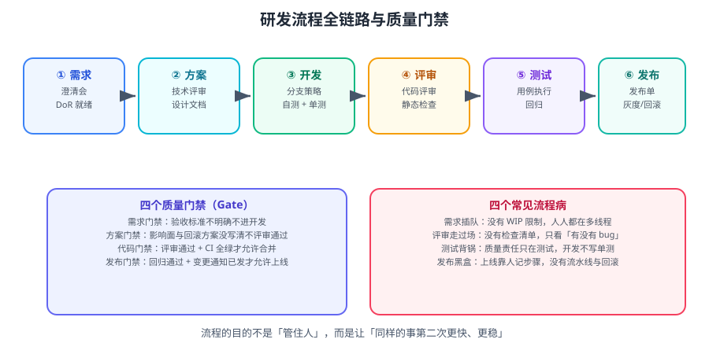

# 研发流程

流程的目的不是「管住人」，而是让**同样的事第二次做得更快更稳**。本篇给出一套可直接落地的最小流程：四道门禁 + 一个迭代节奏 + 四个度量指标。



::: tip 一句话理解
流程的本质是**把「靠人记得住」变成「靠机制必然发生」**。每加一条流程，都要回答：它挡掉了哪类问题？代价是多少？
:::

## 一、DoR 与 DoD

| 缩写 | 全称 | 含义 | 检查点 |
| --- | --- | --- | --- |
| **DoR** | Definition of Ready | 需求「就绪」的标准 | 进开发前 |
| **DoD** | Definition of Done | 任务「完成」的标准 | 转 Done 前 |

```text
# DoR（需求就绪）
□ 背景与目标写清（为什么要做）
□ 验收标准可验证（怎么算做完）
□ 影响范围明确（涉及哪些服务/接口/数据）
□ 优先级已确定
□ 依赖已识别（是否需要其他团队的输入）
□ 工作量已粗估（能判断是否放得进一个迭代）

# DoD（任务完成）
□ 代码已合并到主干
□ 单元测试通过，覆盖率不低于团队门槛
□ 代码评审通过（至少 1 人）
□ 已部署测试环境并验证通过
□ 涉及接口变更的，文档已更新
□ 已关联发布版本
□ 监控/日志已覆盖关键路径
```

::: danger 最常见的两个流程漏洞
1. **DoR 不检查验收标准**：导致开发做完后产品说「不是这个意思」，返工率飙升。
   对策：把「验收标准为空」做成 Jira 的流转阻塞条件。
2. **DoD 只有「代码合并」**：上线后才发现没更新文档、没加监控。
   对策：把 DoD 写进合并请求模板的检查清单，评审人逐项确认。
:::

## 二、四道质量门禁

| 门禁 | 时机 | 检查内容 | 不通过怎么办 |
| --- | --- | --- | --- |
| **① 需求门禁** | 进开发前 | DoR 全部满足 | 退回产品补充 |
| **② 方案门禁** | 编码前 | 影响面、数据变更、回滚方案已写清 | 补方案后再评审 |
| **③ 代码门禁** | 合并前 | 评审通过 + CI 全绿 + 单测达标 | 不允许合并 |
| **④ 发布门禁** | 上线前 | 回归通过 + 变更通知已发 + 回滚方案已验证 | 推迟发布 |

```text
# 门禁应该「自动挡」而不是「人挡」
自动挡：CI 未通过 → 合并按钮不可用（由平台强制）
人挡：评审人记得检查 → 忙的时候必然漏
```

| 门禁项 | 自动化手段 |
| --- | --- |
| CI 全绿 | 分支保护规则：必须通过必需检查 |
| 覆盖率门槛 | 流水线读取覆盖率报告，低于阈值直接失败 |
| 提交信息规范 | commitlint 校验 Conventional Commits |
| 静态检查 | ESLint / Checkstyle / ShellCheck 作为必需检查 |
| 密钥泄露 | 提交前扫描（gitleaks 等） |
| 变更通知 | 流水线发布前自动推送到群 |

::: tip 门禁的「最小可用」配置
如果只做两条，做这两条：
1. **合并前 CI 必需通过**（分支保护）。
2. **合并至少 1 人评审通过**（分支保护）。
这两条能挡掉绝大多数「把坏的合进主干」。
:::

## 三、迭代节奏

### 3.1 两周 Sprint 的标准节奏

| 会议 | 时长 | 输入 | 输出 |
| --- | --- | --- | --- |
| 计划会 | 1~2h | 已就绪的需求（DoR 通过） | Sprint 目标 + 任务清单 + 承诺范围 |
| 每日站会 | 15min | 看板 | 阻塞项暴露 |
| 评审会 | 1h | 已完成的事项 | 产品验收 + 反馈 |
| 回顾会 | 1h | 数据（周期时间、缺陷） | 1~2 条改进项（有负责人） |

::: warning 站会不是「汇报会」
**反模式**：每人依次念「我昨天做了 X，今天做 Y」，15 分钟变成 40 分钟。
**正解**：只看**看板上的阻塞项**——「谁被卡住了？需要什么帮助？」其余信息看板自带。
:::

### 3.2 需求拆分

| 拆分维度 | 示例 | 适用 |
| --- | --- | --- |
| 按用户路径 | 「下单」→ 浏览/加购/结算/支付 | 端到端流程 |
| 按数据维度 | 先支持单店，再支持多店 | 数据结构变化 |
| 按规则复杂度 | 先固定规则，再配置化 | 业务规则多变 |
| 按读写分离 | 先做写入，再做查询优化 | 性能优化类 |

::: danger 「拆分」的两个错误方向
1. **按技术分层拆**（前端一张卡、后端一张卡、DB 一张卡）：每张卡都不可独立验证，且必须同时上线。→ 应按「可独立交付的价值」拆。
2. **拆到「一个人半天能做完」**：卡太碎，管理成本超过执行成本。→ 每张卡应有可验证的产出的最小单位。
:::

## 四、分支与发布策略

| 策略 | 做法 | 适用 |
| --- | --- | --- |
| **主干开发 + 特性分支** | 短分支（1~3 天），合并即部署 | 大多数团队，推荐 |
| **Git Flow** | develop / release / hotfix 多分支 | 有明确版本发布节奏的产品 |
| **Trunk Based** | 直接提交主干，靠特性开关控制 | 工程能力强、CI/CD 成熟 |

```text
# 推荐的简单模型（短分支 + 主干可发布）
main        永远可部署
  ├── feature/ORD-123-order-export    从 main 切出，1~3 天内合并
  ├── fix/ORD-456-timeout             修复分支
  └── hotfix/1.4.3                    紧急修复，从 tag 切出，合并回 main
```

```shell
# 标准动作
git switch -c feature/ORD-123-order-export main
# ...开发与提交...
git push -u origin feature/ORD-123-order-export
# 开合并请求 → CI → 评审 → 合并（Squash 或 Rebase）
git switch main && git pull --ff-only
```

::: warning 分支的黄金三律
1. **分支存活不超过 3 天**：越久越难合并。
2. **不合并未通过 CI 的代码**：分支保护规则强制。
3. **主干永远可发布**：靠特性开关（Feature Flag）而不是靠分支隔离未完成功能。

分支策略的完整方法见 [Git 进阶 · 分支模型](../../VersionControl/Git/BranchModel/index.md) 与 [协作工作流](../../VersionControl/Git/Workflow/index.md)。
:::

## 五、度量：四个指标与算法

| 指标 | 定义 | 计算方式 | 健康趋势 |
| --- | --- | --- | --- |
| **前置时间 Lead Time** | 提出 → 交付 | 交付时间 − 创建时间 | 下降 |
| **周期时间 Cycle Time** | 开始 → 完成 | 完成时间 − 首次进入「进行中」时间 | 下降 |
| **在制品 WIP** | 同时进行中的事项数 | 快照统计 | 稳定或下降 |
| **缺陷逃逸率** | 上线后发现的缺陷占比 | 逃逸缺陷数 ÷ 总缺陷数 | 下降 |

```text
# 用 Jira JQL 取数的思路
前置时间：用「已解决」日期 − 「创建」日期，按月聚合
周期时间：用「已解决」日期 − 「进入 In Progress」日期
WIP：status in ("In Progress","In Review","Ready to Test") 的实时计数
缺陷逃逸率：type = Bug AND labels = escaped ÷ type = Bug 总数
```

::: danger 度量必须「先定口径，再看数字」
同一个「周期时间」，用「创建时间」还是「进入进行中时间」算，能差 3 倍。
**做法**：把口径写进度量文档，固定不变；口径变了要同时改历史数据或标注分界线。
:::

## 六、常见流程病与对策

| 病症 | 表现 | 对策 |
| --- | --- | --- |
| **需求插队** | Sprint 中途不断加需求 | 插队必须移除等量范围；紧急需求走独立通道 |
| **评审走过场** | 合并请求秒过，只看有没有 bug | 加评审检查清单；限制单人同时评审数量 |
| **测试背锅** | 质量问题只归测试 | 开发写单测并纳入 DoD；缺陷分析根因归类 |
| **发布黑盒** | 上线靠人手记步骤 | 流水线化发布；发布单模板化；演练回滚 |
| **状态黑洞** | 事项卡住无人知 | 每个状态设 SLA，超时自动提醒 |
| **文档僵尸** | 代码变了文档没变 | 接口/配置变更纳入 DoD 检查项 |
| **WIP 过高** | 人人多线程，周期时间变长 | 设 WIP 上限，先清空再加新 |
| **会议泛滥** | 每天 3 小时会议 | 同步类改异步；会议必须有议题与结论 |

::: tip 一次只改一个
流程改进最常见的失败是「一次改五条」，结果团队抵触、执行不到位、无法归因。
**做法**：回顾会只挑一条最痛的，改两周，看数据，再决定保留还是回滚。
:::

## 七、实战：为一个 10 人团队设计流程（一页纸）

```text
┌────────────── 研发流程（一页纸） ──────────────┐
│                                               │
│  需求 → 方案 → 开发 → 评审 → 测试 → 发布      │
│   ↑      ↑            ↓        ↓       ↓      │
│  DoR    方案评审    CI 必须绿  回归    发布单   │
│                                               │
│  迭代：两周一个 Sprint                        │
│  分支：短分支（≤3 天）+ main 永远可发布        │
│  站会：只看阻塞项，15 分钟                    │
│  度量：前置时间 / 周期时间 / WIP / 缺陷逃逸率  │
│                                               │
│  回顾会只改一条，改完写进本页                  │
└───────────────────────────────────────────────┘
```

### 落地步骤

```text
第 1 周：把上图的「四道门禁」写进 Jira 工作流与仓库分支保护
第 2 周：准备需求 / 方案 / 发布三个模板并启用
第 3 周：打通「CI 结果推群」与「合并请求 → 事项流转」两条自动化
第 4 周：跑第一次回顾会，确定 1~2 条改进项并写进本页
```

### 验证方式

```text
1. 需求门禁
   操作：创建一条不填验收标准的需求，尝试流转到「进行中」
   预期：被阻止，提示「验收标准不能为空」

2. 代码门禁
   操作：提交一个会让 CI 失败的改动，开合并请求
   预期：合并按钮不可用（必需检查未通过）

3. 评审门禁
   操作：单人自评后尝试合并
   预期：被拒绝，提示需要至少 1 名评审人批准

4. 发布门禁
   操作：跳过回归直接发版
   预期：发布流水线的「回归通过」必需检查阻塞发布

5. 度量可得
   操作：打开「近 30 天完成」过滤器并导出
   预期：能算出周期时间中位数与 WIP，不依赖人工填写

6. 模板已生效
   操作：新建事项与方案
   预期：自动带上 DoR / DoD 检查清单
```

## 八、易错点汇总

::: danger 逐条对照
1. **DoR/DoD 只写在文档里**：必然被忽略。要做成系统里的阻断条件或检查清单。
2. **门禁靠人挡**：忙的时候必漏。把能自动化的都自动化。
3. **站会变成汇报会**：浪费时间。只看阻塞项。
4. **需求按技术分层拆**：无法独立交付。按可验证价值拆。
5. **分支存活超过一周**：合并冲突与风险剧增。短分支 + 特性开关。
6. **主干不可发布**：无法快速回滚与热修。保持主干绿色。
7. **WIP 无上限**：周期时间持续变长。设上限并用数据说话。
8. **Sprint 中途无限插队**：迭代失去意义。插队要等量替换。
9. **度量做考核**：数据失真。只用于发现问题。
10. **回顾会列 10 条改进项**：一条都落不了地。一次只改 1~2 条。
:::

## 参考资料

- Scrum Guide（2020）：https://scrumguides.org/
- 《Accelerate》（DevOps 四指标）：https://itrevolution.com/product/accelerate/
- Git 分支模型与本仓库实践：[Git 进阶](../../VersionControl/Git/index.md)
- 流水线与质量门禁落地：[CI/CD · 自动化测试与质量门禁](../../CICD/Testing/index.md)、[流水线设计最佳实践](../../CICD/PipelineDesign/index.md)
- 文档侧规范：[文档协作规范](../DocCollaboration/index.md)
- 本专题其余章节：[协作与项目管理导览](../index.md)、[Jira 实战](../Jira/index.md)
