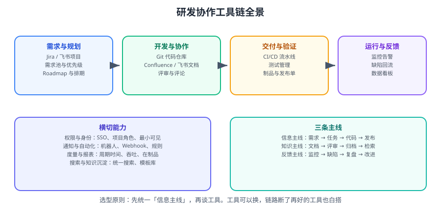

# 协作与项目管理

工具选得再好，链路断了也白搭。本专题讲的是**研发协作的工程化落地**：用 Jira / Confluence / 飞书把「需求 → 开发 → 测试 → 发布 → 复盘」的信息流转固定下来，并用自动化减少人工同步。

<p style="text-align:center;"></p>



## 这个专题解决什么问题

| 痛点 | 表现 | 本专题的对策 |
| --- | --- | --- |
| 信息找不到 | 同一件事在群里、文档、表格各有一版 | 确定唯一来源 + 文档模板 + 状态标记 |
| 流转不顺畅 | 事项卡在某个人手里没人推 | 状态 ≤ 6 个，每个状态有唯一负责人 |
| 同步成本高 | 每天开会同步进度 | 状态即进度，看板代替口头同步 |
| 质量靠运气 | 需求反复改、上线靠人记 | 四道质量门禁 + 流水线自动化 |
| 知识不沉淀 | 聊天记录当文档，人走了知识就没了 | 结论必须回写文档，指定 Owner 与状态 |

::: tip 一句话理解
协作成本 ≈ **信息损耗 × 交接次数**。真正的优化方向是「减少交接、一次说清、随处可查」，而不是「开更多的会」。
:::

## 章节导航

1. [概述与选型](Overview/index.md)：协作全景、工具链地图、选型方法论。
2. [Jira 实战](Jira/index.md)：事项类型、工作流、敏捷看板、JQL 查询、自动化。
3. [Confluence 知识库](Confluence/index.md)：空间与页面树、模板与宏、权限、与 Jira 联动。
4. [飞书协作](Feishu/index.md)：云文档、多维表格、机器人与审批的研发场景。
5. [研发流程](RdProcess/index.md)：DoR/DoD、Sprint 节奏、四道质量门禁、度量指标。
6. [文档协作规范](DocCollaboration/index.md)：文档即代码、模板、命名、评审、归档。
7. [实战：10 人团队协作体系落地](Practice/index.md)：四周落地路径与可验证收尾。
8. [常见问题与最佳实践](FAQ/index.md)：协作问题定位树与经验清单。

## 工具链全景

```text
需求与规划    Jira / 飞书项目               事项从哪来、优先级谁定
      ↓
开发与协作    Git + Confluence / 飞书文档   方案写在哪、评审在哪留痕
      ↓
交付与验证    CI/CD + 测试管理              质量门禁在哪一道
      ↓
运行与反馈    监控告警 + 缺陷回流           问题怎么回到计划里
```

::: warning 关于「工具迁移」
把 Jira 换成飞书项目，或者把 Confluence 换成飞书知识库，**本身不会解决协作问题**。
迁移前先问三件事：
1. 现在的**唯一来源**是哪一处？（如果答不上来，说明问题不在工具）
2. 谁负责维护规则文档？（没有 Owner 的规范必然失效）
3. 迁移后旧数据怎么办？（只读留存 + 明确定义切换日期）
:::

## 版本与部署形态（2026-09 核对）

| 产品 | 形态 | 当前版本线索 | 说明 |
| --- | --- | --- | --- |
| Jira Software | Cloud（SaaS） | 持续交付，功能按周发布 | 无版本号概念，以官方发布说明为准 |
| Jira Software Data Center | 自托管 | **11.3.x LTS**（最新补丁 11.3.10，2026-08-07）；**Jira 12** 在途（Lucene 7.3 → 10.3.1、React 19、Jackson 3） | 适合有合规/内网要求的团队 |
| Confluence Data Center | 自托管 | **10.2.x LTS**；**Confluence 11** 在途（React 19、Jackson 3） | |
| 飞书 | SaaS | 持续交付 | 版本文档见官方帮助中心 |

::: info 自托管团队必须知道的两件事
1. **Atlassian 已公布 Data Center 生命周期调整**，官方在推动迁移到 Cloud。自托管团队需要提前评估路线（继续自托管 / 迁 Cloud / 换工具）。
2. **升级到 Jira 12 / Confluence 11 前要评估应用兼容性**：React 18 → 19、Jackson 2 → 3、Lucene 大版本升级都会影响 Marketplace 插件，且 Lucene 升级**需要全量重建索引**。升级前务必读官方 release notes 并在测试实例演练。
:::

## 相关专题

- 版本控制与分支协作：[Git 进阶](../../Tools/VersionControl/Git/index.md)
- 个人效率工具链（团队规则的执行侧）：[效率工具](../Efficiency/index.md)｜[概述与选型](../Efficiency/Overview/index.md) 里「统一规则、不统一工具」的取舍
- 流水线与质量门禁：[CI/CD](../../Tools/CICD/index.md)
- 接口契约与联调：[接口调试工具](../../Tools/APITools/index.md)
- 需求与设计载体在项目中的落地：[完整项目实战](../../../project/Complete/FullStackProject/index.md)
- 复盘方法与模板：[复盘杂项](../../Others/Review/index.md)、[年度复盘](../../Others/AnnualReview/index.md)

## 参考资料

- Atlassian Jira Software 文档：https://support.atlassian.com/jira-software/
- Atlassian Confluence 文档：https://support.atlassian.com/confluence/
- Atlassian Data Center 路线图：https://www.atlassian.com/roadmap/data-center
- 飞书帮助中心：https://www.feishu.cn/hc/zh-CN
- Scrum Guide（2020）：https://scrumguides.org/
