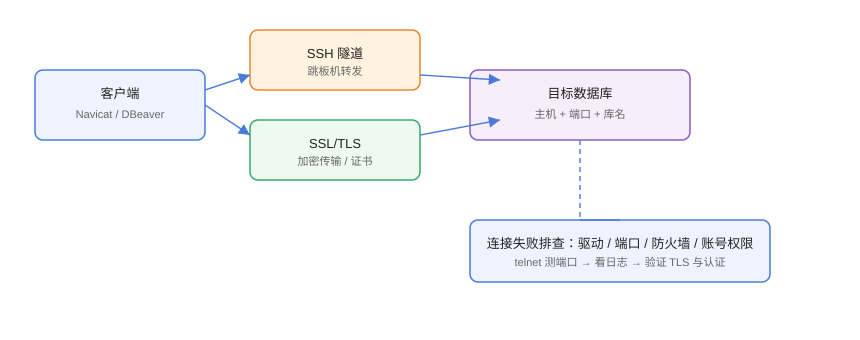

# 连接管理与问题排查

连接管理是数据库客户端的「地基」：连接参数、驱动、安全通道、权限任何一个环节出错，后续所有操作都做不了。本页给出连接配置模板、安全通道（SSH/SSL）与常见连接失败的排查路径。

## 连接的本质



一次数据库连接 = **网络可达 + 协议/驱动匹配 + 认证通过 + 权限允许**：

```text
客户端 → [SSH 隧道] → [TLS 加密] → 数据库端口 → 认证 → 授权
```

任一层失败都会表现为「连接失败」，所以排查要**从下往上**：先网络，再驱动，再认证，最后看权限。

## 连接参数模板

### MySQL / MariaDB

| 参数 | 示例 | 说明 |
| --- | --- | --- |
| 主机 | 127.0.0.1 | IP/域名 |
| 端口 | 3306 | 默认 |
| 用户名 | app_rw | 最小权限 |
| 密码 | 加密保存 | 勾选保存 |
| 数据库 | business | 可选，留空看全部 |

### PostgreSQL

| 参数 | 示例 | 说明 |
| --- | --- | --- |
| 主机 | 10.0.1.5 | 内网地址 |
| 端口 | 5432 | 默认 |
| 数据库 | postgres | **必填** |
| 用户名 | readonly_user | 只读账号 |
| SSL | 按需开启 | 云数据库建议 |

### Redis

| 参数 | 示例 | 说明 |
| --- | --- | --- |
| 主机 | 127.0.0.1 | 地址 |
| 端口 | 6379 | 默认 |
| 数据库编号 | 0 | 逻辑库 |
| 用户名/密码 | ACL 账号 | Redis 6+ |

### SQL Server

| 参数 | 示例 | 说明 |
| --- | --- | --- |
| 主机 | sqlserver.example.com,1433 | 逗号分隔端口 |
| 认证 | SQL Server 认证 | 或 Windows 认证 |
| 数据库 | master | 可改业务库 |
| 加密 | 按需 | Trust Server Certificate |

## SSH 隧道

场景：数据库在内网，客户端在本机，中间有跳板机。

```text
Navicat/DBeaver 连接设置 → SSH 隧道：
1. 勾选「使用 SSH 隧道」
2. 填写跳板机：主机、端口 22、用户名
3. 认证方式：密码 / 密钥（推荐密钥）
4. 数据库主机填内网地址（如 10.0.1.5），端口填数据库端口
```

```shell
# SSH 隧道等价命令
ssh -L 3307:10.0.1.5:3306 jump@bastion.example.com -N
# 之后客户端连 127.0.0.1:3307 即等于连内网 MySQL
```

密钥认证时，把私钥路径填进客户端（Navicat/DBeaver 均支持），避免每次输密码。

## SSL/TLS

云数据库与安全合规场景需要 TLS 加密传输：

```text
客户端连接设置 → SSL 页：
1. 勾选「使用 SSL」
2. 选择 CA 证书文件（云厂商提供）
3. MySQL 可选验证主机名与客户端证书
4. PostgreSQL 选择 sslmode=verify-full 最佳
```

::: warning 说明
只勾 SSL 不配证书，可能仅加密不验证（sslmode=disable 之外仍可被中间人）；生产建议 `verify-ca`/`verify-full` 并用 CA 证书校验。
:::

## 连接失败的排查路径

### 第一步：网络可达

```shell
# 测端口（Windows 可用 Test-NetConnection）
Test-NetConnection 10.0.1.5 -Port 3306

# 或 telnet
telnet 10.0.1.5 3306
```

不通 → 检查安全组、防火墙、跳板机路由。

### 第二步：驱动与协议

```text
报错 "Unable to load authentication plugin" / "Public Key Retrieval is not allowed"
→ MySQL 8 默认 caching_sha2_password，旧驱动不支持，升级 JDBC/客户端版本
```

驱动报错时优先升级客户端或手动指定新版驱动。

### 第三步：认证

```text
Access denied for user 'app'@'x.x.x.x'
→ 用户名/密码错，或账号不允许该来源主机登录
```

用管理员在数据库侧核对账号与 host 范围：

```sql
SELECT user, host, plugin FROM mysql.user WHERE user = 'app';
```

### 第四步：权限

```text
SELECT command denied to user 'app'@'%' for table 'orders'
→ 账号存在但缺权限，最小权限补授权
```

```sql
GRANT SELECT ON business.orders TO 'app'@'%';
FLUSH PRIVILEGES;
```

### 第五步：看日志

- 客户端：错误弹窗 + 日志面板（DBeaver 在「错误日志」视图）。
- 数据库：MySQL `general_log`、PostgreSQL `pg_log`、Redis `redis.log`。

## 连接命名与环境隔离

推荐命名规范，避免误连生产：

```text
<环境>-<业务>-<用途>
示例：
prod-orders-readonly
test-orders-rw
dev-local-mysql
```

客户端支持颜色标签/分组，把生产标红、测试标黄、开发标绿。

## 易错点与最佳实践

::: danger 常见问题
1. **密码明文保存在文档/截图里**：客户端加密存储已足够，截图会泄露。
2. **生产连接用 root/管理员**：日常查询应使用只读账号，权限最小化。
3. **SSH 隧道配错目标端口**：隧道本地端口写错，客户端连的是别的服务。
4. **改了数据库端口忘记同步客户端**：云数据库重启/迁移后端口变化，客户端仍用旧端口。
5. **SSL 证书过期**：证书失效后连接报 SSL 错误，提前在运维日历登记证书到期。
:::

::: tip 最佳实践
- 用密钥登录跳板机，不用密码；私钥本地加密保存。
- 连接分组 + 颜色，生产连接命名带 `prod` 与 `readonly` 字样。
- 新同事入职只给最小权限账号，离职立即回收。
- 定期轮换数据库密码，客户端保存的密码重新录入。
- 连接参数与账号申请流程写进团队规范，与 [数据库相关专题](../../../DB/Relational/MySQL/index.md) 的账号章节一致。
:::

## 实战：给 DBeaver 配一条走跳板机的生产连接

```text
1. 新建连接 → PostgreSQL
2. 数据库主机填 10.0.1.5，端口 5432，账号 readonly_user
3. SSH 隧道：勾选，跳板机 bastion.example.com，密钥认证
4. 测试连接：预期先建立 SSH，再连数据库
5. 保存后命名 prod-core-readonly，颜色标红
6. 验证查询：
```

```sql
SELECT current_user, current_database();
```

预期：返回 `readonly_user` 与目标库名；SSH 断开后连接不可用，说明整条链路依赖隧道。

## 验证方式

1. 每条连接先「测试连接」通过再保存。
2. 网络层：`Test-NetConnection` 通。
3. 认证层：错误提示不再是 Access denied。
4. 权限层：执行受限语句返回权限错误（符合预期）。

## 参考资料

- MySQL 连接文档：<https://dev.mysql.com/doc/refman/8.4/en/connecting.html>
- PostgreSQL SSL 文档：<https://www.postgresql.org/docs/current/ssl-tcp.html>
- Redis ACL：<https://redis.io/docs/management/security/acl/>
- DBeaver SSH 隧道：<https://github.com/dbeaver/dbeaver/wiki/SSH-configuration>
