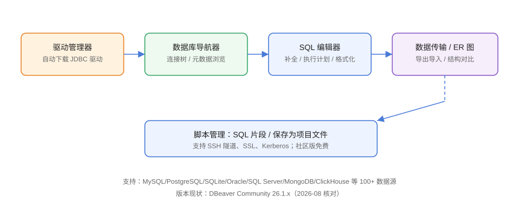

# DBeaver：开源通用查询

DBeaver 是**开源免费**的通用数据库客户端，基于 JDBC 驱动连接 **100+ 数据源**，社区版即可覆盖 MySQL、PostgreSQL、SQLite、Oracle、SQL Server、MongoDB、ClickHouse 等。本页基于 **DBeaver Community 26.1** 编写。

## 产品定位



DBeaver 的核心竞争力是**开放性**：驱动即插即用、界面可定制、SQL 编辑器与脚本管理能力强，是个人开发者与预算有限团队的默认选择。

## 安装 DBeaver

### 桌面版

```shell
# Windows：下载安装包，或 winget
winget install DBeaver.DBeaver

# macOS
brew install --cask dbeaver-community

# Ubuntu
wget -O dbeaver.deb https://dbeaver.io/files/dbeaver-ce_latest_amd64.deb
sudo apt install -y ./dbeaver.deb
```

### 首次启动

1. 启动后左侧为「数据库导航器」。
2. 首次连接某类数据库时，DBeaver 提示**下载驱动**，点确认即可。
3. 连接参数与 Navicat 类似：主机、端口、库名、账号密码。

## 驱动管理器

DBeaver 与 Navicat 的最大区别：**驱动由 DBeaver 统一管理**。

```text
窗口 → 首选项 → 数据库 → 驱动管理器
```

| 操作 | 说明 |
| --- | --- |
| 查看已装驱动 | 列出 MySQL、PostgreSQL、SQLite 等 |
| 下载驱动 | 联网自动拉取 JDBC jar |
| 手动添加驱动 | 离线环境导入 jar + 类名 |
| 编辑驱动设置 | 修改默认端口、URL 模板 |

离线环境（内网）使用技巧：在能联网的机器下载好 jar，通过「手动添加驱动」方式离线安装。

## 新建连接

### 以 PostgreSQL 为例

1. 导航器左上角「新建连接」→ 选择 PostgreSQL。
2. 填写：

| 参数 | 示例 | 说明 |
| --- | --- | --- |
| Host | 127.0.0.1 | 数据库地址 |
| Port | 5432 | 默认端口 |
| Database | postgres | 必填 |
| Username | postgres | 账号 |
| Password | 输入 | 可保存 |

3. 点「测试连接」，成功后「完成」。
4. 连接出现在导航器，展开即可看到 Schemas → Tables。

```text
PostgreSQL 特别注意：库名必填，且对象在 schema 下
（默认 public schema），别在「数据库」层找表。
```

## 核心界面

| 面板 | 作用 |
| --- | --- |
| 数据库导航器 | 连接树：库 → schema → 表/视图/函数 |
| SQL 编辑器 | 多 Tab 脚本、语法补全、执行计划 |
| 结果集 | 数据网格：排序、过滤、编辑、导出 |
| 项目浏览器 | 保存的脚本、数据源、文件 |

## 常用操作

### 查询与执行计划

```sql
-- DBeaver 执行计划：Ctrl+Shift+E
EXPLAIN ANALYZE
SELECT c.name, SUM(o.amount) AS total
FROM customers c
JOIN orders o ON o.customer_id = c.id
GROUP BY c.name
ORDER BY total DESC;
```

### 数据编辑

1. 双击表 → 打开数据网格。
2. 直接改单元格，点击「保存」提交事务。
3. 右键行 → 删除/复制行。

::: warning 说明
DBeaver 数据编辑默认在**事务**中：不点「保存/提交」不会落库，适合谨慎操作；但也别把「没保存」当成「已生效」。
:::

### 导出导入

右键表 → 「导出数据」：

| 格式 | 适用 |
| --- | --- |
| CSV | 通用、Excel 兼容 |
| SQL Insert | 迁移到其他库 |
| JSON | 与程序对接 |
| Excel（需扩展） | 商务报表 |

导入：右键表 → 「导入数据」，支持 CSV 等文件，可预览字段映射。

### ER 图

右键 schema → 「生成 ER 图」：自动绘制表关系图，适合梳理表结构。

## SQL 脚本管理

1. 「文件 → 新建 → SQL 脚本」。
2. 脚本保存在项目里，可复用。
3. 支持多数据库执行：选中语句，Ctrl+Enter。

```text
团队规范：把常用查询保存为脚本文件，纳入 Git 管理，
新人直接复用，避免 SQL 散落在聊天记录。
```

## 首选项优化

```text
首选项 → 数据库 → 结果集：
- 限制单次取行数（默认 200 行，大表防卡）
- 开启「自动提交」

首选项 → 编辑器 → SQL 格式化：
- 安装格式化插件或启用内置 SQL Formatter
```

## 易错点与最佳实践

::: danger 常见问题
1. **驱动下载失败**：内网环境无法访问 Maven 仓库。改为手动添加驱动 jar。
2. **连接超时**：检查防火墙/安全组端口，或用 SSH 隧道。
3. **大表查询卡死**：没有限制行数，拉回几十万行。首选项中限制结果集行数。
4. **忘了提交/回滚**：事务模式下手动提交；批量改数据前先 `BEGIN`，验证后 `COMMIT`。
5. **SQL Server 走 Windows 认证失败**：在连接设置里切换认证方式并勾选对应域。
:::

::: tip 最佳实践
- 每个连接设置「连接名称」为环境+用途（如 `prod-orders-readonly`），便于辨识。
- 常用查询保存为脚本进 Git，配合团队文档复用。
- 用「只读」连接配置日常查询（驱动连接参数中限制），变更走审批流程。
- 离线环境提前准备驱动包，避免现场「连不上驱动」。
:::

## 实战：连接 MySQL 并完成一次数据导出

```text
1. 新建连接 → MySQL → 填写主机/端口/账号 → 测试连接
2. 导航器展开数据库，找到目标表
3. 双击表查看数据 → 确认行数
4. 右键表 → 导出数据 → CSV → 选择输出目录与编码 UTF-8
5. 打开 CSV 验证中文与字段完整
```

```sql
SELECT COUNT(*) FROM target_tbl;
```

预期：CSV 行数 = `COUNT(*)`，无乱码。

## 验证方式

1. 新建连接测试通过。
2. `EXPLAIN ANALYZE` 能正常输出执行计划。
3. 导出 CSV 后文件可正常打开。
4. 断网环境下能通过手动驱动完成连接。

## 参考资料

- DBeaver 官方文档：<https://github.com/dbeaver/dbeaver/wiki>
- DBeaver 下载：<https://dbeaver.io/download/>
- DBeaver 社区版功能对比：<https://dbeaver.com/compare/editions/>
