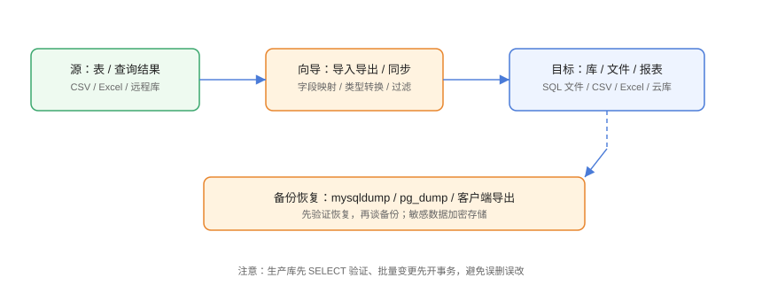

# 常用操作：查询、导入导出与备份

数据操作是客户端的「高频区」：查询、编辑、导入导出、备份恢复、数据同步。本页给出一套可复制的操作流程与安全边界，避免「图方便」带来的数据事故。

## 操作全景



```text
查询 → 编辑 → 导入/导出 → 备份/恢复 → 同步
每步都遵循：先小规模验证，再全量执行
```

## 查询：先读后写

### 只读查询模板

```sql
-- 先看行数与样本，再决定是否全量
SELECT COUNT(*) FROM orders WHERE status = 'PENDING';

SELECT * FROM orders
WHERE status = 'PENDING'
ORDER BY created_at DESC
LIMIT 100;
```

### 更新前先查

```sql
-- 1. 确认影响范围
SELECT COUNT(*) FROM orders
WHERE status = 'PENDING' AND created_at < '2026-01-01';

-- 2. 备份受影响数据
CREATE TABLE orders_backup_20260830 AS
SELECT * FROM orders
WHERE status = 'PENDING' AND created_at < '2026-01-01';

-- 3. 小批量更新（分批避免长事务）
UPDATE orders SET status = 'CLOSED'
WHERE status = 'PENDING' AND created_at < '2026-01-01'
LIMIT 1000;
```

::: danger 注意
生产 UPDATE/DELETE 三原则：
1. 先 `SELECT` 确认条件与影响行数；
2. 先建备份表或导出受影响数据；
3. 分批执行（`LIMIT` 循环），不要一条语句动全表。
:::

## 导入导出

### 导出

| 格式 | 适用场景 |
| --- | --- |
| CSV | Excel 分析、跨系统交换 |
| SQL | 迁移、重建 |
| Excel | 报表交付 |
| JSON | 对接程序 |

```text
导出步骤（Navicat/DBeaver 类似）：
1. 右键表或查询结果 → 导出向导
2. 选格式与范围（结构/数据/结构+数据）
3. 编码选 UTF-8，字段映射确认
4. 预览前 10 行 → 执行
```

### 导入

```text
导入注意：
1. 先建好目标表结构与字段类型
2. CSV 首行是否含表头要勾对
3. 编码一致（UTF-8 或 GBK 按源文件）
4. 先导入少量行验证，再全量
```

```csv [sample.csv]
id,name,amount
1,张三,100.50
2,李四,200.00
```

## 备份与恢复

### 客户端内置备份

```text
Navicat：右键库 → 备份 → 新建备份
DBeaver：右键 schema → 备份（调用 pg_dump/mysqldump）
```

### 命令行等效（生产推荐）

```shell
# MySQL
mysqldump -u backup -p --single-transaction --routines --triggers business > business_20260830.sql

# PostgreSQL
pg_dump -h 10.0.1.5 -U backup -d business -F c -f business_20260830.dump

# Redis（RDB 快照）
redis-cli -a "$REDIS_PASS" BGSAVE
```

### 恢复演练

```shell
# MySQL 恢复
mysql -u root -p business < business_20260830.sql

# PostgreSQL 恢复
pg_restore -h 10.0.1.5 -U app -d business business_20260830.dump
```

::: warning 说明
备份的价值取决于**恢复是否验证过**。每季度做一次恢复演练：把备份恢复到临时库，跑行数校验与抽样比对。
:::

## 数据同步

场景：测试库刷新、多环境数据对齐。

```text
Navicat：工具 → 数据同步 / 结构同步
1. 选源连接与目标连接
2. 选择要同步的表
3. 对比差异（新增/修改/删除）
4. 预览变更 SQL → 确认执行
```

| 同步类型 | 说明 | 注意 |
| --- | --- | --- |
| 结构同步 | 只同步表结构/索引 | 不改数据 |
| 数据同步 | 按主键同步数据 | 覆盖目标，先备份 |
| 数据传输 | 整库/跨库迁移 | 大库注意耗时与网络 |

## 常用 SQL 模板

### 行数统计

```sql
SELECT COUNT(*) FROM tbl;
```

### 去重统计

```sql
SELECT COUNT(DISTINCT user_id) FROM orders;
```

### 分页

```sql
SELECT * FROM orders ORDER BY id LIMIT 100 OFFSET 0;
```

### 慢查询定位（MySQL）

```sql
SHOW FULL PROCESSLIST;
SELECT * FROM performance_schema.events_statements_summary_by_digest
ORDER BY SUM_TIMER_WAIT DESC LIMIT 10;
```

## 易错点与最佳实践

::: danger 常见问题
1. **导入覆盖了整表**：导入向导默认可能清空目标表。先确认「追加 or 覆盖」选项。
2. **编码错乱**：CSV 用 Excel 打开正常但导入乱码，多半是编码/分隔符不一致。
3. **备份没有结构**：只导数据不导结构，恢复时缺表。选「结构+数据」。
4. **长事务锁表**：大批量更新不分批，锁表拖垮在线业务。分批 + 低峰执行。
5. **同步覆盖目标库**：数据同步是覆盖操作，目标库先备份。
:::

::: tip 最佳实践
- 生产变更写成 .sql 脚本，走审批后在客户端/命令行执行，留档审计。
- 重要表建**备份表**（`_backup_YYYYMMDD`）并定期清理，避免磁盘膨胀。
- 导入导出先做 10 行小样验证字段映射与编码。
- 大表操作放低峰期，配合监控观察锁等待与主从延迟。
- 同步/导入前后各记录一次行数，作为操作成功与否的判据。
:::

## 实战：跨库同步一张配置表

```text
目标：把生产库的 config_tbl 同步到测试库，用于联调
1. 源：生产连接（只读）→ 右键 config_tbl → 导出 SQL（结构+数据）
2. 目标：测试库连接 → 右键库 → 运行 SQL 文件
3. 验证：
```

```sql
SELECT COUNT(*) AS prod_cnt FROM prod.config_tbl;
SELECT COUNT(*) AS test_cnt FROM test.config_tbl;
```

预期：两库行数一致，字段差异比对无异常。

## 验证方式

1. 导出文件行数与 `COUNT(*)` 一致。
2. 导入小样（10 行）成功且无乱码。
3. 备份文件能恢复到临时库并通过行数校验。
4. 同步操作前后行数记录可追溯。

## 参考资料

- mysqldump 文档：<https://dev.mysql.com/doc/refman/8.4/en/mysqldump.html>
- pg_dump 文档：<https://www.postgresql.org/docs/current/app-pgdump.html>
- Redis 持久化：<https://redis.io/docs/management/persistence/>
- Navicat 数据传输：<https://www.navicat.com.cn/manual/online_manual_cn/navicat17_win/DataTransfer.html>
