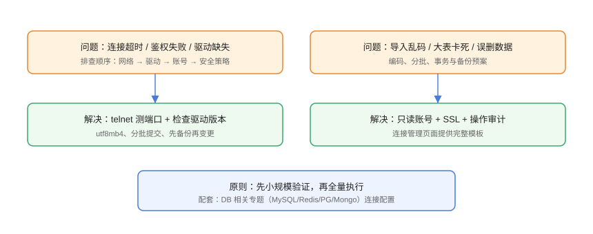

# 常见问题与最佳实践

本页汇总数据库客户端的高频问题：连接失败、乱码、卡死、误操作、驱动与版本冲突等，按「现象 → 排查 → 解决 → 验证」组织。

## 问题总览



## 连接类问题

### Q1：连接超时 / 拒绝连接

**排查顺序**：

```shell
# 1. 网络与端口
Test-NetConnection 10.0.1.5 -Port 3306

# 2. 数据库监听地址
netstat -ano | findstr :3306
```

**解决**：安全组/防火墙放行；数据库配置 `bind-address` 允许内网；走 SSH 隧道。

### Q2：Access denied for user

**原因**：账号密码错、host 范围不匹配、认证插件不兼容。

```sql
SELECT user, host, plugin FROM mysql.user WHERE user='app';
```

**解决**：修正密码；确认客户端来源 IP 在账号 host 范围内；MySQL 8 更新客户端版本以支持 `caching_sha2_password`。

### Q3：SSL 连接报错

```text
报错 "SSL connection error" / "Certificate verify failed"
```

**解决**：换最新 CA 证书；核对证书到期；客户端勾选正确的 sslmode。

### Q4：驱动找不到 / 下载失败

```text
Unable to create connection to database server / Driver not found
```

**解决**：DBeaver 在驱动管理器重新下载；内网环境手动添加驱动 jar（从官方 Maven 仓库获取）。

## 操作类问题

### Q5：导入 CSV 中文乱码

**解决**：确认源文件编码（UTF-8 无 BOM 或 GBK），导入向导编码与之一致；Excel 另存为 CSV UTF-8 后再导入。

### Q6：打开大表卡死 / 内存暴涨

```text
设置结果集行数限制（默认 200~1000 行）
查询加 LIMIT，避免 SELECT * 全表拉取
```

### Q7：误删数据 / 误更新

**处理顺序**：

1. 停止继续写入，评估影响面。
2. 用备份恢复（客户端备份或 `mysqldump`）。
3. 无备份时尝试从 binlog 回放（MySQL）或 PITR（云数据库）。
4. 复盘：为什么没有备份？为什么没先 SELECT 确认？

```shell
# MySQL binlog 查看示例
mysqlbinlog --start-datetime="2026-08-30 10:00:00" mysql-bin.000123
```

::: danger 注意
生产库无备份时做 DDL/DML，等于把数据安全交给运气。规则先于操作：**变更前三查**（查行数、查备份、查回滚方案）。
:::

### Q8：大批量更新锁表

**原因**：单条 UPDATE 扫全表，事务过长。

**解决**：分批更新 + 低峰执行 + 监控锁等待：

```sql
-- 分批更新（每批 1000 行）
UPDATE orders SET status='CLOSED'
WHERE status='PENDING' AND id IN (
  SELECT id FROM orders WHERE status='PENDING' LIMIT 1000
);
```

## 工具对比类问题

### Q9：Navicat 和 DBeaver 哪个好？

| 维度 | Navicat | DBeaver |
| --- | --- | --- |
| 成本 | 付费订阅 | 社区版免费 |
| 数据库覆盖 | 主流全，跨库传输强 | 100+ 数据源 |
| 学习曲线 | 平缓、中文好 | 略陡但可定制 |
| 团队协作 | 需自建规范 | 脚本可进 Git |

**建议**：个人/小团队先 DBeaver；公司采购、多库混合、重视效率选 Navicat。

### Q10：为什么 Redis 用 RedisInsight 而不是通用客户端？

Redis 的数据结构（Hash/List/ZSet/Stream/JSON）在通用客户端里只能看到序列化文本，RedisInsight 能结构化展示并做内存分析，运维效率更高。

## 安全类问题

### Q11：客户端保存的密码安全吗？

主流客户端用系统加密存储（Windows DPAPI / macOS Keychain）保存密码，比明文文件安全。但**共享电脑/离职设备**仍要清理连接；生产建议结合只读账号与 SSH 隧道。

### Q12：连接凭证如何交接？

1. 连接清单（命名/用途）写文档。
2. 密码放密码管理器，不写进文档与聊天。
3. 新设备录入后测试连接，旧设备清除连接记录。

## 最佳实践清单

::: tip 生产环境清单
- 每个环境独立连接，生产命名带 `prod` 与用途，颜色标红。
- 生产日常用只读账号，写操作走脚本 + 审批 + 备份。
- 客户端与数据库版本匹配，升级数据库前先升级客户端/驱动。
- 导入导出先小样验证编码与字段映射。
- 备份每季度恢复演练一次，记录演练结果。
- 重要 SQL 保存为脚本进 Git，团队复用。
- 定期巡检连接清单与账号权限，回收离职账号。
:::

## 参考资料

- Navicat 常见问题：<https://www.navicat.com.cn/support/online-manual>
- DBeaver Wiki：<https://github.com/dbeaver/dbeaver/wiki>
- RedisInsight 文档：<https://docs.redis.com/latest/ri/>
- MySQL 连接错误参考：<https://dev.mysql.com/doc/refman/8.4/en/error-reference.html>
