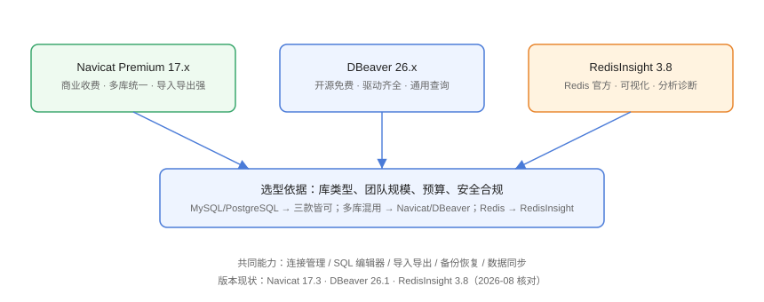

# 数据库客户端概述与选型

数据库客户端（Database Client）是连接数据库、执行 SQL、管理对象的**图形化工具**，把 `mysql -e`、`redis-cli` 这类命令行操作收进一个界面，降低日常操作门槛、减少手误。本页给出三类主流工具的能力对比与选型建议。

## 解决什么问题

没有客户端时，DBA 和开发者的日常是：

1. 每种数据库记一套命令行语法（`mysql`、`psql`、`mongosh`、`redis-cli`）。
2. 查一条数据要手写完整 SQL 再复制结果，改表结构要小心敲 DDL。
3. 导入导出没有统一入口，格式转换靠写脚本。
4. 多个环境（开发/测试/生产）的连接参数散落在文档和聊天记录里。

客户端统一解决这些问题：**连接即保存、对象可视化、SQL 有编辑器、数据能导入导出**。

## 三款主流工具



| 工具 | 收费模式 | 支持类型 | 优势 | 短板 |
| --- | --- | --- | --- | --- |
| Navicat Premium | 商业收费 | MySQL、PostgreSQL、SQL Server、Oracle、MariaDB、MongoDB、Redis、Snowflake 等 | 功能全、导入导出强、中文友好、跨库传输 | 价格高、无 Linux 官方免费版 |
| DBeaver（Community） | 开源免费 | 100+ 数据源（JDBC 驱动） | 免费、驱动全、可扩展、脚本管理 | 部分高级功能在 Ultimate/Enterprise |
| RedisInsight | 免费（Redis 官方） | Redis、Redis Stack、Tair 兼容实例 | Redis 官方出品、可视化强、内存分析 | 只面向 Redis 生态 |

::: info 版本现状（2026-08 核对）
- **Navicat Premium 17.3.x**：17 系列持续迭代，17.2 加入 AI Assistant、Snowflake 支持，17.3 为当前维护线。
- **DBeaver Community 26.1.x**：26.1 于 2026-06 发布，2026-08 更新到 26.1.5；Ultimate/Enterprise 提供 AI 辅助等商业能力。
- **RedisInsight 3.8.0**：2026-07 GA，官方推荐 GUI。
:::

## 按场景选型

| 场景 | 推荐 | 理由 |
| --- | --- | --- |
| 公司采购、团队统一、多库混用 | Navicat Premium | 功能最全、中文文档多 |
| 预算有限、个人开发者 | DBeaver Community | 免费且支持 100+ 数据源 |
| 只做 Redis 开发与运维 | RedisInsight | 官方出品、功能贴合 Redis |
| 需要跨库迁移/同步 | Navicat（数据同步、数据传输） | 图形化对比与同步最顺手 |
| 数据敏感、离线环境 | DBeaver（本地驱动） | 驱动可离线预置、无云依赖 |

## 共同核心能力

1. **连接管理**：保存连接参数、密码加密存储、测试连接。
2. **对象浏览**：库 → 表 → 字段/索引/触发器，右键直接生成 DDL。
3. **SQL 编辑器**：语法高亮、自动补全、执行计划、结果网格。
4. **数据操作**：增删改查、批量编辑、数据网格分页。
5. **导入导出**：CSV/Excel/JSON/SQL 文件互转。
6. **备份恢复**：调用原生工具（mysqldump、pg_dump）或内置导出。
7. **数据同步**：库与库、表与表之间按条件同步。

## 与命令行工具的分工

| 场景 | 用客户端 | 用命令行 |
| --- | --- | --- |
| 日常查询、改数据 | ✔ 更直观 | 也可以 |
| 批量脚本、定时任务 | 不适用 | ✔ 脚本化 |
| CI/CD 迁移、自动化 | 不适用 | ✔ 可重复执行 |
| 紧急故障处理 | 启动慢 | ✔ 更快 |
| 教学演示 | ✔ 看得见 | 结合使用 |

::: tip 建议
客户端负责「人肉日常」，命令行与脚本负责「自动化交付」。生产环境的批量变更**尽量写成 SQL 脚本走审批**，而不是在客户端里手工点。
:::

## 客户端使用安全基线

无论选哪款工具，统一遵守四条底线：

1. **最小权限连接**：日常查询用只读账号，写操作账号单独申请。
2. **加密通道**：远程/云数据库走 SSH 隧道或 SSL，不裸连公网。
3. **凭证保护**：密码用客户端加密存储或密码管理器，不写进文档与聊天。
4. **操作留痕**：关键变更走脚本 + 审批，客户端只做查看与小范围操作。

详细操作见本专题「连接管理与问题排查」与「实战」两页。

## 安装获取方式

| 工具 | 官方下载 | 安装方式 |
| --- | --- | --- |
| Navicat Premium | <https://www.navicat.com.cn/download> | 安装包 / DMG / AppImage，按订阅授权 |
| DBeaver Community | <https://dbeaver.io/download/> | 安装包 / 便携版 / Snap / Homebrew |
| RedisInsight | <https://redis.com/redis-enterprise/redis-insight/> | 桌面版 / Docker 镜像 / 网页版 |

```shell
# Ubuntu 安装 DBeaver（示例）
wget -O dbeaver.deb https://dbeaver.io/files/dbeaver-ce_latest_amd64.deb
sudo apt install -y ./dbeaver.deb

# RedisInsight 用 Docker 跑（示例）
docker run -d --name redisinsight -p 5540:5540 redis/redisinsight:latest
# 浏览器打开 http://localhost:5540
```

## 选型常见误区

::: danger 常见问题
1. **只按「免费」选**：免费版缺少团队协作、高级导入导出时，加班成本可能超过软件订阅费。
2. **生产环境用客户端「直接改」**：客户端方便，但缺少审计；生产变更应走 SQL 审批流程。
3. **下载第三方破解版**：数据库客户端持有全部连接凭证，破解版可能内置后门。一律用官方渠道。
4. **忽略版本与驱动匹配**：旧客户端连新版本数据库可能报协议/驱动错误，升级数据库时同步升级客户端。
5. **把连接密码明文写在文档**：客户端自带的加密存储就够用，不要额外复制明文。
:::

## 验证方式

1. 下载官方安装包完成安装，启动后创建一条本地或测试库连接。
2. 连接测试通过，能浏览到库和表。
3. 在 SQL 编辑器执行 `SELECT 1;`（或对应方言的等效语句）并看到结果。

## 相关专题

- [接口调试工具](../../APITools/index.md)：接口返回的数据可与数据库客户端核对，形成「请求-数据」双验证

## 参考资料

- Navicat 官网：<https://www.navicat.com.cn/>
- DBeaver 下载页：<https://dbeaver.io/download/>
- RedisInsight 文档：<https://docs.redis.com/latest/ri/>
- Redis 客户端对比（官方）：<https://redis.com/redis-enterprise/redis-insight/>
