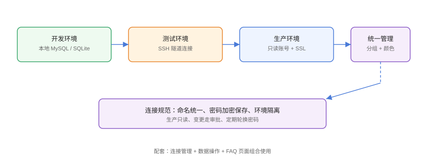

# 实战：多环境多库统一管理

本页把专题能力串成一套**团队级数据库访问规范**：连接统一管理、环境隔离、权限分级、日常操作留痕、交接无痛。照此落地，开发、测试、DBA 可以共用一套可复用的连接体系。

## 目标场景



```text
角色：
- 开发者：本地/开发库读写，测试库只读
- 测试：测试库读写，生产只读
- DBA/负责人：全部环境 + 备份恢复
```

## 第一步：连接分组与命名

### 命名规范

```text
<环境>-<项目>-<用途>[-序号]
dev-user-rw
test-order-rw
prod-order-readonly
prod-order-admin（仅 DBA）
```

### 分组与颜色

```text
Navicat：连接分组文件夹 + 连接颜色（生产红/测试黄/开发绿）
DBeaver：创建「数据源分组」并在项目里整理
RedisInsight：连接别名标注环境
```

## 第二步：账号与权限分级

### MySQL 账号示例

```sql
-- 只读账号
CREATE USER 'order_ro'@'%' IDENTIFIED BY '******';
GRANT SELECT ON order_db.* TO 'order_ro'@'%';

-- 读写账号（开发/测试）
CREATE USER 'order_rw'@'%' IDENTIFIED BY '******';
GRANT SELECT, INSERT, UPDATE, DELETE ON order_db.* TO 'order_rw'@'%';

-- 管理账号（仅 DBA）
CREATE USER 'order_admin'@'bastion_ip' IDENTIFIED BY '******';
GRANT ALL PRIVILEGES ON order_db.* TO 'order_admin'@'bastion_ip';
FLUSH PRIVILEGES;
```

原则：

1. 生产日常查询用只读账号。
2. 管理账号限定来源 IP（跳板机）。
3. 离职/转岗立即回收权限。

## 第三步：安全通道与凭证管理

```text
生产连接统一走 SSH 隧道（密钥认证），不直接暴露数据库端口：
1. 跳板机配置开发/测试各自的 SSH 账号
2. 数据库监听内网地址
3. 客户端连接全部经隧道
```

密码轮换：每 90 天轮换一次数据库密码，客户端重新录入；私钥加密保存，不用明文文件。

## 第四步：日常操作规范

### 查询

- 生产查询一律 `SELECT`，配合 `LIMIT` 与条件过滤。
- 敏感字段（手机号、身份证）查询后脱敏展示。

### 变更

```text
变更流程：
1. 写 .sql 脚本（含回滚脚本）
2. 提交评审（版本库 + 团队审批）
3. 低峰期执行，先备份受影响数据
4. 验证并记录变更单
```

```sql
-- 变更脚本示例（含回滚）
ALTER TABLE orders ADD COLUMN remark VARCHAR(255) NULL;

-- 回滚脚本
ALTER TABLE orders DROP COLUMN remark;
```

### 备份恢复

```text
备份策略：
- 生产库每日自动备份（客户端计划任务或 CronJob）
- 每周一次恢复到测试库演练
- 备份文件异地/对象存储留存 30 天
```

## 第五步：脚本与知识沉淀

```text
把常用查询与运维 SQL 放进团队仓库：
scripts/
├─ queries/
│  ├─ pending_orders.sql
│  └─ slow_query_check.sql
└─ migrations/
   ├─ 20260830_add_remark.sql
   └─ rollback_20260830.sql
```

配合文档库的 [MySQL](../../../DB/Relational/MySQL/index.md)、[Redis](../../../DB/NoRelational/Redis/index.md) 等专题，新同学按文档即可上手。

## 第六步：交接与审计

1. 连接清单（连接名/用途/负责人）维护在团队文档。
2. 每个环境的账号权限表定期核对。
3. 关键操作（DROP/TRUNCATE/大批量更新）记录操作人、时间、影响行数。

```text
交接检查单：
□ 所有连接能否成功登录（按角色各测一遍）
□ 只读账号确认无法写数据
□ 备份任务运行正常
□ 连接命名与文档一致
```

## 易错点与最佳实践

::: danger 常见问题
1. **一个共享账号所有人共用**：无法审计，出了问题不知道是谁。一人一账号。
2. **生产库直连暴露公网**：端口映射到公网是重大风险，一律走跳板机/内网。
3. **连接参数只存在个人电脑**：人走了连接就断。团队文档维护连接清单，密码走密码管理器。
4. **只备份不演练**：恢复不了等于没备份。每月恢复演练一次。
5. **权限给了不退**：转岗/离职账号回收不及时。季度权限巡检。
:::

::: tip 最佳实践
- 颜色与命名双保险：看到红色连接就提示自己「这是生产」。
- 把「只读查询」与「写操作」分开：写操作走脚本与审批。
- 用客户端计划任务/脚本做定时备份，避免手工遗漏。
- 每次生产变更后更新文档库对应专题的示例，保持知识与实践同步。
:::

## 验证方式

1. 用只读账号执行 `INSERT`，确认被拒绝（权限生效）。
2. 断开 SSH 隧道，生产连接不可用（说明未直接暴露端口）。
3. 执行一次备份 + 恢复到临时库 + 行数比对，全程 < 30 分钟。
4. 新同学按交接文档 10 分钟内能连上所有环境。

## 参考资料

- MySQL 账号管理：<https://dev.mysql.com/doc/refman/8.4/en/account-management.html>
- PostgreSQL 角色与权限：<https://www.postgresql.org/docs/current/user-manag.html>
- Redis ACL：<https://redis.io/docs/management/security/acl/>
- 数据库访问控制最佳实践（OWASP）：<https://owasp.org/www-project-top-ten/>
