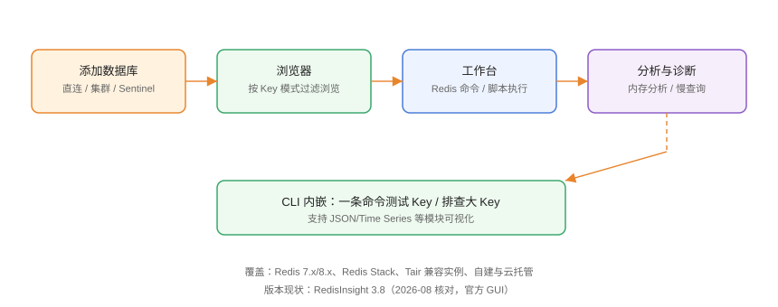

# RedisInsight：Redis 官方可视化

RedisInsight 是 Redis 官方出品的**免费可视化客户端**，用于浏览 Key、执行命令、分析内存、诊断慢查询，是 Redis 开发与运维的默认 GUI。本页基于 **RedisInsight 3.8** 编写。

## 产品定位



RedisInsight 与通用客户端不同：它**深度贴合 Redis 数据结构**，能直接可视化 String、Hash、List、Set、ZSet、Stream 与 JSON 模块，并提供内存分析这类专用能力。

## 安装方式

### 桌面版

```shell
# Windows（winget）
winget install Redis.RedisInsight

# macOS
brew install --cask redisinsight

# Ubuntu（Snap）
sudo snap install redisinsight
```

### Docker 网页版

```shell
docker run -d --name redisinsight -p 5540:5540 redis/redisinsight:latest
# 浏览器打开 http://localhost:5540
```

::: tip 提示
Docker 版与桌面版功能一致，适合服务器上临时使用；注意容器数据卷持久化，避免配置丢失。
:::

## 添加数据库

### 直连单机

1. 打开 RedisInsight，点击「Add Redis Database」。
2. 填写：

| 参数 | 示例 | 说明 |
| --- | --- | --- |
| Host | 127.0.0.1 | Redis 地址 |
| Port | 6379 | 默认端口 |
| Database Alias | 本地开发 | 显示名称 |
| Username/Password | 按需 | Redis 6+ ACL 账号 |

3. 「Test Connection」通过后保存。

### 集群与 Sentinel

- **Cluster**：填写任一节点地址，选择「Cluster」模式，自动发现所有节点。
- **Sentinel**：填写 Sentinel 地址与主节点名称，自动发现。
- **Redis Cloud**：可直接登录 Redis Cloud 账号导入订阅实例。

### 命令行快速验证

```shell
redis-cli -h 127.0.0.1 -p 6379 ping
# PONG
```

## 核心功能


### 1. 浏览器（Browser）

按 Key 模式过滤浏览：

```text
左侧输入 user:* 过滤用户相关 Key
点击 Key 查看类型、TTL、编码与完整值
支持修改值、设置过期时间、删除 Key
```

```shell
# 对应命令
KEYS user:*
TTL user:1001
```

### 2. 工作台（Workbench）

内置命令编辑器，支持批量执行与脚本：

```shell
SET counter 10
INCR counter
GET counter
# 输出 11
```

```lua [工作台 Lua 脚本]
-- 原子操作：扣减库存
local stock = tonumber(redis.call("GET", KEYS[1]) or "0")
if stock > 0 then
  redis.call("DECR", KEYS[1])
  return 1
else
  return 0
end
```

### 3. 分析与诊断

| 功能 | 用途 |
| --- | --- |
| 内存分析 | 找出占内存最大的 Key 与类型分布 |
| 慢查询 | 查看 slowlog，定位延迟来源 |
| 命令监控 | 实时观察命令频率与耗时 |
| 集群可视化 | 查看槽位分布与节点健康 |

```shell
# 慢查询对应命令
SLOWLOG GET 20
SLOWLOG RESET
```

### 4. 数据可视化

- **JSON**：树形展开/编辑 JSON 值。
- **Time Series**：直接画时序图，适合监控数据。
- **Stream**：消费组与消息浏览。
- **Hash**：字段级查看与编辑。

## 连接安全

1. **TLS**：Redis 开启 TLS 时，勾选 TLS 并选择 CA 证书。
2. **SSH 隧道**：通过跳板机连接内网 Redis。
3. **ACL 账号**：Redis 6+ 建议用最小权限账号，避免使用默认 root。

## 易错点与最佳实践

::: danger 常见问题
1. **`KEYS *` 在生产执行**：阻塞 Redis 单线程。用 `SCAN` 或浏览器按前缀过滤。
2. **大 Key 直接打开**：几 MB 的 String 或超大 List 全量加载会卡界面。先用内存分析定位，再按范围读取。
3. **生产连接用管理员账号**：Redis 默认无密码时任何人都能操作。开启 `requirepass` 或 ACL，客户端用最小权限。
4. **把 RedisInsight 当生产控制台随手删 Key**：删除前确认 Key 用途，最好先 `TTL` 与备份。
5. **Cluster 连接只填一个节点还勾了单机模式**：报 MOVED 错误。选 Cluster 模式并填集群节点。
:::

::: tip 最佳实践
- 开发环境直接用，生产环境建议配合「只读账号 + 命令白名单」。
- 用内存分析定期巡检大 Key，把结果记入监控文档。
- 脚本先在「工作台」用 `DEBUG OBJECT` 与 `MEMORY USAGE` 验证再上生产。
- 与 [Redis 专题](../../../DB/NoRelational/Redis/index.md) 配套学习命令语义。
:::

## 实战：定位大 Key

```text
1. 连接生产 Redis（只读账号）
2. 打开「Analyse Database」内存分析
3. 按内存排序查看 Top Key
4. 对疑似大 Key 验证：
```

```shell
MEMORY USAGE user:1001
STRLEN user:1001
LLEN hotlist
```

```text
5. 决定优化：拆分 Key / 换更省内存的结构 / 设置过期时间
6. 修改后再次分析确认内存下降
```

预期：分析报告能给出内存占用 Top10，优化后指标明显下降。

## 验证方式

1. 添加连接测试通过，浏览器可见 Key。
2. 工作台执行 `SET/GET` 返回预期值。
3. 内存分析能在 1 分钟内生成报告。
4. 慢查询页能看到测试期间产生的慢命令。

## 参考资料

- RedisInsight 文档：<https://docs.redis.com/latest/ri/>
- RedisInsight GitHub：<https://github.com/RedisInsight/RedisInsight>
- Redis 命令参考：<https://redis.io/commands/>
- Redis ACL 文档：<https://redis.io/docs/management/security/acl/>
