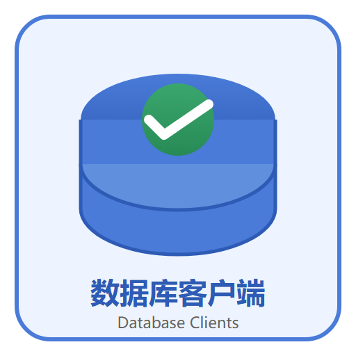

# 数据库客户端

数据库客户端是把「命令行 + 手写脚本」变成**图形化日常操作**的桌面工具：管理连接、浏览表结构、写 SQL、导入导出、备份恢复、数据同步一站完成。本专题覆盖主流三款——**Navicat Premium、DBeaver、RedisInsight**——从安装连接到实战管理，并与库内的 MySQL、Redis、PostgreSQL、MongoDB 专题衔接。

## 专题导航

- [数据库客户端概述与选型](Overview/index.md)
- [Navicat：多库统一管理](Navicat/index.md)
- [DBeaver：开源通用查询](DBeaver/index.md)
- [RedisInsight：Redis 官方可视化](RedisInsight/index.md)
- [连接管理与问题排查](Connection/index.md)
- [常用操作：查询、导入导出与备份](DataOps/index.md)
- [实战：多环境多库统一管理](Practice/index.md)
- [常见问题与最佳实践](FAQ/index.md)

## 阅读建议

1. 还不清楚选哪款：先读「概述与选型」。
2. 只连 MySQL/PostgreSQL：从 DBeaver 或 Navicat 任选一款开始。
3. 负责 Redis：直接看 RedisInsight，再配合 [Redis 专题](../../DB/NoRelational/Redis/index.md) 使用。
4. 多环境、多库、权限规范：重点读「连接管理」与「实战」两页。
